# Assessing the Health of the Peel-Harvey Estuary Through its Benthic Invertebrate Fauna {#bmi}

<!-- ::: {.title_matter width="100%"} -->
<!-- [***Balancing estuarine and societal health in a changing environment***]{style="color:#5f543f"} -->
<!-- ::: -->

<br>

::: {.chapter-authors width="100%"}
**Sorcha Cronin-O'Reilly, Fiona Valesini, Chris Hallett**
:::

::: {.author-info width="100%"}
Centre for Sustainable Aquatic Ecosystems, Murdoch University, Perth, Western Australia
:::

```{r BMI-pic1, echo = FALSE, out.width='100%', class = "title-image"}

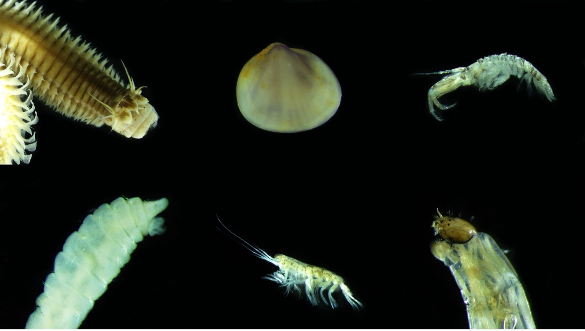

```

<br>
<br>

## Abstract

::: {.body-text width="100%"}
Small benthic (bottom-dwelling) invertebrates, such as worms, bivalves and shrimps, are a fundamental component of healthy aquatic ecosystems. Living on or just below the sediment, they play vital ecosystem roles such as decomposing organic matter, recycling nutrients and providing a major food source for fish and birds. They can also provide key ‘signals’ about the condition of the benthic environment, and have been used worldwide to develop biotic indices for measuring and tracking estuarine health. However, many of these indices have been developed for northern hemisphere systems, and applying them to south-western Australian estuaries has proved difficult and/or ineffective for various reasons.

This study aimed to firstly characterise the current benthic macroinvertebrate community throughout the Peel-Harvey Estuary, and secondly at building a robust biotic index of benthic ecological health (the Estuarine Benthic Community Index – EBCI) and exploring its patterns across the estuary. We also explored which aspects of the benthic environment were best linked to changes in the invertebrate community and health grades (‘A’, excellent, to ‘E’, very poor) of the EBCI.

Our findings show that while the current invertebrate community is species rich (71 taxa), it is dominated by a small number of environmentally-tolerant taxa, including various worm species (e.g. *Capitella sp.*, *Heteromastus filiformis* and *Prionospio cirrifera*) and bivalve species (e.g. *Arthritica semen* and the invasive Asian date mussel *Arcuatula senhousia*). The community is generally representative of one in early stages of development (or ‘early succession’), which are typically found in environments that experience chronic stress. The invertebrate community showed substantially greater differences between regions of the estuary (e.g. basin vs riverine areas) than between seasons (winter vs summer) or different water depths (shallow, < 1 m vs deep, > 1m). These regional differences were strongly linked with those in bottom-water salinity, depth of oxygen penetration into the sediment, sediment odour and sedimentary microalgae (which provides food for many invertebrate taxa). 

To build the EBCI, a diverse suite of 16 attributes (‘metrics’) calculated from the invertebrate community were first tested for their responsiveness to an independent gradient of benthic environmental condition across the Peel-Harvey Estuary. Three metrics (species richness, diversity and dominance) showed the clearest responses, and were then used to construct an index that incorporated metric reference conditions (or benchmarks of ‘best’ metric scores) that were tailored for each broad region and season.
:::

::: {.body-text width="100%"}
 The EBCI showed that benthic ecological health is generally better in winter (mainly good to fair, or grades B–C) than summer (mainly fair to poor, or grades C–D). These trends most likely reflected the effects of winter river flows flushing sedimentary organic matter out of the estuary, and helping oxygenate the bottom waters and sediment. This is well supported by the clear relationships that were found between increasing EBCI grade and decreasing quantities in sedimentary organic matter and mud content and increasing oxygen penetration and odour score. From a spatial perspective, benthic ecological health was often poorest (poor to very poor, or grades D–E) in the deeper waters of the upper Murray River, the deeper sections of the basins (especially in summer) and in the shallow south-eastern area of Peel Inlet (including in the Yunderup channel near the entrance of the Murray River). In some cases, the sediment was completely lacking in invertebrate fauna. These areas coincide with some of the most highly enriched (nutrients and organic matter) and muddy sediments and, in the case of the south-eastern Peel, areas of high macroalgal growth. These findings have significant implications for the ongoing benthic health of the estuary, given the forecast trends of less freshwater flushing of the estuary under a drying climate, and the proposed expansion of marina developments and boating channels within the Peel-Harvey Estuary.

Finally, we have proposed a benthic invertebrate monitoring plan to enable the ecological health of the Peel-Harvey to be reliably tracked into the future, and provide further decision support for management intervention.
:::


## Introduction

::: {.body-text width="100%"}
Benthic macroinvertebrates are bottom-dwelling invertebrates, \> 500 µm in size, that live on the sediment surface or just below it in structures such as burrows or self-made tubes [@snelgrove1998biodiversity]. These faunal communities consist mainly of polychaetes (worms), molluscs (e.g. bivalves) and crustaceans (e.g. shrimps and crabs; Fig. \@ref(fig:BMI-pic3)). They are a fundamental component of the healthy functioning of estuarine ecosystems, performing vital roles such as decomposing the vast organic matter that accumulates in these environments, recycling nutrients and providing rich food sources for many fish and bird species. They are also excellent indicators of the ecological health status of estuaries and other waterways, which is reflected by well-established changes in the species composition of the invertebrate communities. For example, degraded estuaries often have faunas with low numbers of species that are dominated by polychaetes, which are often more tolerant of environmental stress than the more sensitive molluscs and especially crustaceans [@warwick1993comparing; @wildsmith2009changes; @tweedley2012use].

```{r BMI-pic3, echo = FALSE, out.width='40%', class = "text-image", fig.cap = "Examples of benthic invertebrates collected from the Peel-Harvey. (Photos credit: a & c, S. Cronin-O-Reilly; b, M. Wildsmith)."}

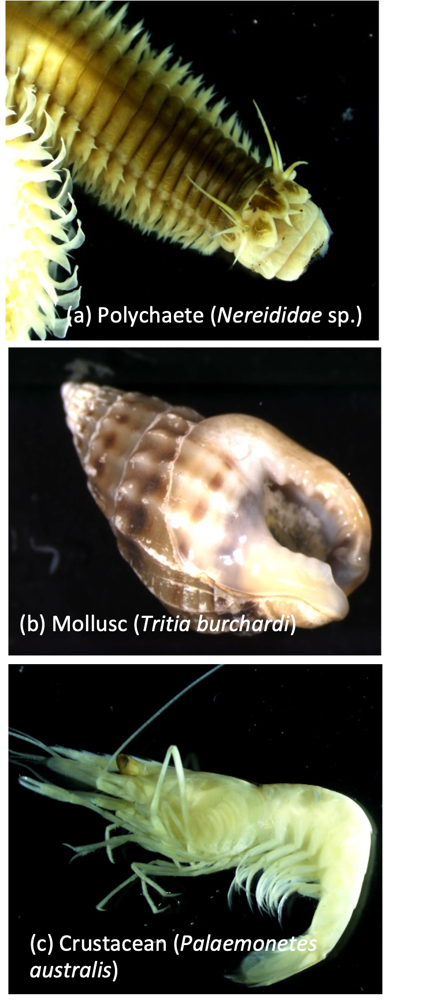

```

For the above reasons, many environmental management agencies worldwide have developed biotic indices based on key attributes of these invertebrate communities to measure and track the ecological health of estuaries and other aquatic environments. They provide key ‘signals’ about ecosystem functioning that cannot be captured by simply measuring the environment alone. Some of the most well-known and widely adopted indices include the Azti Marine Biotic Index [@borja2000marine], the Benthic Opportunistic Polychaete and Amphipod ratio [@dauvin2007polychaeteamphipod] and the Benthic Index of Biotic Integrity [@weisberg1996estuarine]. Many of these existing indices focus on the tolerance of different invertebrate species to environmental stress (e.g. organic enrichment) and have largely been developed for estuaries in the northern hemisphere, for which extensive knowledge exists on species sensitivity. However, applying these indices to estuaries in south-western Australia (and others in the southern hemisphere) has proved difficult or ineffective because (i) our small, shallow and increasingly poorly-flushed estuaries function differently from the often larger and well-flushed systems of the northern hemisphere, and (ii) our invertebrate faunas are very dissimilar, and their sensitivity is largely unknown [@tweedley2014familylevel].

To date, studies of the benthic macroinvertebrate communities in the Peel-Harvey Estuary have concentrated on restricted parts of the estuary basins, times of year and/or subsets of the faunal community, with their main focus on exploring inter-decadal changes between pre-Dawesville Cut (1970s or 1980s) and post-Cut periods [early to mid-2000s: @whisson2004benthic; @wildsmith2009changes]. These studies have generally shown the loss of more environmentally-sensitive crustacean and molluscan taxa and increases in more tolerant annelid taxa over time.

Given it has been 15 years since the benthic invertebrate faunas have been assessed across the Peel-Harvey, and no previous studies have included the faunas in the tidal rivers, the first part of our study was ***aimed at characterising the current benthic macroinvertebrate community throughout the full extent of the estuary***. As a comprehensive index of benthic ecological health is still lacking for this system (and most others across south-western Australia), we then focused on ***building a suitable and robust index from the benthic macroinvertebrate community (the Estuarine Benthic Community Index – EBCI)*** and exploring its patterns across the estuary. The specific study objectives are outlined below.
:::

### Objectives

The specific study objectives were as follows:

 1.  Characterise the current benthic macroinvertebrate community throughout the full extent of the Peel-Harvey Estuary during both wet and dry seasons.

 2.  Explore which environmental drivers are best linked to any spatial or seasonal changes in the invertebrate community.

 3.  Build an index of benthic ecological health (the EBCI) using key attributes (‘metrics’) of the invertebrate community, and develop a benthic health ‘report card’ (grades A–E) for the estuary.

 4.  Explore trends in the EBCI among estuary regions and seasons in 2017–18, and which sediment condition variables are best linked to those trends.

 5.  Propose an ongoing monitoring regime for tracking benthic ecological health throughout the Peel-Harvey Estuary.

## Approach

### Characterizing the benthic invertebrate community and the benthic environment

#### Field and laboratory methods

::: {.body-text width="100%"}
Benthic macroinvertebrates were collected at 60 sites throughout the Peel-Harvey Estuary during both late winter 2017 (high rainfall period – ‘wet’ season) and late summer 2018 (low rainfall period – ‘dry’ season; Fig. \@ref(fig:BMI-pic4)). The location of the sampling sites was governed by the following three factors to account for both ***anthropogenic and natural environmental influences*** on the condition of the benthic environment and their accompanying invertebrate communities. Sites were positioned to provide the best possible spread across these factors (with the first being of primary interest), while also keeping the time requirements for both field sampling and laboratory processing within an achievable window:
:::

1.  The ***condition of the sediment*** (i.e. Good, Fair or Poor), as determined by the Rapid Assessment Protocol (RAP) for characterizing sediment condition, based on scores for sediment colour, odour and texture developed by @hallett2019rapid and presented in Chapter \@ref(sediment)). The guide for how the sediment at each site was scored and assigned to a RAP class is given in Table \@ref(tab:sediment)), with some examples shown in Fig. \@ref(fig:sediment-pic7).

2.  ***Regional differences in water movement*** (e.g. tidal and river flushing) and ***water quality*** (e.g. salinity, dissolved oxygen, temperature), as guided by the coupled catchment-estuary model developed within the broader research program (Chapters \@ref(model-hydrology) & \@ref(model-water-quality)). The main regions were the Southern Harvey Estuary; Northern Harvey Estuary/Western Peel Inlet; Eastern Peel Inlet; Serpentine River; Lower Murray River; Upper Murray River (Fig. \@ref(fig:BMI-pic4)).

3.  ***Water depth***, accounting for both shallow (\< 1 m deep) and deeper (≥ 1 m deep) waters.

::: {.body-text width="100%"}
It is recognized that the effects of human-derived stressors (e.g. the downstream impacts of high catchment nutrient loads, organic matter loads from livestock effluent etc.) and natural environmental influences act synergistically to influence benthic environmental condition in estuaries. However, sediment condition was considered to mainly reflect the culmination of anthropogenic influences in the catchment and estuary, while regional and depth differences were considered to represent natural environmental drivers. 


```{r BMI-pic4, echo = FALSE, out.width='100%', class = "text-image", fig.cap = "Map of the sites at which benthic macroinvertebrates were sampled across the Peel-Harvey Estuary in winter 2017 and summer 2018. Sites have been colour-coded by their RAP sediment condition class in summer 2018 (green, Good; yellow, Fair; red, Poor; see Table 6.1 and Fig. 6.5). Note that these condition classes differed for some sites in winter 2017, as shown in Figs 8.10 and 8.11."}

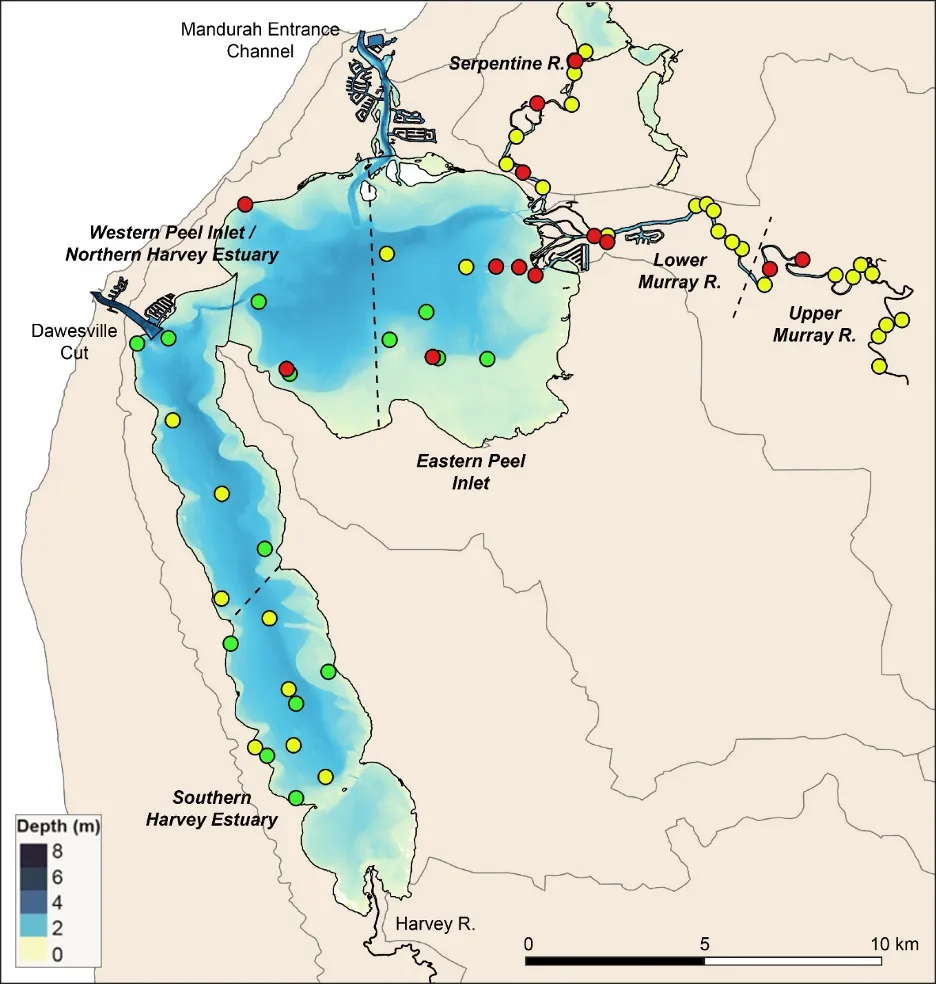

```


```{r bmised, echo=FALSE, message=FALSE, warning=FALSE}
library(knitr)
library(kableExtra)
library(readxl)
  options(knitr.kable.NA = "")
Diff_tab <- read_xlsx('tables/peel_tables_bmi.xlsx', sheet="bmised")
  kable(Diff_tab[,1:3],"html", escape = F, align = "c"
        , caption = "Characteristics of the sediment measured at each benthic invertebrate sampling site, including whether the sediment attributes were considered to represent the effects of anthropogenically-driven stressors that impact sediment condition, or whether they are more reflective of natural drivers.",bootstrap_options = "hover")%>%
   kable_classic(full_width = T) %>%
   kable_styling(Diff_tab, bootstrap_options = "hover",
                full_width = T, position = "left",
                font_size = 11) %>% 
    
  row_spec(0, background = "#5f543f", bold = TRUE, color = "white") %>%
  column_spec(1, width_min = "15em" ,color="black",bold = F) %>%
  column_spec(2, width_min = "15em" ,color="black") %>%
  column_spec(3, width_min = "20em" ,color="black") %>%
  # row_spec(1:2, background = 'white')  %>%
 scroll_box(width = "40em",fixed_thead = FALSE)

  
```

<br>

The RAP sediment condition classification of 97 sites across the estuary by @hallett2019rapid in late 2016 was used as an initial guide for selecting a representative subset of invertebrate sampling sites. At each selected site (and in each season), two replicate sediment cores were collected using a UWITEC corer (Mondsee, Austria) with a telescopic pole and a detachable, transparent PVC tube (60 cm long and 6 cm in diameter; Fig. \@ref(fig:BMI-pic6)). 

One of the replicate cores was used to measure various characteristics of the sediment, as outlined in Table \@ref(tab:bmised)).

The remaining replicate sediment core was wet-sieved through a 500 µm mesh, and all invertebrates retained were preserved in a 4% formalin solution buffered in estuary water. In the laboratory, all invertebrate samples were stored in a 70% ethanol solution, then the numbers of individuals belonging to each species (or lowest possible taxon) were counted in each sample. 

Various water quality characteristics, including salinity, temperature (°C) and dissolved oxygen (mg/L), were also recorded at the bottom of the water column at each site on each sampling occasion using a multiparameter water quality probe (YSI 556).

```{r BMI-pic6, echo = FALSE, out.width='100%', class = "text-image", fig.cap = "(a) Collecting sediment cores using a telescopic corer with a detachable PVC coring tube; (b) Sieving sediment samples to collect benthic invertebrates (Photos, S. Cronin-O’Reilly)."}

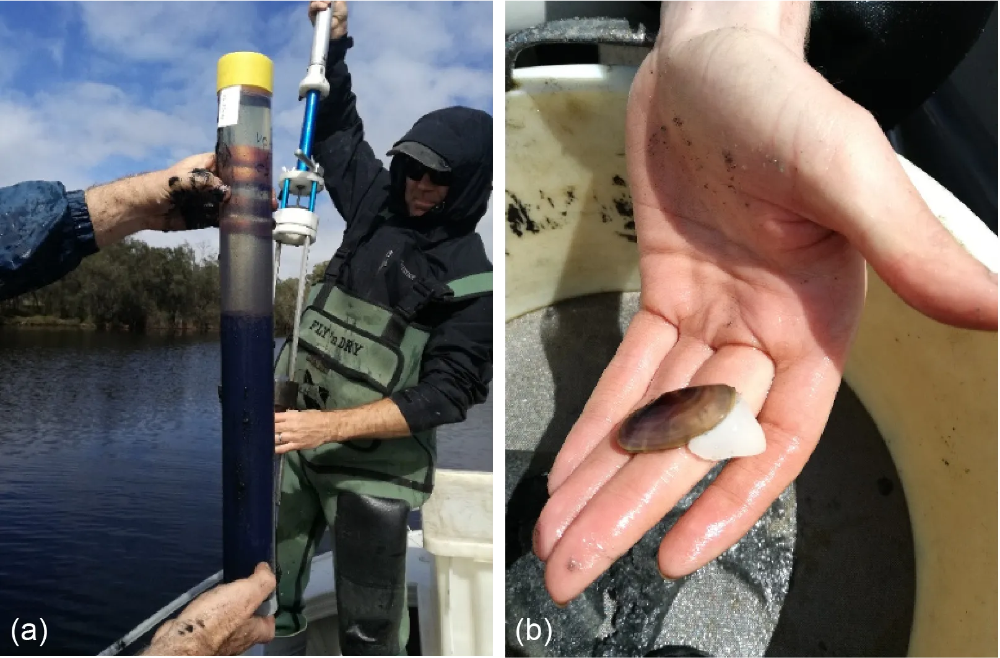

```
:::

#### Data analyses

::: {.body-text width="100%"}
Analysis of the 2017–18 invertebrate species abundance data focused on determining the nature, extent and environmental drivers of any significant shifts in community composition between estuarine regions, seasons, water depths and sediment condition. Note that, while every effort was made to find sites representing each sediment condition class (i.e. Good, Fair, Poor) in each region, season and depth, they were not present in all combinations of those latter three factors. Consequently, analyses of invertebrate community differences among condition classes were undertaken separately from the combined analyses for region x season x depth, though were guided by the outcomes of the latter test (i.e. condition x region x depth tests were undertaken separately for each season, and only those significant terms involving condition were further interpreted). The footnote in section 8.4 provides further technical explanation on the practicalities and drawbacks of this testing approach, and the subsequent choices for other condition-based analyses. 

The environmental variables that were correlated with the invertebrate data included all of the sediment variables outlined in Table \@ref(tab:bmised), as well as the water quality variables measured at the time of faunal sampling.

All data analyses were undertaken in the Primer v7 multivariate statistics software [@clarke2015getting] with the PERMANOVA+ add-on module [@anderson2008permanova].
:::


### Building an index of benthic ecological health

::: {.body-text width="100%"}
An index of benthic ecological health (the EBCI), reflected as a ‘report card’ grading system from A (excellent health) to E (very poor health), was built from key attributes (‘metrics’) derived from the invertebrate species abundance data. The list of candidate metrics that were trialled, and the ones that were selected to comprise the index, are shown in Table \@ref(tab:bmiebci).

<br>

```{r bmiebci, echo=FALSE, message=FALSE, warning=FALSE}
library(knitr)
library(kableExtra)
library(readxl)
library(rmarkdown)
theSheet <- read_excel('tables/peel_tables_bmi.xlsx', sheet="bmiebci")
theSheetGroups <- unique(theSheet$Group)

kbl(theSheet[,2:NCOL(theSheet)], caption = "A list of the 16 invertebrate community metrics tested for inclusion in the Estuarine Benthic Community Index.", align = "c",) %>%
  pack_rows(theSheetGroups[1],
            min(which(theSheet$Group == theSheetGroups[1])),
            max(which(theSheet$Group == theSheetGroups[1])),
            background = '#ebebeb') %>%
  pack_rows(theSheetGroups[2],
            min(which(theSheet$Group == theSheetGroups[2])),
            max(which(theSheet$Group == theSheetGroups[2])),
            background = '#ebebeb') %>%
  pack_rows(theSheetGroups[3],
            min(which(theSheet$Group == theSheetGroups[3])),
            max(which(theSheet$Group == theSheetGroups[3])),
            background = '#ebebeb') %>%
  kable_classic(full_width = T) %>%
  row_spec(0, background = "#5f543f", bold = TRUE, color = "white") %>%
  kable_styling(full_width = F,font_size = 11,bootstrap_options = c("hover", "condensed")) %>%
  column_spec(2, width_min = "7em") %>%
  column_spec(3, width_min = "12em") %>%
   footnote(alphabet = c("indicates metrics that best responded to a gradient of sediment condition, and were included in the EBCI. ‘Negative’ metrics (denoted by ↓) are those that are expected to decrease with declining benthic condition, while ‘positive’ metrics (↑) are expected to increase"))   %>%
  scroll_box(width = "40em",
             fixed_thead = FALSE)
```

<br>

The method used to construct this index is summarised in Fig. \@ref(fig:BMI-pic7), which outlines from left to right (i) the main steps in building the index; (ii) further detail underpinning each main step; (iii) the main statistical methods used (all of which were undertaken in the Primer v7 multivariate statistics software [@clarke2015getting] with the PERMANOVA+ add-on module [@anderson2008permanova]); (iv) key data inputs into the statistical methods; and (iv) main outputs of the statistical methods. The overarching approach was similar to that for the Fish Community Index, broadly outlined in Chapter \@ref(fish) and described in detail in @hallett2012development. The main difference between these approaches was that whereas a large historical and current data set was available to build a time-based gradient for selecting the most informative fish metrics (numerous interannual periods between 1978–2018), this was not the case for the invertebrate data (with historical data existing only for the late 1970s, 1986/7, 2000 and 2003/4, and sometimes for only restricted parts of the basin, times of year and/or subsets of the invertebrate community; see @whisson2004benthic; @wildsmith2009changes). Instead, a continuous spatial ‘benthic condition gradient’, built from key sediment variables shown to best reflect differences in sediment condition scores throughout the estuary, was used as the premise for selecting the most informative (i.e. responsive) invertebrate metrics.

To display EBCI trends throughout the estuary in both the wet and dry seasons, EBCI scores calculated at each sampling site were spatially interpolated across the full extent of the system using QGIS 2.18. 

```{r BMI-pic7, echo = FALSE, out.width='100%', class = "text-image", fig.cap = "Summary of the approach used to build the Benthic Community Index, outlining, from left to right, (i) the main steps in constructing the index; (ii) more detail underpinning each main step; (iii) main statistical methods used; (iv) key data inputs into the statistical methods (PCA, Principal Components Analysis; BEST, Biota and Environment Matching routine; DISTLM, Distance Based Linear Models) and (iv) main statistical outputs."}

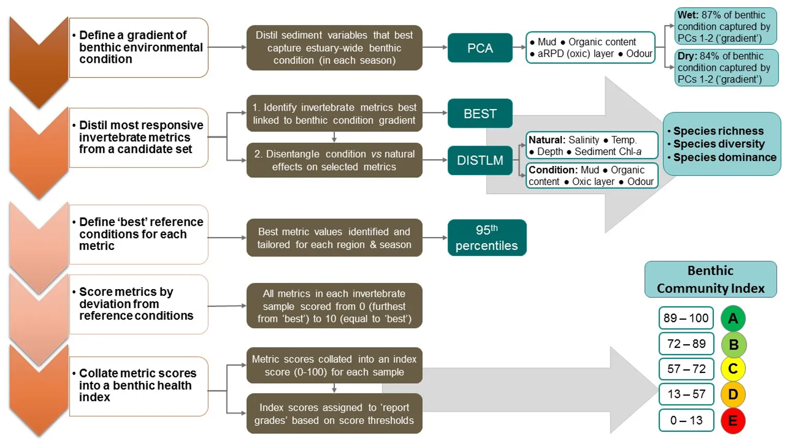

```
:::

## Results & findings

> *The benthic invertebrate community is species rich, but dominated by a small number of taxa that are highly tolerant to environmental stress and represent only the early stages of community development*

::: {.body-text width="100%"}
More than 70 benthic invertebrate species were found across the estuary in 2017–18 ([Supplementary Materials S8.1][Supplementary Materials]). They represented nine broader phyla, but more than 75% of species belonged to just two phyla, namely Annelida (worms; 30 species) and Arthropoda (crustaceans such as shrimps and crabs; 23 species). Thirteen species of Mollusca (shelled organisms) were found, but the remaining six phyla were each represented by only one taxon. We found a greater overall number of species than @wildsmith2009changes in 2003–04 (63), most likely because this previous study was restricted to northern Harvey Estuary/western Peel Inlet whereas the current study covered the full breadth of the estuary and the tidal rivers. Species such as the worms *Desdemona ornata* and *Pseudopolydora kempi* and the bivalves *Mysella spp.* and *Arcuatula senhousia*, were abundant in this study, but were either not recorded or found in low numbers by @wildsmith2009changes

The largely marine and well-flushed northern Harvey/western Peel region had by far the most species (55), while the upper Murray River had the least (18). This decline in species richness along a marine to riverine gradient is common in south-western Australian estuaries, not only for benthic invertebrates [e.g. @wildsmith2017value], but also for other fauna such as fish [e.g. @valesini2017interdecadal]. However, 60% of the species found in the northern Harvey/western Peel each made very small contributions (≤0.5%) to the total number of invertebrates recorded in that region, with many being ‘marine stragglers’ that occur infrequently in the marine reaches of estuaries, e.g. the worms *Heteromastus filiformis*, *Malacoceros sp.* and *Mediomastus sp*. In contrast, only 28% of the species in the upper Murray made similarly small contributions to the fauna in that region, reflecting a more restricted community that is well adapted to deal with environmental stress. Further evidence of this is the far lower total abundance of invertebrates found in the upper Murray, i.e. about one third to one fifth of that in other regions ([Supplementary Materials S8.1][Supplementary Materials]). 

```{r BMI-pic8, echo = FALSE, out.width='100%', class = "text-image", fig.cap = "Examples of common invertebrates (a) *Corophium minor*, (b) *Arthritica semen*, (c) *Arcuatula senhousia* (Photos: S. Cronin-O-Reilly)."}

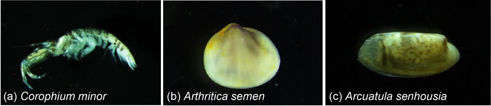

```

The amphipod *Corophium minor* (Fig. \@ref(fig:BMI-pic8)), a small crustacean that is endemic to south-western Australia, was the most abundant species across all basin regions. The polychaete worms *H. filiformis* and *Prionospio cirrifera*, which live on the sediment surface and feed on accumulated organic matter, were highly abundant in the western Peel/northern Harvey and/or eastern Peel Inlet, and especially in the deeper waters where these organic deposits are often greatest. The small bivalve *Mysella spp.* was also abundant across Peel Inlet and the northern Harvey, where it mainly inhabited sandier substrates. Tanaid crustaceans, which were highly abundant only in the southern Harvey Estuary, live in self-made tubes in the sediment and feed mainly on detritus and algae [@rumbold2015comparison]. Their abundance in this region is possibly symptomatic of the long-term and increasing macroalgal growths that are present there (Chapter \@ref(macrophytes)). Regions of the estuary that directly receive freshwater input (i.e. the Serpentine and Murray rivers and, to a lesser extent, the southern Harvey Estuary), all had high numbers of the small bivalve *A. semen* (Fig. \@ref(fig:BMI-pic8)) and the worm *Simplisetia spp*. These species are both adapted to live in brackish reaches of estuaries [@semeniuk2000molluscs; @hirst2004broadscale]. Large aggregations of *A. semen*, and to a lesser extent the worms *D. ornata* and *Capitella sp.*, were mainly responsible for the high total number of invertebrates recorded in the Serpentine River. In the freshest parts of the estuary (i.e., the upper then lower Murray River), further species such as the invasive Asian date mussel *A. senhousia* (Fig. \@ref(fig:BMI-pic8)), the amphipods *Paracorophium excavatum* and *Grandidierella spp.*, and the worms *P. kempi* and *Boccardiella limnicola*, were also relatively abundant. 

Many of the above-mentioned dominant species in the Peel-Harvey Estuary are recognised globally as highly tolerant and opportunistic, e.g. the worms *Capitella sp.*, *H. filiformis*, *P. cirrifera*, *P. kempi* and the Asian date mussel *A. senhousia* [@tweedley2016hypoxia;@borja2000marine]. Such taxa represent the first stages of invertebrate community development following an environmental disturbance, as they are small, short-lived and can reproduce quickly, allowing them to readily colonise uninhabited areas [@pearson1978macrobenthic]. This so-called pattern of ‘early succession’ has also been found in other coastal waterways experiencing chronic environmental stress, both through natural processes (e.g. highly variable salinity; @ritter2005shortterm) and human-driven processes (e.g. organic and nutrient enrichment of sediments; @tagliapietra2012saprobity; Fig. \@ref(fig:BMI-pic9)). Additionally, unlike many large suspension/filter feeding invertebrate species that typify healthy estuaries in the northern hemisphere, many of the common species in the Peel-Harvey and nearby Swan-Canning Estuary lack a pelagic (floating or swimming) larval stage in their development [@rose2019zooplankton]. Instead, species such as *A. semen* brood their young in their shell cavity [@wells1982density] and *Capitella sp.* broods in self-made tubes [@rose2019zooplankton]. This may be an adaptive strategy to safeguard their early life stages from stressful conditions, but also restricts species dispersal and the rate of community succession, keeping it in an early stage of development.


```{r BMI-pic9, echo = FALSE, out.width='100%', class = "text-image", fig.cap = "Benthic invertebrate community development along a gradient of increasing environmental stress. Diverse faunas are gradually replaced by a small number of dominant species (often highly tolerant worms and select bivalves)."}

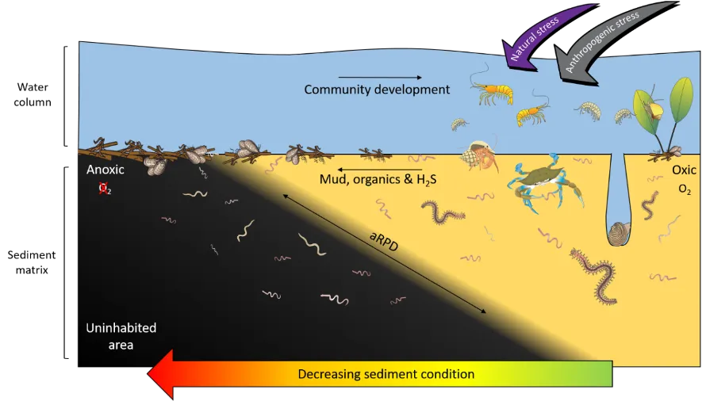

```
:::

> *Regional differences in salinity and sediment oxygen, odour and microalgae exert the greatest influence on the invertebrate community*

::: {.body-text width="100%"}
Regional differences in the benthic invertebrate community throughout the estuary were generally about twice as strong as differences among seasons (winter vs summer), water depth (shallow vs deep) or sediment condition class (Good, Fair, Poor; [Supplementary Materials S8.2][Supplementary Materials]). The community still differed significantly among each of the latter factors, but the magnitude of change was usually far smaller. Regional shifts in the fauna were strongly correlated with combinations of salinity, depth of the sediment oxic layer, sediment odour and the quantity of microalgae living near the sediment surface (BEST, *P* = 0.01–0.02, Spearman rank correlation = 0.78–0.87).

The regional patterns in the species composition of the invertebrate fauna are illustrated on the plots in Figures \@ref(fig:BMI-pic10) and \@ref(fig:BMI-pic11). They have been displayed for each season (Fig. \@ref(fig:BMI-pic10)) and water depth (Fig. \@ref(fig:BMI-pic11)) to accommodate significant ‘interaction effects’ with those other sampling factors (i.e. contrasting regional trends across different seasons and depths; [Supplementary Materials S8.2a][Supplementary Materials]). Based on the simple premise that points lying close together on these plots have similar faunas while those further apart have greater differences, it is clear that there was a distinct shift in the invertebrate communities between the estuary basins (western Peel/northern Harvey, eastern Peel and south Harvey regions, all lying to the left on plots) and the tidal Murray River (lower and particularly the upper regions, lying to the right), while those in the Serpentine River bridged this spectrum. 

The key invertebrate species that mainly drove these regional shifts in the community are summarised in the ‘shadeplots’ in Figs. \@ref(fig:BMI-pic10) and \@ref(fig:BMI-pic11) (simply the darker the shading, the more abundant the species). The basin regions were characterised by a wider spectrum of species, including many with affinities for the marine conditions and/or abundant seagrass and macroalgae present in that part of the estuary. These included various amphipods (e.g. *C. minor, Eusiridae spp.* and *Grandidierella spp.*), bivalves (*Spisula trigonella* and *Mysella spp.*) and tolerant worms (*H. filiformis* and *P. cirrifera*). The Serpentine River was distinctive for its particularly high numbers of the worms *D. ornata* (though only in the wet season), *Capitella sp.* and *Simplisetia spp.*, as well as the tolerant bivalve *A. semen* (especially in the dry season and in the shallows). The key species in the Murray River, however, differed from those in the Serpentine. In the lower Murray, the crustaceans *Grandidierella spp.* and *P. excavatum* and the worms *Scoloplos normalis* and *P. kempi* dominated, but largely in the dry season and in shallows. In the wet season and/or deeper waters, the invertebrate fauna was relatively depauperate and comprised mainly tolerant or opportunistic species, e.g. midge larvae (*Chironomidae spp.*) and worms such as oligochaetes and *Capitella sp.* Faunas in the upper Murray were also restricted, and were largely represented by highly tolerant worms (*B. limnicola*, *S. normalis*), the invasive Asian date mussel (*A. senhousia*) and other taxa with affinities for fresher waters (e.g. *Chironomidae spp.* and *Coleoptera spp.*).

The regional shifts in the invertebrate community from basin to riverine areas were shown to be best linked with (i) decreasing salinities from marine to essentially freshwater conditions; (ii) less oxygen permeating the sediment; (iii) increasingly malodorous sediment; and (iv) increases in sediment microalgae (Fig. \@ref(fig:BMI-pic12)). With respect to salinity, regional differences were far greater in winter when they ranged from an average of ~31 in the western Peel/northern Harvey (close to sea water) to ~2 in the upper Murray (fresh water; \@ref(fig:BMI-pic12)). Marine waters (~35) permeated most regions in summer, except for the upper Murray which remained brackish (~15). In contrast, the shallowing of the sediment oxic layer between the basin and riverine regions was more apparent in summer (Fig. \@ref(fig:BMI-pic12)).

```{r BMI-pic10, echo = FALSE, out.width='100%', class = "text-image", fig.cap = "(a) Plot of the relative similarity of the invertebrate communities in each region (colour coded: WP/NH, Western Peel Inlet/ Northern Harvey Estuary; EP, Eastern Peel Inlet; SH, Southern Harvey Estuary; SP, Serpentine River; LM, Lower Murray River; UM, Upper Murray River) and season (black labels: W, Wet; D, Dry) sampled in the Peel-Harvey in 2017–18. Points closer together have more similar communities, and sampling seasons in each region are joined by colour-coded lines. Plots have been constructed using MDS ordination. (b) Shadeplot of the average abundance of key invertebrate species in each region and season. Abundance is shown on a grey scale from most abundant (black) to absent (white), and has been plotted from pretreated not raw data."}

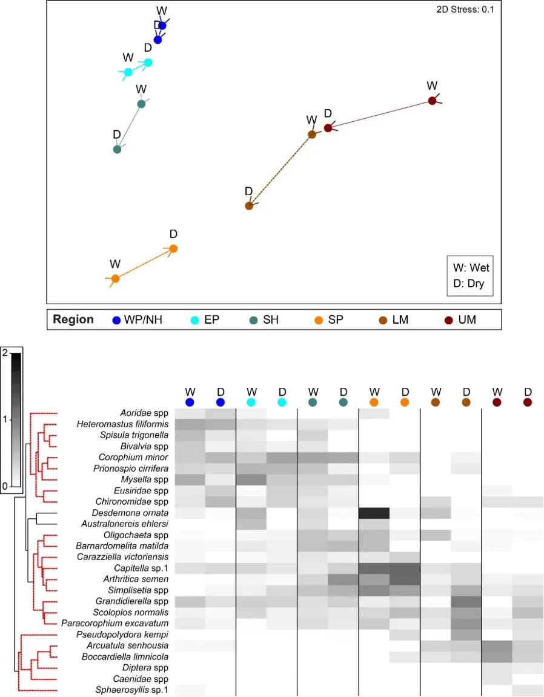

```

```{r BMI-pic11, echo = FALSE, out.width='100%', class = "text-image", fig.cap = "(a) Plot of the relative similarity of the invertebrate communities in each region (colour coded: WP/NH, Western Peel Inlet/ Northern Harvey Estuary; EP, Eastern Peel Inlet; SH, Southern Harvey Estuary; SP, Serpentine River; LM, Lower Murray River; UM, Upper Murray River) and depth (black labels: S, Shallow; D, Deep) sampled in the Peel-Harvey in 2017–18. Points closer together have more similar communities, and sampling depths in each region are joined by colour-coded lines. Plots have been constructed using MDS ordination. (b) Shadeplot of the average abundance of key invertebrate species in each region and depth. Abundance is shown on a grey scale from most abundant (black) to absent (white), and has been plotted from pretreated not raw data."}

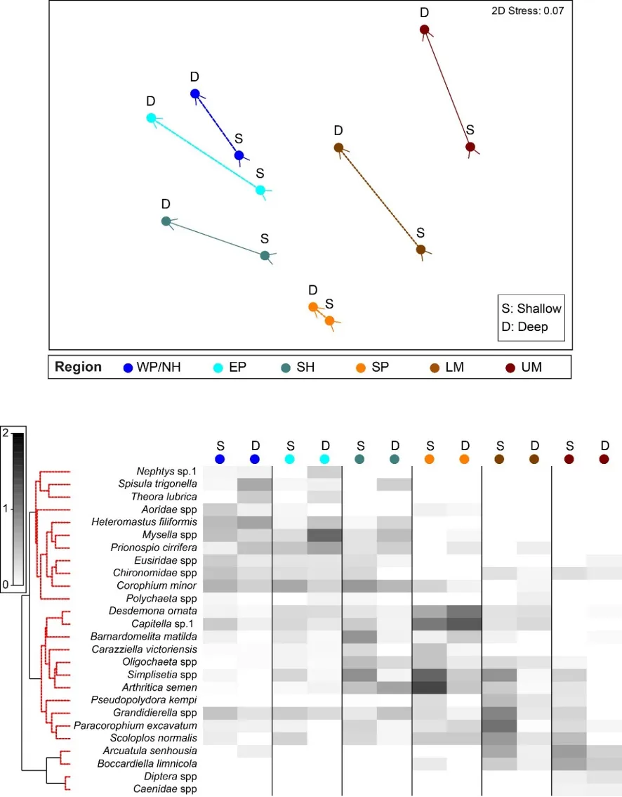

```

These trends match the long water residence times in the estuary during low river flows (Chapter \@ref(model-hydrology)), which in turn leads to deoxygenation of the bottom waters and the sediment. Interestingly, low sediment oxygen persisted year-round in the Serpentine River (~0.7–1.5 cm of oxic sediment; Fig. \@ref(fig:BMI-pic12)), and was also prevalent in some basin regions (southern Harvey and eastern Peel) in one or more seasons. The most malodourous sediments (reflecting the production of hydrogen sulphide or ‘rotten-egg gas’ under anoxic conditions) matched several of the trends in sediment oxygen, being worst in the deeper waters of the upper Murray, Serpentine River and the shallows of the eastern Peel (Fig. \@ref(fig:BMI-pic12)). ‘Signals’ of these environmental conditions were evident in the invertebrate fauna. For example, the worm *Capitella sp.*, which was far more abundant in the Serpentine than any other region and dominated in both seasons and water depths, is well able to persist in low oxygen conditions [@diaz1995marine]. Other closely related species are also highly tolerant of hydrogen sulphide [@gamenick1996hypoxia]. The most obvious regional shifts in the amount of sediment microalgae, which provides a food source for deposit-feeding invertebrates, were the far lower quantities in the most marine and highly flushed region (western Peel/northern Harvey) compared to the upper Murray (Fig. \@ref(fig:BMI-pic12)). These trends almost certainly reflect the far lower sediment nutrient concentrations in the western Peel/northern Harvey than any other part of the estuary, and particularly the upper Murray, most of which is highly enriched (Chapter \@ref(sediment)). The higher microalgal concentrations in the shallows than deeper waters of most regions (Fig. \@ref(fig:BMI-pic12)) very likely reflects the greater light availability in those environments to support benthic algal growth.

A separate set of tests to explore sediment condition impacts on the invertebrate community in each season showed that they were relatively strong in winter, when their influence was not too far behind that of regional differences and far stronger than depth differences ([Supplementary Materials 8.2b][Supplementary Materials]). Faunas in the poor sediment class were the most distinct, and were generally characterised by less species than their ‘fair-good’ counterparts, as well as lower abundances of species that were present. Additionally, species such as the worms *Australonereis ehlersi* (which builds U-shaped burrows in sandy sediments and has strong jaws for eating other invertebrates; @beesley2000polychaetes) and *D. ornata* (a predominantly deposit-feeding fan worm that is relatively sensitive to environmental stress; [@borja2000marine; @rossi2002dynamics]) showed clear preferences for good sediments and were mostly absent from poor sediments. The fauna also differed significantly among condition classes in summer, with poor vs good sediments being most distinct, but these differences were comparatively weak ([Supplementary Materials S8.2c][Supplementary Materials]). It should be noted, however, that since not all condition classes were well represented in each region, season and depth combination^[The lack of the full spectrum of sediment condition classes in each region x season x depth combination necessitated a separate testing design to that used for the other three sampling factors (compare [Supplementary Materials S8.2a][Supplementary Materials] and [S8.2b-c][Supplementary Materials]). This was needed to (i) moderate the influence of the ‘Poor’ class being underrepresented in the wet season and the ‘Good’ class lacking in the dry season, and (ii) account for any confounding influences on sediment condition of region, depth and season. Yet, this design was still compromised by sampling imbalance. Difficulties with this multifactorial categorical approach for testing condition differences in the fauna inspired an alternative analysis pathway when building the EBCI. Composite EBCI metrics were instead selected based on their responsiveness to a continuous condition gradient, built from sediment variables that best reflected estuary-wide differences in benthic condition. We were confident in using condition as a reliable premise for exploring invertebrate community shifts and building the EBCI, given its robust validation by @hallett2019rapid, these findings may underrepresent the true influence of sediment condition on the invertebrate fauna. 

Further exploration of how particular attributes (‘metrics’) of the invertebrate community relate to the full spectrum of sediment condition is presented below in the findings for the EBCI.

```{r BMI-pic12, echo = FALSE, out.width='100%', class = "text-image", fig.cap = "Plots showing the relative similarity of invertebrate communities in each region (colour-coded; see Fig. 8 for full names) and season (a; W, Wet; D, Dry) or depth (b–d; S, Shallow; D, Deep). Invertebrate sample points (those closer together have more similar communities) have been overlaid with key sediment condition variables (represented by circles of proportionate sizes) known to best ‘explain’ the observed patterns in the fauna. Plots have been constructed using MDS ordination."}

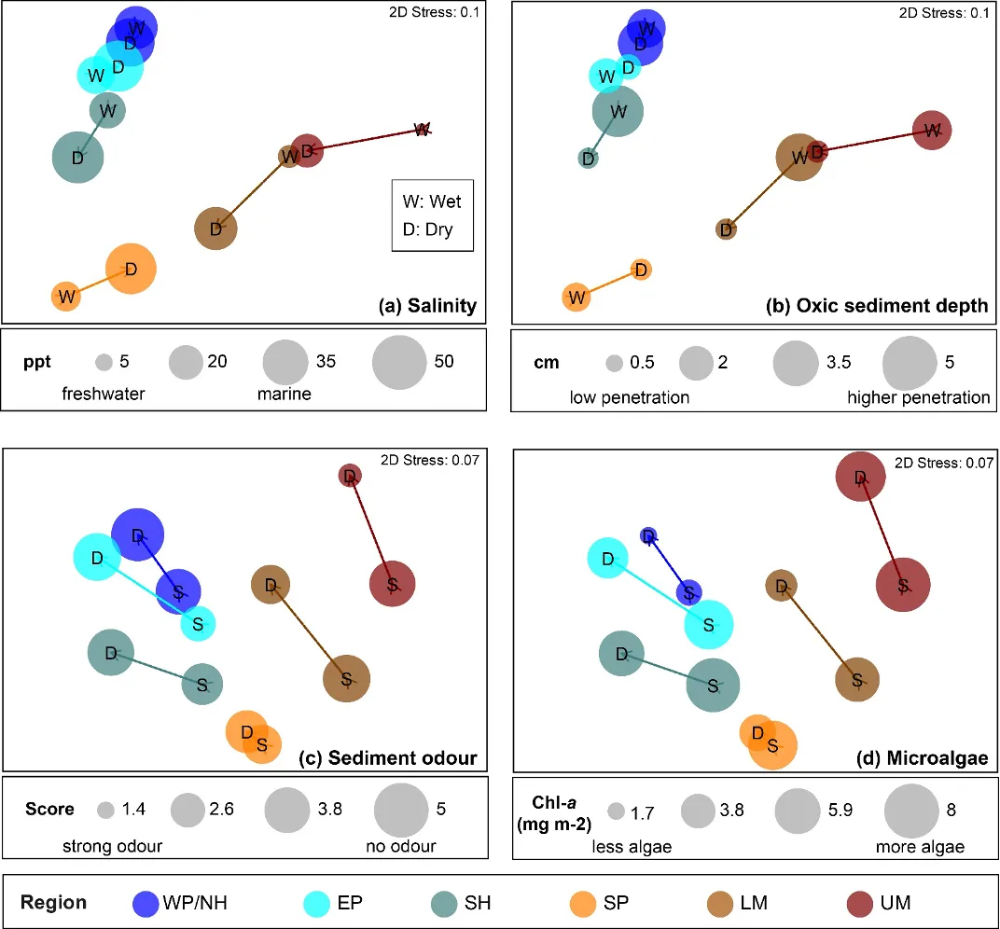

```
:::

> *The benthic ecological health of the estuary was mainly good to fair in the wet season, but fair to poor in the dry season*

::: {.body-text width="100%"}
The EBCI, interpolated across the whole estuary from the index scores calculated for each site in each season, showed that overall benthic health was better in the wet than dry season (Figs \@ref(fig:BMI-pic13) and \@ref(fig:BMI-pic14)). In the wet season, large sections of the basins (excepting the south-eastern Peel Inlet) were classified as having a good (B grade) to fair (grade C) health status, with some sites near the Dawesville Channel and in the shallows of the northern Harvey in very good health (grade A; Fig. \@ref(fig:BMI-pic13)). Most of the Serpentine River was also in fair to good benthic health, while this was only true for intermittent sections of the Murray River and mainly in its shallow lower reaches. In the dry season, however, most of the basins were in fair (grade C) to poor (grade D) benthic health (except again some healthy sites near the Cut and in the shallows), with some sites near navigation channels in the eastern Peel Inlet (Yunderup canals) in very poor condition (grade E; Fig. \@ref(fig:BMI-pic14)). Most of the upper Murray was also in poor to very poor condition (D/E grade), though the lower Murray and Serpentine typically had a fair to good health status (grades B--C), with a few sites even being in very good health (grade A). 


```{r BMI-pic13, echo = FALSE, out.width='100%', class = "text-image", fig.cap = "Map of the Benthic Condition Index in the wet season, interpolated throughout the estuary (A, excellent to E, very poor). Circles denote invertebrate sampling sites, colour coded by their sediment condition class (green, Good; yellow, Fair; red, Poor). Insets provide higher resolution views of patterns in the rivers."}

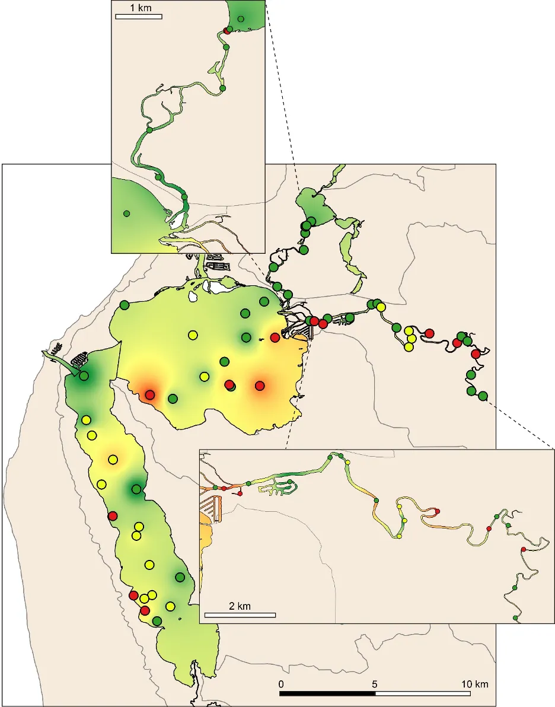

```

```{r BMI-pic14, echo = FALSE, out.width='100%', class = "text-image", fig.cap = "Map of the Benthic Condition Index in the dry season, interpolated throughout the estuary (A, excellent to E, very poor). Circles denote invertebrate sampling sites, colour coded by their sediment condition class (green, Good; yellow, Fair; red, Poor). Insets provide higher resolution views of patterns in the rivers."}

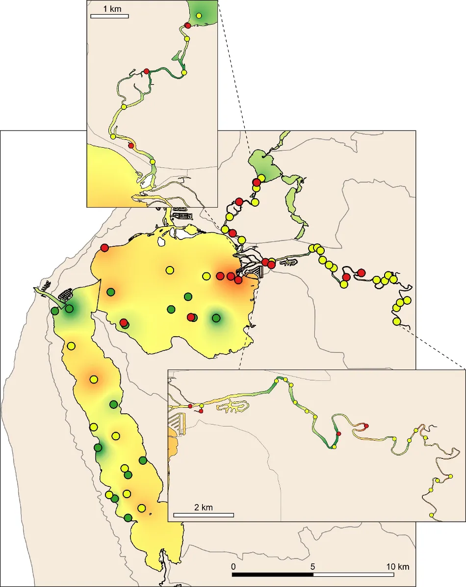

```

The poorer health grades in the dry season, which were especially evident in the deeper waters, mainly reflected conspicuous decreases in species richness and diversity (Fig. \@ref(fig:BMI-pic15)). This was particularly evident in the upper Murray River, with several samples containing no invertebrates at all. In the shallows, health declines between the wet and dry season were most obvious in the eastern Peel Inlet, and were driven mainly by a drop in species diversity.

```{r BMI-pic15, echo = FALSE, out.width='100%', class = "text-image", fig.cap = "Plots of the each component metric of the BCI in the (a) wet season in the shallows, (b) wet season in the deeper waters, (c) dry season in the shallows, (d) dry season in the deeper waters. Separate lines on each plot represent each region of the estuary (WP/NH, Western Peel Inlet/ Northern Harvey Estuary; EP, Eastern Peel Inlet; SH, Southern Harvey Estuary; SP, Serpentine River; LM, Lower Murray River; UM, Upper Murray River)."}

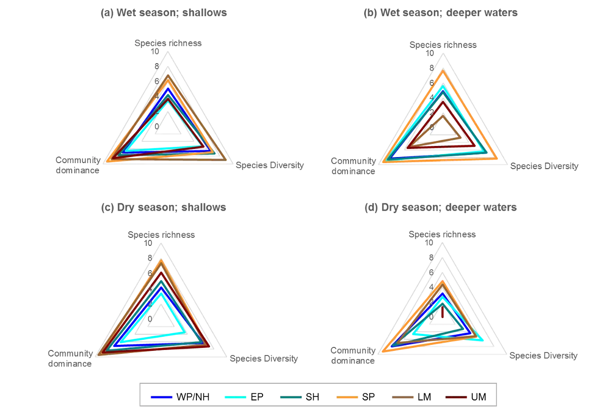

```

The generally healthier benthic condition in the wet season is most likely related to the freshwater flushing of the system at that time of year, helping to remove sedimentary organic matter and increase oxygenation of the bottom waters and sediment. This is well supported by the clear relationships that were detected between increasing health grades of the benthic invertebrate community, and decreasing trends in sedimentary organic matter and mud content and increasing oxygen penetration and odour score (Fig. \@ref(fig:BMI-pic16).

```{r BMI-pic16, echo = FALSE, out.width='100%', class = "text-image", fig.cap = "Averages of each sediment condition variable (aRPD [oxic sediment depth], odour, organic content, left y-axis; mud content, right y-axis) in each Benthic Community Index grade (A, excellent to E, very poor)."}

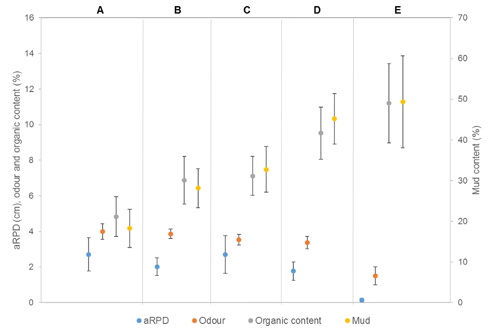

```

Although there was general agreement between the benthic health grades (A–E) and the RAP sediment condition grades (Good, Fair, Poor), which can be seen by comparing the BCI scores (interpolated ‘background’ colours) with the RAP grades (colour-coded sites) in Figs \@ref(fig:BMI-pic13) and \@ref(fig:BMI-pic14), there were a few exceptions. For example, several sites in the Murray River in the wet season had a low BCI grade (D–E) but a Good RAP grade. This may reflect the influence of higher freshwater flows improving sediment condition (e.g. by flushing out organic matter and mud), but also dislodging invertebrate fauna.

:::

> *Benthic ecological health is generally poorest in the deeper waters of the upper Murray River, deeper waters of the basins and in the south-eastern Peel Inlet*

::: {.body-text width="100%"}
Poor to very poor EBCI grades were most commonly recorded in the deeper waters of the upper Murray River, the deeper sections of the basins (especially in the dry season) and in the shallow south-eastern area of Peel Inlet (including the deeper navigational channels near the entrance of the Murray River; Figs \@ref(fig:BMI-pic13) and \@ref(fig:BMI-pic14)). The deeper parts of the upper Murray were characterised by faunas with a low species richness and diversity in winter, and were highly depauperate in summer when they either contained just one species or were totally lacking invertebrate fauna. The deeper waters of all basin regions, and especially the southern Harvey Estuary, had among the lowest species richness and/or diversity in summer, as did the shallows of the eastern Peel in both seasons (Fig. \@ref(fig:BMI-pic15)).

The above areas typically corresponded with either fair to poor RAP sediment condition in the current study, and the most highly enriched (including both nutrient and organic matter content) and muddier sediments found in the companion study on sediment health (Chapter \@ref(sediment)). These poorer quality sediments, and subsequently less healthy benthic invertebrate faunas, typically intersect with poorly flushed, depositional environments. The shallow south-eastern Peel Inlet also has a high biomass of green macroalgae, which has largely persisted throughout the 40-year macrophyte monitoring record in the Peel-Harvey Estuary and even increased in recent years (Chapter \@ref(macrophytes)). Large accumulations of macroalgae can also contribute to sediment deoxygenation and enrichment, with the sediment acting as a source of nutrients to fuel further macrophyte growth [@lavery1991macroalgalsediment].

These findings have significant implications for the ongoing benthic ecological health of the estuary, given the forecast trends of less freshwater flushing under a drying climate, and the proposed expansion of marina developments and boating channels within the Peel-Harvey Estuary.
:::

## Conclusions

> *The benthic invertebrate community generally reflects a stressed benthic environment*

-   Although a large number of benthic invertebrate species was recorded throughout the estuary in 2017–18, the community was mainly dominated by a small number of environmentally-tolerant taxa. These species are reflective of a community in its early stages of development, or one that is typically found following an environmental disturbance, i.e., colonisers that are small, short-lived and reproduce rapidly.

-   The main environmental drivers of changes in the species composition of the invertebrate community included some that are natural (salinity and the amount of sedimentary microalgae) and others that are often linked to human-derived stressors (the depth of oxygen penetration into the sediment and strong sediment odours). 

> *Benthic ecological health is in a poor to very poor state in poorly-flushed, depositional areas of the estuary*

-   The EBCI developed in this study detected poor to very poor benthic ecological health (grades D--E) in many depositional areas of the estuary, such as the deeper waters of the upper Murray River, deeper sections of the basins, and the south-eastern Peel Inlet (including both the shallows and deeper navigational channels near the entrance of the Murray River). This was particularly the case in summer, when there is virtually no river flushing and water residence times are high.

-   These poor ecological health grades were clearly linked to increasing sediment organic matter and mud content and little to no oxygen penetrating the sediment.

-   Given the projections for an increasingly drier climate, and proposed expansions of marina developments and boating channels within the Peel-Harvey Estuary, it is anticipated that these benthic ecological health trends will become more persistent and expansive. This could have a host of flow-on effects for the ecological function, resilience and biodiversity of the estuary, through channels such as its ability to recycle nutrients and organic matter, and provide nutritious food for higher fauna such as fish and birds.

> *Establishing a regular benthic invertebrate monitoring regime is fundamental to assessing and tracking measures to improve ongoing benthic ecological health*

-   The 2017–18 invertebrate species abundance data has enabled a comprehensive understanding of the current invertebrate community in the Peel-Harvey Estuary, and provides a greater spatial spread of information on this fauna than has ever been collected across the system. It has also enabled calculation of the EBCI. However, given that the EBCI is based on data collected over just one year, the metric reference conditions on which the grading system is based are limited. To strengthen understanding of the ‘best’ metric values (and open the possibility of including further metrics in the index that begin to show strong responses to sediment condition), it is recommended that at least a further four consecutive years of invertebrate data are collected (see Table \@ref(tab:bmimon)) to help bolster the robustness of the EBCI. 

-   Following on from the above, it is imperative that a consistent and regular invertebrate monitoring program is continued to better assess the ongoing health and environmental drivers of this key ecosystem component into the future.

-   A broad program for the future monitoring of the benthic health of the Peel-Harvey via the EBCI (and accompanying RAP) is proposed in Table \@ref(tab:bmimon) and Fig. \@ref(fig:BMI-pic17). Finer details for implementing this program will need to be determined, following clarity in level of interest in uptake and resourcing. 

::: {.body-text width="100%"}
```{r BMI-pic17, echo = FALSE, out.width='100%', class = "text-image", fig.cap = "Map of suggested sites for future monitoring of benthic ecological health, based on the outcomes of the current study. Note that the location of all sites is provisional, and should be tailored for purpose prior to finalising any monitoring regime. "}

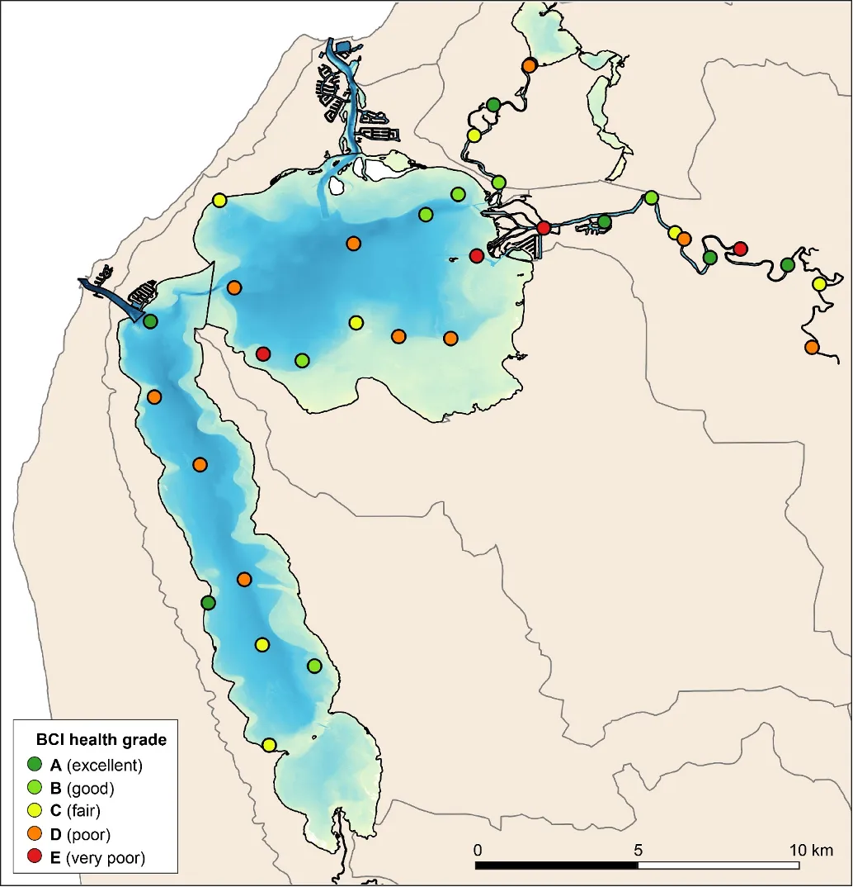

```
:::

<br>

```{r bmimon, echo=FALSE, message=FALSE, warning=FALSE}
library(knitr)
library(kableExtra)
library(readxl)
  options(knitr.kable.NA = "")
Diff_tab <- read_xlsx('tables/peel_tables_bmi.xlsx', sheet="bmimon")
  kable(Diff_tab[,1:5],"html", escape = F, align = "c"
        , caption = "Proposed future monitoring regime for the benthic invertebrate communities in the Peel-Harvey Estuary. Finer details on this broad approach should be tailored to uptake and resourcing.",bootstrap_options = "hover") %>%
       kable_classic(full_width = T) %>%
       kable_styling(Diff_tab, bootstrap_options = "hover",
                full_width = T, position = "left",
                font_size = 11) %>% 
    
  row_spec(0, background = "#5f543f", bold = TRUE, color = "white") %>%
  column_spec(1, width_min = "8" ,color="black",bold = F) %>%
  column_spec(3, width_min = "8" ,color="black") %>%
  column_spec(4, width_min = "8" ,color="black") %>%
  column_spec(5, width_min = "8" ,color="black") %>%
  row_spec(1, background = "#D9D2C6", color = "black") %>%
  row_spec(2, background = "#FAF8F3", color = "gray") %>%
  row_spec(3, background = "#D9D2C6", color = "black") %>%
  row_spec(4, background = "#FAF8F3", color = "gray") %>%
  footnote(alphabet = c("A sediment condition monitoring regime has also been proposed (Chapter 6). If both this regime and the invertebrate monitoring regime are adopted, then it is suggested that the sampling sites and frequency of both regimes are aligned as closely possible to maximise efficient use of resources"))   %>%
  # row_spec(1:2, background = 'white')  %>%
 scroll_box(width = "40em",fixed_thead = FALSE)
```


## Data availability & supplementary materials

::: {.body-text width="100%"}
The data collected during this study are available on request, with details provided in the *Benthic Macroinvertebrate* [data folder](https://github.com/AquaticEcoDynamics/Peel_ARC/tree/master/Data/Benthic%20Macroinvertebrate) of Peel ARC Linkage Project Github repository [@busch2023].

The following supplementary materials are also available in the [Supplementary Material][Supplementary Materials] chapter:

 - S8.1. List of benthic macroinvertebrate taxa recorded in all regions of the Peel-Harvey Estuary during winter 2017 and summer 2018.
 - S8.2. Three-way crossed PERMANOVA (Permutational MANOVA and ANOVA) of the species composition of the Peel-Harvey benthic macroinvertebrate community.
:::
 
## Acknowledgements

::: {.body-text width="100%"}
We are indebted to the many hard-working team members who helped with the collection of sediment cores, including Alan Cottingham, Jason Crisp, Brian Poh, Clara Obregon, Oliver Krumholz, Sam Robinson, Bianca Owen and Evan Byrnes. We would also like to express our gratitude to Steve Goynich, Mike Taylor and Iain Alexander who provided technical support for field surveying or laboratory processing of samples. Additional thanks to Michelle Wildsmith, who helped with species identification of benthic invertebrate taxa.
:::

<br>
<br>
<br>

::: {.author-info width="100%"}
Cover image: Benthic invertebrates of the Peel-Harvey Estuary, Western Australia. From left to right, top to bottom, a bait worm (Nereididae), the Pea clam *Arthritica semen*, the amphipod *Corophium minor*, the worm *Capitella* sp., an amphipod belonging to the family Oedicerotidae, and a larva of the non-biting midge family Chironomidae. Photo credit: S. Cronin-O’Reilly.
:::

