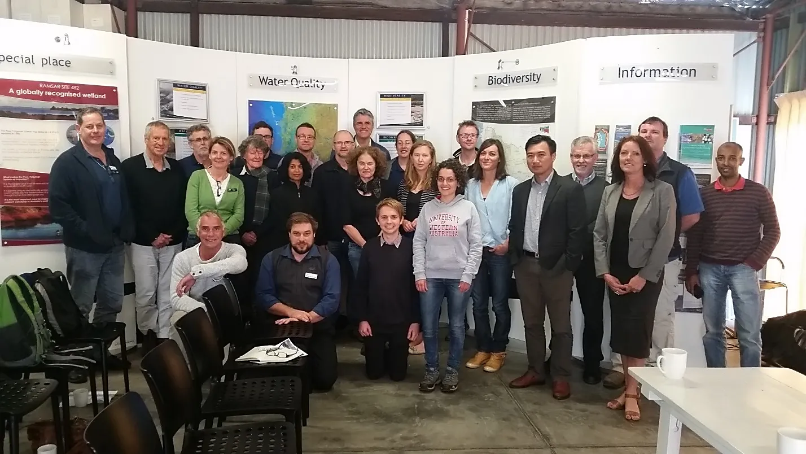

# Acknowledgements

<br>

::: {.body-text width="100%"}
The research presented in this document was generously supported by the Australian Research Council Linkage Program (LP150100451), together with our Industry Partners (Department of the Premier and Cabinet; Department of Water and Environmental Regulation; City of Mandurah; Shire of Murray; Peel-Harvey Catchment Council) and collaborating research institutions (Murdoch University; The University of Western Australia; Southern Cross University; University of Hull). We are indebted to our Industry Partners for their support, trust and engagement in this Linkage Project, not only during its funding period, but throughout the many prior discussions that helped shape its development and bring it to fruition. We extend a particular note of gratitude to the Peel-Harvey Catchment Council team for their support in organising and facilitating our many stakeholder meetings, and advocating for the research. We also acknowledge the Bindjareb people of the Noongar Nation as the Traditional Custodians of the land and waters on which this work was undertaken, and pay our respects to Elders past, present and emerging.
:::


## Acknowledgements

::: {.body-text width="100%"}
We are indebted to our Industry Partners for their support, trust and engagement in our Linkage Project, not only during its funding period, but during the many prior discussions that helped shape its development and bring it to fruition. We are also indebted to the Australian Research Council and the collaborating research institutions for their funding and operational support. We extend a particular not of gratitude to Steve Fisher and the Peel-Harvey Catchment Council team for their support in organising and facilitating our many stakeholder meetings, and advocating for the research. 
:::


## Our Supporters and Collaborators {-}

::: {.body-text width="100%"}

This project was generously supported by the Australian Research Council (ARC) Linkage Program, together with our Industry Partners (Department of the Premier and Cabinet; Department of Water and Environmental Regulation; City of Mandurah; Shire of Murray; Peel-Harvey Catchment Council) and collaborating research institutions (Murdoch University; The University of Western Australia; Southern Cross University; University of Hull). 

```{r introduction-pic1, echo = FALSE, out.width='100%', class = "text-image"}

```
:::