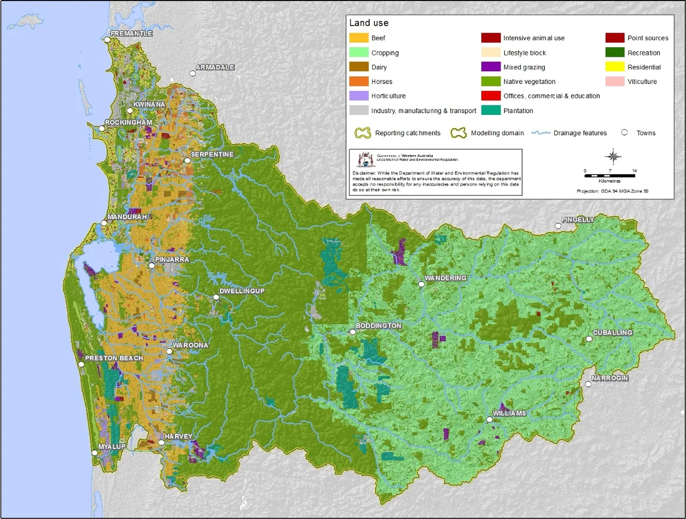

# (PART)  Characterising the Environment {-} 

# Modelling of the Peel-Harvey Catchment {#catmodel}

<!-- ::: {.title_matter width="100%"} -->
<!-- [***Balancing estuarine and societal health in a changing environment***]{style="color:#5f543f"} -->
<!-- ::: -->

<br>

::: {.chapter-authors width="100%"}
**Karl Hennig, Kieryn Kilminster, Peta Kelsey, Ben Marillier, Joel Hall, Gayan Gunaratne, Malcolm Robb**
:::

::: {.author-info width="100%"}
Department of Water and Environmental Regulation, Government of Western Australia, Perth, Australia
:::

```{r catchment-model-pic1, echo = FALSE, out.width='100%', class = "title-image"}

```

<br>

## Abstract

::: {.body-text width="100%"}
The Source (eWater®) modelling platform was used to develop hydrological and nutrient models for the catchment of the Peel-Harvey Estuary. These models allow the nutrient export delivered to the estuary to be estimated and the major sources of these nutrients to be identified. This allows management actions to be targeted where they will have the most capacity to reduce nutrient export. 

The model indicates that the nutrient load from all sub-catchments reaching the estuary is approximately 630 tonnes per year of nitrogen and 60 tonnes per year of phosphorus, averaged from 2006--2015. Additional nutrient loads also flow out to the ocean or are stored in dams. The major sources of nutrients by land-use are, for **nitrogen**, beef cattle farms (62% of total load), cropping (12%) and dairy cattle farms (6.8%) and, for **phosphorus,** beef cattle (67%), dairy cattle (8.1%) and horticulture (7.3%).

The catchment model, which was coupled with an estuary response model in subsequent aspects of the research, was then used to compare a range of scenarios proposed for 2050 by stakeholders across the Peel region. These scenarios encapsulated three different catchment management narratives (termed 'environmentally optimistic, 'business as usual' and 'environmentally pessimistic/economically optimistic') under two climate regimes (current climate and 2050 predicted climate). Full details of the catchment model development, calibration and outputs of the tested scenarios relating to (i) land-use change, (ii) nutrient management and (iii) climate are outlined in separate documents detailed in the following report. 
:::

## Introduction

::: {.body-text width="100%"}
This study used catchment-scale models to estimate the water flows and loads and concentrations of nitrogen and phosphorus to the Peel-Harvey Estuary and the ocean. The Source (eWater®) modelling platform was used to develop hydrological and nutrient models, which require meteorological and land-cover input data, and are calibrated using the data from flow and water quality monitoring sites located throughout the Peel-Harvey catchment. This modelling is an update of the work done by @kelsey2011hydrological, using different models and methodology. The Department of Water and Environmental Regulation (DWER) is currently preparing a detailed technical report on this revised catchment modelling, and exploring a suite of scenarios of land-use change, catchment management actions and climate change (Hennig et al., 2021).

Specific catchment model outputs were made available to inform a set of three 2050 narratives or 'plausible futures' proposed by Peel stakeholders during project discussions and workshops. The scenarios underpinning these narratives, which are detailed in @hipsey2019estuarine, comprised specific land-use, catchment management and climate combinations. The catchment model outputs for each of these scenarios were then coupled with the estuary hydrodynamic and biogeochemical models developed in other parts of the research program (outlined in Chapters \@ref(model-hydrology) and \@ref(model-water-quality)). This enabled forecasting of estuarine ecosystem response under each 2050 scenario (Chapter \@ref(healthscenarios)).

Beyond this modelling analysis, the revised Peel-Harvey catchment model has been further applied to inform the development of the *Peel-Harvey Estuary Protection Plan* and a revision of the *Peel Harvey Water Quality Improvement Plan*, which are currently being developed by DWER.
:::

### Objectives

1.  Create a calibrated catchment hydrological model to estimate flow and nutrient loads in the Peel-Harvey.

2.  Run the model for a suite of 2050 scenarios related to catchment land-use, management and climate. 

3.  Analyse the catchment output data (flow, total nitrogen and total phosphorus) in the context of the linked Peel-Harvey estuary model to support forecasting of estuarine response under each 2050 scenario. 

## Approach

### Model description

::: {.body-text width="100%"}
Constructing a model for a particular catchment management situation involves selecting appropriate component models and linking them in the software (including rainfall-runoff models, nutrient export and filtering models, streamflow routing models etc.). We used the Source (eWater®) modelling platform which has been adopted widely around Australia for catchment modelling, and is at the core of the National Hydrological Modelling Platform program [@welsh2013integrated]. The model Source is based on the following building blocks:
:::

-   [Catchments:]{.ul} The sub-catchment is the basic spatial unit, which is then divided into hydrological response units (or functional units) based on a common response or behaviour such as land-use.

-   [Nodes:]{.ul} Nodes represent sub-catchment outlets, stream confluences or other places of interest such as stream gauges or dam walls. Nodes are connected by links, forming a representation of the stream network. 

-   [Links:]{.ul} Links represent the river reaches. Within each link, a selection of models can be applied to route or delay the movement of water along the link or modify the contaminant loads due to processes occurring within the links, such as the decay of a particular constituent over time.

::: {.body-text width="100%"}
The basis of the **hydrological model** comprised three different models for land-uses classified as urban, cleared and vegetated, and their combined flow describes the total flow (Fig. \@ref(fig:catchment-model-pic2)). Each of the 23 descriptive land-use classes identified across the Peel-Harvey catchment (Fig. \@ref(fig:catchment-model-pic3)) were assigned to the broader urban, vegetated or cleared categories. The hydrological model was calibrated predominantly using gauged station data from 2000--2015.
:::

-   [Urban:]{.ul} Urban land-uses (such as urban residential, commercial and education offices, industry, manufacturing and transport) were assigned the calibrated parameters for Bannister Creek, as this was the gauge with the best calibration metrics. 

-   [Vegetated:]{.ul} Vegetated land-uses (such as plantations, rural living bush block, native vegetation) were calibrated to vegetated gauged catchments. Model parameters were assigned by major river (Serpentine and Murray). 

-   [Cleared:]{.ul} Cleared land-uses (such as dairy, beef, cropping, horticulture) were calibrated to flow gauging stations throughout the Peel-Harvey catchment. 

::: {.body-text width="100%"}
```{r catchment-model-pic2, echo = FALSE, out.width='50%', class = "text-image", fig.cap = "Components of the hydrological model at the modelling catchment scale. Cleared, urban and vegetated land-uses have unique hydrological models. The flow generated from these land-uses amount to the total flow generated by a modelling catchment, as indicated by the blue ‘total’ graph."}

```

The **nutrient model** framework in Source has four modules:
:::

-   **Constituent generation models**: which determine how constituents (e.g. sediments or nutrients) are generated within a functional unit (e.g. a land-use parcel within a sub-catchment) and the resulting concentrations or loads that are passed to the filter model. 

-   **Inflow nodes**: Inflow nodes have been used to include point sources of nutrients, septic tanks, dam inflows and irrigation returns. The nutrients from these sources are external to the constituent generation and filtering models.

-   **Filtering models**: which represent any transformation of constituents between generation within the functional unit and arrival at the sub-catchment node. Filtering models process constituents within the functional units. Filtering models have been used to represent nutrient processes in vegetated riparian zones.

-   **In-stream processing models**: This model has not been included explicitly in-stream processing models. Instead, these processes are implicit within the catchment calibration process.

::: {.body-text width="100%"}
The diffuse nutrient model uses the *power function (flow in mm)* constituent generation model to generate total nitrogen and total phosphorus concentrations. The modelling functional units include the 23 land-use categories and two soil phosphorus retention index (PRI) categories (to represent poor soils that are prevalent on the Swan Coastal Plain). Calibration was undertaken for all catchments upstream of water quality monitoring sites and was used for both nitrogen and phosphorus. The nutrient model was calibrated to winter nutrient concentration data for the period of 2011--2015.

Dairy farms were modelled using the same approach described for the diffuse nutrient model. However, farm nutrient surplus was modified using a farm nutrient budget that considered nutrients from paddock and dairy shed effluent. 

Water and nutrients from dam releases and irrigation returns were calculated separately and included as inflow nodes. 

Riparian zone nutrient removal was calculated linearly, assuming 0% removal for catchments with 0% riparian zone vegetation to the maximum nutrient removal for catchments with 100% riparian zone vegetation. Stream order was also considered. It was assumed that first- and second-order streams required half the vegetated riparian zone width of larger-order streams to achieve the same percentage nutrient reductions [@hennig2015avon]. The vegetated riparian zone nutrient-removal percentages were assumed to be the same as the 'medium' quality riparian zone efficacy given in the Leschenault Estuary Water Quality Improvement Plan [@hugues2012leschenault]. The nutrient removal of riparian zones on the Swan Coastal Plain was assumed to be less effective that those in inland areas [@hugues2012leschenault].
:::

### Model input data

::: {.body-text width="100%"}
**Meteorological data** was derived from the Australian Water Availability Project (AWAP) which provides daily gridded rainfall, temperature, vapour pressure and solar exposure data. Daily rainfall and calculated potential evapotranspiration (PET) data were extracted for the centroids of the modelling catchments for 1/1/1960 to 31/12/2015. PET was calculated using the FAO56 methodology [@allen1998crop; @ladson2008hydrology], with missing data infilled as following:
:::

-   Solar exposure data was not available pre-1990. Global exposure data was substituted prior to 1990. 

-   Vapour pressure was not available prior to 1971 and was infilled using average monthly vapour pressure from 1971-2015.

::: {.body-text width="100%"}
The catchment model climate data series was later updated with SILO data from 1/1/2016 to 8/10/2018 to generate data for the estuary model. At the time, AWAP data could not be generated. More information about SILO data can be found [here](https://www.longpaddock.qld.gov.au/silo/).

The **land-use mapping** dataset from @kelsey2011hydrological was updated to represent land-use present in 2015, and was informed by the state cadastre dataset (Landgate), aerial photography, upper storey vegetation calculated from LIDAR (DWER) and native vegetation data (Department of Primary Industries and Regional Development) (Fig. 2). The land-use mapping update focused on the inclusion of new urban developments, large-scale changes to agricultural land-uses and practices, intensive agriculture and riparian zone revegetation.

**Nutrients associated with land-use** (e.g. input, surplus rates and nutrient use efficiencies) were assigned with data sourced from relevant literature and assumptions. Nutrient surplus is equal to nutrient input minus nutrient output. Nutrient surpluses can be stored (e.g. in livestock, soil or plant matter) or lost from the land parcel. Nutrient losses can occur though leaching to groundwater, via surface runoff, or to the atmosphere (e.g. wind erosion, fire, denitrification, volatilisation). Nutrient use efficiency (NUE) is nutrient out divided by nutrient in, expressed as a percentage. Land-uses with 100% NUE convert all nutrient inputs to nutrient outputs and therefore have a nutrient surplus of zero. Fig. \@ref(fig:catchment-model-pic4) shows land-uses ranked by nutrient surplus and nutrient use efficiency. 

**Other input data** included soil phosphorus retention, environmental water provision/releases, irrigation returns, point sources (e.g. feedlots, stockyards, piggeries, abattoirs, poultry, industrial and waste water treatment plant) and septic tanks (more than 12,000 in the Peel-Harvey Estuary catchments). Fig. \@ref(fig:catchment-model-pic5) displays the full extent of the Peel-Harvey catchment, including its main drainage features and reporting catchment boundaries. 
:::

### Model calibration

::: {.body-text width="100%"}
Full details of model calibration, parameterisation and model performance will be provided in Hennig et al. (XXXX). 

Where possible, the hydrological models were calibrated for the 2000--2015 period and validated using data from 1980--1999. This was done so that the hydrological model produced accurate results for the period for which most results were derived (2006--2015) and because the 2000--2015 period had substantially lower flow. As a result, the model consistently underestimated larger flow events that were present in the validation period of 1980--1999.

The nutrient models were calibrated using data recorded at water quality monitoring sites across the catchment. Five-year winter median nutrient concentrations (2011--2015) were used as the primary calibration statistic, with a difference of ±15% deemed acceptable and a difference of ±5% set as the calibration objective. All sites had modelled median winter nutrient concentrations within 5% of observed winter median concentrations (Fig. \@ref(fig:catchment-model-pic6)).

```{r catchment-model-pic3, echo = FALSE, out.width='100%', class = "text-image", fig.cap = "Land-use classes for the Peel-Harvey catchment."}



```

```{r catchment-model-pic4, echo = FALSE, out.width='100%', class = "text-image", fig.cap = "Nitrogen (top) and phosphorus (bottom) surplus and nutrient use efficiency (NUE), ranked by land-use."}
knitr::include_graphics("images/catchment_model/picture4.webp")
```

```{r catchment-model-pic5, echo = FALSE, out.width='100%', class = "text-image", fig.cap = "Reporting catchments for the Peel-Harvey."}

```

```{r catchment-model-pic6, echo = FALSE, out.width='100%', class = "text-image", fig.cap = "Winter median observed and modelled total nitrogen (top) and total phosphorus (bottom) concentrations. All sites represent the 2011–2015 period except 614037, which represents 1995–2000. The locations of these sites are given in Fig. 6."}

```
:::

### Coupling to the estuary model

::: {.body-text width="100%"}
This model was used to provide inputs of water flow, total nitrogen and total phosphorus to the estuary hydrological and biogeochemical models, reported in Chapters \@ref(model-hydrology) and \@ref(model-water-quality). The locations of catchment inputs to the estuary model are shown Fig. \@ref(fig:catchment-model-pic7). For the catchment model outputs prior to 2000, an adjustment was needed to correct for an underestimation of the flow by the model in this period. This underestimation was likely due to the catchment model being calibrated during a dry period from 2000--2015 (see section ??4.3??). This bias correction was only applied to model outputs used for the estuary model inputs prior to 2000. Details of how this bias was adjusted are given in Supplementary Materials S2.1. 
:::

### Scenarios

::: {.body-text width="100%"}
This calibrated catchment nutrient model was used to explore a range of scenarios relating to (i) land-use change, (ii) nutrient management and (iii) climate. Specifically for this research study, a set of eight scenarios were run using this model that aligned with the three 2050 narratives identified by Peel stakeholders ['*environmentally optimistic*, '*business as usual*' and '*environmentally pessimistic/economically optimistic*'], i.e. two scenarios for each narrative and two further scenarios to represent the 'base case' or current conditions. A summary of the model configurations underpinning each scenario is given in Chapter \@ref(healthscenarios), and a detailed account of the fuller range of scenarios is also given in Hennig et al. (XXXX). 

```{r catchment-model-pic7, echo = FALSE, out.width='80%', class = "text-image", fig.cap = "Catchment model inputs to the estuary model (white circles) and catchment monitoring sites (circle with site number). "}
knitr::include_graphics("images/catchment_model/picture7.webp")
```
:::

## Results & findings

### Flows and loads to the Peel-Harvey Estuary

> *Average annual loads (2006--2015) of nutrients estimated to be exported from the Peel-Harvey catchment were lower than the previous reporting period, mainly due to reduced river flow*

::: {.body-text width="100%"}
The nutrient load from all catchments is approximately 830 tonnes per year of nitrogen and 90 tonnes per year of phosphorus. The loads to the Peel-Harvey Estuary were estimated to be 630 tonnes of nitrogen and 60 tonnes of phosphorus (with the remainder flowing out to the ocean or stored in dams). 

Estimated flows and nutrient loads were substantially lower than estimated in previous modelling by @kelsey2011hydrological, which gave results for the period of 1997--2007. During the current modelling period of 2006--15, the climate was drier and thus resulted in less river flow and nutrient loading to the Peel-Harvey Estuary. However, concentrations of nutrients from the current model remain excessive. All estuary catchments on the coastal plain had flow-weighted concentrations in excess of ANZECC guidelines (2000) for lowland rivers (1.2 mg/L TN and 0.065 TP). A detailed discussion about water quality targets will be given in a detailed technical report that is currently being prepared by the DWER.
:::

> *Most nutrients are delivered to the estuary in winter*

::: {.body-text width="100%"}
Actual nutrient loads in a given year have a fairly tight relationship to flow, as shown in Fig. \@ref(fig:catchment-model-pic8). More than 90% of the flow and nutrient is discharged during the winter months (June-October).
:::

### Source of nutrients

> *Of the 13 catchments modelled, three catchments (Harvey, Lower Murray and Upper Serpentine) contribute 60% of the total nitrogen and phosphorus load to the estuary*

::: {.body-text width="100%"}
Overall, the catchments that delivered the greatest loads of nutrients to the Peel-Harvey estuary were:
:::

**Nitrogen:** 

1.  Harvey (205 tonnes, 32%)

2.  Lower Murray (103 tonnes, 16%)

3.  Upper Murray (80 tonnes, 13%)

4.  Upper Serpentine (72 tonnes, 11%).

**Phosphorus:**

1.  Harvey (20 tonnes, 33%)

2.  Upper Serpentine (10 tonnes, 17%) 

3.  Nambeelup (6.7 tonnes, 11%) 

4.  Lower Murray (6.2 tonnes, 10%).

::: {.body-text width="100%"}
The nutrient loads per cleared area of estuary catchments (excluding the Upper Murray) are 3.6 kg/ha/yr of nitrogen and 0.39 kg/ha/yr of phosphorus. The catchments with the greatest average annual nutrient loads that drain to the estuary are, for **nitrogen**: (1) Harvey (6.1 kg/cleared ha); (2) Dirk Brook (4.1 kg/cleared ha); (3) Nambeelup (3.7 kg/cleared ha) and, for **phosphorus**: (1) Nambeelup (0.61 kg/cleared ha); (2) Harvey (0.59 kg/cleared ha); (3) Lower Serpentine (0.42 kg/cleared ha).
:::

> *The major sources of nutrients by land-use are, for nitrogen: beef (62% of total load), cropping (12%) and dairy (6.8%) and, for phosphorus: beef (67%), dairy (8.1%) and horticulture (7.3%)*

::: {.body-text width="100%"}
The above land-uses above account for approximately 80% of the nitrogen and phosphorus loads delivered to the Peel-Harvey Estuary. Beef is clearly the largest source of nutrients in the Peel-Harvey catchment. This is primarily due to the large area of beef farming (Fig. \@ref(fig:catchment-model-pic3)), its high nutrient surplus rate, poor nutrient-use efficiency (\<10%) and its location on the Swan Coastal Plain (high rainfall and large areas of low PRI soils).

Intensive animal uses (piggeries, abattoirs, poultry, feedlots and stockyards) contribute \<5% of the total nutrient load. While this could be considered small at an estuary catchment scale, the nutrient load is much greater at a reporting catchment scale. For instance, 17% of the phosphorus load of the Meredith catchment is estimated to originate from piggeries.

Point sources (e.g. wastewater treatment plans, industrial sources, composting facilities) contribute \<1% of the nutrient load. However, septic tank nutrient contributions are much larger, accounting for 3.1% and 2.6% of the nitrogen and phosphorus loads, respectively, reaching the estuary.

```{r catchment-model-pic8, echo = FALSE, out.width='100%', class = "text-image", fig.cap = "Annual flow and nitrogen and phosphorus loads from the major river catchments to the Peel-Harvey Estuary."}
knitr::include_graphics("images/catchment_model/picture8.webp")
```
:::

## Conclusions

> *The calibrated catchment model estimates that, on average, 630 tonnes of nitrogen and 60 tonnes of phosphorus reaches the Peel-Harvey Estuary per year -- with disproportionately greater loads coming from a few catchments*

::: {.body-text width="100%"}
The catchments that contribute the greatest average annual nutrient loads per cleared area are, for **nitrogen**:
:::

1.  Harvey (6.1 kg/cleared ha),

2.  Dirk Brook (4.1 kg/cleared ha),

3.  Nambeelup (3.7 kg/cleared ha),

and for **phosphorus**: 

1.  Nambeelup (0.61 kg/cleared ha),
2.  Harvey (0.59 kg/cleared ha),
3.  Lower Serpentine (0.42 kg/cleared ha),

> *Beef cattle farming was the land-use responsible for the majority of both nitrogen and phosphorus exported to the estuary*

::: {.body-text width="100%"}
The major sources of nutrients by land-use are, for **nitrogen**: beef (62% of total load), cropping (12%) and dairy (6.8%) and, for **phosphorus:** beef (67%), dairy (8.1%) and horticulture (7.3%).
:::

## Data availability & supplementary materials

Data used for the model and supporting the conclusions of this study are available in the Peel ARC Linkage Project Github repository (Busch et al., 2023). 

Supplementary materials for this chapter are available <here>.

## Acknowledgements

::: {.body-text width="100%"}
The modelling work undertaken was supported by funding from the [Regional Estuaries Initiative](https://rei.dwer.wa.gov.au), a Western Australian State Government investment in the health of south-west estuaries.  
:::