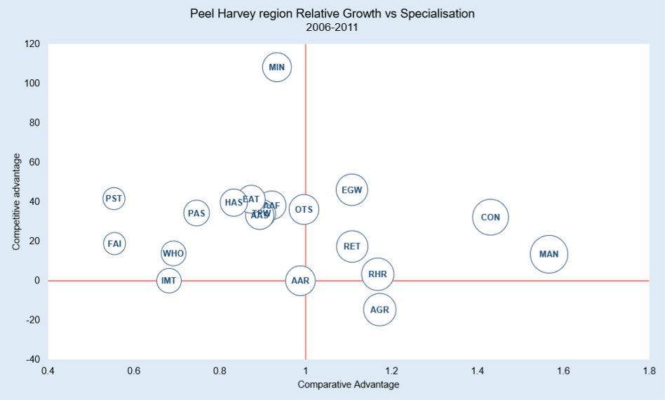
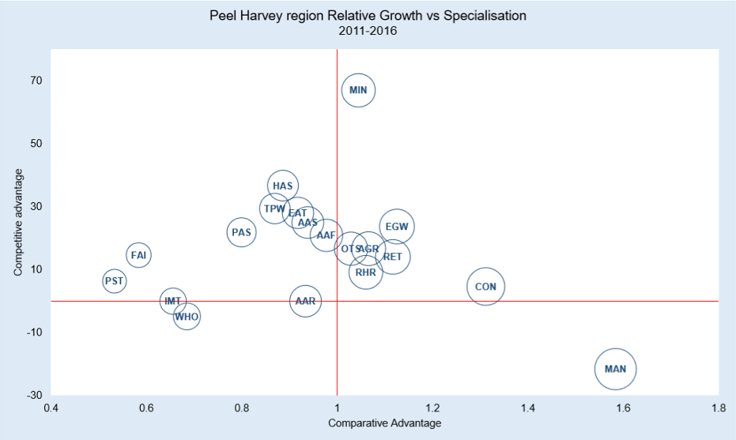

# Understanding Local Economic Competitiveness for the Peel-Harvey: Identifying Key and Strategic Industries, 2006-2016

::: {.title_matter width="100%"}
[***Balancing estuarine and societal health in a changing environment***]{style="color:#5f543f"}
:::

::: {.chapter-authors width="100%"}
**Paul Plummer, Jill Trinh & Julia Horsley**
:::

::: {.author-info width="100%"}
Centre for Regional Development, The University of Western Australia, Crawley WA 6009, Australia
:::

```{r economic-competitiveness-pic1, echo = FALSE, out.width='100%', class = "title-image"}


```

## Executive Summary

The **Peel-Harvey Region** experienced **overall increase in employment** between **2006 and 2016** with its total workforce increased from 42,194 people to 64,491 people. The most significant period was between 2006 and 2011 with the region's employment growth rate reaching 28.7%. It was then followed by an employment growth rate of 18.8 between 2011 and 2016. Over the same decade, the total Western Australian workforce increased from 936,130 people to 1,157,735 people. The proportion of Peel-Harvey's workforce to that of Western Australia during the period increased by 1.1%, from approximately 4.5% to 5.6%.

***Competitive advantage***

In 2006, the highest employing industries in the Peel-Harvey Region by number of people and % of the total employment in the region were: 

-   Manufacturing (6244, 14.7%) 

-   Construction (5489, 13%) 

-   Retail trade (5211,12.3%)

In 2011, these three industries were still the ones with highest employment level and employment growth rate, however, the order changed with construction taking the lead: 

-   Construction (7257, 13.3%)

-   Manufacturing (7082, 13%)

-   Retail trade (6116, 11.2%) 

In 2016, construction and retail trade remained in the top three industries with the highest employment level and employment growth, however, manufacturing dropped out and was replaced by health care and social assistance: 

-   Construction (7594, 11.8%), 

-   Retail trade (6976, 10.8%) 

-   Health care and social assistance (6817, 10.6%) 

Between 2006 and 2011, agriculture declined from 1630 to 1391 people employed, or from 3.8% to 2.6% of the total workforce in Peel-Harvey. Between 2011 and 2016 it rebounded slightly in terms of raw numbers, but due to overall increase in Peel-Harvey's workforce, this amounted to only 2.5% of the total employment in the region.

***Comparative advantage***

Over the full period between 2006 and 2016, the Peel Harvey region's economy remained specialised in the following industries: manufacturing, construction, agriculture, retail trade and electricity, gas, water and waste services. 

In 2011, the region became specialised in mining. By 2016, mining surpassed agriculture in the degree of specialisation for the region. The majority of all other industries in Peel-Harvey also grew in size between 2006 and 2016. However, there are some exceptions to this trend, which include: information, media and telecommunications which declined in the period from 2006 to 2011, but grew in the period from 2011 to 2016; and wholesale trade, which declined in the period from 2011 to 2016. 

## Background

This research component forms part of an Australian Research Council Linkage Project LP150100451 (the 'ARC Linkage Project') aimed at understanding the relational dynamics of the ecological and socio-economic system(s) of the Peel-Harvey estuary and surrounding catchment areas (the 'Peel-Harvey Region'). Two major challenges are predicted for the Peel-Harvey Region within the next 30 years: (i) a major increase in population growth, and (ii) a significant further drying and warming of the regional climate [@valesini2019peel]. The need to get the right balance between development aspirations and estuarine health has never been more important. This research component focuses on *understanding local competitiveness* in the Peel-Harvey Region's economic system. 

This research uses the Australian Bureau of Statistics (ABS) Census of Population and Housing time series profiles, which count the number of persons in each industry of employment (based on place of enumeration) for all 138 local government areas (LGAs) in Western Australia for the census periods 2006, 2011 and 2016. The three most recent census periods have been selected as the most relevant for the purposes of this research (and due to lack of concordance in data collection methods for census periods prior to 2006). Boundaries for the LGAs of the Peel-Harvey Region -- Boddington, Harvey, Mandurah, Murray, Waroona and Serpentine-Jarrahdale - are according to the ABS 2016 definition. To identify the key and strategic industries for each LGA, employment is disaggregated by industrial sector, as defined by the Australian and New Zealand Standard Industrial Classification (ANZSIC) industry coding (see Appendix 1). It should be noted that one limitation widely reported by local governments is the likely undercount of employees by the ABS. This arises out of the difficulty in capturing fly-in/fly-out workers and other temporary residents. In this research, place of usual residence data has been used. 

The scope of the study is based on the political boundaries of the LGAs that 'overlap' the Peel-Harvey Estuary and primary catchment areas (see map at Appendix 3). The estuary, which covers approximately 130 km2, lies predominantly in the smallest of the nine formal planning regions for the State of Western Australia, the Peel Region. However, some of the 9,400 km^2^ of the three main river subcatchments of the estuary extend into part of the South West Region. Accordingly, there are five LGAs in the Peel Region, and one in the South West region, whose boundaries broadly 'overlap' those of the estuarine ecological system to form the 'Peel-Harvey Region' for the purposes of this study:

+:----------------------------:+:-------------------------------------:+
| Shire of Boddington (Peel)   | Shire of Murray (Peel)                |
|                              |                                       |
| Shire of Harvey (South West) | Shire of Serpentine-Jarrahdale (Peel) |
|                              |                                       |
| City of Mandurah (Peel)      | Shire of Waroona (Peel)               |
+------------------------------+---------------------------------------+

## Objectives

The objective of this research component is to undertake an investigation of the *Competitive Advantage* and *Comparative Advantage* of the Peel-Harvey Region economy. 

This links with the broader research objectives:

-   To construct a simple model with which to conduct scenario analysis on the impacts of ecological and/or socio-economic changes in the Peel-Harvey Region.

-   To link the model of competitive and comparative advantage across the Peel-Harvey Region to an ecological land use model that is being developed through the ARC Linkage Project as a tool to inform planning & development decisions.

## Approach

***Understanding "Local Competitiveness" and "Comparative Advantage"***

Cities and regions compete with each other for global, national, and local 'market share'. The drivers that shape local economies encompass both the impacts of globalisation, technological, and environmental change and local geographical conditions. Furthermore, industries perform differently in particular locations and, not surprisingly, localities perform differently to each other. Some of those reasons include natural resources, geographic advantages, access to transport, energy or information networks, local policies and human capital. Human capital brings knowledge, skills and competencies which have a productive value. Housing, education, amenity and services all shape the availability and employability of human capital [@plammer2001theories].

The transition of the Western Australian economy from the mining investment boom to broader-based growth creates challenges to localities across the State, while bringing opportunities for growth and prosperity in others [@plummer2014endogenous]. Policy and institutional settings will also impact local and regional capacity to respond to changes in economic, ecological and social conditions, and their dynamic interdependency. Building on the conceptual and empirical foundations of 'New Regionalism', we refer to recent government publications including a 2014 report published by the former *Western Australian Department of Regional Development* identifying the key drivers of local competitive and comparative advantage across the Western Australian economy [@wadrd2014summary], and a more recent report published by the *Australian Government Productivity Commission* [@productivity2017transitioning], identifying challenges that particular regions face in successfully transitioning from mining to a more sustainable economic base. In response to the identified ecological and demographic challenges being faced by the locations included in the ARC Linkage Project, this research component sets out the structure, dynamics, and competitiveness of **the Peel-Harvey Region** economy.

### Local Competitive Advantage: the ability to create jobs locally

The competitive advantage of a locality can be imputed, or calculated, from information on both the number of persons employed in each industry ('***size'***) and those industries that are growing most rapidly in terms of their ability to create jobs relative to a benchmark economy ('***growth'***).

Using the benchmark of the overall performance of the Western Australian economy, it is possible to categorize local industries as:

-   ***Fast growing***: relatively large sectors that have exhibited rapid recent growth.

-   ***Restructuring***: relatively large sectors that make a significant contribution to the economic base but with little or no growth over the recent past.

-   ***Underdeveloped***: low levels of activity in terms of employment and the contribution to the local economy.

### Comparative Advantage: local economic specialization and interregional-trade patterns

Conventionally it is assumed that localities specialize in those activities in which they have a comparative advantage. Comparative advantage is the principle that a country, region or locality should specialise in producing and exporting goods in which it has comparative or ***relative cost advantage over others***, and import goods in which it has a cost disadvantage. 

The comparative advantage of the Peel-Harvey Region is imputed using information on the importance of an industry in terms of the degree to which the local economy specializes in that economic activity ('***specialisation'***) and a measure of the degree to which economic activity and employment is related to servicing local demand as against servicing demand external to the region ('***economic base'***).

Determining the pattern of local economic ***specialisation*** using location quotients identifies the industries that drive and underpin the local economy (see Appendix 1). Location quotients (LQ) measure the concentration of an industry or economic activity in a particular location, compared to a benchmark economy, in this instance Western Australia. Typically, this is measured as the proportion of people employed in an industry in a locality relative to the proportion of people employed in that industry in the benchmark economy. If a particular industry's share of regional employment is greater than that industry's share of State employment, i.e. the location quotient is greater than one, (or unity), then the locality is assumed to specialize in that economic activity. 

Since local economic data on trade flows does not exist, location quotients have also been widely used to infer regional trade patterns (see Appendix 2): 

-   ***Basic sector***: The greater the location quotient above one (or unity), the larger the economy's net sectoral exports from that sector (i.e. the greater the proportion or share of the local economy of a particular industry, and therefore exports from that region).

-   ***Non-basic sector***: The greater the location quotient below unity (or one), the larger the economy's net sectoral imports from that sector (i.e. the proportion or share of the local economy of a particular industry is less than the overall State proportion, and therefore imports into that region).

-   ***Neutral sector***: For a location quotient of unity, (or one), the economy is neither a net exporter nor a net importer for that sector.

### Classifying Industrial Activities

Combining the information on an economy's ability to create jobs locally (*Competitive Advantage*) and identifying the patterns of specialization and inter-regional trade within sectors of the economy (*Comparative Advantage*), it is possible to classify industries in terms of their impact on the growth potential of a locality. Fig. 1 classifies the economic structure of a local economy with relative growth measured on the vertical axis and relative specialization measured on the horizontal axis:

-   ***Important growth industries***: characterized by above average employment growth, relative economic specialization, and export orientation.

-   ***Important industries that may require attention:*** characterized by below average employment growth, relative economic specialization, and export orientation.

-   ***Potential emergent industries***: characterized by above average employment growth, but currently oriented towards servicing local demand.

-   ***Industries of little promise***: characterized by below average employment growth and currently oriented towards servicing local demand.

```{r economic-competitiveness-pic2, echo = FALSE, out.width='50%', class = "text-image", fig.cap = "Classification of Industrial Structure."}


```

## Main Findings

Figs 2(a) and 2(b) summarise the economic structure of the Peel-Harvey economy:

-   The Peel-Harvey economy is relatively diverse with six specialised industries, however, growth in each of these sectors was not consistent between 2006 and 2016. (The size of the 'bubbles' in Figure 2 relates to the relative size of the industry in terms of the number of people employed).

-   Agriculture is important, especially by comparison to the Western Australian economy but overall does not employ a large number of people in Peel-Harvey compared with other industries. 

-   The majority of other industry sectors, without further attention, will likely remain '*potential emergent industries'* from a local competition perspective. Although, promisingly, they all grew between 2006 and 2016. The exceptions to this trend, were:

    -   information, media and telecommunications which declined in the period from 2006 to 2011 to become an '*industry of little promise'*, but grew again in the period from 2011 to 2016, lifting its status to '*potential emergent industry'*; and

    -   wholesale trade, a '*potential emergent industry'* in 2006 and 2011, but declined in the period from 2011 to 2016 and so classified as an '*industry of little promise'*. 

<!-- -->

-   In the 2006--2011 period, the only sector that showed both poor relative growth and limited specialisation in Peel-Harvey was information, media and telecommunications which was therefore designated an '*industry of little promise'*. While manufacturing, construction, retail trade, real estate (Rental, Hiring and Real Estate Services) and utilities (Electricity, Gas, Water and Waste Services) were the '*important growth industries'* (based on relative growth and specialisation compared with the broader Western Australian economy). Agriculture, due to a decline in the number of people employed and ongoing comparative specialisation was identified as an '*important industry that may require attention'*.

-   In the 2011-2016 period, agriculture rebounded somewhat to reclaim its status as an '*important growth industry'*, and was joined in this quadrant by mining which grew more significantly in terms of employee numbers as well as becoming a specialisation for the Peel-Harvey Region. However, manufacturing while remaining a specialisation for the region, declined in size to become an '*important industry that may require attention'*. Information, media and telecommunications grew very slightly thereby ceasing to be in the '*industry of little promise'* and transitioning to a '*potential emergent industry'*. Wholesale trade decreased in employee numbers over the same period leading it to change its status from '*potential emergent industry'* to '*industry of little promise'*.

```{r economic-competitiveness-pic3, echo = FALSE, out.width='100%', class = "text-image", fig.cap = "The relative growth of the industry based on level of local specialization for 2006-2011."}



```

```{r economic-competitiveness-pic4, echo = FALSE, out.width='100%', class = "text-image", fig.cap = "The relative growth of the industry based on level of local specialization for 2011-2016."}



```

## Conclusions

The contemporary Western Australian economy can be characterized by a multi-speed economy, driven by a strong and consistent pattern of job creation that has not played out evenly across Western Australia. This has resulted in an increasingly 'patchwork economy', with larger and more economically diverse economies forging ahead of less resilient or smaller regions. Empirical analysis of both *Comparative Advantage* and *Competitive Advantage* provide valuable information on both existing and strengths and weaknesses of the Peel-Harvey region. 

More broadly, *Competitive Advantage* and *Comparative Advantage* are technically two separate concepts which measure different dimensions of economic performance. However, when viewed together they have the potential to provide information on:

-   Multiple factors in the economy of a particular place;

-   The relationship of a particular locality with other localities nearby; 

-   The interdependence between industries; and 

-   The performance of that economy compared to other local economies. 

This research component unpacks the growth experience of the Peel-Harvey Region. The dynamics and drivers of local competitiveness and comparative advantage shape a regional economy's responsiveness to externalities and help explain the underlying forces triggering 'catch-up', 'falling behind' and 'forging ahead'. They also assist in forecasting economic impacts including:

-   The direct and indirect effect of investing in the region, 

-   The influence of local investment beyond the region, 

-   The potential for diffusion of external shocks across the economic system, and

-   The potential significance of ecological change and/or environmental policy on the relative competitiveness of the local economy.
