# Assessing the Health of the Peel-Harvey Estuary Through its Fish Communities

<!-- ::: {.title_matter width="100%"} -->
<!-- [***Balancing estuarine and societal health in a changing environment***]{style="color:#5f543f"} -->
<!-- ::: -->
<br>

::: {.chapter-authors width="100%"}
**Chris Hallett, Fiona Valesini, Daniel Yeoh**
:::

::: {.author-info width="100%"}
Centre for Sustainable Aquatic Ecosystems, Murdoch University, Perth WA 6XXX, Australia.
:::

```{r fish-ecology-pic1, echo = FALSE, out.width='100%', class = "title-image"}

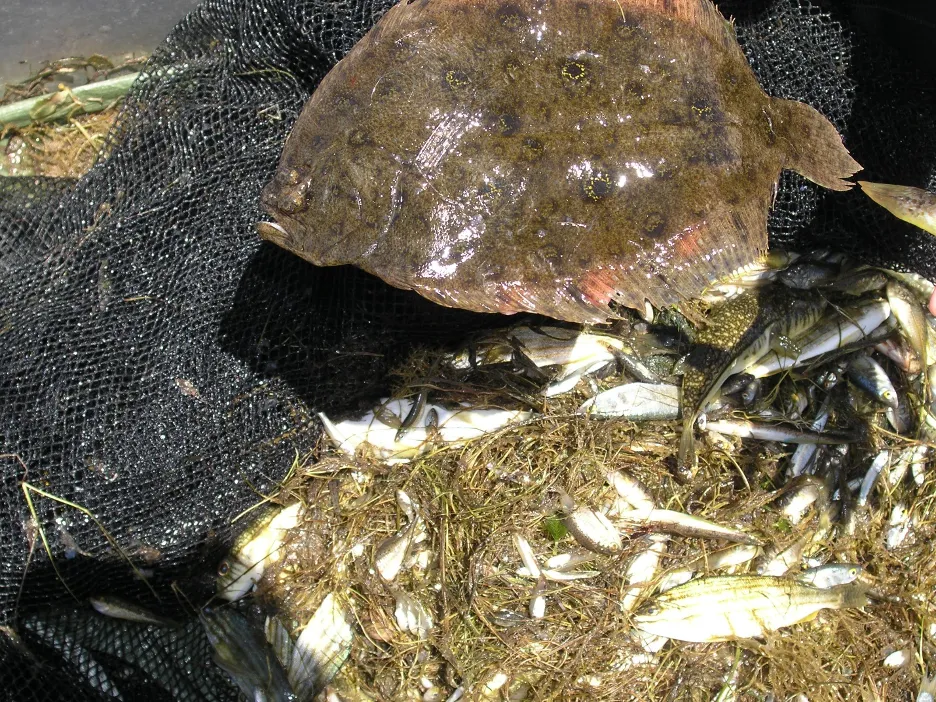

```

<br>

::: {.author-info width="100%"}
Cover image: Seine-net catch in shallow waters of the Peel-Harvey Estuary, including a Small-toothed flounder (*Pseudorhombus jenynsii*).
:::

<br>

## Abstract

::: {.body-text width="100%"}
Fish communities provide important 'signals' about the ecosystem health of estuaries. Their component species typically occupy habitats from the top to bottom of the water column, feed across most levels of estuarine food webs, and encompass varied behavioral traits and estuarine use patterns. Taking a community-wide view can thus reveal many clues about the cumulative and complex impacts of the estuarine environment on higher ecological health. As a result, biotic indices that integrate key traits of fish communities, scored against established 'benchmark' or reference conditions, have been used to measure, monitor and report the ecological health of estuaries worldwide. 

This study focused on applying a Fish Community Index (FCI) to the Peel-Harvey Estuary to measure and track its ecological health over a 40-year period from 1978 to 2018. It also aimed to link patterns in the FCI to key environmental drivers to support forecasting of ecological health under different environmental scenarios.

The FCI, which was developed specifically for south-western Australian estuaries, synthesises complex information from different structural and functional measures (metrics) of the fish community into simple 'report card' grades (A, very good, to E, very poor). The long historical fish community data set that exists for the Peel-Harvey was supplemented by two further years of fish sampling in the current study (2016-2018), which covered a greater spatial range in both the shallow (\<1.5 m deep) and deeper waters (\>1.5 m deep) than had ever been sampled previously. While this 40 year data set provides a rare basis for setting metric benchmark conditions (especially in the shallow basins where most historical data was collected), inconsistencies in sampling methods over time, gaps in the data record, and a relative lack of data in the deeper waters and rivers, has hampered some interpretations of longer-term health. Moving forward, we have proposed a consistent fish monitoring regime for the Peel-Harvey to enable its ecological health to be reliably tracked with the FCI into the future. 

Based on the available evidence, our findings show that there has been a slight improvement in the health of the shallow river environments from 1978-2018, from poor (grade D) to fair (grade C), while the shallow basin waters have remained in fair health. The condition of the deeper waters, however, and especially in the basins, has declined from a good health status (grade B) to a fair/poor status (grade C/D). The improvements in the shallow rivers mainly reflect an increased dominance of small hardyhead species that are specialist feeders and can spawn in the estuary, rather than the opportunistic or detritus-feeding species that previously dominated these areas. The more obvious decline in the deeper basins, however, reflected a clear shift in the fish fauna from one that was relatively species-rich, abundant and contained more benthic-associated and/or estuarine individuals (all of which positively influence the FCI, e.g. Estuary cobbler, Mulloway, Yellow-finned whiting and Western striped grunter), to one that is more depauperate (with no fish being caught on several sampling occasions), sporadic and dominated by marine species (traits which negatively influence the FCI, e,g. Tailor, Southern eagle rays, Herring and Weeping toadfish). The opening of the Dawesville Cut in the mid-1990s, combined with a drying climate, has clearly led to a 'marinisation' of the fish fauna. However, the above declines in ecological health may also reflect (i) declines in the health of the benthic invertebrate fauna upon which many of these species feed, (ii) decreases in green macroalgal growths (especially in Peel Inlet) which can provide abundant fish food and shelter, (iii) increased water clarity and thus net avoidance and/or (iv) fishing pressure impacts on targeted species.

More detailed analysis of the current (2016--2018) FCI trends showed that, overall, the estuary is in fair to poor health (grades C--D). At a finer regional and seasonal resolution, trends in the shallow nearshore waters were often inconsistent, possibly reflecting that large areas of the basins are extremely shallow and prone to rapid environmental changes, and are dominated by small, highly-schooling species which can lead to variable catches. One worrying trend that was consistent in the shallows, however, was the often poor to very poor health (grade D--E) in the Mandurah Entrance Channel. This reflected a far lower number of species since the 1970s/80s, as well as clear drops in abundance of various specialist feeding, estuarine-spawning and/or bottom-dwelling species (e.g. Long-finned goby, Bridled goby and Small-toothed flounder), and increases in the relative proportions of opportunistic species such as Weeping toadfish.

Trends in the deeper waters were generally more discernible, and indicated that (i) the health of the basins is generally better than in the rivers (and especially in the Murray River); (ii) the more tidally-flushed basin regions (northern Harvey Estuary, western Peel Inlet and, to a lesser extent, eastern Peel Inlet) are often in better health (good to fair, grades B--C) than the poorly flushed southern Harvey (fair to poor, grades C--D), and (iii) the upper Murray River appears to be in chronically poor ecological condition (grade D), characterised in most seasons by only two or three species which are either detritivores or opportunistic omnivores (Sea mullet, Perth Herring or Black Bream). The population status of the latter species, which is prized by recreational fishers, is also vulnerable due to poor recruitment of juveniles and low abundances of adults above minimum legal length at capture. These trends most likely reflect the susceptibility of the upper Murray to salinity stratification of the water column, high organic matter loading, and the persistent low dissolved oxygen levels that develop as a result.

Finally, when FCI scores were statistically correlated with a suite of environmental variables, bottom water age, dissolved oxygen content and salinity were shown to have the greatest influence on ecological condition. In the deeper waters of the rivers, the best ecological condition occurred when dissolved oxygen content was highest and when the bottom water age was between 50 and 100 days. Poor FCI scores in this region occurred shortly after flooding (very low water age) and when bottom water became stagnant (water age \>100 days). In the shallow waters of the rivers increasing salinity had a weak positive effect on FCI scores, while in the shallow waters of the basins, hypoxia area (% of region with dissolved oxygen content \< 2 mg/L) had a weak negative influence. These quantitative responses of the FCI to specific environmental variables provides a basis for predicting the future ecological condition of the system under various environmental scenarios. 

```{r fish-ecology-pic2, echo = FALSE, out.width='100%', class = "text-image"}

knitr::include_graphics("images/fish_ecology/Photo 9.1_SCR.png")

```
:::

## Introduction

::: {.body-text width="100%"}
Healthy, diverse and productive estuarine fish communities require good water quality, the availability of appropriate habitats and good connectivity between estuarine, marine and freshwater environments. Human activities can degrade estuaries and disrupt these requirements, resulting in the loss of particular species or groups ('guilds') of fish. Environmentally-sensitive fish species, including those that cannot tolerate widely ranging salinities or low levels of oxygen, or those with specialized feeding strategies or habitats, are typically lost first as estuary health declines (Fig. \@ref(fig:fish-ecology-pic3)). Conversely, species that are highly tolerant and/or are more generalist in their requirements, can often dominate communities when the environmental niches previously occupied by less robust species become available.

The structure of fish communities can therefore provide important signals about the ecological health of an estuary and the ways in which it is impacted by human activities, climate change and other pressures. Even though fish communities occupy higher ecological levels than other biotic indicators such as plankton or benthic invertebrates, they are known to be excellent indicators of estuarine condition (or 'health') since their component species vary widely in their (i) feeding levels (e.g. from primary to secondary consumers), (ii) habitat types (e.g. fresh to hypersaline waters, bottom-dwelling to open water, bare to vegetated substrates), (iii) the ways in which they use estuaries (e.g. nurseries to permanent residence) and (iv) life spans (e.g. one year to decades). Consequently, their ability to capture 'signals' from acute to chronic environmental changes, is vast [e.g. @whitfield2002fishes; @perez2012current; @richardson2011weight].

```{r fish-ecology-pic3, echo = FALSE, out.width='75%', class = "text-image", fig.cap = "Conceptual diagram of predicted responses of the estuarine fish community to poor and good ecological condition (‘health’). Images courtesy of the Integration and Application Network, University of Maryland Center for Environmental Science (ian.umces.edu/symbols/). Reproduced from Hallett et al. (2019a)."}

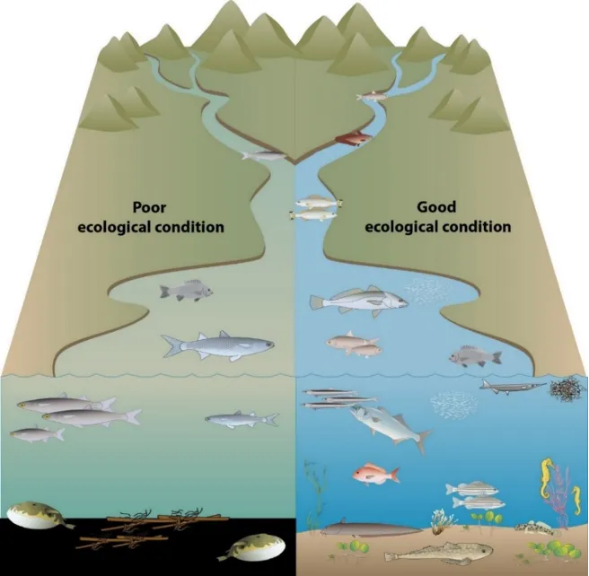

```

Biotic indicators based on fish communities are now used to measure and monitor the ecological health of estuaries worldwide [@perez2012current; @martinho2015efficacy], although Australia has been slower to adopt this approach [@hallett2016review]. However, one fish-based indicator that has been developed specifically for south-western Australian estuaries is the Fish Community Index [FCI, @hallett2012validation]. The FCI integrates data on various characteristics ('metrics') of the fish community to generate ecological condition scores (0--100), which are then assigned to corresponding 'report card' grades (A, very good -- E, very poor) that are easily understood by the wider community The FCI was originally developed for the Swan-Canning Estuary, where it has been used by the Department of Biodiversity, Conservation and Attractions for annual monitoring and reporting of estuary health since 2012. It has also been adopted in the Walpole-Nornalup Estuary by the *Department of Primary Industries and Regional Development* (Fisheries) since 2017 [@hallett2019fish; @yeoh2019monitoring]. 

In this study, we ***aimed to adapt and apply the FCI to the Peel-Harvey Estuary to quantify patterns in its ecological health over the past four decades.*** We also sought to relate observed FCI scores to estuarine environmental conditions [as derived from the estuary response model developed in Chapters \@ref(model-hydrology) and \@ref(model-water-quality) to determine which elements were the key drivers of ecological health. 

It should be noted that while the fish communities of the Peel-Harvey Estuary have been studied periodically since the late 1970s, these surveys have typically differed in their sampling methods. Not only have different net types been used over time, but the fish communities in the tidal rivers and deeper waters of the estuary have been poorly studied. This study therefore involved an extensive fish sampling campaign to expand the collective fish data set for this system, and develop a fuller understanding of ecological health responses to environmental stressors. This campaign has also provided a good framework for designing a robust fish monitoring regime to allow the FCI to be tracked into the future.
:::

## Objectives

The specific objectives of this research study were to:

1.  Customize the Fish Community Index (FCI) to the Peel-Harvey Estuary, and calculate an ecological health 'report card' (grades A--E) for all historical (1979--2014) and contemporary (2016--2018) fish community samples collected throughout the system.

2.  Examine broad trends in estuarine ecological health over the last four decades (1979--2018) and finer-scale trends among estuary regions and seasons in 2016--2018.

3.  Compare observed FCI health scores to model-derived environmental data to identify the key environmental stressors of estuarine ecological health.

4.  Propose an ongoing fish monitoring regime for tracking the ecological health of the Peel-Harvey Estuary into the future.

## Approach

### Applying the FCI to the Peel-Harvey Estuary

#### Collection and collation of data

::: {.body-text width="100%"}
All available fish community data for the Peel-Harvey Estuary were collated, comprising fish species abundances collected throughout the shallows and deeper waters of the basins and tidal rivers. These included historical data sets, collected by various Murdoch University researchers in select periods from 1979 to 2014, and those collected in the current study (2016--2018; Fig. \@ref(fig:fish-ecology-pic4)). Full details of the historical and current fish sampling regimes can be found in the published accounts of those studies (see Table \@ref(tab:fishdata)). 
:::


```{r fish-ecology-pic4, echo = FALSE, out.width='75%', class = "text-image", fig.cap = "Map of the sites at which fish communities were sampled in the Peel-Harvey Estuary from 1979–2018."}

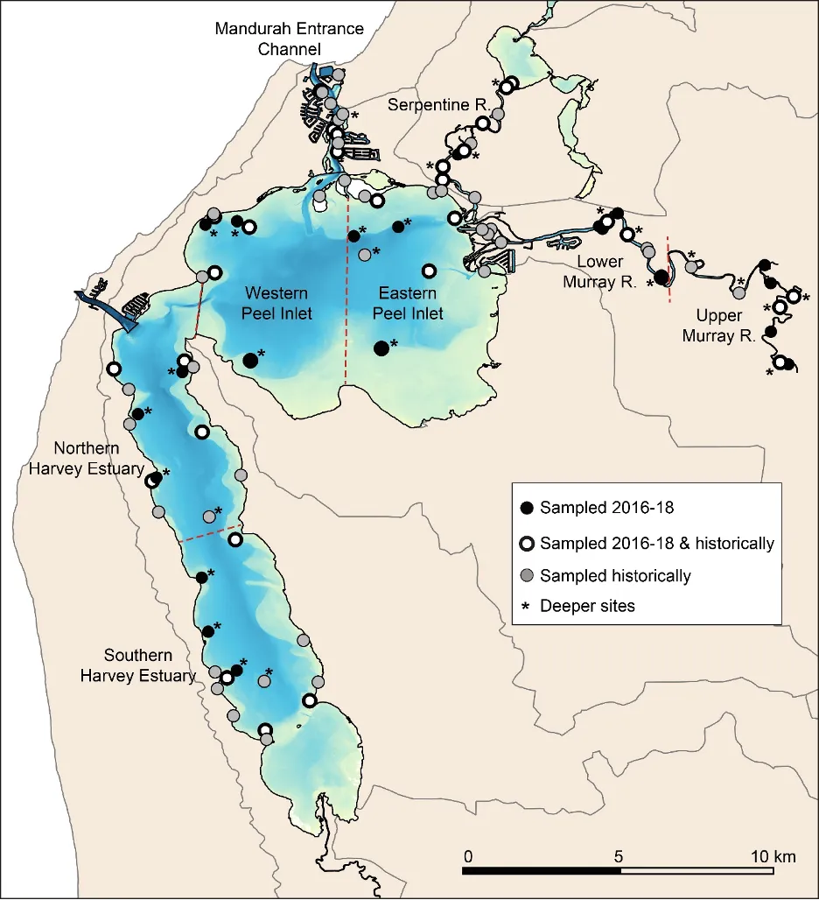

```

::: {.body-text width="100%"}
In the current study, fish were sampled throughout the estuary in eight consecutive seasons from autumn 2016 to summer 2018, typically in the middle month of each season. In the nearshore shallow waters (\<1.5 m deep), fish were collected using a 21.5 m long seine net during the day, while in the deeper waters (typically \>1.5 m deep), they were collected using multi-mesh gill nets at night. The dimensions and mesh sizes of these nets [see @hallett2012method for details] were consistent with those used in several of the historical studies. All fish were immediately either identified to species or placed in an ice slurry and taken to the laboratory for subsequent identification. The total number of individuals belonging to each species in each sample was recorded. 

For historical samples collected using different seine net types to that used in the current study, all data were standardised [using a generalised linear modelling method as detailed in @hallett2012equivalence]to minimize the effects of varying net lengths and mesh sizes, and converted to number of fish 100 m^−2^. For samples collected with gill nets, all data were converted to equivalent catch rates (fish hr^−1^). Note that whilst these standardizations minimized (as far as possible) the effects of different sampling gear on fish abundances, some biases may remain [@hallett2012equivalence].
:::

```{r fishdata, echo=FALSE, message=FALSE, warning=FALSE}
library(knitr)
library(kableExtra)
library(readxl)
library(rmarkdown)
theSheet <- read_excel('tables/peel_tables_fish.xlsx', sheet="fishdata")
theSheetGroups <- unique(theSheet$Group)

kbl(theSheet[,2:NCOL(theSheet)], caption = "<small>Summary of the historical (1979–2014) and contemporary (2016–2018) fish species abundance data sets collected across the Peel-Harvey Estuary in (a) shallow waters and (b) deeper waters. Large time gaps (>2 years) when there was no fish sampling are shaded in grey. See published studies listed in the ‘reference’ column for more details on historical fish sampling regimes. Key limitations of these previous regimes (with respect to their use in the current study) are in italics. Regions: SH, southern Harvey Estuary; NH, northern Harvey Estuary; MC, Mandurah Channel; WP, western Peel Inlet; EP, eastern Peel Inlet; SR, Serpentine River; LM, lower Murray River; UM, upper Murray River.</small>", align = "c",) %>%
  pack_rows(theSheetGroups[1],
            min(which(theSheet$Group == theSheetGroups[1])),
            max(which(theSheet$Group == theSheetGroups[1])),
            background = '#ebebeb') %>%
  pack_rows(theSheetGroups[2],
            min(which(theSheet$Group == theSheetGroups[2])),
            max(which(theSheet$Group == theSheetGroups[2])),
            background = '#ebebeb') %>%
  row_spec(0, background = "#5f543f", bold = TRUE, color = "white") %>%
  kable_styling(full_width = F,font_size = 11) %>%
  column_spec(2, width_min = "7em") %>%
  column_spec(4, width_min = "12em") %>%
  scroll_box(width = "40em",
             fixed_thead = FALSE)
```

<br>

#### Calculating the FCI for the Peel-Harvey Estuary

::: {.body-text width="100%"}
Independent versions of the FCI were developed for assessing the condition of shallow and deeper waters to account for the marked differences in their fish faunas and the methods used to sample them [@hallett2019fish]. The metrics which comprise the FCI, and which are known to provide a robust basis for quantifying estuarine ecological health in south-western Australia [e.g. @hallett2016review], are listed in Table \@ref(tab:fishmetrics). Figure \@ref(fig:fish-ecology-pic5) summarizes the process for calculating the FCI, which has been described extensively elsewhere [@hallett2012method; @hallett2014quantile]. The following subsections briefly outline this process, emphasizing the modifications used to customize the FCI for the Peel-Harvey Estuary.

Firstly, all fish species in the collated and standardised data sets (section 9.4.1.1) were assigned to functional groups ('guilds') that reflected their habitat, feeding mode and use of the estuary (see Supplementary Material S9.1). Values for each fish metric (Table \@ref(tab:fishmetrics)) were then calculated for every fish sample collected in the shallow and deeper waters between 1979 and 2018. 


```{r fishmetrics, echo=FALSE, message=FALSE, warning=FALSE}
library(knitr)
library(kableExtra)
library(readxl)
  options(knitr.kable.NA = "")
Diff_tab <- read_xlsx('tables/peel_tables_fish.xlsx', sheet="fishmetrics")
  kable(Diff_tab[,1:2],"html", escape = F, align = "c"
        , caption = "<small>Metrics comprising the Fish Community Index (FCI) for shallow and deeper waters of the Peel-Harvey Estuary. Predicted metric responses to ecological degradation are shown in parentheses; positive metrics (+) increase with increasing degradation, whilst negative (−) metrics decrease as the ecosystem becomes more degraded. </small>",bootstrap_options = "hover")%>%
   kable_styling(Diff_tab, bootstrap_options = "hover",
                full_width = T, position = "left",
                font_size = 11) %>% 
    
  row_spec(0, background = "#5f543f", bold = TRUE, color = "white") %>%
  column_spec(1, width_min = "20em" ,color="black",bold = F) %>%
  column_spec(2, width_min = "20em" ,color="black") %>%
  # column_spec(3, width_min = "15em" ,color="black") %>%
  # row_spec(1:2, background = 'white')  %>%
 scroll_box(width = "40em",fixed_thead = FALSE)

  
```
<tfoot>
<tr><td style="padding: 0; " colspan="100%">
<sup>a</sup> <small> A measure of species biodiversity</small></td></tr>
<tr><td style="padding: 0; " colspan="100%">
<sup>b</sup> <small> Species with specialist feeding requirements (e.g. those that only eat small invertebrates)</small></td></tr>
<tr><td style="padding: 0; " colspan="100%">
<sup>c</sup> <small> Species that are omnivorous or opportunistic feeders</small></td></tr>
<tr><td style="padding: 0; " colspan="100%">
<sup>d</sup> <small> Species that eat detritus (decomposing organic material)</small></td></tr>
<tr><td style="padding: 0; " colspan="100%">
<sup>e</sup> <small> Species that live on, or are closely associated with, the estuary bed</small></td></tr>
<tr><td style="padding: 0; " colspan="100%">
<sup>f</sup> <small> The Blue-spot or Swan River goby, a tolerant, omnivorous species that often inhabits silty habitats and is used as an ‘indicator’</small></td></tr>
</tfoot>
<br>

```{r fish-ecology-pic5, echo = FALSE, out.width='75%', class = "text-image", fig.cap = "Overview of the process for calculating the Fish Community Index."}

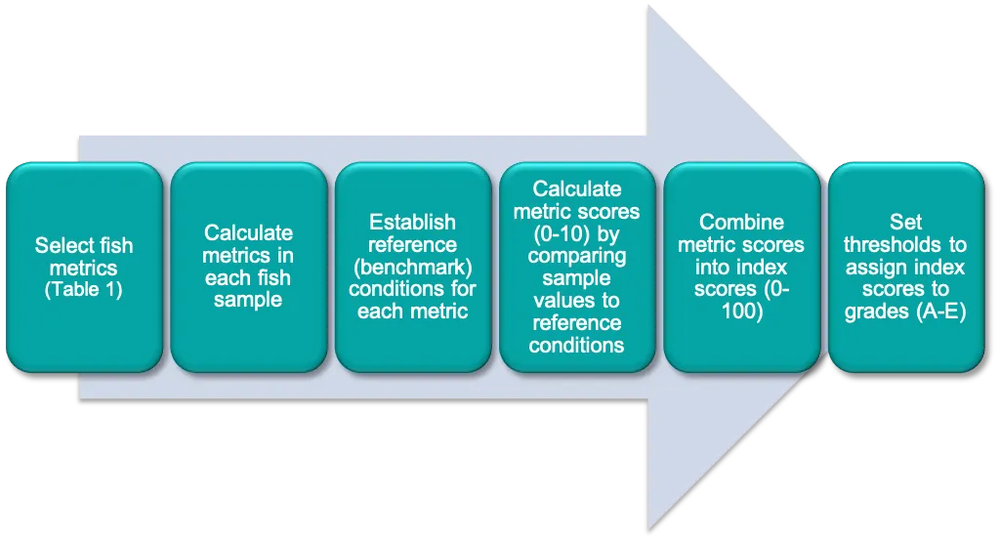

```

Values for each metric in each fish sample were then converted to scaled (0--10) scores, based on their deviation away from established benchmark values ('reference conditions'). *Note that these reference conditions were defined for each estuary region and season to account for natural spatial and seasonal variations in metric values* [@hallett2012development]. To derive the reference conditions, the best value recorded for each metric across all fish samples collected between 1979 and 2017 (hereafter referred to as the 'training data set'), were used. Note that the data from the second year of contemporary sampling (2017--2018) was retained as a 'validation data set' for independent testing of the relationships between FCI condition grades and modelled environmental outputs (see section \@ref(relating)). 

Scaled metric scores were then combined to produce an index score (0--100) for each sample. Each index score was then compared to threshold values (Table \@ref(tab:fishthresh)), derived statistically from the distributions of all index scores in the training data sets [after @hallett2014quantile]. This enabled the corresponding ecological health grade (A, very good, to E, very poor) to be determined for each sample. Intermediate grades (*e.g.* B/C, good-fair, or C/B, fair-good) were awarded if the sample index score was within one point of a grade threshold.
:::


```{r fishthresh, echo=FALSE, message=FALSE, warning=FALSE}
library(knitr)
library(kableExtra)
library(readxl)
  options(knitr.kable.NA = "")
Diff_tab <- read_xlsx('tables/peel_tables_fish.xlsx', sheet="fishthresh")
  kable(Diff_tab[,1:3],"html", escape = F, align = "c"
        , caption = "<small>Fish Community Index (FCI) score thresholds defining each of the five ecological health grades (A–E) for both shallow and deeper waters of the Peel-Harvey Estuary. </small>",bootstrap_options = "hover")%>%
   kable_styling(Diff_tab, bootstrap_options = "hover",
                full_width = T, position = "left",
                font_size = 11) %>% 
    
  row_spec(0, background = "#5f543f", bold = TRUE, color = "white") %>%
  column_spec(1, width_min = "20em" ,color="black",bold = F) %>%
  column_spec(2, width_min = "20em" ,color="black") %>%
  column_spec(3, width_min = "15em" ,color="black") %>%
  # row_spec(1:2, background = 'white')  %>%
 scroll_box(width = "40em",fixed_thead = FALSE)

  
```

#### Exploring trends in the FCI

::: {.body-text width="100%"}
To explore broad, long-term trends in the ecological health of the estuary, the mean FCI scores in the shallow and deeper waters were plotted in each fish sampling year from 1979 to 2018, both for the estuary as a whole and for the basin and river regions separately. To understand the fish species which were mainly responsible for driving observed trends in the FCI, complementary plots of species abundances across the whole community were constructed, as were plots of the mean number of species. These data analyses were undertaken in the Primer v7 multivariate statistics software [@clarke2015getting] with the PERMANOVA+ add-on module [@gorley2008permanova].

To explore the current (2016--2018) ecological condition of the estuary in more detail, a series of maps were constructed showing the mean FCI in each region and season in the shallow and deeper waters. Note that this period included a large and unseasonal rainfall event in February 2017, which brought large amounts of organic matter and sediment into the estuary, followed by a sustained period of low to no dissolved oxygen in autumn 2017 that particularly impacted the upper Murray River region.
:::

### Relating estuary condition to modelled environmental changes {#relating}

::: {.body-text width="100%"}
We aimed to identify the key environmental drivers of estuarine ecological health (as assessed by the FCI) and, in particular, the environmental stressor thresholds that best 'explain' each of the ecological health classes (*i.e.* A, excellent, to E, very poor).

Generalised additive models (GAMs) were used to relate observed FCI scores from 1978--2017 to a range of ***environmental stressor metrics*** derived from the coupled estuary response model developed in other parts of the research project (see Chapters \@ref(model-hydrology) & \@ref(model-water-quality)). These metrics included various water quality parameters (e.g. temperature, salinity and dissolved oxygen concentration) as well as measures of the frequency, severity, extent and/or persistence of stressors such as hypoxia, harmful algal blooms and ammonium concentrations. A detailed list of these stressors, which were calculated at both the site and estuary region scales, is given in Supplementary Materials S11.2.

The GAMs analyses were conducted separately for the shallow and deep waters of the basins and the rivers. In each case, a suite of models was tested using many combinations of environmental metrics to determine the 'best-fit' model, or that which best 'explained' observed trends in the FCI scores. 

The above best-fit models were then used to ***predict FCI scores and condition grades*** based on known or modelled environmental data, ***allowing the ecological condition of the estuary to be estimated under any future environmental scenario***. The reliability of these GAM predictions was tested by (i) predicting FCI scores for all sampling occasions in a validation data set (i.e. the FCI data recorded in autumn 2017--summer 2018), based on the modelled environmental stressor data, and (ii) comparing the predicted FCI grades with those calculated directly from the corresponding fish species abundance data.
:::

## Results & Findings

### Broad long-term (1979-2018) trends in estuary condition

> *The ecological health of the shallows has improved from poor to fair in the rivers, but has remained fair in the basins over the last 40 years*

::: {.body-text width="100%"}
Plots of the mean FCI in each sampling season and year from 1979--2018 showed that, on average, the ecological condition of the shallow nearshore waters has improved slightly over time in the rivers (from poor, grade D, to fair, grade C), but has remained fair in the basins (Fig. \@ref(fig:fishscorea)). As a result, the health of the shallows across the whole estuary has also apparently improved (Fig. \@ref(fig:fishscoreb)). 

Examination of the shallow water fish communities in both the basins and rivers shows that there has been a notable shift in the dominant species over time, and especially between the 1970s-1980s and later periods (see the shadeplots in Supplementary Materials S9.3 and S9.4; simply, the darker the shading, the more abundant the fish species). Whereas several species with freshwater affinities were abundant in the earliest period (e.g. River garfish *Hyporhamphus regularis* in both the rivers and basins, and Perth herring *Nematalosa vlaminghi* and Southwestern goby *Afurcagobius suppositus* in the rivers), they were either not recorded or were caught far less consistently in later periods. Instead, a relatively restricted suite of species, several of which have marine affinities or can withstand very high and variable salinities, have dominated the fauna from the mid-1990s onwards. In the rivers, these included the Elongate hardyhead *Atherinosoma elongata*, Wallace's hardyhead *Leptatherina wallacei*, Weeping toadfish *Torquigener pleurogramma* and, in some seasons, Sandy sprat *Hyperlophus vittatus* (Supplementary Materials S9.4), while in the basins they included Weeping toadfish, Long-finned goby *Favonigobius lateralis*, Silverfish *Leptatherina presbyteroides* andElongate hardyhead. This 'marinisation' of the fish fauna, which was also reported by @potter2016decadal, almost certainly reflects the increased tidal flushing brought about by the Dawesville Cut, combined with a drying climate. These factors have interacted to produce more stable, saline conditions that have pushed further upstream into the estuary over time (Chapter \@ref(model-hydrology)). A similar marinisation trend has also occurred in the shallows of the Swan-Canning Estuary between the late 1970s and recent decades [@valesini2017interdecadal]. Another notable finding in the shallows of the basins, which was also identified by @potter2016decadal and further corroborated by the additional fish data collected in the Linkage study, is the return of abundant catches of various 'weed-associated' marine species since 2008, i.e. Western gobbleguts, *Ostorhinchus rueppellii*, Soldier fish *Gymnapistes marmoratus* and Western striped grunter *Pelates octolineatus* (Supplementary Materials S9.3). These species were also abundant in 1979-1983 when large blooms of green macroalgae blanketed Peel Inlet [@potter1983abundance; @loneragan1986spatial]. Their return in recent decades is likely to be related to the increases in seagrass and, in the southern Harvey Estuary, green macroalgae, that have been recorded over the same time frame (Chapter \@ref(macrophytes)).

With respect to how these changes in the fish community have impacted the ecological health of the estuary, the main drivers of the improved FCI in the shallows of the rivers over the last few decades are the feeding, habitat and estuary usage guilds of the most dominant fish species (see the shadeplot of the FCI metric scores in Fig. 5, where green to white shades indicate better scores and red to black shades indicate poorer scores). Since the mid-2000s, more of the species that now dominate the fish assemblage (e.g. the hardyheads *L. wallacei* and *A. elongata*; Appendix 4) have specialist feeding strategies and/or are able to spawn in the estuary (i.e. metric trends which lead to increases in the FCI; see Table 2). In contrast, several of the more abundant species in the late 1970s (e.g. Perth herring and Yellowtail grunter *Amniataba caudavittata*) have generalist or opportunistic feeding strategies, or feed mainly on detritus (i.e. metric trends which lead to decreases in the FCI). Interestingly, however, some metrics showed a tendency to decline in health from the late 1970s to more recent periods. These included the prevalence of bottom-dwelling (benthic) fish, both in terms of the number of species and proportion of fish in the assemblage (although the latter also performed poorly in the early 1980s), as well as the overall number of fish species (Fig. 5).

Another feature of the longer-term trends in the FCI is the greater inter-seasonal and inter-annual variability in the late 1970s/early 1980s compared to later decades (Fig. 4). This is very likely related to the far greater river inflows during that period, especially compared to the last decade. For example, the obvious drop in the FCI in winter 1981 to very poor (E) in both the rivers and basins (Fig. 4a), coincided with large flows from the Murray River compared to those in other sampling years in that period, i.e. 1979, 1980 or 1982 [@valesini2019peel]. Such large winter flushes often displace fish downstream (or out to sea), leading to low catches. The massive summer blooms of the toxic blue-green algae *Nodularia spumigena* in the Harvey Estuary in the 1970s/80s almost certainly would have further contributed to the observed variability in the FCI, particularly in the basins. Dense blooms of this microalgae, combined with related impacts such as deoxygenation of the water column as the blooms collapse, are well known to negatively impact the fish fauna in the estuary [@potter1983blue]. Further evidence of these impacts was that while the basin FCI was often highest in summer in sampling periods after the Cut (i.e. those from 1996 onwards), this was rarely the case in the pre-Cut periods (Fig. 4a). 

```{r fish-ecology-pic6, echo = FALSE, out.width='95%', class = "text-image", fig.cap = "Trends in mean Fish Community Index (FCI) scores and corresponding ecological health grades in the shallow nearshore waters from 1979-2018 in (a) the rivers and basins and (b) the Peel-Harvey Estuary as a whole. The dashed lines represent the line of best fit through the data."}

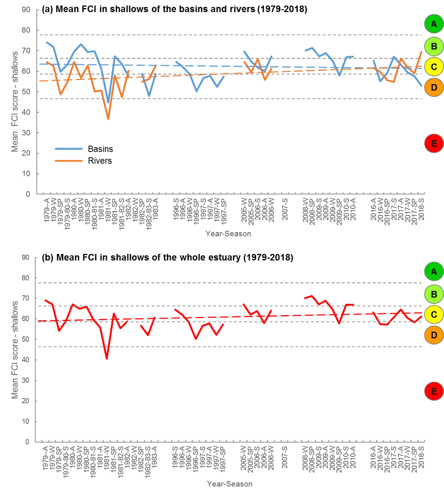
```

```{r fish-ecology-pic7, echo = FALSE, out.width='95%', class = "text-image", fig.cap = "Shadeplot of the average FCI metric scores in the shallows of the (a) basins and (b) rivers in each sampling year and season (S, summer; A, autumn; W, winter; SP, spring) from 1979–2018. Metric scores are shown on a coloured spectrum from red/black (poor scores) to green/white (excellent scores)."}

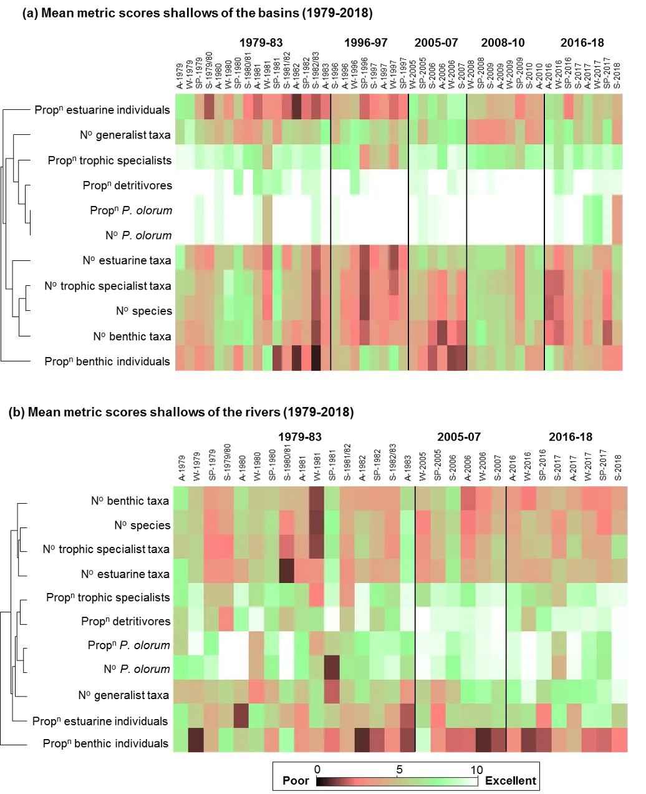
```
:::

> *The ecological health of the deeper waters has declined over the last 40 years*

::: {.body-text width="100%"}
In contrast to the trends in the shallows, the average condition of the deeper waters has worsened over the last 40 years (Fig. 6). This was especially so in the basins, which have declined from a good health status (B) in the 1970s/80s to fair/poor (C/D) in 2016--18 (Fig. 6a). The rivers have also declined, but only slightly from an average of C/D to D/C.

The health trends in the deeper basins clearly reflect a shift in the fish fauna from one that was relatively species-rich, abundant and contained proportionately more benthic-dwelling and/or estuarine individuals (all of which positively influence the FCI; see Table 2), to one that is comparatively depauperate (with no fish being caught on several sampling occasions), sporadic and dominated by marine species (Fig. 7; Appendix 5). In the 1970s/80s, catches were regularly dominated by Estuary cobbler (which is able to spawn in the estuary and is also bottom-dwelling), other benthic-associated species such as Mulloway *Argyrosomus japonicus*, Roach *Gerres subfasciatus*, Yellow-finned whiting *Sillago schomburgkii* and Western striped grunter. Tailor *Pomatomus saltatrix*, and Yellow-eye mullet *Aldrichetta forsteri* were also abundant (Appendix 5). In 2016-18, however, catches were sparser and dominated only in particular seasons by Tailor, Australian herring *Arripis georgianus*, Southern eagle rays *Myliobatis tenuicaudatus* and Weeping toadfish, all of which are marine species. One metric that did show improvements from the earliest to latest sampling period was the proportion of fish feeding on detritus, but this mainly reflected the lower catches of Sea mullet *Mugil cephalus* in 2016-18 (Fig. 7, Appendix 5). 

The reasons for the decline in health in the basins are unclear, though may partly reflect the substantial decline in green macroalgae from the 1970s to 2018, especially in Peel Inlet [see @valesini2019seagrass]. Macroalgae provides abundant food and shelter for several of the above fish species, which are well known to be weed-associated, e.g. Estuary cobbler and Western striped grunter. Additionally, given that many of the fish species abundant in the earlier period feed on bottom-dwelling invertebrates, their decline over time may also reflect the poor health of those invertebrate fauna in the deeper basin sediments that we recorded in other parts of the Linkage study [see @oreilly2019assessing]. While there are no available data on the full invertebrate community in the deeper basins from the 1970s/80s, evidence from the shallows shows an obvious decline in these fauna from the mid-1980s to mid-2000s [@wildsmith2009changes]. It is also possible that due to greater water clarity in the basins with the greater tidal influx since the Dawesville Cut, the gill nets used to sample fish in the deeper waters may be more visible and thus more easily avoided. Lastly, fishing pressure impacts on key fishery species such as Estuary Cobbler, Mulloway and Yellow-finned whiting cannot be discounted.

Nonetheless, it is notable that the health of the deeper waters in the rivers has generally been poorer than those in the basins over the last 40 years. This mirrors the situation in the Swan-Canning Estuary [@hallett2018assessment], and probably reflects the greater vulnerability of these deeper areas to low dissolved oxygen conditions. Such 'hypoxia' is typically worse at the bottom of the water column given it is often related to salinity stratification, where saltier, denser waters fall to the bottom and are overlain by fresher, lighter water. It is also linked to poor river flushing, as waters retained in the estuary for long periods of time become depleted of oxygen due to consumption by biota and other biogeochemical processes. Both the stratification and flushing of the rivers are anticipated to worsen in coming decades given projections for further drying of the climate [@huang2019changing].

```{r fish-ecology-pic8, echo = FALSE, out.width='95%', class = "text-image", fig.cap = "Trends in mean Fish Community Index (FCI) scores and corresponding ecological health grades in the deeper waters from 1979-2018 in (a) the rivers (orange lines) and basins (blue lines) and (b) the Peel-Harvey Estuary as a whole. The dashed lines represent the line of best fit through the data."}

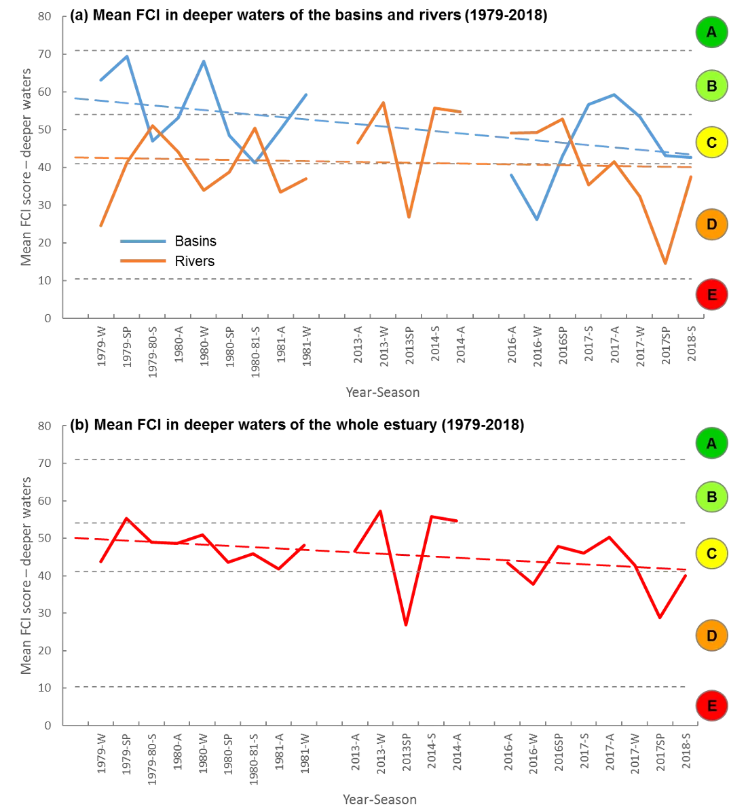
```

```{r fish-ecology-pic9, echo = FALSE, out.width='95%', class = "text-image", fig.cap = "Shadeplot of the average FCI metric scores in the deeper waters of the (a) basins and (b) rivers in each sampling year and season (S, summer; A, autumn; W, winter; SP, spring) from 1979-2018. Metric scores are shown on a coloured spectrum from red/black (poor scores) to green/white (excellent scores)."}

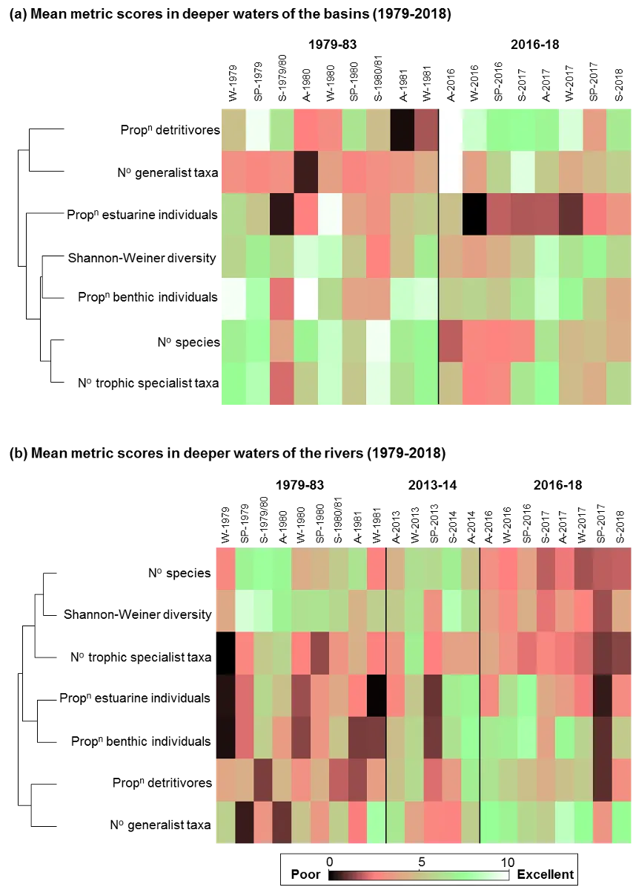
```
:::

> *Interpretation of long-term trends in estuary health is hampered by inconsistencies in sampling approach among historical studies*

::: {.body-text width="100%"}
The above interpretations of the longer-term trends in the ecological health of the estuary should be considered indicative only, given the potential influence on the FCI of the differences in fish sampling methods over the last 40 years (see Table 1). While this historical fish community data set is the best available for the Peel-Harvey Estuary, and has been standardised as far as possible to minimize the effects of sampling differences (see section 4.1.1), it is inevitable that some legacy effects will remain. For example, fish in the shallows were sampled using far larger seine nets with bigger mesh sizes in the early periods, compared to the smaller and finer-meshed nets used in recent periods. These net differences invariably impact the 'catchability' of different fish species that may be present, given differences such as the extent from shore that can be fished, the speed with which a net can be retrieved, the efficiency with which different sections of the water column are fished, and which fish species can escape through the mesh. @hallett2012equivalence experimentally tested the efficiency with which the large (102 m) and small (21 m) seine nets used over the last 40 years in the Peel-Harvey caught different guilds of fish. They found, for example, that the larger net typically catches fewer of the smaller species and especially in the rivers (where the steeper banks reduce its fishing efficiency), yet often returns more species per haul given the potentially broader habitats it can reach. Differences between the gill nets used to sample the deeper waters in the 1970s/80s compared to more recent periods may have also impacted the comparability of those fish data sets. For example, gill nets used in the earlier period were a combination of floating and sunken nets, while those in recent sampling periods were only sunken nets and may have sampled pelagic species less effectively. Additionally, whereas nets were set for three hours in the 1970s--1980s, they could only be set for one hour in the more recent period given revised regulatory requirements and ethical considerations. While we have standardised both data sets to numbers of fish caught per hour, nets left in the water for longer periods simply have a greater likelihood of catching a greater number of species if they are present.

Although our data standardization methods can adjust for the effects of net biases on the abundances of any fish species that *was* caught, it is impossible to adjust the abundance of a species that was *never caught* in a given fish sample. That is, there is no way of knowing whether the failure of a net to catch a species was due to the net type, or to that species simply not being present. Moving forward, it is thus strongly recommended that to avoid these sampling biases, a standardised fish sampling approach is used for monitoring the ecological condition of the estuary into the future (see section 5.4). A consistent fish sampling regime to support FCI monitoring has been undertaken annually in the Swan-Canning Estuary since 2012, and continues to be supported by the Department of Biodiversity, Conservation and Attractions in that system [@hallett2019fish]. A similar approach has also been adopted in the Walpole-Nornalup Estuary by the Department of Primary Industries and Regional Development (Fisheries) since 2017 [@yeoh2019monitoring].
:::

### Current ecological condition of the Peel-Harvey Estuary (2016-18)

> *The current overall health of the Peel-Harvey Estuary is fair to poor*

::: {.body-text width="100%"}
More detailed analysis of the FCI in each region and sampling season between autumn 2016 and summer 2018 showed that, on average, the overall health of the estuary in both the shallow and deeper waters was fair to poor (C--D; see grades in larger circles in Figs 8 and 9). Overall estuary condition was consistently best during autumn in both years and water depths (grade C), while the poorest grades were found in winter 2016 and spring 2017 in both water depths (grade D).

In general, health grades were typically better in several of the basin regions than they were in one or more of the river regions. However, this was not a consistent trend, with regional patterns varying considerably among sampling occasions and water depths. For example, the shallow upper Murray River was in good to very good health (A--B) in autumn and spring 2017 and summer 2018, while the rest of the estuary was in fair to very poor health (C--E; Fig. 8).

Further exploration of the complexity of these patterns in both the shallow and deeper waters is given below. Accompanying shadeplots of the metric scores in each region and sampling occasion are also provided for the shallows in Fig. 10 and deeper waters in Fig. 11.
:::

> *In the deeper basins, the northern Harvey Estuary and Peel Inlet is often in better ecological health than the southern Harvey Estuary*

::: {.body-text width="100%"}
Good to fair ecological health was commonly recorded in the deeper waters of the northern Harvey Estuary, western Peel Inlet and to a lesser extent the eastern Peel Inlet, whereas the deeper southern Harvey Estuary was often in fair to poor health; (Fig. 9). The higher FCI grades often reflected the presence of more species, as well as more trophic specialists and/or fewer detritivores in some seasons and/or regions (Fig. 11). Thus, while several species such as Tailor, Australian herring and Weeping toadfish were commonly caught across all basin regions, there were multiple marine species caught in the northern Harvey and Peel Inlet regions that were never or rarely caught in the southern Harvey, e.g. Black stingray *Bathytoshia lata*, Western shovelnose ray *Aptychotrema vincentiana*, Rock flathead *Platycephalus laevigatus*, Western Australian salmon *A. truttaceus* and King George whiting *Sillaginodes punctata* (shadeplots not shown). This undoubtedly reflects the ready access from the ocean to those northern basin regions via the Dawesville and/or natural entrance channels, as well as the more stable, marine salinities in particularly the western Peel Inlet and northern Harvey Estuary.

Perth herring, which is a detritivore, was relatively abundant across the Harvey Estuary in some seasons, which in part probably reflects the high sedimentary organic matter levels throughout the deeper parts of that basin [@hallett2019sediment]. However, it was proportionally more abundant in the southern Harvey, which would have contributed to the lower FCI scores recorded in that region. These findings may be indicative of the extensive green macroalgal growths that occur in the southern Harvey [@valesini2019seagrass], and hence the abundant food sources for detritus-feeding fish species. 
:::

> *In the deeper rivers, the upper Murray appears to be in chronically poor ecological health, while the Serpentine River is often in fair to good health*

::: {.body-text width="100%"}
The condition of the deeper waters of the upper Murray region was poor (D) in six of the eight sampling seasons, and never better than fair (C; Fig. 9). This commonly reflected the low number and diversity of species, low numbers of species with specialist feeding strategies, dominance of species feeding on detritus (detritivores) and relatively low representation by species that spawn in the estuary (see metric scores in Fig. 11). In most seasons, the fish community of this region was represented by just two or three species, the most abundant of which was Sea mullet (a detritivore that spawns in marine waters), followed by Black bream (a highly opportunistic omnivore) and Perth herring (also a detritivore; shadeplots not shown). Additionally, concurrent work on Black bream, which is a prized species targeted by recreational fishers that inhabits the riverine reaches of estuaries, has shown that its current population status in the Peel-Harvey is vulnerable. This is due to both very poor recruitment of juveniles into the stock since 2010, as well as low catches of adult fish above the State minimum legal length for capture of 250 mm (A. Cottingham, unpublished data). The virtual absence of these juveniles from the shallows of the rivers where they typically reside is reflected in Appendix 4, and contrasts with the higher numbers recorded in the previous sampling period in 2005--2007. Similarly, the abundance of larger fish in the deeper rivers has also declined from the previous 2013--2014 sampling period to the current one (Appendix 6), and a substantial number of the larger Black bream caught in 2016--2018 were in the lower Murray or Serpentine River (shadeplot not shown).

```{r fish-ecology-pic10, echo = FALSE, out.width='50%', class = "text-image", fig.cap = "One of the many Black Bream killed in the Murray River during the summer 2017 rainfall event (Photo, A. Cottingham)."}

knitr::include_graphics("images/fish_ecology/picture10.webp")
```

The poor ecological health of the deeper waters in the upper Murray likely reflects their susceptibility to stratification of the water column, and the persistent low dissolved oxygen conditions that develop as a result. The high levels of organic matter that accumulate in the deeper waters of this region [@hallett2019fish] also accelerate the biological consumption of oxygen in the bottom waters. From summer to winter 2017 and again in summer 2018, the salinity at the water surface was 12-24 units fresher than at the bottom, and there was close to no dissolved oxygen in the bottom waters (concentrations of  \<1 mg L^‑1^) on all four sampling occasions. A major fish kill event (\>10,000 fish) occurred in the Murray River during this period (summer 2017), triggered by an unseasonally high rainfall event and the extensive hypoxia/anoxia that developed as a result (see below). While the most visible impact of these events is on larger fish (with many dead Black bream observed; C. Hallett, pers. obs., and photo above), the impacts on earlier life stages and small fish are less obvious. In the case of Black bream, given that its typical spawning period [late spring-summer, @sarre1999comparisons] coincides not only with the acute episode in summer 2017, but also with the chronic stratification and hypoxia that develops at that time of year, it is very possible that its decline in the Peel-Harvey is due to the mortality of its eggs and/or young larvae under these conditions.  

In contrast to the deeper waters, the ecological health of the shallow upper Murray was good to very good in several seasons (autumn and spring 2017 and summer 2018; Fig. 8), which often reflected a prevalence of species with specialist feeding strategies, low contributions by detritivores, and low contributions by the indicator species *Pseudogobius olorum* (Fig. 10). These good metric scores were mainly driven by several smaller fish species that feed on small animals near the sediment surface (i.e. zoobenthivores), most of which have freshwater affinities, e.g. Southwestern goby *A. suppositus*, Western minnow *Galaxias occidentalis*, Western pygmy perch *Edelia vittata*, Mosquito fish *Gambusia holbrooki* (shadeplots not shown). 

Also in contrast to the deeper upper Murray, the deeper waters of the Serpentine River were in fair to good ecological health for five of the eight sampling occasions (Fig. 9). This was due mainly to good scores for metrics such as more specialist feeders rather than generalist feeders or detritivores, more bottom-dwelling species, and more species able to spawn in the estuary (Fig. 11). Its fish fauna was often characterised by marine-associated zoobenthivore or zooplanktivore species such as Tarwhine, Yellow-finned whiting, Roach and Southern anchovy, several of which are also benthic-associated. Commonly occurring estuarine-spawning species included Black bream and also Anchovy (shadeplots not shown). The better health of the deeper waters of the Serpentine likely reflects the shallower and more consistent depth of this river (with fewer deep holes where organic matter can accumulate), and its less variable and more marine salinities. In particular, the Serpentine River rarely exhibits the marked salinity stratification and associated hypoxia found in the upper Murray (unpublished data).
:::

> *The FCI successfully tracked the ecological impacts of the summer 2017 flood event*

::: {.body-text width="100%"}
On the 10^th^ of February 2017, the Perth Metro area received a daily total of 114.4 mm of rain, its second highest daily fall for any month from records going back to 1876 [@bom2017special]. The high river flows that followed created fresh conditions throughout the Murray River and delivered an enormous quantity of organic matter from the surrounding catchments into the estuary (see photo below). This was evident as a 10cm-thick layer of organic-rich silt and cow faeces during fish sampling in the lower Murray River on 16 February 2017 (pers. obs.). The combination of this organic loading and the highly stratified water column that became established in the following weeks and months led to severe hypoxia throughout the Murray River. 

```{r fish-ecology-pic11, echo = FALSE, out.width='50%', class = "text-image", fig.cap = "Plume of organic-rich water from the Murray River (darker waters) spreading across Peel Inlet on 13th February 2017"}

knitr::include_graphics("images/fish_ecology/picture11.webp")
```

During this period, both the shallow and deeper waters of the lower Murray region were in poor to very poor health, reflecting that either no fish were caught at all (deeper waters), or that the fish fauna contained only a limited number of species with ecological traits that decreased the FCI (shallows). Indeed the slightly higher grades in the shallows appeared to be artificially inflated by some larger species which normally inhabit the deeper waters of the lower Murray coming up on the banks to seek refuge (e.g. Tarwhine), and some species which normally occupy the more upstream river reaches being flushed down (e.g. the Southwestern goby). Another goby species which was relatively abundant in the shallows was the Blue-spot goby, which can tolerate silty substrates and survive hypoxic conditions through its capacity to 'breathe air' at the water surface [@gee1991reactions]. This 'indicator' species represents two metrics in the shallow-water FCI (Table 2), and its relative abundance would have contributed to the poor ecological health recorded in summer 2017.

As well as tracking the immediate ecological health impacts of the flood in the lower Murray, the FCI also tracked impacts in adjoining regions such as the eastern Peel Inlet and Serpentine River. While the deeper waters of both of those regions were in 'good' health (grade B) in summer 2017 (Fig. 9), this was likely due in part to either the displacement of fish flushed out of the Murray River, or fish that were actively seeking refuge from inhospitable conditions. Tailor, for example, which was caught in the lower Murray in the warmer seasons of 2016--2018, was recorded for the only time in the Serpentine River in summer 2017 and was also relatively abundant in the eastern Peel Inlet. Similarly, Roach, which was frequently abundant in the lower Murray but less so in the Serpentine, became most abundant in that latter region in summer 2017. Tarwhine, which had also been abundant in the lower Murray in warmer seasons, became relatively abundant in the eastern Peel and to a lesser extent the Serpentine in summer 2017, then also returned to being abundant in the lower Murray in autumn 2017 (shadeplots not shown).

These findings provide good evidence that the FCI is a sensitive indicator of ecological health shifts due to environmental perturbations such as acute hypoxic events.
:::

> *The ecological health of the shallow nearshore waters is inconsistent among regions, seasons and years*

::: {.body-text width="100%"}
It was difficult to discern many clear trends in the ecological health of the shallow waters (Fig. 8). Considerable variability has also been observed in the nearshore FCI scores in the Swan-Canning Estuary [@hallett2019fish], but generally less so than in the Peel-Harvey. The high variability in the shallows may in part reflect the fact that the bulk of the fish fauna are small, highly-schooling species (such as Hardyheads, Sandy sprat and Weeping toadfish) that can be caught either in very large numbers or virtually not at all, depending on whether a school is intercepted. The particularly shallow waters across large parts of the Peel-Harvey basins, where depths of \<0.5 m often extend a considerable distance from shore, may further contribute to the erratic nature of catches. For example, water quality conditions such as temperature can change quickly in the very shallow waters, and fish are also highly susceptible to predation by other fish or birds.

One surprising trend that was relatively consistent in the shallows was the regularly poor to sometimes very poor ecological health recorded in the Mandurah Entrance Channel (Fig. 8). This well-flushed and essentially marine region, which is a conduit for many marine species moving between the estuary and the ocean, was expected to mainly be in good ecological health. However, it often scored poorly for metrics such as number of species and contributions by species that are benthic, specialist feeders and/or estuarine (Fig. 10). However, given that the reference or 'benchmark' conditions for the FCI metrics are (i) tailored to each estuary region and season and (ii) based on all available historical data (see section 4.1.2), examination of the fish community recorded in the Mandurah Channel over the full data record revealed some key reasons for the comparatively poor scores in 2016-2018. Several species which are specialist feeders, estuarine-spawners and/or bottom-dwelling, have dropped markedly in abundance from the 1970s/80s to more recent periods, e.g. Long-finned goby, Bridled goby, Small-toothed flounder and Sandy sprat (shadeplots not shown). Additionally Weeping toadfish, which are opportunistic omnivores, now make up a greater proportion of the fish assemblage than they did 40 years ago. The average number of species caught per sampling occasion has also declined progressively over time, from \~17 species in the 1970s/80s to \~7 in 2016-2018. 

While some of these trends may be influenced by differences in sampling regimes from the earlier to later periods (see subsection 5.1), the declines of several species that prefer sandy substrates (Long-finned goby and Small-toothed flounder) or seagrass (Bridled goby) could also reflect degradation of the channel environment from greater siltation and/or loss of key habitat. One obvious development between the 1970s/80s and more recent decades is the construction of the housing canals that now branch off and drain into the entrance channel, and which may have contributed to localised habitat changes.

```{r fish-ecology-pic12, echo = FALSE, out.width='100%', class = "text-image", fig.cap = "Average Fish Community Index condition grades (A, very good; B, good; C, fair; D, poor; E, very poor) in the shallow waters of each region of the Peel-Harvey Estuary, and for the estuary as a whole, in each sampling season from autumn 2016 to summer 2018."}

knitr::include_graphics("images/fish_ecology/picture12.webp")
```

```{r fish-ecology-pic13, echo = FALSE, out.width='100%', class = "text-image", fig.cap = "Average Fish Community Index condition grades (A, very good; B, good; C, fair; D, poor; E, very poor) in the deeper waters of each region of the Peel-Harvey Estuary, and for the estuary as a whole, in each sampling season from autumn 2016 to summer 2018. NB condition assessments missing for some regions in first two seasons due to sampling issues."}

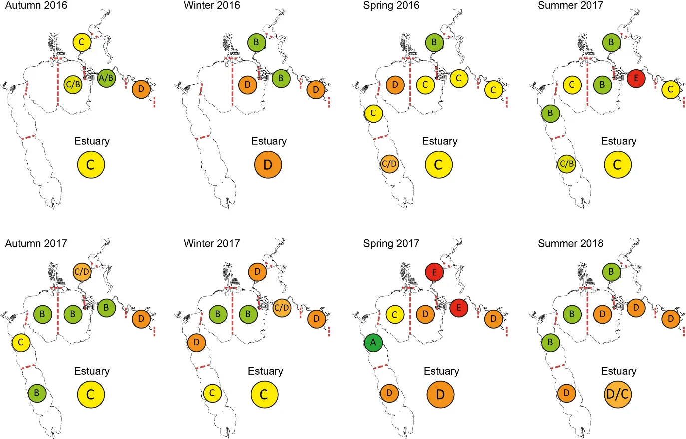
```

```{r fish-ecology-pic14, echo = FALSE, out.width='100%', class = "text-image", fig.cap = "Shadeplot of the average FCI metric scores in the shallows of each region (MC, Mandurah Channel; EP, Eastern Peel Inlet; WP, Western Peel Inlet; NH, Northern Harvey Estuary; SH, Southern Harvey Estuary; SR, Serpentine River; LM, Lower Murray River; UM, Upper Murray River) in each season (S, summer; A, autumn; W, winter; SP, spring) from autumn 2016-summer 2018. Metric scores are shown on a coloured spectrum from red/black (poor scores) to green/white (excellent scores)."}

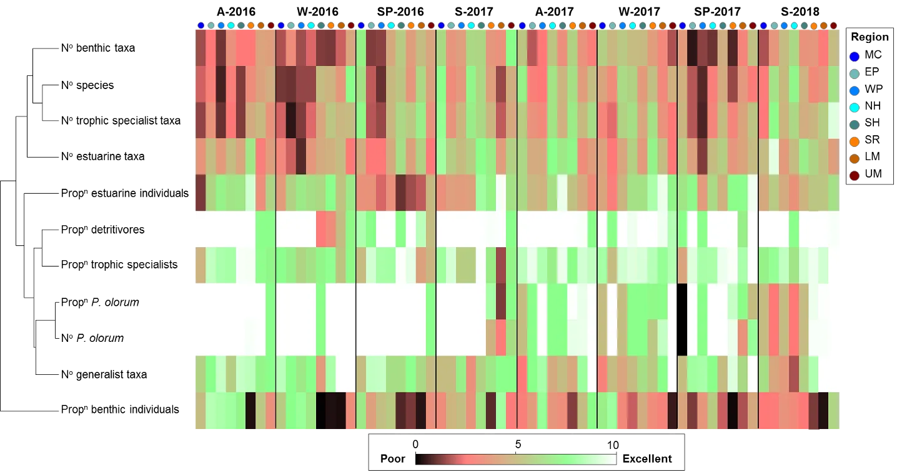
```

```{r fish-ecology-pic15, echo = FALSE, out.width='100%', class = "text-image", fig.cap = "Shadeplot of the average FCI metric scores in the deeper waters of each region (EP, Eastern Peel Inlet; WP, Western Peel Inlet; NH, Northern Harvey Estuary; SH, Southern Harvey Estuary; SR, Serpentine River; LM, Lower Murray River; UM, Upper Murray River) in each season (S, summer; A, autumn; W, winter; SP, spring) from autumn 2016-summer 2018. Metric scores are shown on a coloured spectrum from red/black (poor scores) to green/white (excellent scores). NB condition assessments missing for some regions in first two seasons due to sampling issues."}

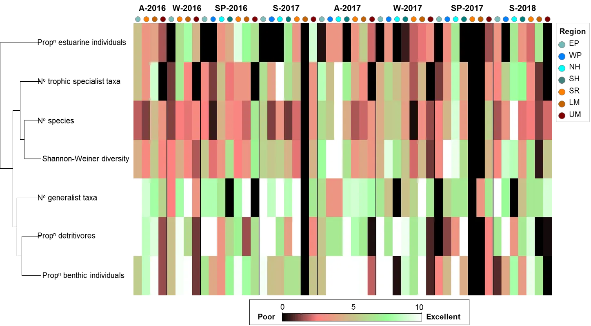
```
:::

### Relating estuary condition to modelled environmental changes

> *Bottom water age, dissolved oxygen and salinity have the greatest impact on ecological health*

::: {.body-text width="100%"}
When FCI scores were correlated with a suite of environmental variables, bottom water age, dissolved oxygen content and salinity were shown to have the greatest influence on ecological condition in the estuary (see Appendix 7 for GAM model descriptions). This correlation was strongest in the deeper waters of the rivers, where the best ecological condition occurred when water age was between 50 and 100 days (though it declined when water age exceeded 100 days) and when dissolved oxygen content was highest (Fig. 12). Thus, the poorest ecological condition occurred at water ages of \< 50 days and when dissolved oxygen content was low (\<2 mg/L). While this finding for water age may initially seem unusual, it reflects the fact that immediately flowing high freshwater flow events (very low water age) marine-associated fish species (e.g. Tarwhine, Tailor, Giant herring, Mulloway) are flushed downstream to more saline areas, thereby negatively influencing several FCI metrics (e.g. no. trophic specialist, no. species, Shannon-Weiner diversity) and resulting in decreased FCI scores. 

The robustness of this best-fit GAM model was tested by comparing actual FCI scores collected during 2017--2018, with those predicted based on the modelled environmental data during those sampling events. Observed and predicted scores were significantly correlated (Pearson R = 0.6, P \< 0.05) and, for 10 of the 12 sampling occasions, predicted the same FCI grade or overlapped the range of observed FCI scores (Fig. 13). One downside of the GAMs model, however, was that it generally over predicted FCI scores and so did not predict very low scores (i.e. grade E) very well (Fig. 13). 

In the shallow waters of the estuary, correlations between FCI scores and environmental variables were weaker, although salinity and the area of hypoxic waters (percentage of the region with dissolved oxygen content \< 2 mg L^-1^) were shown to significantly influence ecological health in the rivers and basins, respectively. In the rivers, increasing salinity had a weak positive effect on FCI scores, while in the basins, hypoxia area had a weak negative influence. No significant correlation between ecological condition and the tested environmental variables was detected in the deeper waters of the basins. 

This study represents the first time FCI scores and environmental variables (observed or model-derived) have been incorporated into statistical models to predict ecological health. Although the correlations were weak in some estuarine regions, the findings in the deeper waters of the rivers highlight the potential of this statistical modelling approach to predict future ecological condition in this vulnerable part of the estuary. More research is required to further explore the reasons underlying the poorer correlations in other parts of the estuary.

```{r fish-ecology-pic16, echo = FALSE, out.width='100%', class = "text-image", fig.cap = "Estimated FCI scores in the deeper waters of the rivers under changing environmental conditions predicted by GAMs. Inward tick marks on the x-axis show the distribution of observed values for each variable, and the grey shading represents the confidence limits of the model."}

knitr::include_graphics("images/fish_ecology/picture16.webp")
```

```{r fish-ecology-pic17, echo = FALSE, out.width='100%', class = "text-image", fig.cap = "Observed and GAM-predicted FCI scores (± standard error) in the deeper riverine areas of the Peel-Harvey Estuary during 2017–18. Regions; SR, Serpentine River; LM, Lower Murray River; UM, Upper Murray River. Seasons; S, summer; A, autumn; W, winter; SP, spring."}

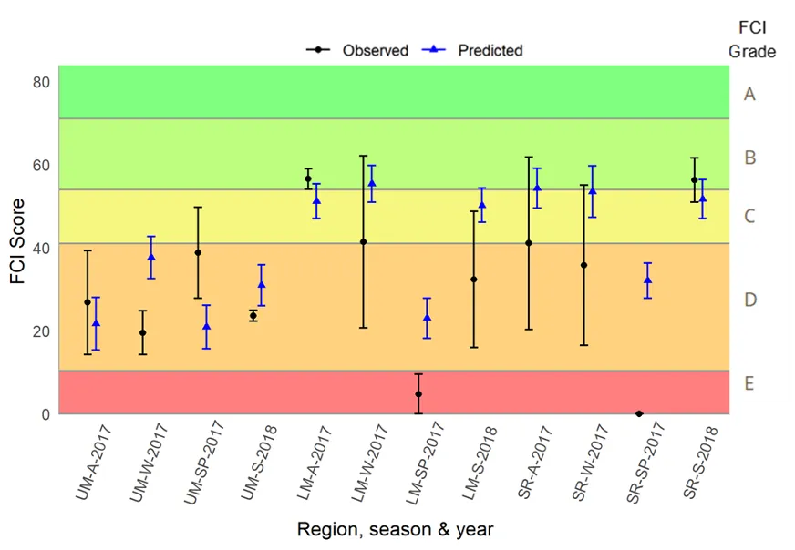
```

```{r fish-ecology-pic18, echo = FALSE, out.width='100%', class = "text-image", fig.cap = "Estimated FCI scores in the shallow waters of the estuary under changing environmental conditions predicted by GAMs. (a) The effect of salinity in riverine areas and, (b) the effect of hypoxia area in the basins. Inward tick marks on the x-axis show the distribution of observed values for each variable, and the grey shading represents the confidence limits of the model."}

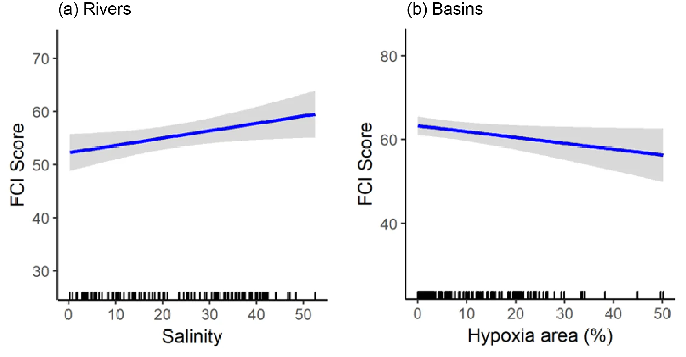
```
:::

### Proposed fish monitoring regime for the Peel-Harvey Estuary

::: {.body-text width="100%"}
Various options for a consistent fish monitoring regime to track the ongoing ecological health of the Peel-Harvey Estuary using the FCI have been proposed in section 11. These options have been based on the outcomes of the current study, and informed by the design of a comparable ongoing monitoring regime in the Swan-Canning Estuary [@hallett2012validation]. They include varying levels of spatial and temporal replication, depending on resource availability and monitoring objectives. Each of these options could (and should) be further tailored for purpose prior to implementation. 
:::

## Conclusions

> *The ecological health of the estuary has generally declined over the last 40 years, and is currently in a fair to poor state overall*

-   While the basins of the estuary are often perceived to be in 'good' condition following the Dawesville Cut and the resulting increase in tidal flushing and decline in algal blooms, the fish faunal trends in the deeper waters indicate otherwise. While they have certainly become more marine-influenced, they are also less diverse, less abundant, more sporadic and less specialised in their habitat requirements, and have declined from good overall health in the 1970s--1980s to fair/poor health in 2016--18.

-   The current, overarching health of the estuary in both the shallow and deeper waters is fair to poor, relative to previously-recorded benchmark conditions. While there is considerable variability among regions and seasons, especially in the very shallow waters, the average ecological signal reflects an ecosystem under moderate to high levels of stress.

> *The most impacted areas are the deeper waters of the upper Murray River and southern Harvey Estuary, and the shallows of the natural entrance channel*

-   The above areas currently appear to be in a chronically-stressed state and often exhibited poor to very poor ecological health via fish faunas that were either comparatively depauperate or dominated by a small number of species with less desirable ecological traits, e.g. opportunistic or detritus feeders.

-   The ecological health signals from the fish communities align with those of the benthic invertebrate and macrophyte communities in the upper Murray and/or southern Harvey Estuary [@oreilly2019assessing; @valesini2019seagrass]. The convergence of each of these biotic indices, which each reflect different (albeit inter-related) aspects of estuarine structure and function, provides compelling evidence that the ecological health of those areas is under significant threat.

> *Spatio-temporal patterns in FCI scores and grades reflect key environmental drivers*

-   Persistent bottom-water hypoxia and high organic matter loadings in the upper Murray are likely to be main drivers of consistently poor FCI scores, as are the relative lack of flushing and high organic loadings in the southern Harvev Estuary. 

-   It is predicted that low oxygen conditions in the Murray River will become more persistent in the future [@hipsey2019estuarine; @huang2019changing], which, given the above findings, would be expected to result in further ecological degradation. 

-   Somewhat unexpectedly, substantial flushing in the rivers also caused a decline in FCI scores, which was likely due to avoidance of the area by marine-associated species and a resultant fish fauna comprised of only a few freshwater tolerant species (e.g. Sea mullet, Black bream). 

-   The surprising trends in the natural entrance channel may reflect an increase in silty sediments and loss of habitat (e.g. seagrass or saltmarsh) since the 1970s, possibly linked to localised developments such as the adjoining housing canals.

> *Establishing a regular fish monitoring regime is critical to assessing and tracking measures to improve ongoing ecological health*

-   The historical fish faunal data set available for the Peel-Harvey has provided a rare basis for establishing fish metric benchmarks and exploring ecological health trends over time. However, the substantial inconsistencies in fish sampling approaches lead to inevitable biases that are at best minimised and in some cases are impossible to overcome, and cannot be disentangled from the historical health trends presented in this report.

-   Given the evidence presented in this report that the ecological health of the estuary is under stress, it is imperative that a consistent and regular fish monitoring program is continued to better assess its ongoing health into the future. 

-   Various options for such a fish monitoring program, which can be tailored to suit, are provided in section 11 of this report.

## Acknowledgements

::: {.body-text width="100%"}
We are grateful to Dr Peter Coulson, Hannah Joss, Kieryn Graham, Chris Hill and Willem DeKlerk for their assistance with sampling and sample processing, and to the many researchers who shared their data from previous studies in this system. We particularly wish to thank Dr Alan Cottingham, without whom none of this work would have been possible.
:::