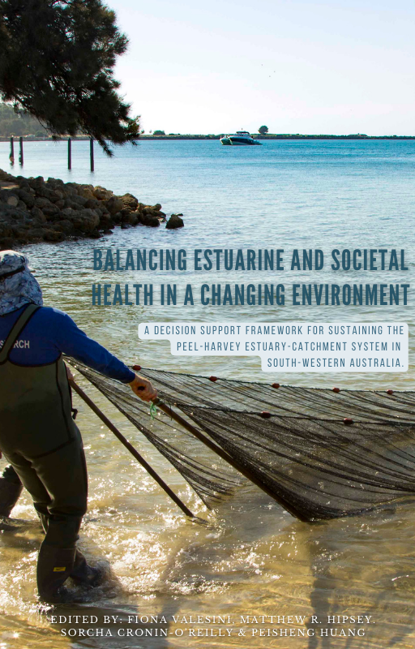

--- 
title: "Balancing estuarine and societal health in a changing environment"
author: "Fiona Valesini, Matthew R. Hipsey, Sorcha Cronin-O’Reilly, Peisheng Huang"
date: "`r format(Sys.time(), 'the %dth of %B, %Y')`"
site: bookdown::bookdown_site
documentclass: book
bibliography:  ["references/references.bib", "references/BMI_refs.bib", "references/all_refs_test.bib","references/Chapter3_Ref.bib"]
csl: "references/elsevier-harvard_edited.csl"
biblio-style: apalike
link-citations: yes
description: "The online Peel book"
favicon: images/book/favicon.ico
cover-image: images/book/cover1.png
github-repo: https://github.com/AquaticEcoDynamics/peel-book
url: https://aquaticecodynamics.github.io/peel-book/
---

```{r, include=FALSE}
knitr::knit_hooks$set(class = function(before, options, envir) {
  if(before){
    sprintf("<div class = '%s'>", options$class)
  }else{
    "</div>"
  }
})

#rmarkdown::render_site(output_format = 'bookdown::bs4_book', encoding = 'UTF-8')
```


<!-- #.·´¯·.´¯·.¸¸.·´¯·.¸><(((º> -->

# ><(((º> {-}

<br>

## Welcome {-}

 This is an online version of *Balancing estuarine and societal health in a changing environment* book, a summary of inter-disciplinary research studies completed as part of an Australian Research Council (ARC) project focused on the [Peel-Harvey Estuary](https://en.wikipedia.org/wiki/Peel-Harvey_Estuarine_System) and it's community, located in Western Australia. 

Undertaken from 2016 to 2019, the research sought to develop an evidence-based approach to understand the links and trade-offs between regional catchment development (economic resilience) and the health of the receiving estuary (environmental and ecological resilience). Given the Peel-Harvey’s particular history of fundamental ecosystem shifts through both chronic decline and an acute engineered ‘recovery,’ combined with its current and forecast climate and development stressors, there has been an urgent need for a holistic view of this important socio-ecological system.

This book summarises a series of ten studies that together document the changing environmental conditions, ecosystem character and socio-economic priorities of the system, and provides insight into possible future trajectories that can be used to inform sustainable development. 

# <u>i</u> About {-}

<br>

This work was first published by the The University of Western Australia on XX^th^ December, 2023.

**ISBN**: 978-1-74052-939-6

**DOI**: https://doi.org/10.26182/ymst-gz83

## Citing this work {-}

Please cite this edited book as: 

> <small>Valesini, F., Hipsey, M. R., Cronin O’Reilly, S., & Huang, P. (Eds.) (2023).*Balancing estuarine and societal health in a changing environment: A decision support framework for sustaining the Peel-Harvey estuary-catchment system in south-western Australia*. The University of Western Australia. https://doi.org/10.26182/ymst-gz83.
</small>

If you would like to cite an individual chapter of this book, please use this format (example given here for Chapter X): 

> <small>Hipsey, M.R. and P. Huang. (2023) XXXXXX. <u>In</u>:  Valesini, F., Hipsey, M. R., Cronin O’Reilly, S., & Huang, P. (Eds.) (2023). Balancing estuarine and societal health in a changing environment: A decision support framework for sustaining the Peel-Harvey estuary-catchment system in south-western Australia. The University of Western Australia.  https://doi.org/10.26182/ymst-gz83.</small>


## Accompanying data assets {-}

The work contained herein served to compile a diverse data-set spanning many disciplines, decades, and data-types. In the spirit of fostering future continuation of the analyses, and uptake of the model tools developed in this work, the book includes an accompanying data asset with digital object identifier (DOI). Specific chapters explain aspects of the data and model tools. Users of the data-set and models can use the following citation:

> <small> .........  https://doi.org/10.26182/ymst-gz83.</small>


## Copyright and license {-}

<br>
<a rel="license" href="http://creativecommons.org/licenses/by-nc-nd/4.0/"></a> This book is licensed to you under a <a rel="license" href="http://creativecommons.org/licenses/by-nc-nd/4.0/">Creative Commons Attribution-NonCommercial-NoDerivatives 4.0 International License</a>.

The model and data sets associated with this book are licensed under [Creative Commons CC0 1.0 Universal (CC0 1.0)](https://creativecommons.org/publicdomain/zero/1.0/), i.e. public domain, unless otherwise identified.

<br>


