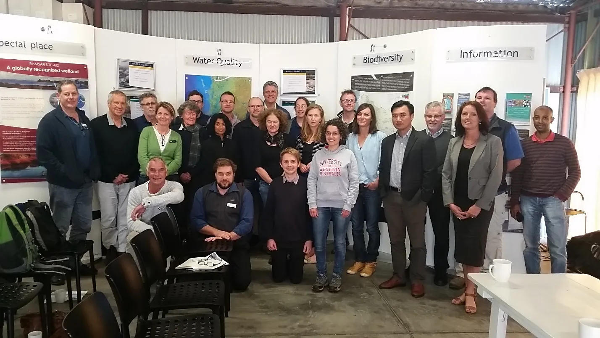

--- 
title: "Balancing Estuarine and Societal Health in a Changing Environment"
author: "Fiona Valesini, Matthew Hipsey, Brad Eyre, Kieryn Kilminster, Paul Plummer, Mike Elliott, Chris Hallett, Peisheng Huang, Brendan Busch, Naomi Wells, Karl Hennig, Sorcha Cronin-O’Reilly, Mustefa Reshid, Oliver Krumholz, Julia Horsley and Jill Trinh"
date: "`r format(Sys.time(), 'the %dth of %B, %Y')`"
site: bookdown::bookdown_site
documentclass: book
cover-image: cover.png
bibliography:  ["references/references.bib", "references/BMI_refs.bib", "references/all_refs.bib"]
biblio-style: apalike
link-citations: yes
description: "The online Peel book"
---

```{r, include=FALSE}
knitr::knit_hooks$set(class = function(before, options, envir) {
  if(before){
    sprintf("<div class = '%s'>", options$class)
  }else{
    "</div>"
  }
})

#rmarkdown::render_site(output_format = 'bookdown::bs4_book', encoding = 'UTF-8')
```


# Introduction {-}
::: {.body-text width="100%"}
{.cover width="250"} Insert introductory text for *Balancing Estuarine and Societal Health in a Changing Environment* here. INSERTED
<br>
<br>
<br>
<br>
<br>
<br>
<br>
<br>
<br>
<br>


## Our Supporters and Collaborators {-}

This project was generously supported by the Australian Research Council (ARC) Linkage Program, together with our Industry Partners (Department of the Premier and Cabinet; Department of Water and Environmental Regulation; City of Mandurah; Shire of Murray; Peel-Harvey Catchment Council) and collaborating research institutions (Murdoch University; The University of Western Australia; Southern Cross University; University of Hull). 

```{r introduction-pic1, echo = FALSE, out.width='100%', class = "text-image"}

```
:::