# The What, Where, When and Why of Nutrient Transport to the Peel-Harvey Estuary

<!-- ::: {.title_matter width="100%"} -->

<!-- [***Balancing estuarine and societal health in a changing environment***]{style="color:#5f543f"} -->

<!-- ::: -->

<br>

::: {.chapter-authors width="100%"}
**Naomi S. Wells^1,2^, Mustefa Yasin Reshid^2^, Karl Hennig^3^, Daren Gooddy^4^, Bradley Eyre^1^**
:::

::: {.author-info width="100%"}
^1^ Centre of Coastal Biogeochemistry, Southern Cross University, Lismore, Australia <br> 
^2^ Department of Soil & Physical Sciences, Lincoln University, Lincoln, New Zealand
^3^ Department of Water and Environmental Regulation, Government of Western Australia, Perth, Australia <br> 
^4^ British Geological Survey, Wallingford, Oxfordshire, United Kingdom
:::

```{r isotopes-pic1, echo = FALSE, out.width='100%', class = "title-image"}


```

<br>
<br>

## Abstract

::: {.body-text width="100%"}
This study aimed to characterise the sources, form and biological controls on nutrient inputs to the Peel-Harvey Estuary. This was achieved by first assessing the dominant forms of nitrogen and phosphorus found in the catchment sources (e.g., groundwater, rainwater, wastewater effluent and soil water) and in the receiving waters (e.g., drains, farm dams, rivers and the estuary basins). Isotope-based indicators were the developed to describe the biological transformations that were acting to modify the downstream flow of excess nitrogen. This approach revealed that (1) both groundwater and rainwater could bring excess reactive nitrogen to the estuary; (2) shallow receiving waters like drains and creeks play a critical role in removing ('assimilating') excess nitrogen before it reaches the estuary; and (3) up to 100% of inorganic nitrogen sources within the catchment could be biologically-removed during downstream transport. Together, these findings lay the foundation for improved catchment-estuary nutrient load quantification and modelling, as well as providing evidence to support drain management interventions that could help maximise nutrient removal prior to nutrients entering the main waterways.
:::

## Introduction

::: {.body-text width="100%"}
There is a long history of concern about excess nutrients leading to the over-enrichment of organic matter (eutrophication) in the Peel Harvey Estuary [@bradby1997peel; @mccomb1981eutrophication]. However, relatively little is known about how the nutrients (nitrogen and phosphorus) that cause this over-enrichment to reach the estuary. Understanding how, why, where, and when nitrogen (N) and phosphorus (P) move from sources like agricultural soils and wastewater treatment plants to the estuary, is a critical (but complex) step in being able to effectively manage eutrophication in this system. This complexity stems, from the fact that microbes and vegetation can remove up to 100%, or as little as 0%, of excess nitrogen as it's transported downstream from the catchment and/or atmospheric sources.

This research study aimed to improve knowledge of nutrient transport and transformations across the Peel Harvey system by measuring changes in the isotopic composition of different N and P forms. This approach is based on the knowledge that both the different nutrient pollution sources and the biological processes that limit nutrient transport downstream will impart unique isotopic 'fingerprints', or signatures. Characterising the fingerprints for the different sources and processes could enable us to measure how efficiently nutrients moved through different portions of the catchment to the estuary. This type of isotope tracing approach has been successfully used in other temperate waterways to determine the extent of their eutrophication [@gooddy2016multi] or the particular nitrogen sources most responsible for driving this eutrophication [@xue2012use].

Detailed information on the origin, form and fate of nutrients across the Peel-Harvey catchment generated through this research component was collected for the purposes of filling gaps in the catchment nutrient export model, and to set the scene for future targeted work to improve ecosystem health in the identified 'at risk' zones.
:::

### Objectives

The specific study objectives were as follows:

1.  Identify the dominant sources and forms of nutrients moving through the Peel-Harvey catchment and estuary.

2.  Assess the potential of isotopic tools to distinguish the identified nutrient sources.

3.  Identify the catchment locations and events that enhance nitrogen removal (biogeochemical '*hot spots*' and '*hot moments*').

4.  Evaluate the added value of incorporating isotope measurements into catchment nitrogen export models.


## Approach

### Conceptual model: Isotope fate and transport

::: {.body-text width="100%"}
The conceptual model underpinning our work is based on the knowledge that different nitrogen (and maybe phosphorus) sources have unique concentrations of heavy vs light isotopes, and that biological removal of nitrogen (by processes including denitrification and assimilation into organic biomass) will preferentially remove only light isotopes (Fig. \@ref(fig:isotopes-pic2)). This model informed our study design: we set out to evaluate the concentrations and isotopic composition of different nutrient sources across the Peel-Harvey catchment, and then track those sources as they moved through the complex network of drains, aquifers, farm dams, lakes and finally the estuary.

```{r isotopes-pic2, echo = FALSE, out.width='75%', class = "text-image", fig.cap = "Different nutrient sources (e.g. livestock waste, wastewater treatments, rain) have different quantities of heavy vs light isotopes. These sources will mix in surface waters, where biological removal will again alter the ratio of heavy to light isotopes by preferentially removing the latter."}

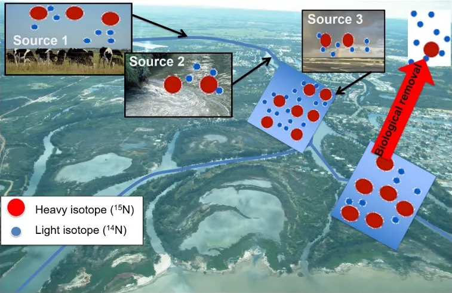

```
:::

### Sample collection

::: {.body-text width="100%"}
We collected samples from both receiving waters (defined as surface waters in the catchment and estuary) and N and P sources (defined as soils, fertilisers, and the non-surface waters that could directly flow to the surface water; Table \@ref(tab:sampletable)). This sampling design enabled us to build a biogeochemical understanding onto the known hydrologic flow paths linking 'sources' and 'receiving waters' and avoid extraneous or duplicate sampling. For instance, we sampled soil water (which could directly leach into creeks, drains and rivers), but not the nitrogen fertilisers and livestock excreta that are applied to these soils. Examples of the different types of waters sampled within the campaigns are shown in Fig.  \@ref(fig:isotopes-pic3))
:::

```{r isotopes-pic3, echo = FALSE, out.width='100%', class = "text-image", fig.cap = "Examples of the different types of water bodies sampled across the Peel-Harvey system. The different flow dynamics and biological structure of these water bodies could have a major impact on how efficiently they remove excess nutrients."}

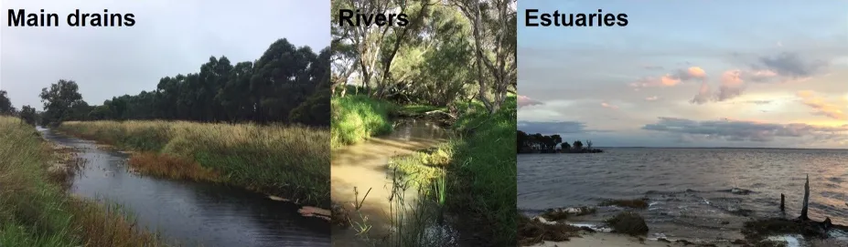

```


<br>
<center>

```{r sampletable, echo=FALSE, message=FALSE, warning=FALSE}
library(knitr)
library(kableExtra)
library(readxl)
  options(knitr.kable.NA = "")
  Diff_tab <- read_xlsx("tables/peel_tables.xlsx", sheet="sampletable")
  kable(Diff_tab[,1:2],"html", escape = F, align = "c"
        , caption = "Summary of sampled sources and receiving waters. Note that soils and storm drains were only sampled during the high flow season (winter 2017), while the rest were sampled in both summer and winter.",bootstrap_options = "hover")%>%
      kable_classic(full_width = T) %>%
      kable_styling(Diff_tab, bootstrap_options = "hover",
                full_width = T, position = "left",
                font_size = 12) %>% 
  row_spec(0, background = "#5f543f", bold = TRUE, color = "white") %>%
  column_spec(1, width_min = "20em" ,color="black",bold = T) %>%
  column_spec(2, width_min = "20em" ,color="black") %>%
  # column_spec(3, width_min = "15em" ,color="black") %>%
  # row_spec(1:2, background = 'white')  %>%
 scroll_box(width = "40em", fixed_thead = FALSE)
```

<br>

::: {.body-text width="100%"}
The location of all sampling points is shown in Fig. \@ref(fig:isotopes-pic4), with most being sampled in both summer (February--March 2017) and winter (July--August 2017); see Table \@ref(tab:sampletable) for exceptions.

In addition to the above sampling of sources and receiving waters, high-resolution temporal sampling (24 h continuous measurements) of different forms of nitrogen were carried out at two estuary locations (see Fig. \@ref(fig:isotopes-pic4)) in winter 2017 to assess how tides impacted their distributions. 

```{r isotopes-pic4, echo = FALSE, out.width='75%', class = "text-image", fig.cap = "A map of the Peel-Harvey catchment and estuary showing locations where isotope samples were collected. The farms where the soil and feeder drain samples are outlined in grey, and the drain (yellow circle) where the WWTP samples were collected is indicated."}

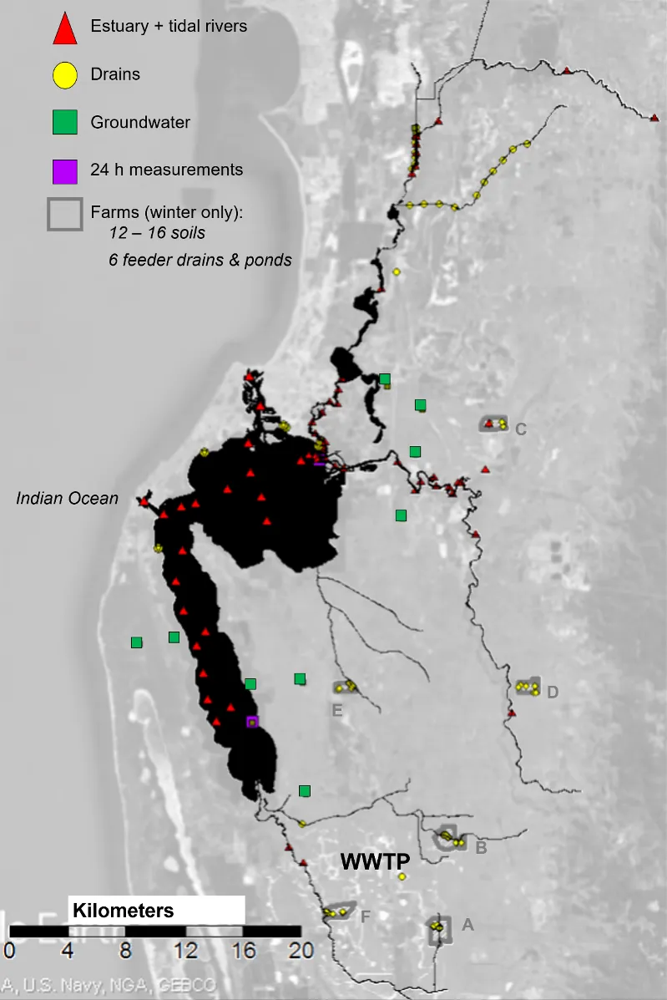
```
:::

### Isotope analyses

::: {.body-text width="100%"}
In each of the samples collected from the various sources and receiving waters (Table \@ref(tab:sampletable)), we first measured the concentration of the different species of P (dissolved organic P, and inorganic P, PO~4~^3-^) and N (dissolved organic and inorganic N, as nitrate, NO~3~^-^, and ammonium, NH~4~^+^). We then analysed the isotope composition of the inorganic species. 

For P, this involved sending samples to our colleagues at the *British Geological Survey* for processing, as described in @davies2014phosphate. Phosphate isotope (δ^18^O-PO~4~^3-^) samples were limited to the main sources (fertilisers and soils) due to the large sample volume required for these analyses, the very time-intensive preparation steps, and the need for significant method development before these analyses can be readily applied to samples with complex organic matrices and high salinities, as found throughout most of the Peel-Harvey system. 

Measuring the isotopic composition of N involved converting the two inorganic forms (NO~3~^-^ and NH~4~^+^) to nitrous oxide (N~2~O), which we could then use to quantify the relative abundance of heavy to light isotopes for both N (δ^15^N) and O (δ^18^O). These analyses were performed in the stable isotope laboratory at Southern Cross University's Centre for Coastal Biogeochemistry. For more details on these methods, see McIlvin and Casciotti (2011) and Zhang et al. (2007). 
:::

### Analysis to resolve the "what", "where" and "when"


#### 'What': Characterize the sources and forms of catchment nutrients (Objectives 1 and 2)

##### Sources {-}

::: {.body-text width="100%"}
The main sources of P to the Peel-Harvey Estuary include fertilisers (rock phosphorus) leached through agricultural soils. The key sources of N include leaching from agricultural soils (which includes inputs from nitrogen fixing crops like clover and grazing livestock), effluent from wastewater treatment plants, inflows of historically contaminated groundwater, urban storm drains and rain water carrying reactive nitrogen mobilised from more distant (10--1,000 km) farms and industrial sources. We also evaluated the potential of precipitation to transport reactive nitrogen around the catchment. This is because 'atmospheric transport' can move nitrogen around agricultural catchments and confound traditional methods of identifying sources and sinks. The potential for rain to carry nitrogen has never been evaluated in Western Australia, so the importance of this nitrogen source to the Peel-Harvey system was unknown.

Using the laboratory methods outlined above, samples of all of these sources were evaluated for the consistency of their isotope values, and thereby their usefulness for 'fingerprinting' these sources as they move through the catchment and estuary. 
:::

##### Forms {-}

::: {.body-text width="100%"}
Standard water quality models only consider nutrients as a 'total' of their forms (e.g. TN and TP). While this approach is efficient given the many chemical forms of both N and P that exist in the environment, it makes it difficult to accurately track changes in nutrient export. This is because, (1) the process used to measure TN and TP concentrations (persulfate oxidation of unfiltered samples) is imprecise and thus often obscures real changes occurring in the environment, and (2) the TN pool in particular is large and thus a fairly insensitive indicator of changes in nutrient pollution over space and time (Table \@ref(tab:ntable)). 
:::

::: {.body-text width="100%"}
We also know that certain forms included in the TN pool, like nitrate (NO~3~^-^), exist in relatively low concentrations but can rapidly increase in response to human activities like N fertiliser use [@parfitt2012nitrogen]. This makes such inorganic forms (NO~3~^-^ and NH~4~^+^) potentially more indicative of changes in pollution over space and time. The rest of the dissolved N pool is made up of organic molecules (DON), which can range from easily altered compounds like urea to large and non-biodegradable compounds [@sipler2015dynamics]. Therefore, the first objective that must be fulfilled in order to understand how nitrogen moves from land to the Peel-Harvey is to quantify the relative abundance and distribution of more labile nitrogen forms like NO~3~^-^, ammonium (NH~4~^+^), and DON. 
:::

<br>

```{r ntable, echo=FALSE, message=FALSE, warning=FALSE}
library(knitr)
library(kableExtra)
library(readxl)
library(rmarkdown)
theSheet <- read_excel('tables/peel_tables.xlsx', sheet="ntable")
theSheetGroups <- unique(theSheet$Group)

kbl(theSheet[,2:NCOL(theSheet)], caption = "Summary of the different N forms commonly found in rivers and estuaries. Note that negatively charged N forms like NO~3~^-^ are more readily transported in water than positively charged N forms like NH4^+^, which tends to stick to soil and sediment particles", align = "c",) %>%
  pack_rows(theSheetGroups[1],
            min(which(theSheet$Group == theSheetGroups[1])),
            max(which(theSheet$Group == theSheetGroups[1])),
            background = '#ebebeb') %>%
  pack_rows(theSheetGroups[2],
            min(which(theSheet$Group == theSheetGroups[2])),
            max(which(theSheet$Group == theSheetGroups[2])),
            background = '#ebebeb') %>%
  pack_rows(theSheetGroups[3],
            min(which(theSheet$Group == theSheetGroups[3])),
            max(which(theSheet$Group == theSheetGroups[3])),
            background = '#ebebeb') %>%
  kable_classic(full_width = T) %>%
  kable_styling(full_width = T,font_size = 11) %>%
  row_spec(0, background = "#5f543f", bold = TRUE, color = "white") %>%
  column_spec(2, width_min = "7em") %>%
  column_spec(4, width_min = "12em") %>%
  scroll_box(width = "40em",
             fixed_thead = FALSE)
```


#### 'Where and When': Identify nitrogen removal 'hot spots' and 'hot moments (Objective 3)

##### Spatial variations in nitrogen removal {-}

::: {.body-text width="100%"}
To determine which regions of the catchment were more biologically active (and thus more likely to remove source nutrients), we measured N concentrations and isotopes across a range of receiving waters from small feeder drains on farms (shallow, seasonally flowing, vegetated) to large regional drains (permanently flowing, high velocity, channelized) to the Peel and Harvey estuaries (shallow with a large surface area; Table \@ref(tab:sampletable), Fig. \@ref(fig:isotopes-pic3)). At these sites, we also used laser instruments to measure dissolved concentrations of carbon dioxide (CO~2~), methane (CH~4~) and nitrous oxide (N~2~O) gasses. Gas measurements are useful as they provide an independent indicator of biological productivity, and thus potential nutrient removal 'hot spots'. This is because CO~2~, CH~4~, and N~2~O are produced by the same microorganisms that consume excess nitrogen. 
:::

##### Temporal variations in nitrogen removal {-}

::: {.body-text width="100%"}
We carried out the same isotope and dissolved gas measurements over both winter (high flow) and summer (low flow) seasons. As there was an anomalously large rainfall event in the Murray catchment during this summer, we sampled both before and after this 'flood'. Unless otherwise noted the presented data is from the pre-flood (low flow) period. We further assessed the effect of extreme events on nutrient fluxes by sampling during a winter storm (wind speeds \>100 km/hr) very strong winds) in the Harvey Estuary. Seasonal variations in N forms, sources and removal were also assessed by measuring concentrations and isotopes in monthly samples from eight estuary sites that were collected for us by the Department of Environmental Regulation. 
:::

#### 'Why': Quantify implications for nitrogen export budgets (Objective 4)

::: {.body-text width="100%"}
Current nutrient monitoring in the Peel-Harvey system (and thus the models based on this data) do not measure biological removal ('attenuation') processes that could occur as N is moved from catchment soils and/or rainfall sources to the waterways. A key aim of our isotope data was therefore to generate independent attenuation calculations that could be used to validate and improve the coupled catchment-estuary model being developed in other components of the research (Chapter \@ref(model-water-quality)). Isotope-based calculations provide a measure of N removal that integrates N removal during *transport to* the sampled system and N removal *within* the sampled system. This approach will provide unique insight into the complex and poorly understood processes that occur as N is transported from land to water. 
:::

<b>

## Results & findings

### 'What': The majority of nitrogen in the Peel-Harvey is in organic forms

::: {.body-text width="100%"}
Dissolved organic nitrogen (DON, that is, organic nitrogen smaller than 0.45 µm, see Table \@ref(tab:ntable)) dominated the nitrogen pool in all of the sampled surface waters, from farm dams to feeder drains to main drains to rivers to the estuary basins (Fig. \@ref(fig:isotopes-pic7)). The fact that DON concentrations decreased as the size of the waterbody increased suggests that this comes from terrestrial sources that are gradually diluted downstream [@raymond2016hydrological]. This is very different to the eutrophied catchments in temperate latitudes where the vast majority of research is conducted. Nitrate (NO~3~^-^) was also a significant portion of the nitrogen pool in a few of the main drains and in the Harvey and Murray rivers. 

```{r isotopes-pic7, echo = FALSE, out.width='100%', class = "text-image", fig.cap = "Concentrations of N as DON, NO3- and NH4+ across the hydrologic gradient, from farm dams (‘pond’) to feeder drains, main drains, rivers then the estuary basins, measured in winter 2017."}

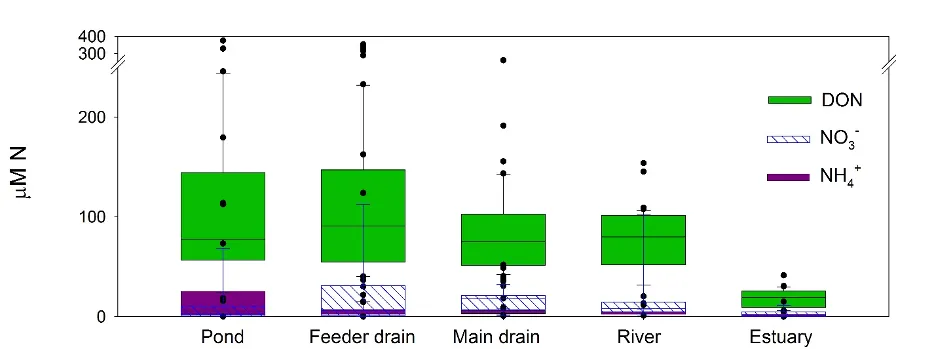

```

Reporting of nitrogen export from the Peel-Harvey catchment via catchment models primarily focus on total nitrogen (TN, that is, one composite measure of all organic, inorganic, and particulate forms, see Table \@ref(tab:ntable)) (Chapter \@ref(catmodel)). This approach is analytically and computationally expedient, but potentially misses key information about ecosystem health. This is because biological organisms use the different nitrogen forms differently (e.g., because NH~4~^+^ is more likely to be used than NO~3~^-^ it may be a stronger driver of eutrophication). The dominance of DON in a highly human-impacted system like the Peel-Harvey contrasts with water quality conditions in comparable systems in temperate regions, where NO~3~^-^ tends to be the dominant nitrogen form. As a consequence, very little is known about how organisms use DON. More research will clearly be needed on this topic in order to fully understand the downstream impact of this type of nitrogen pollution in the Peel-Harvey system.
:::

### 'What': Nutrients originating from soils and groundwaters will be difficult to track, but rain provides a distinct inorganic nitrogen source

#### Fertilisers

::: {.body-text width="100%"}
We sent our phosphate fertiliser samples to our collaborator Daren Gooddy at the British Geological Survey for analysis. Unfortunately, we found that the isotope composition of the phosphate fertilisers used in the Peel-Harvey region vary depending on both the fertiliser manufacturer and the year of production (Fig. \@ref(fig:isotopes-pic8)). This means that the source signature of phosphorus isotopes would be too variable to make useful 'fingerprints' of agricultural run-off.

```{r isotopes-pic8, echo = FALSE, out.width='50%', class = "text-image", fig.cap = "The isotopic composition of PO~4~^3-^ in fertilisers sold to farmers in the Peel-Harvey catchment between 2012 and 2018. Dashed lines show mean values for AGRAS (top) and Superphosphate (bottom)."}

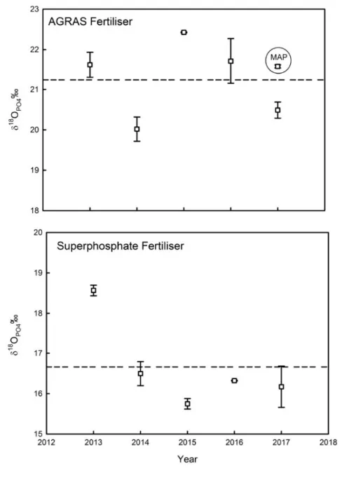

```
:::

#### Soils

::: {.body-text width="100%"}
We measured the isotope composition of the different forms of nitrogen found in soils (total nitrogen, TN, ammonium, NH~4~^+^, and nitrate, NO~3~^-^) on six livestock farms across the Harvey (Farms B, A, F), Murray (Farms D and E), and Serpentine (Farm C) catchments (Fig. \@ref(fig:isotopes-pic9), and see Fig. \@ref(fig:isotopes-pic4) for farm locations). 

```{r isotopes-pic9, echo = FALSE, out.width='100%', class = "text-image", fig.cap = "Box and whisker plots of the (a) isotope composition of the total soil N pool, (b) 2M KCl extractable NH~4~^+^, and (c, d) NO~3~^-^ pools. Black diamonds indicate outlier values and boxes represent quartiles 1 – 3 around the median (black horizontal line). Note that Farm C has a significantly depleted δ^15^N-TN composition (a), while Farms A and D have significantly depleted δ^15^N and δ^18^O compositions of the extractable inorganic N forms (b, c, d). "}

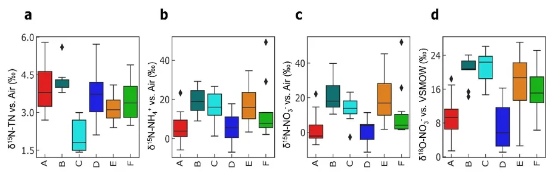

```

We found two distinct fingerprints in NO~3~^-^ isotopes: farms with relatively high δ^15^N-NO~3~^-^ and δ^18^O-NO~3~^-^ values (B, C, E), and farms with relatively low δ^15^N-NO~3~^-^ and δ^18^O-NO~3~^-^ values (A, D; Fig. \@ref(fig:isotopes-pic9)c-d). These differences must be driven by fundamental differences in soil biology between the farms, but were not easily explained by factors like soil type, soil moisture content, or current land-use. This was surprising because the farm sites were selected to span a range of soil leaching potential (i.e., sand to clay soils), and we expected to find less processed (i.e., lower) δ^15^N values in the sandier soils. 

Instead, we may potentially be detecting the influence of two other factors. First, a land-use legacy effect on soil nitrogen cycling being reflected in the nitrogen isotopes, creating distinct values between the different farms independent of soil type. For instance, many farms in the region have shifted from dairy (higher stocking rates) to beef (lower stocking rates) over the past few decades. Second, heavy rainfalls during the winter period ensured that even the well-drained soils were saturated, and thus could have hosted the types of microbial reactions that would enrich δ^15^N values (Table \@ref(tab:ntable)). Despite this complexity, the relatively small range of δ^15^N values in the total nitrogen pool (1.5 -- 4.5 ‰, Fig. \@ref(fig:isotopes-pic9)a) provide a reasonable 'source' fingerprint for our subsequent work assessing transformation during transport downstream to the estuary.  
:::

#### Groundwater

::: {.body-text width="100%"}
At the upstream end of the hydrologic gradient, groundwater in the Peel-Harvey catchment can also contain very high levels of nitrogen (Fig. \@ref(fig:isotopes-pic10)). However, N concentrations (and isotopes) were extremely variable between the different wells, ranging from \~0 µM to \~1,000 µM. A more in-depth study of the groundwater hydrology of the region would be needed to determine why high nitrogen concentrations persist in some locations but not others. 

The isotope composition of NO~3~^-^ in the groundwater ranged from values that are typical for N leached from soil ('terrestrial') to values that reflect a clear human input to the groundwater ('fertiliser') (Fig. \@ref(fig:isotopes-pic10)b). Despite this variability, our data demonstrate that groundwater can contain high concentrations of all three nitrogen forms, and thus could be a source of N enrichment to the estuary and other surface waters. 

```{r isotopes-pic10, echo = FALSE, out.width='100%', class = "text-image", fig.cap = "(a) Variations in the concentrations of the dominant N forms and (b) isotopic composition of NO~3~^-^, when present, in groundwater in ten shallow wells (~4 m to water table). Wells were sampled both in the winter (Jul. 2017) and summer (Feb. 2017), but water chemistry did not differ significantly between these sampling dates."}

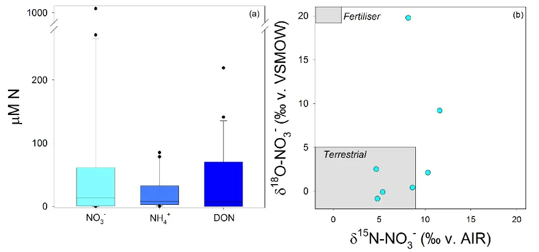

```
:::

#### Precipitation

::: {.body-text width="100%"}
We were surprised to find such high and variable concentrations of all three nitrogen forms in rain falling in the Peel-Harvey catchment (Fig. \@ref(fig:isotopes-pic11)). These high concentrations are likely caused by a combination of local reactive N off-gassed from soils, combustion, and bush fires and complex chemical reactions in the atmosphere [@jickells2016atmospheric]. 

```{r isotopes-pic11, echo = FALSE, out.width='100%', class = "text-image", fig.cap = "(a) The concentration of different N forms in precipitation and (b) the isotopic composition of NO~3~^-^ in precipitation that fell in the Peel-Harvey catchment in summer and winter 2017. To give these results context, the grey boxes in (b) show the commonly reported range of NO3- isotopes in NH~4~NO~3~ fertilisers and terrestrial soils."}

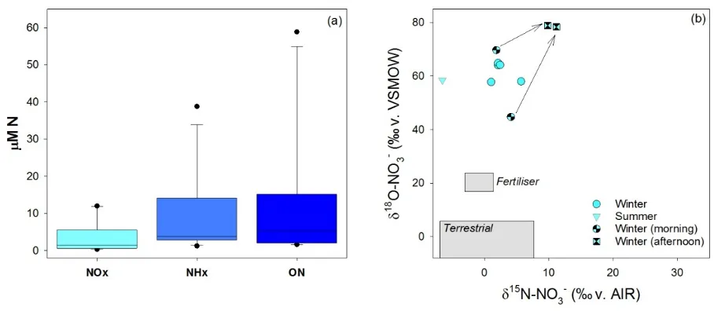

```

While rain NO~3~^-^ isotope values did vary (e.g. between morning and afternoon showers), the very high values of oxygen isotopes (δ^18^O) in NO~3~^-^ from rainwater mean that they provide distinct fingerprints of where and when 'atmospheric' nitrogen enters the large surface water bodies of the Peel-Harvey system. 
:::

### 'Where': Shallow, productive waters are nitrogen removal hot-spots

::: {.body-text width="100%"}
In order for N to be 'removed' (either converted into gaseous forms or taken up by plants) from the Peel-Harvey microbes will first need to convert the dominant DON into NH~4~^+^ (for plant uptake) or NO~3~^-^ (the first step towards producing N~2~O and N~2~ gasses). The knowledge that the zones of greater biological activity will enhance the nitrogen 'turnover' reactions thus motivated us to start identifying nitrogen removal hot-spots by looking for areas with the highest concentrations of biologically-produced dissolved gasses. 

By far the highest concentrations of dissolved gasses in the drains (including drains and farm dams) around the catchment (Fig. \@ref(fig:isotopes-pic12)). This suggests that the drains are very biologically active, and thus could play a critical role in controlling how much nitrogen reaches the estuary

```{r isotopes-pic12, echo = FALSE, out.width='25%', class = "text-image", fig.cap = "A summary of the dissolved gasses produced in different portions of the Peel Harvey catchment, from the main drains (0.9 % of the surface water by area) through the rivers (11% of the surface water by area) to the main estuary basins (87% of the surface water by area). The emissions of three gasses (N~2~O, CH~4~, and CO~2~) were all normalised to their ‘global warming potential’ (GWP), which is reported in Tg C/yr and based on the assumption that CH~4~ has 28× the warming potential of CO~2~ and N~2~O has 280× the warming potential of CO2 (IPCC, 2013)."}

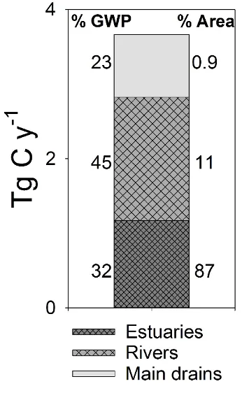

```

Summer measurements of nitrogen concentrations and isotopes in the main drains supported this suggestion. The dramatic changes in δ^15^N signatures over the length of the drains (in the downstream direction) means that biological processes are working to recycle (or potentially remove) the nitrogen loads they're receiving. Nutrient recycling occurs when nitrogen is converted between multiple forms, including incorporated into the biomass and then re-mineralised into the water column, without leaving the system. Nitrogen removal processes can be distinguished from recycling processes based on, (1) a consistent increase in isotope values as the concentrations decrease, and, (2) parallel increases in the N and O isotopes of NO~3~^-^. Here active N recycling and removal was most clearly demonstrated in the Waroona Drain downstream from the Waroona wastewater treatment plant, where NH~4~^+^ inputs were rapidly removed (Fig. 9, bottom panel) and converted to NO~3~^-^ within a few kilometres of entering the drain (Fig. \@ref(fig:isotopes-pic13), middle panel). More intensive sampling through the middle reaches of the drain should be undertaken to identify the exact rate of conversion to NO~3~^-^, as currently this estimate is based on the one site we could access further downstream (Fig. \@ref(fig:isotopes-pic13)). Despite this acknowledged uncertainty, the mirrored patterns of the δ^15^N composition and composition between the two inorganic N forms (NO~3~^-^ and NH~4~^+^) are highly indicative of biological reactions. Thus, the inclusion of isotope data here enabled us to help rule out alternative explanations for the observed shift in concentrations downstream (e.g., inflowing groundwater). 

```{r isotopes-pic13, echo = FALSE, out.width='100%', class = "text-image", fig.cap = "Changes in NO~3~^-^ (centre, left axis, blue circles) and NH~4~^+^ (bottom, left axis, blue circles) in the Waroona Drain as water leaves the wastewater treatment plant (~26 km from the estuary) and approaches the Harvey Estuary. Data is from the summer sampling campaign. Note the very high NH4+ concentrations and low δ^15^N values (right axis, black crosses) closest to the plant. The isotope ‘source’ signature is almost immediately lost, and over 4 km in the drain, all of the NH~4~^+^ has converted to NO~3~^-^ via microbial reactions."}

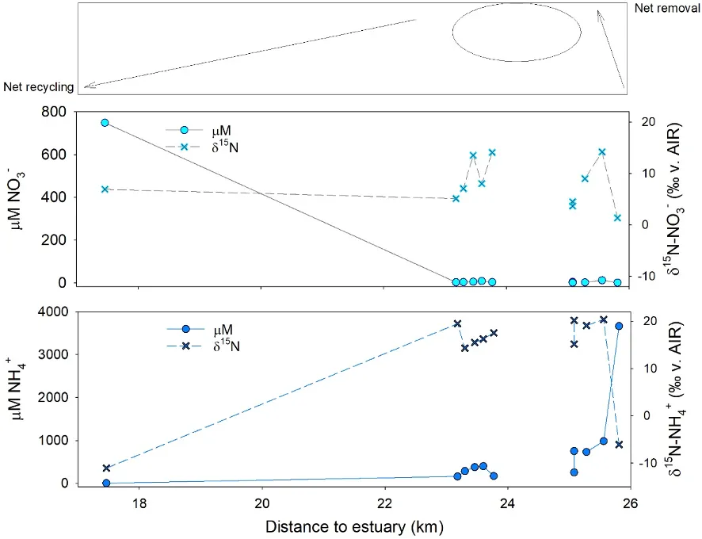

```

At the opposite end of the hydrologic gradient, we also found evidence that the shallow waters in the estuary basins rapidly consumed all of the inorganic nitrogen exported through the rivers (Fig. \@ref(fig:isotopes-pic14)a). Although NO~3~^-^ concentrations were high in the rivers due to terrestrial (soil and groundwater) sources, these concentrations dropped to \~0 ug N /L near the Dawesville Cut and Mandurah Channel. Examination of the isotope composition of the NO~3~^-^ that did persist in these portions of the estuary showed that this nitrogen originated from rain, not from the rivers (Fig. \@ref(fig:isotopes-pic14)b). This change in nitrogen source between particularly the Murray River and the western side of Peel Inlet highlights how efficiently the shallow estuary waters consumed and recycled inorganic nitrogen. This general pattern persisted both during and after the high-flow summer 'flood' event we sampled. However, inputs of terrestrial nitrogen are likely helping to fuel the high sediment N concentrations [@hallett2019rapid] and large and persistent green macroalgal communities found in the estuary, particularly the south east corner (Chapter \@ref(macrophytes)).

```{r isotopes-pic14, echo = FALSE, out.width='100%', class = "text-image", fig.cap = "(a) Concentrations of NO~3~^-^, the most mobile nitrogen form, across the estuary and main rivers, measured in March 2017. Warmer colours indicate higher concentrations, and black circles indicate locations where samples were collected. (b) The isotope composition of this NO~3~^-^ shows that the higher loads carried in the rivers primarily came from soil / terrestrial sources, while closer to the ocean, the small amounts of NO~3~^-^ present came primarily from rain /atmospheric deposition. "}

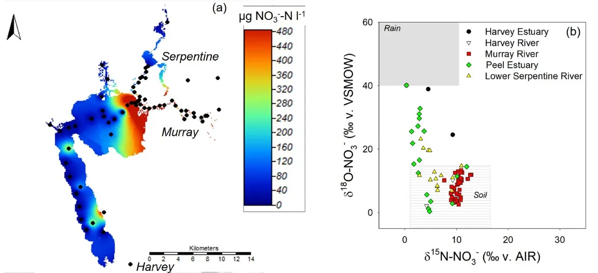

```
:::

### 'When': Both the source and amount of nitrogen reaching the estuary fluctuates seasonally

#### Sources

::: {.body-text width="100%"}
Winter rainfalls produce a distinct 'drainage season' in the Peel-Harvey, which also seems to change the sources of new nutrients moving through the system. Additionally, the importance of key nutrient sources varies depending on location in the estuary. This is clearly illustrated by the differences in groundwater inputs (as reflected by measurements of a qualitative tracer, radon, ^222^Rn, see @wells2018estuaries for more information) measured between seasons in the Murray and Serpentine rivers and lower Harvey Estuary (Fig. \@ref(fig:isotopes-pic15)). First, the persistently higher concentrations in the Murray suggest that groundwater contributes more to the river flow, and thus likely nutrient levels, in that system. This is an important finding given the high nitrogen concentrations we found in much of the shallow groundwater in the region. The seasonal fluctuations then further suggest that low summer water flows maximise groundwater inputs to the Murray River, but almost completely cut off the lower Serpentine and Harvey Estuary from the groundwater. The potentially very high nitrogen concentrations in this groundwater (section 5.4.2.3) means that this seasonal switch could have a major impact on how much nitrogen reaches the estuary. 

```{r isotopes-pic15, echo = FALSE, out.width='100%', class = "text-image", fig.cap = "Concentrations of ^222^Rn, a qualitative indicator of groundwater inputs, detected in the surface water in the tidal portions of the Murray and Serpentine Rivers, as well as the Harvey Estuary, in the dry summer period (February 2017) and the wet winter period (July 2017). Higher values indicate a higher relative contribution of groundwater to the surface water body."}

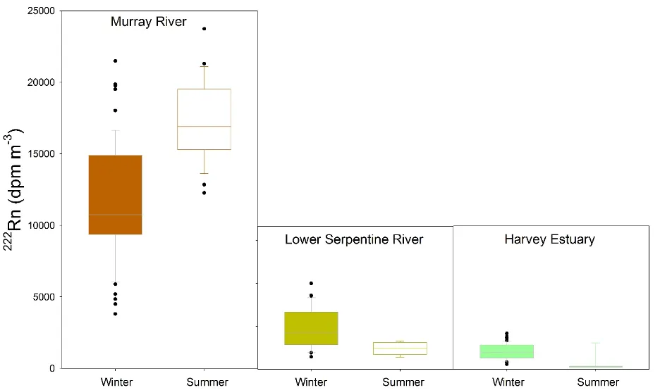

```
:::

#### Processes

::: {.body-text width="100%"}
We also found major seasonal differences the nitrogen isotopes measured in the receiving waters. As demonstrated in section 5.5, the δ^15^N-NO~3~^-^ and δ^15^N-NH~4~^+^ values were generally less variable in the winter than the summer. This most likely reflects the fact that colder temperatures and faster flows in the winter limit the biological processes responsible for nitrogen isotope variations. 
:::

### 'Why': Both natural streams and artificial drains remove significant quantities of nitrogen during transport towards the estuary

::: {.body-text width="100%"}
Catchment models currently predict daily TN exported via major rivers and drains into the estuary (Fig.  \@ref(fig:catchment-model-pic8)), where the flux of N from the catchment to the estuary (*N*~export~) is approximated as a function of downstream discharge (*Q*) and the *TN* concentration measured at the gauging station, i.e., 

$$
N_{export} = Q*N
$$

where *Q* is in ML/d and *N* is in mg N /L. 

Biological nitrogen removal is termed 'attenuation' to specify removal via microbial conversion to inert gasses, e.g., denitrification converting reactive NO~3~^-^ to inert N~2~ gas, see Table \@ref(tab:ntable). Evidence that these critical attenuation processes occur non-linearly over space and time means that assuming a direct relationship between N concentrations, flows and catchment nitrogen losses can dramatically underestimate actual N losses from the system [@bernhardt2017control]. Including terms for N attenuation therefore produces more sensitive catchment nutrient export models, where changes to N inputs in the system are not masked by changes in biological N removal.

We used NO~3~^-^ isotope samples collected regularly over distance in the Punrak Drain, Peel Main Drain, and upper Serpentine River (Fig. \@ref(fig:isotopes-pic4)) to constrain the proportion of N attenuation occurring as N is transported to and through these systems. Two models were used to calculate attenuation, with the final attenuation coefficient being the range between the two generated values. Based on the findings for Objective 1 (section 5.3), the first model defined the NO~3~^-^ 'source fingerprint' as nitrified soil N (calculated using theoretical mixing and fractionation ratios and measured δ^15^N-TN), while the second model defined the NO~3~^-^ 'source fingerprint' as the mean soil δ^15^N-NO~3~^-^ and δ^18^O-NO~3~^-^ measured across the six sampled farms. 

The difference between these 'source fingerprints' and the measured NO~3~^-^ in the receiving waters was then used to calculate N removal (Fig. \@ref(fig:isotopes-pic16)). This was based on the knowledge that any increase in isotope values relative to the sources must have been caused by biological removal [@hogberg1997tansley].

```{r isotopes-pic16, echo = FALSE, out.width='90%', class = "text-image", fig.cap = "(a) Estimated daily discharge and (b) N export through two drains (Punrak and Peel Main) and one stream (Upper Serpentine) that run parallel to each other along the northern end of the Peel-Harvey catchment. Estimates are based on gauged flow in each system and monthly measured TN concentrations at the gauging stations in 2017. Rectangles indicate dates for the summer and winter sampling campaigns for N forms and isotopes."}

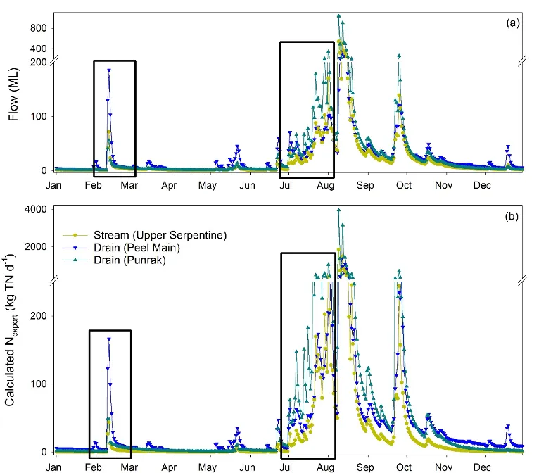

```

```{r isotopes-pic17, echo = FALSE, out.width='100%', class = "text-image", fig.cap = "Plots showing the relative isotopic enrichment of O (y axis) and N (x axis) in NO~3~^-^ measured in the surface water of two drains (Punrak and Peel Main) and the upper Serpentine River feeding the Peel-Harvey Estuary. Rectangles indicate the isotopic range of known N sources to the system, and the 1:1 line indicates the pattern produced during biological N attenuation. Note differences in the scales between summer and winter plots."}

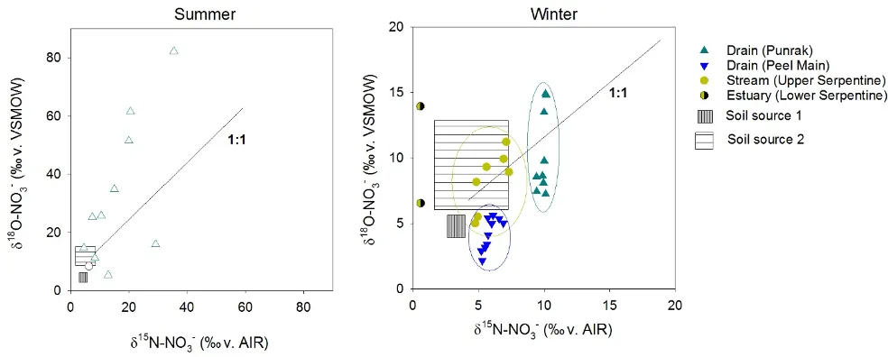

```

Based on this knowledge that biological N removal predictably increases the values of δ^15^N and δ^18^O in the residual NO~3~^-^ pool as the reaction progresses, we calculated net attenuation based on the difference between the δ^15^N and δ^18^O values measured within each system and the calculated 'initial' concentrations for that NO~3~^-^ pool, i.e., 

$$
\begin{align*}
\text{attenuation} &= 1-e^{(\delta-\delta_{0})/\epsilon} \\
atten_{total} &= \int_{0}^{x} \frac{d[\text{attenuation}]}{dx} \
\end{align*}
$$ where δ is the measured δ^15^N-NO~3~^-^ or δ^18^O-NO~3~^-^ value at a given location, δ~0~ is the established 'source' value for that isotope (using either model 1 or model 2), and ε is the known degree of isotopic enrichment caused by N removal. The top equation generates the proportion of the initial N pool attenuated, which is then calculated for each location along the stream and integrated over stream length (*x*) to generate the proportion of the total N load attenuated (*atten*~total~). For more details on this equation and approach, see @wells2019effects and @wells2016spatial.

The generated *atten*~total~ value was then folded into the established catchment *N*~export~ model to better capture *N*~export~ differences driven by biology vs hydrology, i.e., 

$$
N_{total} = N_{export} + atten_{total} N_{export}
$$

Using this approach, we found that N attenuation was consistently lower in the Peel Main Drain than in either Punrak or Serpentine, and that attenuation in all three systems was lower in the winter than the summer (Fig. \@ref(fig:isotopes-pic18)). This latter finding is to be expected given the lower temperatures and faster flows, and provides a 'first-principles' validation of the method. However, the situation in the Peel Main Drain is a bit more puzzling, in that N concentrations are consistently very high, but attenuation very low. This could be due to either the relatively fast flows in that drain, where vegetation etc are frequently removed, meaning that N-removing organisms don't have enough time to take up the available N. 

```{r isotopes-pic18, echo = FALSE, out.width='90%', class = "text-image", fig.cap = "Daily N exported to the Peel-Harvey via the upper Serpentine River (top), Punrak Drain (middle), and Peel Main Drain (bottom), calculated from logged stream flow and modelled TN concentrations (coloured lines and symbols) and accounting for biological attenuation during transport (black areas, which cover the range of calculated values). Grey background indicates winter months (high flow). Question marks on %attenuation are due to lack of measurable NO~3~^-^ in the surface water."}

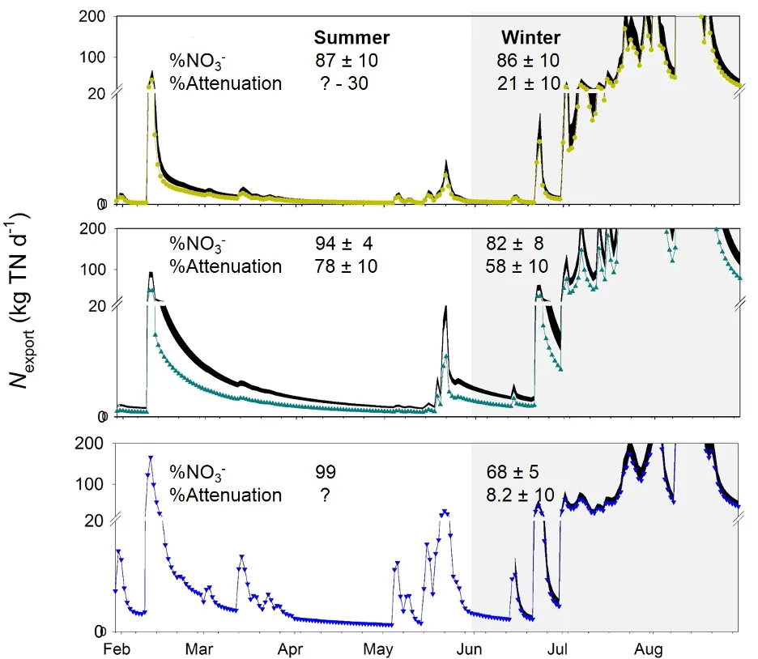

```

This data set also reveals one of the major limitations to quantifying N removal: we can only measure removal when nitrate is present. So, in the summer Peel Main Drain, where nitrate concentrations are consistently too low to measure, we are unable to assess whether these low concentrations are due to high removal rates or low inputs. The fact that 'nil' reactive N concentrations are recorded can thus indicate either a healthy waterway (no excess nutrient inputs) *or* a highly reactive yet polluted waterway (excess nutrient inputs drive rapid nitrogen removal). This poses a significant challenge to water quality monitoring, which requires robust reactive-transport models to resolve (Chapter \@ref(model-water-quality)). 
:::

## Conclusions

::: {.body-text width="100%"}
This study focusing on the Peel-Harvey system has produced three key findings:
:::

> The improved understanding of the source and form of nitrogen moving through the Peel-Harvey system will underpin on-going work to quantify human and climatic effects on water quality.

::: {.body-text width="100%"}
Our findings that two rivers (Murray and Harvey) carried high loads of NO~3~^-^, which is indicative of human impacts exceeding the ecosystem's capacity to absorb nutrients, suggests that remediation activities should target these two systems. At the same time, our work highlights the need to better understand how reactive the very large DON pool is, and whether this reactivity varies between catchment locations. Are human activities increasing its concentration or altering its chemistry? Such changes would have knock-on effects to the nitrogen recycling and removal dynamics we uncovered here.
:::

> There is a need for greater research and management efforts to target the drains and farm dams across the Peel-Harvey system, given the evidence for the potentially high biological productivity and N attenuation occurring in these often-overlooked features

::: {.body-text width="100%"}
Future work should focus on identifying the characteristics of these small waterways that maximise the N attenuation capacity that we have demonstrated they could achieve, to help reduce nutrient inflows into the estuary. For instance, it is clear from our study that Punrak Drain removes more N than Peel Main Drain or the Serpentine River, but the precise features of the drain that drive this are not clear. Further investigation into the relationships between N attenuation and drain features such as morphology, groundwater inputs, flow rates, and vegetations is warranted to help mitigate nutrient pollution of the receiving waters. 
:::

> Accurately assessing nutrient pollution and impacts in a eutrophied system like the Peel-Harvey requires a nuanced approach

::: {.body-text width="100%"}
The detailed assessments of nitrogen turnover in the shallow drains and estuary also highlight a major limitation to our current ability to track this pollutant. Namely, how can we distinguish zones where inorganic nitrogen concentrations are zero due to eutrophication (e.g. overgrowth of macrophytes in the Peel Estuary) vs zones where inorganic nitrogen concentrations are zero due to a lack of pollution? We need to develop multi-proxy systems for determining the extent of nitrogen pollution that are able to identify both zones like the Peel Estuary, which both receives and retains high inorganic nitrogen loads (low concentrations in the water), and the Murray River, which receives and exports high inorganic nitrogen loads (high concentrations in the water). 
:::


## Data availability

::: {.body-text width="100%"}
The data collected during this study are available on request, with details provided in the *Isotope* [data folder](https://github.com/AquaticEcoDynamics/Peel_ARC/tree/master/Data/Isotope) of Peel ARC Linkage Project Github repository [@busch2023].
:::

## Acknowledgements

::: {.body-text width="100%"}
Thanks to Natasha Carlson-Perret, Iain Alexander, Matheus Carvahlo de Carvahlo, and Hanieh Tohidi Farid for assistance processing samples in the Centre for Coastal Biogeochemistry laboratories. Thanks also to Rob Summers, Kieryn Kilminster, and Steve Fisher for facilitating intensive field sampling campaigns, and Fiona Valesini, Alan Cottingham, and Chris Hallett for hosting us at Murdoch University during these campaigns. Roisin McCallum and Sorcha Cronin-O'Reilly assisted with intensive diurnal sampling campaigns. This study would not have been possible without the cooperation of six farmers, who let us access their lands throughout our winter 2017 field campaign. 
:::


<br>
<br>
<br>

::: {.author-info width="100%"}
Cover image: Sampling for nutrients, isotopes and greenhouse gas concentrations in Peel Inlet. Photo credit *N Wells*.
:::
