# (PART)  Estuarine Ecological Health {-} 

# Seagrass and Macroalgal Communities of the Peel-Harvey Estuary from 1978 to 2018 {#macrophytes}

<!-- ::: {.title_matter width="100%"} -->
<!-- [***Balancing estuarine and societal health in a changing environment***]{style="color:#5f543f"} -->
<!-- ::: -->
<!-- <link href="css/zoom.css" rel="stylesheet"> -->
<!-- <script src="js/zoom-vanilla.min.js"></script> -->
<br>

::: {.chapter-authors width="100%"}
**Fiona Valesini, Oliver Krumholz, Chris S. Hallett, Halina Kobryn**
:::

::: {.author-info width="100%"}
Centre for Sustainable Aquatic Ecosystems, Murdoch University, Perth, Western Australia
:::

```{r macrophytes-pic1, echo = FALSE, out.width='100%', data.action = "zoom", class = "title-image"}

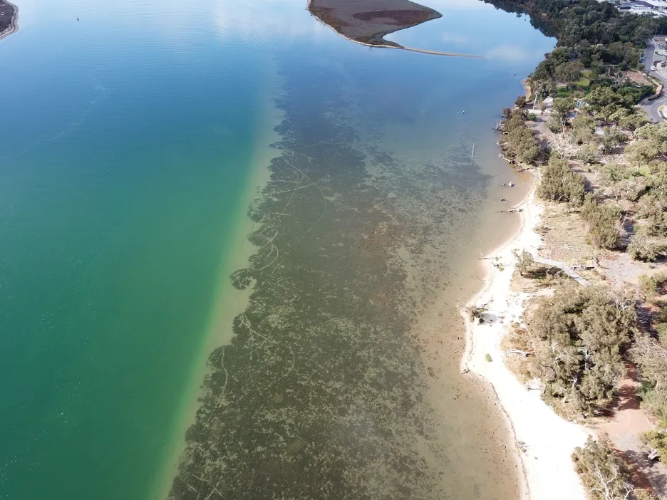

```

<br>
<br>


## Abstract

::: {.body-text width="100%"}
Seagrass and macroalgal communities ('macrophytes') play key roles in the function of estuaries and the societal benefits they provide. Over more recent history, the macrophytes of the Peel-Harvey, and especially the green macroalgae, have been a major focus due to the massive blooms that occurred from the 1960s--1980s and the ecological and societal issues that resulted. Opening of the Dawesville Cut in 1994 to help alleviate these problems led to a major step change in the estuary's hydrology and nutrient levels. There have also been other more gradual shifts in the estuarine environment from catchment development and climate change effects, particularly in recent decades.

This report explores how the macrophyte community in the Peel-Harvey has changed over the last 40 years (1978--2018), and the environmental drivers that have been most influential. While other studies have examined changes in these plant communities in particular periods (e.g. just before and after the Cut), this is the first to examine the full sampling record. We also developed an index of macrophyte community condition or 'health', which was translated into a report card scale from 'A' (excellent) to 'E' (very poor), and used it to track changes over time across the estuary. Lastly, we propose a macrophyte monitoring plan for the future. This report provides a broad summary of our key findings, and is supplemented by a more detailed and technical account in @krumholz2019macrophyte.

Our findings show there have been dramatic changes in the macrophyte community from the late 1970s, which in most regions of the estuary has reflected major declines in green macroalgae and increases in seagrass. These shifts were most obvious just after the Cut and the subsequent boost in tidal flushing. The most recent survey results (2017--2018) show that, for the first time in the monitoring record, the community is clearly dominated by seagrass (70% of overall biomass in autumn 2018) as opposed to green macroalgae (52--86% of overall biomass from 1978--1994). This progression has led to improved health of the macrophyte community, from very poor to fair (index grade E--C) across much of the estuary in 1985--1989, to fair to excellent (grade C--A) in 2018.

One region of the estuary that is not showing signs of improvement is the southern Harvey Estuary. The macrophytes in this shallow and poorly flushed region remain in poor condition and are showing worrying signs with respect to increases in nuisance green macroalgae. While average green algal biomass decreased from the late 1970s to just after the Cut in this region, it has increased in more recent years, especially in spring when it far exceeds values recorded for any other macrophyte group across the whole estuary in the full 40 year timeframe. The shallow south-eastern Peel Inlet also has a high biomass of green macroalgae, again especially in spring, which has largely persisted throughout the monitoring record and even increased in recent years.

The main environmental driver of the above longer-term shifts in the macrophyte community was the concentration of total nitrogen in the water column. Green algal-dominated assemblages were generally linked with higher nitrogen concentrations, and more seagrass-dominated assemblages were linked with lower concentrations. Some weaker correlations were also found with increasing salinities and temperatures, as well as decreasing total phosphorus concentrations.

A more detailed study of the macrophytes across the estuary in spring 2017 and autumn 2018 found 23 species in total (over a third of which were red macroalgae), which has increased from the last comparable survey in 2009 (14 species in spring 2009 vs 18 species in spring 2017). Based on biomass, seagrass clearly dominates the 2017--2018 community (56% on average), most of which is Ruppia sp. and occurs mainly in the northern Harvey Estuary and parts of Peel Inlet. Not only has the seagrass contribution increased since spring 2009 (38% vs 60% in spring 2017), but the dominant seagrass species has changed from Zostera sp. to Ruppia sp. As for the long-term macrophyte data, the changes in the 2017--2018 community from more seagrass-dominated assemblages in the northern half of the system to a more green algal-dominated one in the southern Harvey Estuary, were best linked with an increase in total nitrogen, and to a lesser extent total phosphorus.

To better assess the ongoing health and environmental drivers of this macrophyte community, and if its recent move towards seagrass domination reflects a stable shift, it is imperative that a consistent and regular macrophyte monitoring program is implemented, alongside other environmental monitoring of the estuary. The broad monitoring regime we have proposed can be tailored to suit resourcing.
:::

## Introduction

::: {.body-text width="100%"}
Macroalgal and seagrass communities are one of the most visual elements of the Peel-Harvey biota. These submerged plant communities (collectively referred to as 'macrophytes') play pivotal roles in estuarine ecosystems and are key indicators of environmental condition. Healthy macrophyte communities provide many ecosystem services, including *supporting functions* such as primary production and carbon sequestration, *provisioning functions* such as food and habitat for many fauna, and *regulating functions* such as sediment and shoreline stabilisation. These, in turn, support many *societal values* such as productive fisheries, wildlife watching opportunities and safer coastal environments that better mitigate threats such as bank erosion and flooding. Macrophytes are also good indicators of water quality, reflecting key aspects such as nutrient availability, salinity and turbidity. Seagrass-dominated communities, as opposed to those which are algal-dominated (and particularly by fast-growing green algae), typically reflect healthier estuarine ecosystems [e.g. @macreadie2017seagrasses].

The Peel-Harvey became iconic throughout the 1960s--1980s for its extreme nutrient enrichment and associated macroalgal bloom issues [@mccomb1981eutrophication]. Thick blankets of green algae, dominated by *Willeella brachyclados* (previously *Cladophora montagneana*) and *Chaetomorpha linum*, covered Peel Inlet and some parts of Harvey Estuary, leading to massive accumulations of rotting weed. Seagrass also retracted due to algal smothering [@hodgkin1980peel; @bradby1997peel]. The Dawesville Channel ('Cut') built in 1994 to help mitigate these algal blooms through increased tidal flushing certainly led to major shifts in the hydrology and nutrient levels of the estuary. Hydrodynamic modelling undertaken in other parts of the Linkage Project has shown, for example, that the Cut reduced water retention time in autumn from \~100 to 50 days in Peel Inlet and from \~150--200 to 50--80 days in Harvey Estuary (Chapter \@ref(model-hydrology)). There have also been other, more incremental shifts in estuarine condition since the Cut opened 25 years ago, mainly through ongoing catchment development and climate change [@valesini2019peel]. Under our increasingly drier climate, for example, water retention times have now increased back towards pre-Cut levels in some parts of the estuary Chapter \@ref(model-hydrology).

This study has collated existing long-term monitoring data of macrophyte biomass across the estuary basins, and undertaken new surveys of the macrophyte community, to produce a data set spanning four decades from 1978 to 2018. While there are several gaps in the monitoring record, this data provides a rare opportunity to explore how the seagrass and macroalgal communities of the Peel-Harvey have changed over the last 40 years, covering periods in the height of the macroalgal bloom issues, those just before and after the Cut, then more recent ones. Although some previous studies have examined changes in these plant communities in select years, e.g. before (1985--1991) and after (1994--1999) the Cut [@wilson1999macrophyte], and in 2009 [@pedretti2011snapshot], this is the ***first to examine changes over the full sampling record, as well as statistically explore their environmental drivers.*** We also develop a simple ***index of macrophyte condition ('health')***, and propose a ***monitoring plan*** for the future. 
:::

### Objectives

The specific objectives of this study are as follows:

1.  Characterise the long-term (1978--2018) shifts in the macrophyte community in the Peel-Harvey Estuary, and determine any key water quality drivers.

2.  Characterise, in finer detail, the current (2017--18) macrophyte community throughout the Peel-Harvey Estuary.

3.  Calculate a simple macrophyte condition index and explore its trends throughout the estuary over the last 40 years.

4.  Outline an ongoing monitoring regime for tracking macrophyte health throughout the Peel-Harvey Estuary.

## Approach {#approach-}

### Long-term (1978--2018) trends in macrophyte communities and their drivers

#### Collating the long-term data sets

::: {.body-text width="100%"}
Macrophyte biomass has been sampled in various years from 1978 to 2018 throughout the basins of the Peel-Harvey Estuary. To help with exploring long-term trends in the macrophyte community, sampling years were grouped into *interannual 'periods'*, which typically contained four-six years, except in the more recent times when they contained one or two years. A summary of this long-term sampling regime is provided in Fig. \@ref(fig:macrophytes-pic3) and a map of the sites that were sampled regularly is in shown in Fig. \@ref(fig:macrophytes-pic4). This map also shows the estuarine regions (southern and northern Harvey Estuary; western and eastern Peel Inlet) and water depth category (shallow \<1.5 m; deep \>1.5 m) to which sites were assigned. Aside from 2017--2018, when sampling was undertaken as part of the current research (see section 7.4.2), all surveys were carried out by the Marine and Freshwater Research Laboratory (MAFRL) at Murdoch University [e.g. @wilson1999macrophyte; @pedretti2011snapshot].

```{r macrophytes-pic3, echo = FALSE, out.width='100%', class = "text-image", fig.cap = "Summary of the long-term (1978–2018) and current (2017–2018) macrophyte and water quality (WQ) data sets collected across the Peel-Harvey Estuary. Large time gaps (>2 years) when there was no macrophyte sampling are shaded in grey. NB: *1994 was assigned to a ‘pre-Cut’ period in autumn but a ‘post-Cut’ period in spring given that the Dawesville Cut opened in late April 1994, i.e. after most autumn sampling but before all spring sampling. Although all macrophytes were classified to a fine taxonomic level (genus or species) in 2009, 2017 and 2018, a broad (phyla or division) level was used for these years in the long-term analyses to provide consistency across the full data set. The finer taxonomic levels were, however, used for more detailed analyses of the current data."}

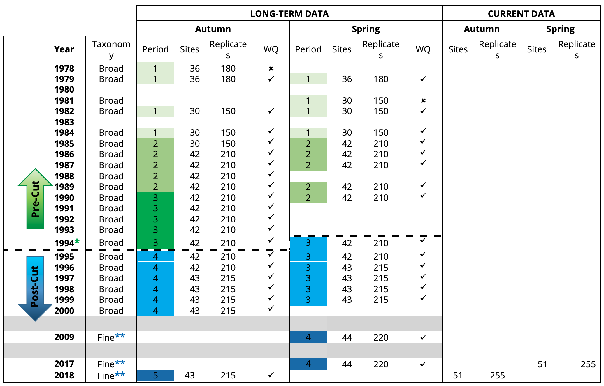
```

<br>

Macrophyte surveys over the last 40 years have varied in the (i) frequency and timing during any one year (one--four times per year), (ii) number of sites sampled (30 to 51 sites) and (iii) resolution to which macrophyte taxa were identified, i.e., fine (species or genus ) vs broad (phylum or division; Fig \@ref(fig:macrophytes-pic3)). To maximise data consistency between years, as well as the number of years that could be included for analysis, the data were harmonised in the following ways.
:::

1.  As *autumn and spring* were the most frequently sampled seasons across years, only data collected at these times of year were used. Long-term trends were examined separately for each of these seasons because of differences in their sampling regimes (Fig. \@ref(fig:macrophytes-pic3)), and because macrophyte growth often changes seasonally in response to environmental changes.

2.  Only data collected from *regularly sampled sites* (i.e. visited in at least five of the sampling years) were included in the data set, i.e., those shown in Fig. \@ref(fig:macrophytes-pic3).

3.  Only *broad groups of macrophyte taxa* (i.e., seagrass; green macroalgae; brown macroalgae; red macroalgae; charophytes) were examined across all sampling years, since this was the extent to which taxonomic classifications were consistently recorded from 1978--2000.

::: {.body-text width="100%"}
In addition to the long-term macrophyte dataset, complementary data on various *water quality parameters* known to influence macrophyte growth (see below) were also collated from the weekly to monthly measurements made at six routine water monitoring sites throughout the estuary since 1977 by the Department of Water and Environmental Regulation (DWER) and other agencies such as MAFRL (see Fig. \@ref(fig:macrophytes-pic4)). Measurements recorded at the water surface and bottom for the following parameters were collated for each of the years and seasons (autumn and spring) in which macrophytes were sampled. Surface measurements were matched with nearby shallow macrophyte sites, and bottom measurements were matched with nearby deeper sites.
:::

-   Salinity

-   Water temperature (°C)

-   Turbidity, and particularly the extent to which light penetrates to the estuary bottom (reflected by Secchi depth scaled to a proportion of total water depth, i.e. 0, clear waters; 1, completely turbid)

-   Total phosphorus concentration (µg/L)    

-   Total nitrogen concentration (µg/L)

::: {.body-text width="100%"}
Additionally, to help with detecting any 'growth response' by the macrophytes to preceding water quality conditions, water measurements recorded over the two months prior to each macrophyte sampling event were also collated, and used to create a 'time lag' data set.

Note that, due to some inconsistencies in the water quality monitoring record when not all of the above parameters were measured when macrophytes were sampled, some years had to be excluded from both data sets, i.e. 1978 in autumn and 1981 in spring (Fig. \@ref(fig:macrophytes-pic3)).

```{r macrophytes-pic4, echo = FALSE, out.width='90%', class = "text-image", fig.cap = "Map of the sites at which macrophytes were regularly sampled in the Peel-Harvey Estuary from 1978–2018, and the stations at which water quality was monitored by the Department of Water and Environmental Regulation. Additional macrophyte sites sampled only in 2017–18 are highlighted, and the estuarine regions and water depths to which each site was assigned are also shown."}

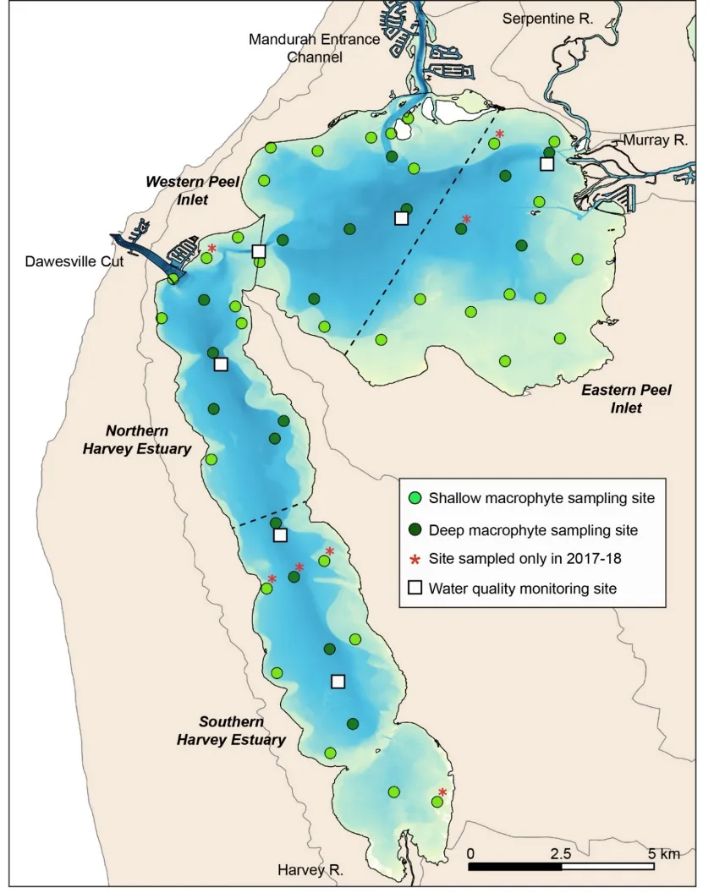
```
:::

#### Field and laboratory methods

::: {.body-text width="100%"}
At each field site on each sampling occasion, five replicate samples of the macrophyte community were taken by pushing a 9 cm diameter Perspex^®^ core at least 10--15 cm deep into the sediment, then sealing it with rubber bungs to capture above and below-ground macrophyte biomass (Fig. \@ref(fig:macrophytes-pic5)).

```{r macrophytes-pic5, echo = FALSE, out.width='50%', class = "text-image", fig.cap = "Example of a sediment core used to sample macrophyte biomass across the estuary (Photo, O. Krumholz)."}

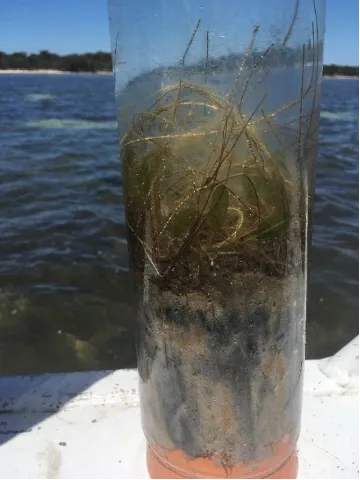
```

In the laboratory, all macrophytes in each replicate core were sorted into individual taxa, oven dried at 70°C, then the dry weights (g) of each taxon recorded. The resulting data from the five replicate cores were used to calculate the mean biomass of each taxa (weight per unit area; g/m^2^) at each site on each sampling occasion. Further details on field and lab methods can be found in @wilson1999macrophyte, @pedretti2011snapshot and @krumholz2019macrophyte.
:::

#### Data analyses

##### Long-term macrophyte trends and links with water quality:

::: {.body-text width="100%"}
Analysis of the 1978--2018 biomass data in each season focused on determining any changes in the macrophyte community between interannual periods, and the water quality drivers that were best correlated with any macrophyte shifts (both before and after a two-month time lag was applied to the water quality data; see section 7.4.1.1). Necessarily, these analyses also included other key elements of the sampling design, namely the estuarine region and water depth (shallow, deep) from which samples were collected, to account for any confounding effects. However, only those significant findings involving period differences were explored further.

Most data analyses were undertaken in the Primer v7 multivariate statistics software [@clarke2015getting] with the PERMANOVA+ add-on module [@gorley2008permanova+]. Spatial interpolations of macrophyte biomass data throughout the estuary were undertaken in ESRI ArcMap v10. Details of all data pretreatments, statistical routines employed, test designs and routine settings are given in @krumholz2019macrophyte. Guides for interpreting the main outcomes of these analyses are provided in the 'Main Findings' section.
:::

##### Macrophyte condition index:

::: {.body-text width="100%"}
A simple index of the condition or 'health' of the macrophyte community, and thus the estuary, was calculated from the autumn data for all periods from 1978--2018. The premise of the index was that communities dominated by seagrass rather than green macroalgae reflect more desirable or 'healthier' estuarine conditions, with both the ratio and total biomass accounted for the assessment of macrophyte health. Broadly, the index was calculated by (i) determining the proportion of seagrass to green algal biomass in each field sample; (ii) weighting that proportion by the total biomass of seagrass and green algae (after it was standardised by the maximum value in the sampling record) and; (iii) placing all values on a common 0--1 scale then assigning them to five condition categories (1, 'excellent' to 0, 'very poor'). Index categories were spatially interpolated throughout the estuary for each period using ESRI ArcMap v10. A full account of the methods for calculating and displaying the index are given in @krumholz2019macrophyte. *It is important to note that the 0--1 index scale, and hence the condition categories, are relative to macrophyte trends observed only in the Peel-Harvey from 1978--2018.*
:::

### Current trends in macroalgae and seagrass biomass (2017--18)

::: {.body-text width="100%"}
The current macrophyte community was sampled in both spring 2017 and autumn 2018 at all 51 sites shown in Fig. \@ref(fig:macrophytes-pic4). Several new sites were added to this sampling regime to improve coverage in certain sections of the estuary (see sites marked on Fig. 1). The field and lab methods were the same as those described in section 7.4.1.2, except that each macrophyte taxa was identified to species rather than broad phyla or division level as in previous surveys (Table 1).

In contrast to the long-term macrophyte data set, the data analysis approach for the current data set focused equally on exploring the nature and extent of any differences in species biomass composition among estuarine *regions, water depths* and *seasons*. The same software as described in section 7.4.1.3 were used for these analyses. Full details of these analyses are given in @krumholz2019macrophyte.
:::

## Results & findings

### Long-term (1978--2018) trends in macrophyte communities and their drivers

> *Green macroalgae has decreased and seagrass has increased from 1978--2018, except in the southern Harvey Estuary where green macroalgae has increased*

::: {.body-text width="100%"}
Significant changes have occurred in the macrophyte community over the last 40 years (Fig. \@ref(fig:macrophytes-pic6); Supplementary Materials S7.1). The extent of these interannual period changes has been substantial, especially in autumn when they were more influential than any macrophyte changes due to differences in estuary regions or water depth.

In general, there has been a clear decline in green macroalgal biomass over time, especially after the Dawesville Cut. Whereas green algae represented \~84% of the overall biomass in the late 1970s to mid-1980s (period 1), it was \<20% in the most recent period in autumn (period 5, 2018) and 43% in spring (period 4, 2009 and 2017). However, seagrass has increased dramatically post-Cut and more so in recent years, dominating overall biomass in autumn (\~70% in period 5) and representing about half the biomass in spring (46% in period 4; Fig. \@ref(fig:macrophytes-pic6)).

```{r macrophytes-pic6, echo = FALSE, out.width='100%', class = "text-image", fig.cap = "Average contribution of each broad macrophyte group to the overall biomass in each period from 1978–2018 in autumn (top) and spring (bottom)."}

knitr::include_graphics("images/macrophytes/picture6.webp")
```

Inter-period shifts in the macrophyte community are shown in more detail for each region of the estuary in the 'shadeplots' in Fig. 4 (simply the darker the shading, the greater the biomass). Green algal and seagrass biomass are also interpolated across the whole estuary (based on site measurements) in Figs 5 and 6. In general, these plots show that reductions in green macroalgae over time have been most marked in Peel Inlet (in both the western and eastern sides in autumn and the western side in spring), while seagrass has increased most obviously in the northern Harvey, followed by Peel Inlet (Figs 4--6).

The large shift in the macrophyte community following the Cut, especially in the northern Harvey and western Peel regions located closest to this channel, are also reflected in Fig. 7. Simply, years lying close together on these plots have more similar communities while those further apart have greater differences, and it was clear that there was a notable jump between pre- and post-Cut periods. While there was also a shift in the eastern Peel Inlet over time (mainly in autumn), it was a more gradual progression (Fig. 7).

The macrophytes of the southern Harvey Estuary, however, have shown different long-term responses to other regions of the estuary. Although green algal biomass decreased from the late 1970s to just prior to the Cut in the early 1990s, it has again increased substantially in recent years (Figs 4--6). This was particularly so in spring, where green macroalgal biomass in period 4 (2009, 2017) was higher than that for any macrophyte group across the whole estuary in the full 40 year sampling timeframe. Additionally, seagrass in the southern Harvey virtually disappeared after the mid-1980s (period 1), which may in part reflect further smothering by the extreme blue-green algae blooms in the Harvey Estuary from the late 1970s--1980s @mccomb1992loss, combined with the particularly long water residence times in that poorly flushed part of the estuary [pre-Cut: \~150--200 days in autumn and \~50--75 days in spring, compared to \~100 and \~50 days, respectively, in Peel Inlet, @huang2019changing], which leads to other negative effects such as greater nutrient retention. While there has been a small (autumn) to moderate (spring) recovery of seagrass in the most recent period, it has not increased to the same extent as in other regions (Figs 4--6). It is noteworthy that, while water retention in the southern Harvey fell just after the Cut (\~75 days in autumn and 25 days in spring), it is now returning back towards pre-Cut levels (Chapter \@ref(model-hydrology)). The lack of clear directional changes in the macrophyte community of the southern Harvey from 1978--2018 is also reflected by the lack of separation of different periods on the plots in Fig. 7.

```{r macrophytes-pic7, echo = FALSE, out.width='100%', class = "text-image", fig.cap = "Shadeplots of average biomass of each macrophyte group in each period (from 1978–2018) and estuarine region in autumn (top) and spring (bottom). Biomass is shown on a grey scale from highest biomass (black) to absent (white). *Average biomass values, which have been derived from the data recorded at each site, are presented on a pretreated (square-root transformed, dry weight g m-2) not raw scale."}

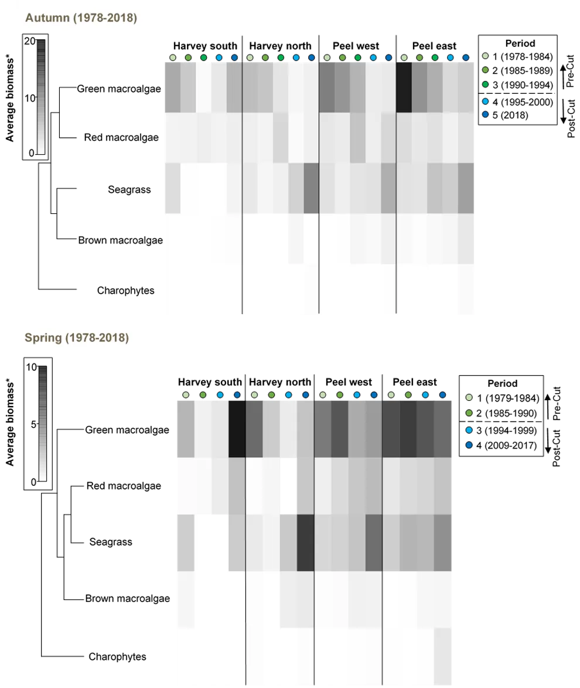
```

```{r macrophytes-pic8, echo = FALSE, out.width='100%', class = "text-image", fig.cap = "Average autumn biomass of green macroalgae (top) and seagrass (bottom) interpolated throughout the Peel-Harvey Estuary in each period from 1978–2018. Interpolated values were derived from the average biomass at each site in each period."}

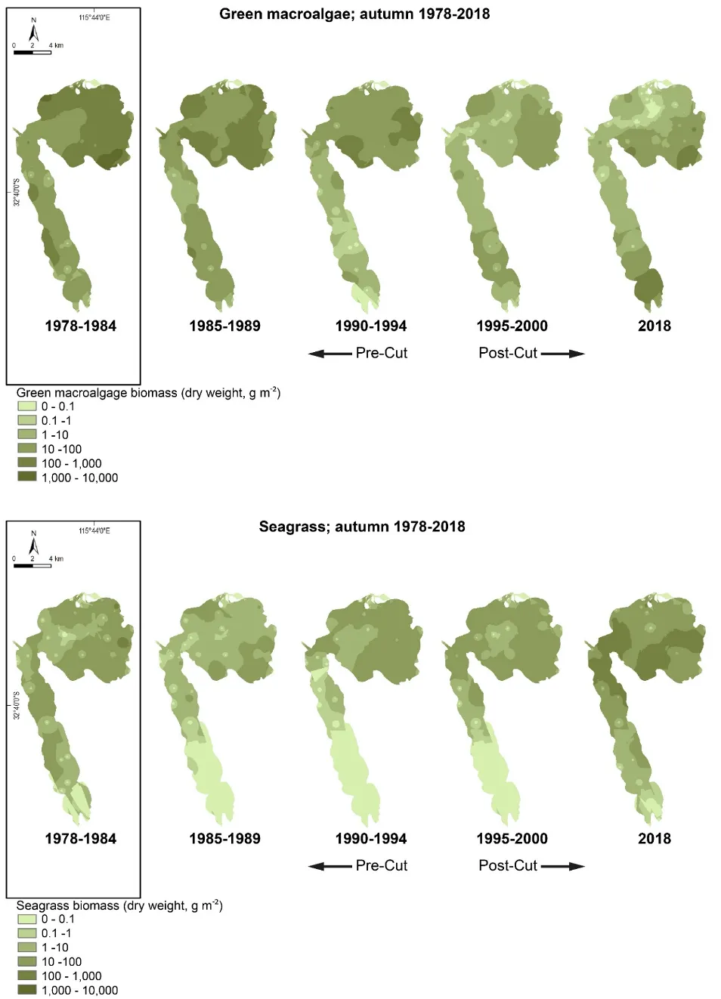
```

```{r macrophytes-pic9, echo = FALSE, out.width='100%', class = "text-image", fig.cap = "Average spring biomass of green macroalgae (top) and seagrass (bottom) interpolated throughout the Peel-Harvey Estuary in each period from 1978–2018. Interpolated values were derived from the average biomass at each site in each period."}

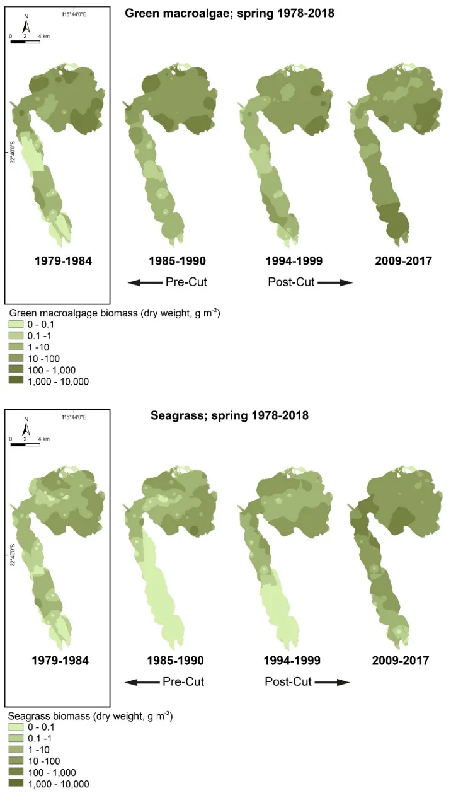
```

```{r macrophytes-pic10, echo = FALSE, out.width='100%', class = "text-image", fig.cap = "Plots showing the relative similarity of macrophyte communities in each year (black labels) from 1978–2018 (years closer together have more similar macrophyte compositions) and each region during autumn (top) and spring (bottom). Consecutive years in each period are joined by colour-coded lines. Plots have been constructed using MDS ordination."}

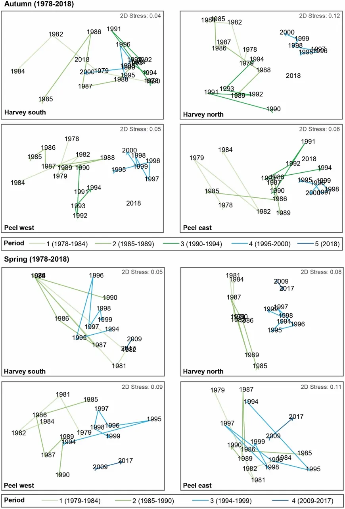
```

Another (but lesser) exception to the general long-term trends across most of the estuary was the eastern Peel Inlet, especially in spring, where green algal biomass is still comparatively high (Figs 4, 6). Growths are particularly abundant in the shallow south-eastern corner, which has long been a 'problem area' for nuisance macroalgae, and appear to have increased from post-Cut periods to the most recent period in both seasons (Figs 5, 6). Given this area is very shallow and close to the mouth of the Murray River, the recurrence of high green algal biomass is not surprising following seasonal increases in temperature (and shallow waters that are quick to warm) and, especially in spring, a new flush of nutrients from preceding winter river flows. Across the broader eastern Peel region, there has been a slight decline in spring algal biomass since the mid-1980s (Fig. 4), which could reflect both markedly lower river flows [\~50% drop in flow from the Murray sub-catchment since the 1970s, @valesini2019peel] and greater tidal flushing.
:::

> *Longer-term shifts in the macrophyte community show strong links with reductions in total nitrogen concentrations*

::: {.body-text width="100%"}
The distinct changes in the autumn macrophyte communities of the northern Harvey Estuary and western Peel Inlet from 1978--2018, especially after the Cut, were strongly linked with reductions in total nitrogen concentrations (TN) in the water column. For each of these regions located closest to the Cut, this was the case both when TN recorded close to the time of macrophyte sampling was correlated with the macrophyte data (BEST, *P* = 0.01, Spearman rank correlation [ρ] = 0.697 for Harvey north and 0.52 for western Peel), and after a two-month lag was applied to the water quality data to allow for a macrophyte growth response (BEST, *P* = 0.01, ρ = 0.668 for Harvey north and 0.44 for western Peel).

This clear relationship can be seen in Fig. 8, which shows annual trends in the macrophyte community (black year labels) with the corresponding TN concentrations overlaid as circles of proportionate sizes. Note that, since trends in the 'non-lag' and 'lag' TN data were similar, only the former are shown. In both regions, the large macrophyte shifts in the post-Cut periods (4--5), which were due to declines in green algae and increases in seagrass (Fig. 4), were clearly linked with a large drop in TN from pre-Cut periods.

Correlations between longer-term trends in the spring macrophyte communities and corresponding water quality parameters were also significant, but not as strong. In both the western and eastern Peel Inlet, moderate correlations were found when a combination of lag salinity, temperature and, for the western Peel, also total phosphorus concentration, was used (BEST, *P* = 0.001, ρ = 0.439--0.489). In general, the longer term changes in the macrophyte community (as shown in Fig. 7), were linked with increasing salinities and temperatures and decreasing total phosphorus (TP) concentrations (overlaid plot not shown). Average salinity across the Peel Inlet and Harvey Estuary has increased from \~26 in the pre-Cut periods, to \~32 from 1994-mid-2000s, and again slightly over the last decade (\~33), reflecting additional influences of climate change such as reduced river flow (see earlier) and rising sea level (2.6 mm yr^−1^ from 1970). TP concentrations, like TN, fell rapidly following the Cut (annual TP averages of \~150 µg L^−1^ pre-Cut and \~50 µg L^−1^ post-Cut) and have continued to fall over recent decades [@valesini2019peel].

```{r macrophytes-pic11, echo = FALSE, out.width='100%', class = "text-image", fig.cap = "Plots showing the relative similarity of macrophyte communities in each year from 1978–2018 (black labels; years closer together have more similar communities), with TN concentration overlaid as circles of proportionate sizes. Separate plots are shown for the northern Harvey and western Peel regions. Plots constructed using MDS ordination of macrophyte biomass composition data."}

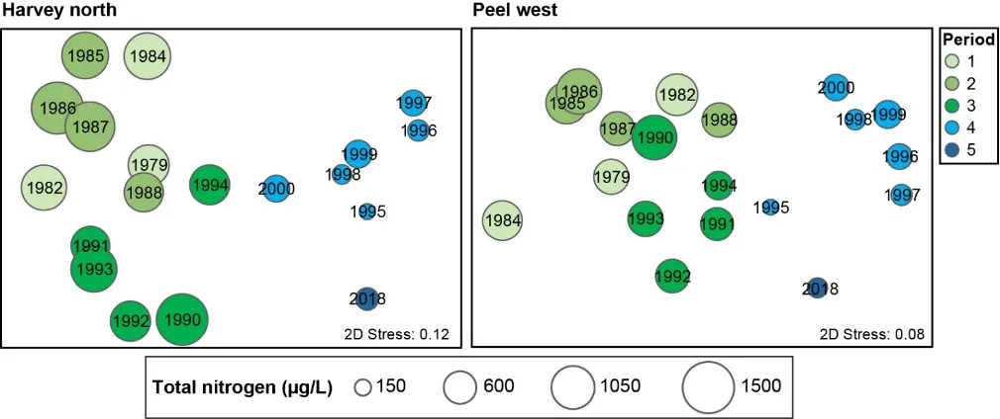
```
:::

> *The 'health' of the macrophyte community has improved in most regions of the estuary, but remains poor in the southern Harvey Estuary*

::: {.body-text width="100%"}
The current condition of the macrophyte community, as reflected by the scaled contributions of seagrass as opposed to green macroalgae, is the best that has been observed over the last 40 years in most areas of Peel Inlet and the northern Harvey Estuary, rating good to excellent (A--B) on the relative 'health' index scale. However, the communities in the southern Harvey remain in fair to poor condition (C--D; Fig. 9).

Trends in the condition index from 1978--2018 show that, in general, the macrophyte community was at its least healthy in the mid to late 1980s, when it was fair to very poor across most of the estuary (Fig. 9). This mainly reflected a pronounced loss of seagrass across the system compared to 1978--1984, combined with green macroalgal biomass remaining relatively high (Fig. 5). Whereas the condition of the Peel Inlet macrophytes then gradually improved from 1990 to 2018, the condition of the Harvey Estuary (especially the southern region) continued to fall, reaching very poor status in 1995--2000, i.e. virtually no seagrass, but moderate levels of green macroalgae which had increased from just before the Cut (1990--1994; Figs 5 and 9). While green macroalgal biomass has continued to increase in the southern Harvey in recent years (2018; Figs 5 and 9), there has also been a small recovery of seagrass, leading to an improvement in the overall health score for this part of the estuary. The northern Harvey Estuary on the other hand has shown a striking improvement in macrophyte condition post-Cut, reaching 'excellent' status in 2018 and reflecting strong seagrass colonisation and a concurrent reduction in green algae (Figs 5 and 9).

```{r macrophytes-pic12, echo = FALSE, out.width='100%', class = "text-image", fig.cap = "Macrophyte condition index categories interpolated throughout the Peel-Harvey Estuary in each period from 1978–2018. Index values have been calculated from data recorded in autumn in each sampling year. * *It is important to note that the 0–1 index scale, and hence the condition categories, are relative to macrophyte trends observed only in the Peel-Harvey from 1978–2018.*"}

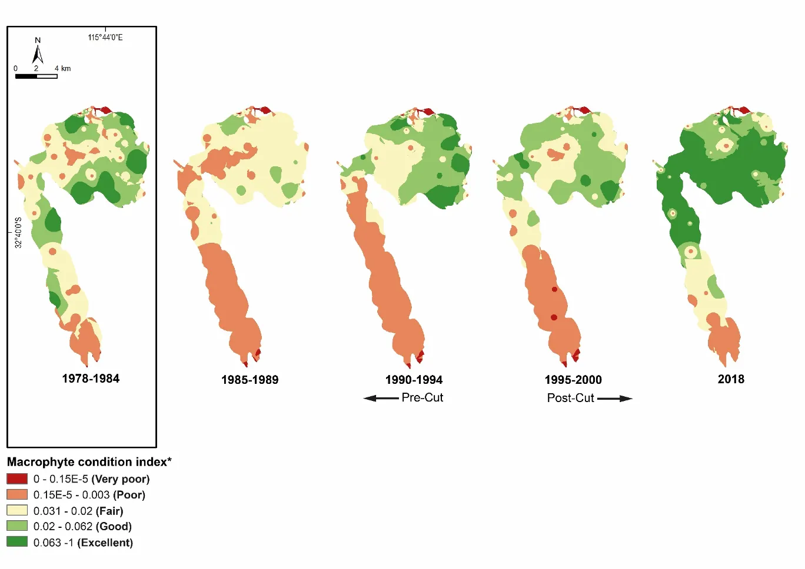
```
:::

### Current trends in macroalgae and seagrass species composition (2017--18)

> *The macrophyte community is dominated by seagrass, except in the southern Harvey Estuary*

::: {.body-text width="100%"}
Twenty three macrophyte species were found across the Peel-Harvey in the most recent sampling during spring 2017 and autumn 2018 (Supplementary Materials S7.2; Fig 10). Most of these species were red macroalgae (nine species), followed by green and brown algal species (six and four species, respectively), while three seagrass species and only one charophyte species were recorded (Supplementary Materials S7.2; Fig 10). The species richness of the macrophyte community has increased when compared to the only other previous study in the estuary in which all taxa were identified to species [i.e. @pedretti2011snapshot]. Whereas 14 macrophyte species were found in spring 2009 [@pedretti2011snapshot], 18 were recorded in spring 2017 (Supplementary Materials S7.2).

Based on total biomass at all sampling sites in both seasons, however, the current macrophyte community is clearly dominated by seagrass (56%), most of which is *Ruppia* sp. (44%) with smaller contributions by *Halophila* sp. and *Zostera* sp. (\~11%; Supplementary Materials S7.2; Fig 10). Green macroalgae represent just over a third of the current biomass, with *Willeella* sp. (19%) and *Chaetomorpha* sp. (13%) being the most abundant in this macrophyte group. Despite being the most speciose group, red macroalgae made up only 5.5% of the overall biomass, and was represented mainly by *Chondria* sp. and *Spyridia* sp. Brown macroalgae and Charophytes contributed only a small proportion to the overall biomass, with the former comprised mainly of *Hormophysa* sp. and the latter entirely of *Lamprothamnium* sp. (Supplementary Materials S 2; Fig 10).

The dominance of seagrass in the current macrophyte community has developed only in the last decade. The survey by @pedretti2011snapshot in spring 2009 showed that only 38% of the overall biomass was seagrass (as opposed to 60% in spring 2017 at the same sites), while 50% was green macroalgae (27% in spring 2017). Additionally, the dominant type of seagrass has changed. While *Zostera* sp. made up nearly half of the seagrass biomass in 2009 [and was found mainly in the northern Harvey and western Peel near the Cut, @pedretti2011snapshot], *Ruppia* sp. is now clearly not only the dominant seagrass, but also the most dominant taxa in the whole macrophyte community. *Zostera* sp. represented only 8% of seagrass in spring 2017, with its total biomass value being about a third of that found in 2009.

When trends in the macrophyte community composition were tested statistically, significant differences were found between regions of the estuary and water depth, but not between seasons (Supplementary Materials S7.3). The seagrass *Ruppia* sp. was the dominant species in the shallows of all regions except the southern Harvey, where it was matched in terms of biomass by the nuisance green macroalgae species *Willeella* sp. and *Chaetomorpha* sp. (Figs 11--12 and photos opposite). The latter green algal species was also common in the shallows of eastern Peel Inlet. In the deeper waters, however, each of these three species were either absent or less prevalent. The seagrass *Halophila* sp. was instead relatively abundant in all regions except the southern Harvey, and *Zostera* sp. was also abundant in the western Peel. The red algae *Chondria* sp. made a moderate contribution to the macrophyte biomass in the deeper parts of Peel Inlet, while *Chaetomorpha* sp. dominated the deeper southern Harvey.


```{r macrophytes-pic14, echo = FALSE, out.width='100%', class = "text-image", fig.cap = "Percentage contributions of each broad macrophyte group to the total macrophyte biomass (across all sampling sites in spring 2017 and autumn 2018) and the contribution of each species comprising each group."}

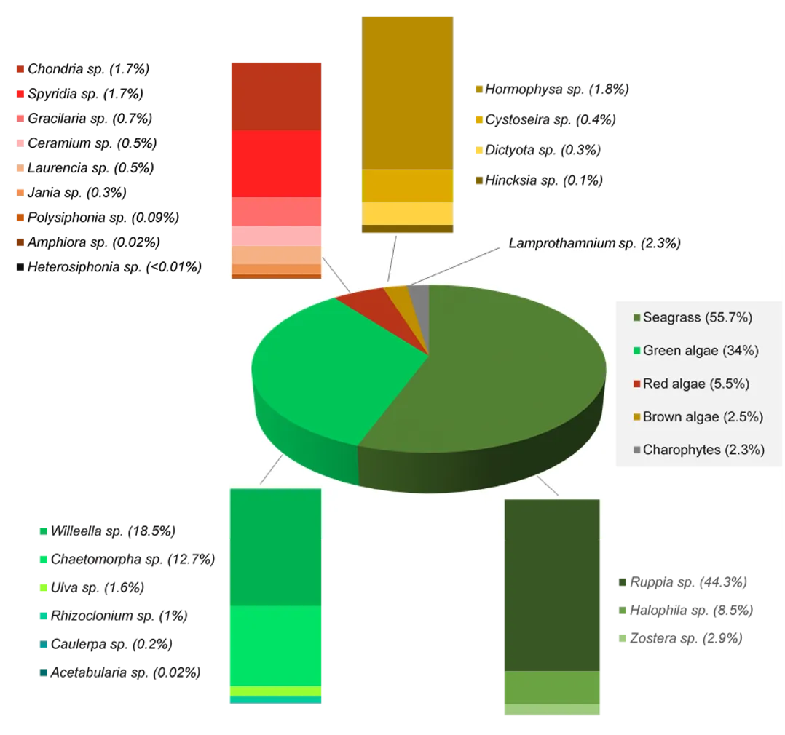
```

```{r macrophytes-pic15, echo = FALSE, out.width='100%', class = "text-image", fig.cap = "Shadeplots of average biomass of each macrophyte taxa in each region and water depth in 2017–2018. Biomass is shown on a grey scale from highest biomass (black) to absent (white). Average biomass values, which have been derived from the data recorded at each site, are presented on a pretreated (square-root transformed, dry weight g m-2) not raw scale."}

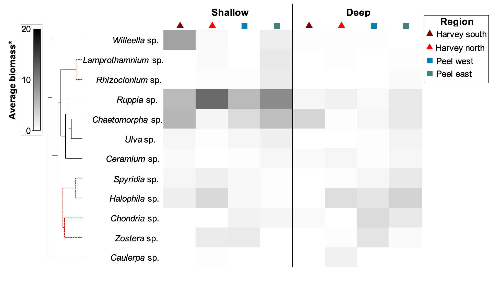
```

```{r macrophytes-pic16, echo = FALSE, out.width='100%', class = "text-image", fig.cap = "Average biomass of abundant macrophytes recorded in spring 2017 and autumn 2018 (seagrasses Halophila sp. and Ruppia sp. and green macroalgae *Chaetomorpha* sp.), interpolated throughout the Peel-Harvey Estuary. Interpolated values were derived from the average biomass at each site in each season."}

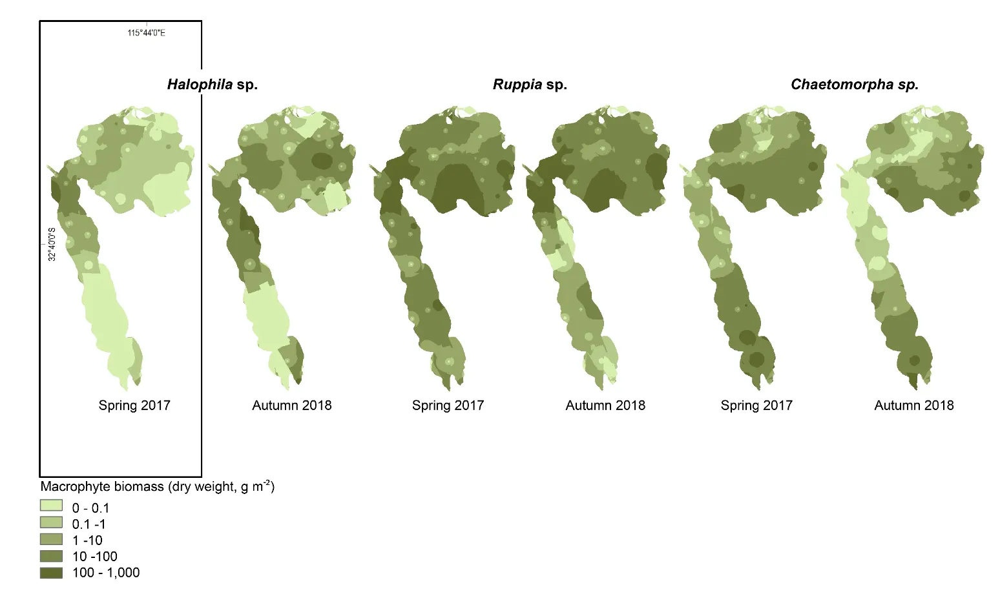
```
:::

> *Spatial trends in the current macrophyte community are best correlated with total nitrogen and total phosphorus concentrations*

::: {.body-text width="100%"}
The current macrophyte community shows a gradual progression in composition from the more marine-dominated northern Harvey Estuary and western Peel regions, where seagrasses *Ruppia* sp. and *Halophila* sp. dominate the shallows and deeper waters respectively (Fig. 11), to the eastern Peel Inlet and then southern Harvey Estuary, where green macroalgal species *Willeella* sp. and/or *Chaetomorpha* sp. are most abundant. Figure 13a summarises these trends, capturing the above compositional shifts (from left to right) in macrophyte samples averaged for each region and water depth. The distinction between the shallow and deeper macrophyte communities can also be seen (top vs bottom of the plot, respectively).

These spatial changes in the macrophyte community were moderately well correlated with total nitrogen concentration (TN) in the water column (after a two-month lag was applied to the water quality data; BEST, *P* = 0.04, Spearman rank correlation = 0.351). This is also shown in Fig. 13, with the TN values overlaid on the macrophyte samples. Clearly, the progression from a seagrass to algal dominated community was linked with increases in total nitrogen. The higher nitrogen values in the surface than deeper waters, especially in both Peel regions in spring 2017, most likely reflect nutrient flushes into the estuary from the preceding winter river flow.

Similar relationships were found between the macrophytes and total phosphorus (TP) concentration when the data sets were correlated at a finer spatial (site **×** depth) resolution (Fig. 13). Although the correlation was quite weak (BEST, *P* = 0.05, Spearman rank correlation = 0.19), it was clear that the green-algal dominated macrophyte samples from the southern Harvey were linked with notably higher TP concentrations (Fig. 13).

```{r macrophytes-pic17, echo = FALSE, out.width='100%', class = "text-image", fig.cap = "Plots showing the relative similarity of macrophyte communities during 2017–18 in (a) each region (colour coded) and water depth (white labels; s=shallows; d=deeper) and (b) each site and water depth. Samples closer together have more similar communities. The values of (a) total nitrogen concentration (with a two-month time lag) and (b) total phosphorus concentration, have been overlaid as circles of proportionate sizes. Plots constructed using MDS ordination of macrophyte biomass composition data."}

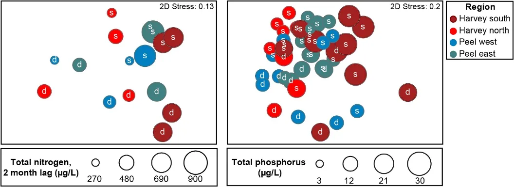
```
:::

## Conclusions

> *The macrophyte community has changed over time, and mostly for the better*

-   The macrophyte community of the Peel-Harvey Estuary has changed significantly from 1978--2018 from one dominated by green macroalgae (late 1970s to at least the early 2000s) to one dominated by seagrass (possibly in the last decade, but more likely only in the last five years).

-   Based on the index of macrophyte condition (and by extension, estuarine ecosystem health), the above changes correspond with a change from fair--very poor (index grade C--E) throughout much of the estuary in 1985--1989, to fair to excellent (index grade C--A) in 2018.

-   The macrophyte community in the southern Harvey, however, continues to be dominated by green algae ('poor' condition in 2018) and is showing worrying trends. While some seagrass is now growing in this region after its complete loss from the mid-1980s to early 2000s, green algae still dominates and has increased in biomass since the last (2009) survey. This is particularly true of the nuisance species *Willeella* *brachyclados*, which is only abundant in this region. High green macroalgal biomass also still persists in the shallow south-eastern corner of Peel Inlet.

> *Nutrient concentrations are the main drivers of observed long-term and current changes in the macrophyte community*

-   The main environmental drivers of both the long-term (1978--2018) and current (2017--2018) trends in the macrophyte community are either total nitrogen or total phosphorus concentration in the water column. Broadly, shifts from green macroalgal to seagrass-dominated communities were linked with clear reductions in nutrient availability. Despite the marked changes in various other examined water quality variables following the Cut, as well as further incremental shifts with climate change (i.e., increasing salinities, temperatures and water clarity, @huang2019changing; @huang2019integrated; @valesini2019peel), the strongest and most convincing correlations were still found with changes in the above nutrient concentrations.

> *Continuing and standardising the macrophyte monitoring regime is fundamental for assessing ongoing macrophyte health and better understanding key drivers*

-   The 1978--2018 macrophyte biomass record for the Peel-Harvey Estuary is a rare biotic data set that has enabled exploration of long-term changes in the macrophyte community. Yet, it has several limitations that preclude a more thorough understanding of macrophyte trends, including inconsistencies in the level of taxonomic identification (and hence only broad groups for most of the data) and the number of sampling sites and seasons. There are also large gaps between some consecutive surveys, including between the current 2017--2018 survey and the previous one in 2009. Additionally, biomass only captures one perspective of the plant community, whereas others such as spatial cover are also important.

-   To better assess the ongoing health and environmental drivers of this macrophyte community, and determine if its recent move towards seagrass domination reflects a stable shift, it is *imperative that a consistent and regular macrophyte monitoring program is continued into the future*.

-   A broad program for future monitoring of the Peel-Harvey seagrass and macroalgal communities is proposed in Table 2. *This program is purposely broad, outlining the main macrophyte components to be monitored and suggested methods*. Finer details for implementing this program will need to be determined, following clarity in level of interest in uptake and resourcing.

## Data availability and supplementary materials

::: {.body-text width="100%"}
The data collected during this study and in relevant historical studies are available on request, with details provided in the Seagrass and Macroalgae [data folder](https://github.com/AquaticEcoDynamics/Peel_ARC/tree/master/Data/Seagrass%20and%20Macroalgae) of Peel ARC Linkage Project Github repository [@busch2023].

The following supplementary materials are also available in the [Supplementary Material][Supplementary Materials] chapter:

 - S7.1. Three-way crossed PERMANOVA (Permutational MANOVA and ANOVA) of the biomass composition of the macrophyte community recorded in each interannual period from 1978–2018 in each region and water depth of the Peel-Harvey Estuary.
 - S7.2. Biomass (g/m^2^, dry weight) of each macrophyte species found across the Peel-Harvey Estuary in spring 2017 and autumn 2018.
 - S7.3. Three-way crossed PERMANOVA (Permutational MANOVA and ANOVA) of the biomass composition of the macrophyte community in each region and water depth of the Peel-Harvey Estuary in spring 2017 and autumn 2018
:::

## Acknowledgements

::: {.body-text width="100%"}
We are particularly grateful to the Marine and Freshwater Laboratories at Murdoch University for generously sharing the historical macrophyte data they had collected across the Peel-Harvey Estuary from 1978--2009. We also thank the Department of Water and Environmental Regulation for providing water quality data recorded at their monitoring stations throughout the estuary. We are also indebted to Steve Goynich, Ian Dapson, Alan Cottingham and Sorcha Cronin-O'Reilly who bravely helped with the collection of the macrophyte cores for the 2017--18 survey.
:::

<br>
<br>
<br>

::: {.author-info width="100%"}
Cover image: An aerial photograph showing macrophyte coverage in shallow areas of the Peel-Harvey Estuary, Western Australia.
:::
