# The Changing Hydrology of the Peel-Harvey Estuary: Past, Present and Future {#model-hydrology}

::: {.chapter-authors width="100%"}
**Peisheng Huang^1,2^, Karl Hennig^3^, Brendan Busch^1^, Matthew R. Hipsey^1,2^**
:::

::: {.author-info width="100%"}
^1^ Aquatic Ecodynamics, UWA School of Agriculture and Environment, The University of Western Australia, Crawley WA 6009, Australia. 
<br>
^2^ UWA Oceans Institute, The University of Western Australia, Crawley WA 6009, Australia. 
<br> 
^3^ Department of Water and Environmental Regulation, Perth WA 6842, Australia.
:::

```{r model-hydrology-pic1, echo = FALSE, out.width='100%', class = "title-image"}
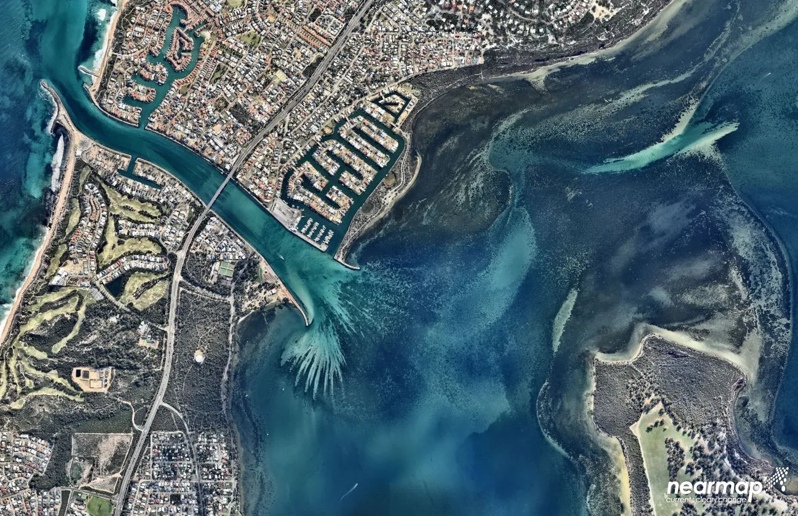
```


## Abstract

::: {.body-text width="100%"}
Shallow microtidal lagoons like the Peel-Harvey Estuary system are particularly sensitive to hydrologic change due to restricted exchange with the ocean. The drying climate trend in the south-west Australian region has been widely reported, though the interaction of the trend in river flow and changes to estuarine hydrodynamics brought about by the Dawesville Cut on estuarine conditions has been complex, and it is necessary to establish implications of these changes for future management of the estuary. This study developed a 3D finite-volume hydrodynamic model to assess changes in estuary hydrodynamics, considering how attributes such as water retention time, salinity and stratification have responded to the drying climate trend the artificial channel over the period from 1970 to 2016, and how they will evolve under current climate projections. Our results show that both have significantly changed the hydrology by comparable magnitudes, and also highlight the complexity of their interacting impacts. Firstly, the artificial channel successfully improved estuary flushing by reducing average water ages by 20--110 days, whilst in contrast the reduced inflow from the catchment (more than 50% since 1970) has had the gradual opposite effect on the water ages, and during the wet season this has almost counteracted the reduction brought about by the channel. Secondly, the drying climate has caused an increase in the salinity by 10--30 psu; whilst the artificial channel increased the salinity during the wet season, it has reduced the likelihood of hypersalinity (\>40 psu) during the dry season in the western areas. The impacts also varied spatially. The southern estuary, which has limited connection with ocean through the natural channel, is shown to be the most sensitive to climate change and the opening of the artificial channel. The projected future drying climate is shown to slightly increase the retention time and salinity in the lagoon, and increase the hypersalinity risk in the rivers. The significance of these changes for nutrient retention and estuary ecology are discussed, highlighting the importance of these factors when setting up monitoring programs, environmental flow strategies and nutrient load reduction targets.
:::

## Introduction

::: {.body-text width="100%"}
Hydrologic features such as water circulation, retention and the pattern of saline water intrusion are critical in shaping estuarine ecosystems and health. The interactions of pulses of freshwater runoff with ocean water inputs can create complex hydrodynamics that subsequently structures the biogeochemical processes, including the distribution of nutrients and hotspots of primary productivity (e.g. Legović et al., 1994; Kasai et al., 2010; Watanabe et al., 2014; Cloern et al., 2017). In particular, salt intrusion can increase lagoon salinity and drive a difference between surface and bottom salinity (salinity stratification). In highly seasonal systems, like in southern Australia, this effect leads to notable oxygen depletion and establishes hypoxia in the bottom boundary layer (Bruce et al., 2014; Cottingham et al., 2014; Huang et al., 2018), and can raise the likelihood of hypersalinity during the long dry summer and autumn months (Potter et al., 2010). More generally, the time-scales associated with water transportation and retention are often related to the long-term trophic state and ensuing phytoplankton dynamics in coastal systems (e.g. Knoppers et al., 1991; Ferreira et al., 2005; Paerl et al., 2006; Zhu et al., 2017). Therefore, understanding and predicting hydrologic changes is critical to underpin our understanding of estuary water quality and approaches to management.

In systems undergoing hydrologic change, it remains an ongoing challenge to attribute changes in river flows, meteorological and ocean conditions to changes in estuary function, also bearing in mind coastal engineering developments. The impacts of climate change on estuarine hydrology have been widely reported and shown to significantly affect the water quantity and quality of many estuaries (e.g. Ducharne et al., 2007; Whitehead et al., 2009; Liu and Chan, 2016). One of these effects is the reduction of precipitation, which subsequently leads to reduction of streamflow to estuaries (Graham, 2004; Silberstein et al., 2012; Smith and Power, 2014) and increases the water retention time (τ). Aside from climate change, the hydrodynamics of an estuary is also often modified by engineering projects associated with dredging and coastal management, or through the creation of artificial channels built to enhance hydrologic connectivity to the ocean, and increase nutrient export (Brearley, 2005; Manda et al., 2014; Prestrelo and Monteiro-Neto, 2016). However, the combined effects of introducing an artificial channel in conjunction with the climate change trend is not necessarily easy to predict. For example, the opening of an artificial channel and a drying climate can both introduce more ocean intrusion into an estuary. On the other hand, the drying climate enhances water residence time, which may cancel out the effect of the artificial channel. The combined effects are further complicated in large lagoon-type estuaries with complex morphology.

The Peel-Harvey Estuary (PHE) is one such system experiencing both a severe drying climate and the opening of large artificial channel to enhance ocean flushing and nutrient export. The impact on water resources of recent climate trends has been particularly acute in the PHE catchment, and the IPCC AR4 identified this region as one that has experienced amongst the greatest impact on divertible water resources in the world ( Hennessy et al., 2007; Bates et al., 2008). From the 1970s, rainfall has decreased by 16% and stream flows have declined by more than 50%, a trend which has appeared to accelerate since the 2000s (Silberstein et al., 2012). The “Dawesville Cut” (hereafter referred as “the Cut”), was built in 1994 with the purpose of increasing the flushing of the lagoons and thus reducing nutrient levels. Observations have shown that the water nutrient and phytoplankton concentrations have been successfully reduced by the construction of the channel (Brearley, 2005), yet long-term river gauged data have shown a clear trend of decreasing runoff to the estuary, which has caused concerns to the catchment and estuary managers. A series of water quality improvement plans (Environmental Protection Authority, 2008; Rogers et al., 2010; Kelsey et al., 2011) have been set to achieve a healthier aquatic system, which requires knowledge of how the hydrology changes with time in this estuary.
:::

### Objectives

::: {.body-text width="100%"}
This report aims to understand how the hydrology of this shallow, choked estuary is influenced by the drying climate and the Cut opening, separately and jointly, over decadal time periods. This is achieved using a 3D hydrodynamic model, with the main objectives to:
:::

1)    Investigate the general trends of key hydrologic features (water age, τ, and salinity) corresponding to the drying climate;
2)    Assess the interacting impacts of the artificial channel with climate change on τ and salinity;
3)    Consider the implications of these hydrologic changes to estuarine ecosystem management.

## Approach

### Development of a high-resolution hydrodynamic model

::: {.body-text width="100%"}
The TUFLOW-FV (BMT WBM, 2013) package was used for this investigation as a 3D flexible-mesh (finite volume) hydrodynamic model that accounts for variations in water level, horizontal salinity distribution and vertical density stratification in response to tides, inflows and surface thermodynamics. The mesh consists of triangular and quadrilateral elements of different size that are suited to simulating areas of complex estuarine morphometry. To meet accuracy requirements, a fine-grid resolution (mean mesh area ~12000 m2) was used within the lagoons and coarse resolution was implemented towards the ocean boundary. The vertical mesh discretization adopted a hybrid sigma-z coordinate allowing multiple surface Lagrangian layers to respond to tidal elevation changes. The layer thickness was 0.2 m at depths of 1.0–5.0 m that gradually increased to 0.5 m in deeper water, and then five uniformly-distributed sigma layers were added above the fixed-thickness layers. The finite volume numerical scheme solves the conservative integral form of the nonlinear shallow water equations in addition to the advection and transport of scalar constituents such as salinity and temperature. The equations are solved in 3D with baroclinic coupling from both salinity and temperature using the UNESCO equation of state (Fofonoff and Millard, 1983). The model computes water transportation time-scales using the concept of water age, which is defined as the time the water has spent since entering the estuary through boundaries (either the ocean or river). The water age in each computational cell, $\tau$, was computed as a conservative tracer subject to a constant increase with time (i.e. $d\tau⁄dt=1$).

Surface momentum exchange and heat dynamics are solved internally within TUFLOW- FV. In the current application, turbulent mixing of momentum and scalars has been calculated using the Smagorinsky scheme in the horizontal plane and through coupling with the General Ocean Turbulence Model (GOTM) for vertical mixing with option of second-order $k-\varepsilon$ turbulence closure. The bottom shear stress was calculated using a roughness-length relationship assuming a rough-turbulent logarithmic velocity profile in the lowest model layer. The roughness length z0 settings were based on the area type (e.g. coast, rivers, and estuary) and the estimated biomass of aquatic vegetation within the estuary. For the purpose the modelling domain was categorized into eight zones (Fig. \@ref(fig:model-hydrology-pic2)b) where the benthic character and associated $z_0$ in each zone are specified. While the setting of $z_0$ affected the water advection and uncertainty remains in the spatial (and temporal) variability in the $z_0$, it is important to note that the modelled $\tau$ and salinity do not change fundamentally over a reasonable range of $_z0$, as shown in the results of the model sensitivity tests described later.

```{r model-hydrology-pic2, echo = FALSE, out.width='100%', class = "text-image", fig.cap = "Model domain of the Peel-Harvey Estuary and three main rivers: Serpentine River, Murray River, and Harvey River. The colours indicate the water depths of the study domain; the black crosses indicated the 6 monitoring sites, and the red polygons indicate the areas for result analysis. The three sub-plots are: a) location of the Peel-Harvey Estuary and its catchment in the Western Australia; b) b)	Zonal categorization of the model domain according to the area and aquatic vegetation biomass (see Table 1); and c)	a zoom-in view of the artificial channel Dawesville Cut, constructed in 1994 aiming at improving the ocean flushing."}
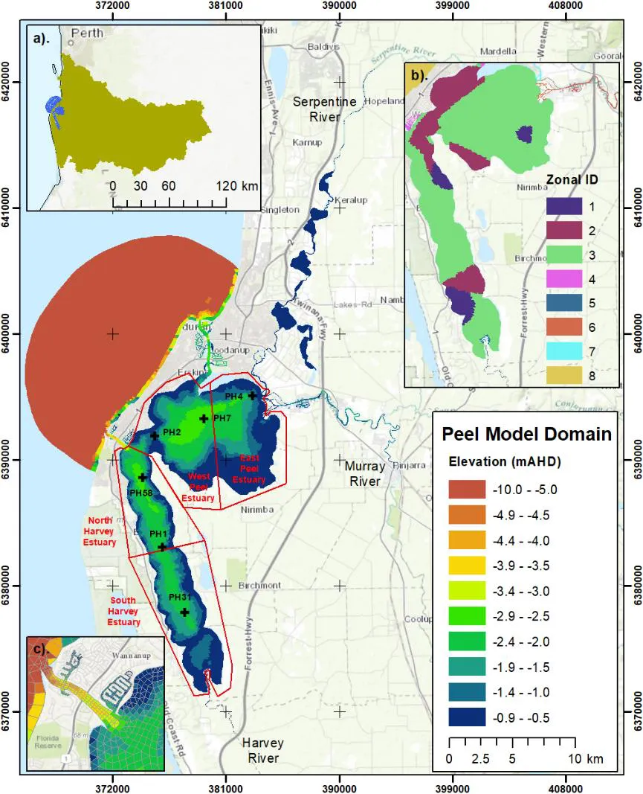
```
:::

### Data review and model simulations

::: {.body-text width="100%"}
Historical observations of nearby precipitation and the gauged data of the major Murray River inflow have shown a decreasing trend from 1970 to the present (Fig. \@ref(fig:model-hydrology-pic3)), though variability from year to year is noticeable. The average annual precipitation dropped by 15% in 1994-2016 compared to the period 1970-1993, and this led to a dramatic decrease of annual inflow volumes, especially in the recent decade. For example, the 10-year moving average of the Murray River inflow rate dropped from 340 GL in 1970 to 98 GL in 2016, and similar declines are seen in the other rivers (not shown). Years with inflow rates close to the 10-year moving average were selected for hydrologic modelling simulations to explore in more detail the hydrologic changes in these years (depicted relative to the trend in Fig. \@ref(fig:model-hydrology-pic3)b).

Due to the concern that the drying climate will continue into 21st century (Silberstein et al., 2012), we also undertook model simulations to investigate the potential hydrologic changes in “future scenarios” representative of 2040 and 2060, by considering reduced streamflow and rising sea levels. The runoff declines were based on the mean projection by Smith and Power (2014) that suggested the total runoff to the rivers and estuaries within the WA region will drop by about 0.96% per year, corresponding to the projected reduction in precipitation of 0.27% per year, on average. Sea level rise was also included in the future scenarios, estimated from the long- term (1897–2000) tide gauge observations at the Fremantle tide gauge station that shows a sea level trend of 1.50 mm/yr (Kuhn et al., 2011). These estimates may be biased due to a possible accelerated sea level rise towards the end of the 21st century (IPCC, 2007; Kuhn et al., 2011).

```{r model-hydrology-pic3, echo = FALSE, out.width='100%', class = "text-image", fig.cap = "Historical record of (a) annual precipitation rate; (b) Murray River annual inflow rate; (c) monthly-average sea level at Fremantle gauge station; (d) salinity at Harvey Estuary and Peel Inlet; and (e) total chlorophyll-a (TCHLA) in Harvey Estuary and Peel Inlet since 1970 to 2016."}
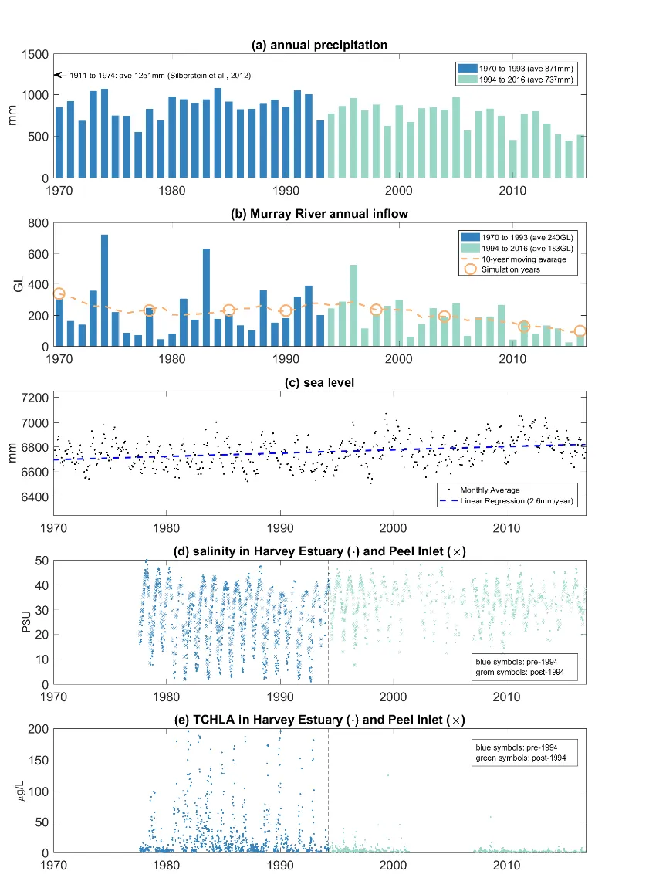
```

For the modelling years after 1994, when the artificial channel was constructed, we also ran “no-Cut scenarios” that assumed the Dawesville Cut was not constructed, in order to separate the impact of the artificial engineering intervention on hydrology relative to the “with-Cut” scenarios.

Where gauged data wasn’t available, the outputs of the catchment model were used. Weather conditions over the period were set based on a combination of weather station data and model outputs from the regional WRF model. A summary of all historical simulations and future scenarios is provided in Table 1. The total inflow into the estuary of the chosen simulation years shows a general decrease from past to future, except for the year 1978 when the total inflow rate was less than that in 1985 and 1990. This was due to an exceptionally low inflow rate at the Harvey River, produced from the catchment model output, which had an effect mostly on the Harvey Estuary. We still include this year to show the historical evolution during the past decades.
:::

### Model evaulation and sensitivity tests

::: {.body-text width="100%"}
The model accuracy in reproducing the key hydrologic features was assessed by using the salinity and temperature data measured at six monitoring stations along the estuary (Fig. \@ref(fig:model-hydrology-pic2)). For each variable, we evaluated the model quantitatively against the monitored data using three skill metrics: correlation coefficient (r), mean absolute error (MAE), and model skill score (SS). Comprehensive evaluation was conducted for all the simulation years, except for 1970 when the long term monitoring had not started yet. The evaluation focused on the salinity and water temperature at the surface and bottom water of 6 monitoring stations along the estuary. Surface elevation records obtained from two gauged stations in the centre of Peel Inlet and Harvey Estuary were also used, when they were available, to validate the modelled surface elevation.

The current study focused on the impact of reduced inflow, due to drying climate and the Cut, on the estuary hydrology. However, the perturbations of environmental factors such as air temperature, tide elevation, and benthic vegetation could also affect the local hydrology, therefore their influence to the modelling results was explored. To do this, the sensitivity of the modelled τ and salinity to the changes of: (1) air temperature (±1 degree, representing 100 year change of local air temperature); (2) tidal elevation (±0.15m, representing 100 year change of local tide record); and (3) bed roughness length (±50%, representing 50% change of bed roughness). The ranges of these environmental factors were carefully selected based on the historical records. Two years, 1998 and 1990, representing a year with the Cut opening and another year without the Cut, respectively, were selected for the model sensitivity tests.
:::

## Main Findings

### Model reconstruction of historical conditions

::: {.body-text width="100%"}
The monitored and modelled salinity and temperature within the two lagoons in the year of 1990 (a ‘pre-Cut’ year, the year before the Cut constructed) and year of 1998 (a ‘post-Cut year’, the year after the Cut constructed) demonstrate the ability of the model to accurately capture the seasonal cycle in response to the catchment inflows (Fig. \@ref(fig:model-hydrology-pic4)). In summer and early autumn the flow rates were low, followed by high salinity and weak salinity stratification in the two lagoons. In contrast, there were large inflows to the estuary in winter and early spring. The peaks of the inflows occurred in winter (July–September), followed by a significant drop in the salinity in the estuary due to the freshwater flushing. However, differences in the salinity response to freshwater flushing can be observed between the pre-Cut year (1990, left column of Fig. \@ref(fig:model-hydrology-pic4)) and the post-Cut year (1998, right column of Fig. \@ref(fig:model-hydrology-pic4)). In 1990 when the estuary had limited connection without the opening of the Cut, the salinity stratification was small in the Harvey Estuary. The salinity dropped to below 5 psu, indicating the hydrology of Harvey Estuary was mainly dominated by the Harvey River flushing. Whilst during 1998, with greater ocean connection due to the opening of the Cut, stronger salinity stratification was observed in the Harvey Estuary, and the minimum salinity was lifted to over 10 psu due to more seawater intrusion from the Cut. The water temperature also presented a clear seasonal signal, ranging from about 10 °C in winters to 30 °C in summers. The differences in the water temperature observed in the centres of two lagoons, and between the surface and bottom waters, were small.

The opening of the Cut also affected the surface elevations of the estuary (Fig. \@ref(fig:model-hydrology-pic5)). The tide elevations in the ocean showed similar characteristics in 1990 and 1998 in terms of the annual mean sea level (−0.079 m and −0.027 m in 1990 and 1998, respectively) and tidal range (both < 1m). However, the surface elevation measured at the centre of the estuary had significantly different characteristics in these two years. The estuary surface elevation in 1998 had a much wider range of −0.6 m to 0.8 m compared to that in 1990 of −0.4 m to 0.4 m, indicating higher magnitude of water exchange between the estuary and the ocean due to the opening of the Cut.

In general, the model reproduced the temporal variations of salinity and temperature in both the surface and water well (Table 2). The mean regression coefficient r for the salinity from six monitoring sites is above 0.81, and for the water temperature is above 0.85 except in the year 1970, when a mean r of 0.72 was obtained, which may have been due to poor boundary forcing for this year. The model skill scores are generally higher than 0.61 for both salinity and temperature in all historical years, suggesting the model has captured the major features of the hydrologic response to the external forcing of tide and freshwater inputs.

```{r model-hydrology-pic4, echo = FALSE, out.width='100%', class = "text-image", fig.cap = "Annual variation in 1990 (left column, a) and 1998 (right column, b) of (1) inflow rate of the three main rivers; (2) monitored and modelled surface and bottom salinity at the centre of Peel Inlet (site PH7 at Fig. 1); (3) monitored and modelled surface and bottom water temperature at the centre of Peel Inlet; (4) monitored and modelled surface and bottom salinity at the centre of Harvey Estuary (site PH1 at Fig. 1); (3) monitored and modelled surface and bottom water temperature at the centre of Harvey Estuary."}
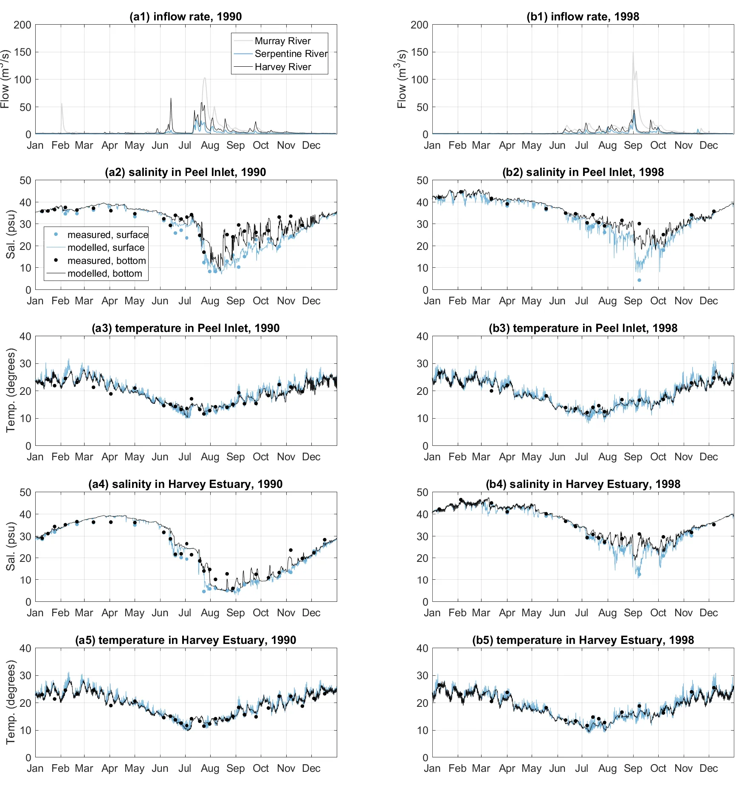
```

```{r model-hydrology-pic5, echo = FALSE, out.width='100%', class = "text-image", fig.cap = "(a) Sea level variation in 1990 and 1998; (b) modelled vs. measured surface elevation in the centre of Peel Inlet in 1990 (r=0.9795), the grey line indicates the 1:1 ratio; and (c) same as figure b except for year 1998 (r=0.9841). The colour from blue to red in figure b and c indicate the data density from minimum to maximum."}
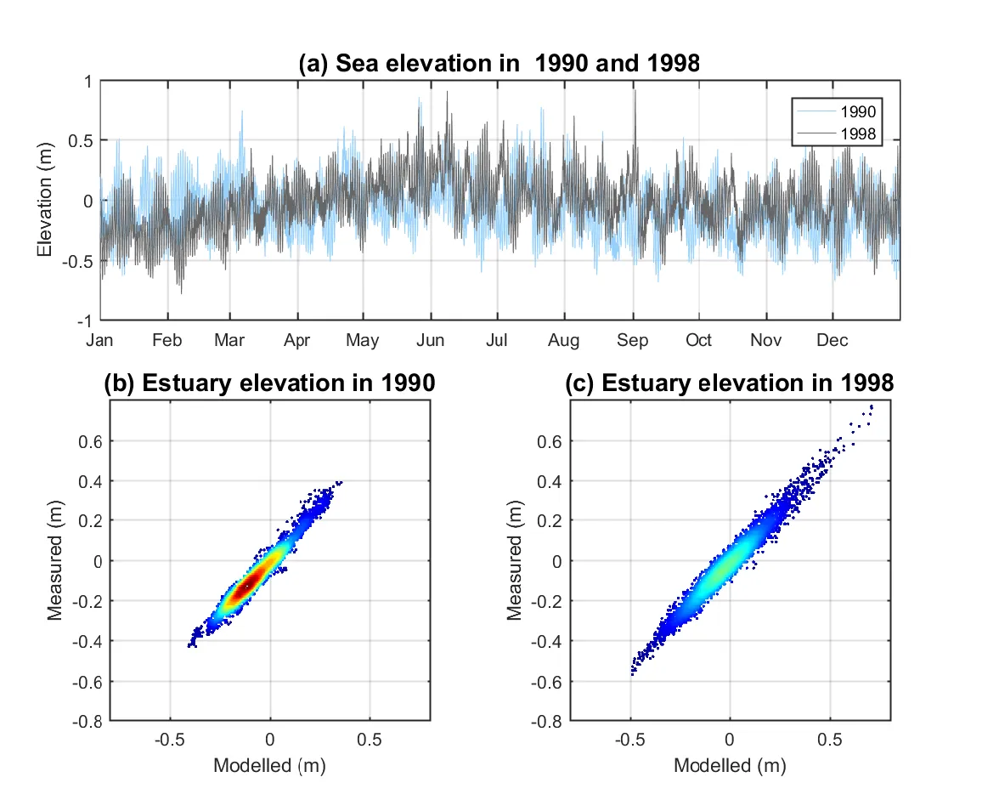
```

The sensitivities of modelled salinity and $\tau$ to air temperature, tide elevation, and bed roughness are shown in Fig. \@ref(fig:model-hydrology-pic6). The changes in the air temperature of ±1 degree have minor effects on both the salinity and $\tau$ in both years of 1990 and 1998. The influence of air temperature on the hydrology was mostly through evaporation, and resulted in changes in salinity of less than 0.9 psu, and 0.5 days changes in $\tau$. Secondly, the changes in the mean tide elevation of ±0.15 m led to changes in salinity of up to 2.2 psu and 8.4 days in $\tau$. This is not surprising because the changes in the mean tide elevation were theoretically equal to changing the volume of this shallow estuary, where 0.15 m is significant when compared to the mean estuary depth of ~1.4 m. Thirdly, the bed friction also had a noteworthy impact on the salinity and $\tau$ by modifying the water movement and therefore benthic layer mixing at near-bed level. The presence of benthic vegetation was shown to impact salinity by up to 2.8 psu in the Harvey Estuary, while a maximum change in the $\tau$ of 8.6 days was observed in the same location.

```{r model-hydrology-pic6, echo = FALSE, out.width='100%', class = "text-image", fig.cap = "Sensitivity of the modelled annual-mean salinity and retention time in the Peel Inlet and Harvey Estuary. SV: standard scenario; S1: +1 degree in air temperature scenario; S2: −1 degree in air temperature scenario; S3: +0.15 m in tide elevations scenario; S4: −0.15 m in tide elevations scenario; S5: +50% in bed roughness scenario; S6: −50% in bed roughness scenario."}
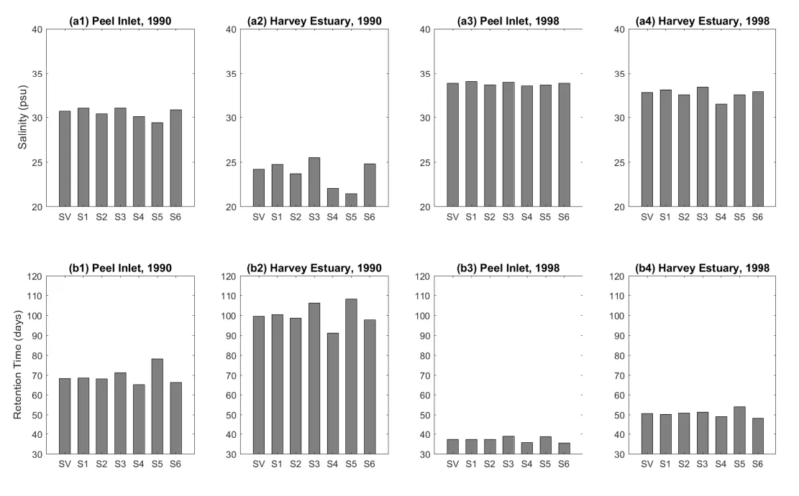
```

In summary, the modelled salinity and $\tau$ were more sensitive to the changes in the sea level variation and bottom vegetation presence, but the effects of these environmental factors were still small when compared to that caused by the reduced flow over the past decade and the Cut opening. For example, the maximum change in $\tau$ observed in the sensitivity test runs was 8.6 days, caused by the enhanced bottom roughness in the 1990 scenario, compared to the magnitude of 20–100 days caused by the reduced flow from 1970 to 2016 (see more details below). The maximum changes in the salinity observed in the sensitivity test runs was 2.8 psu, caused by the reduction of tide level in the Harvey Estuary, compared to the magnitude of 10–30 psu changes in the salinity caused by the reduced flows from 1970 to 2016 (see more details below).
:::

### Incomplete mixing and changes in water rentention times

::: {.body-text width="100%"}
Water retention time in tidal lagoons is sometimes confusing because various definitions that are used (flushing time, water age, and residence time) (e.g. Monsen et al., 2002; Jouon et al., 2006). The flushing time is the most popular concept and has been used in many aquatic systems, including the PHE, in the early 90s (Lord, 1998) as it is convenient as an indicator of water transportation relative to the time scales of nutrient inputs or biogeochemical processes. The flushing time is “a bulk or integrative parameter that describes the general exchange characteristics of a waterbody without identifying the underlying physical processes, the relative importance of those processes, or their spatial distribution” (Monsen et al., 2002), which can be numerically represented as (Sheldon and Alber, 2006):
:::

$$
\begin{equation}
\tau_{f} = \frac{V}{Q_{FW}+R_{O}+Q_{SW}}
\end{equation}
$$

::: {.body-text width="100%"}
where $\tau_{f}$ is the bulk flushing time of the estuary, $V$ is the estuary volume (=187.5 GL), 𝑄𝐹𝑊 is the freshwater inflow rate, $Q_{SW}$ is the average seawater flow rate over a tidal period, and $R_{O}$ is the exchange fraction of the seawater fluxes that contribute to flushing (Rynne et al., 2016). The values of $Q_{SW}$ and $Q_{SW}$ are derived from model outputs, while the value of $R_{O}$ is set to 0.27 following the study of Taylor and Dean (1974) in a lagoon-type estuary.

Both the mean $\tau$ from the hydrodynamic model and the $\tau_{f}$ bulk approximation show significant reduction of retention time in summertime and wintertime due to the Cut opening (Fig. \@ref(fig:model-hydrology-pic7)). Yet the $\tau_{f}$ is about 5–50% lower than the average modelled water age in the Cut-closed scenarios and 68–82% lower in the Cut-open scenarios, indicating the seawater fluxes are considerably over-estimated with the bulk flushing time method, especially after the Cut construction. The flushing time method assumes the estuary is fully mixed as a box model, which is not the case given the shallow and complex morphometry of the PHE system. These changes suggest strong incomplete mixing of the ocean flushing, which results in a lower tidal exchange ratio (Sheldon and Alber, 2006). Therefore the concept of flushing time is not appropriate in this large shallow lagoon and heterogeneity in the water age distribution needs to be considered from the model results. It also has implications since incomplete mixing will lead to area-specific retention of nutrients, and therefore affect local biogeochemistry such as pelagic denitrification and P burial rates (e.g. Almroth-Rosell et al., 2016).

```{r model-hydrology-pic7, echo = FALSE, out.width='100%', class = "text-image", fig.cap = "Comparison of average water age ($\tau$) and bulk flushing time ($\tau_{f}$) in (a) summertime and (b) wintertime in the PHE."}
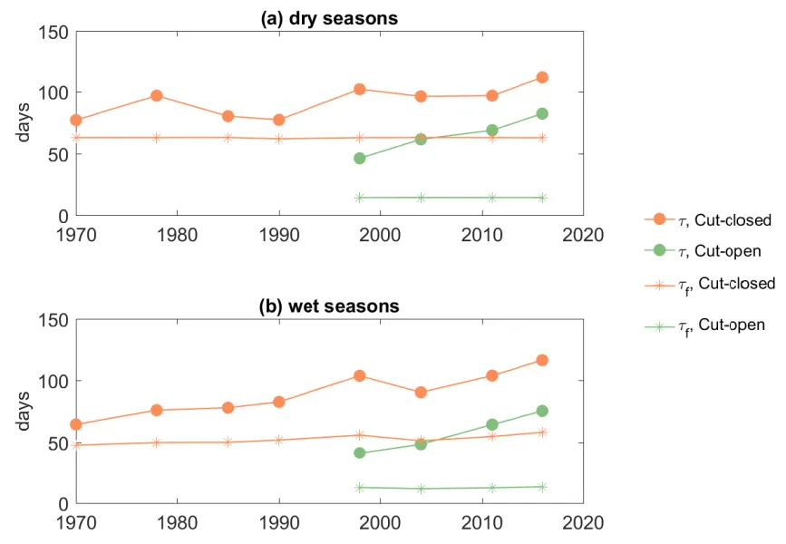
```
:::

### Past and future hotspots of water retention

::: {.body-text width="100%"}
Water retention is highly dynamic depending on seasonal flows, tidal conditions, and different regions of the estuary. The evolution of water age, $\tau$, over time has shown a general increase from 1970 to the present, superimposed on the effect of the Cut, however, with some considerable variation across the two lagoons (Fig. \@ref(fig:model-hydrology-pic8)). Firstly, wet season (winter and spring) conditions were more sensitive to the changes in the drying climate. In the “no-Cut” scenarios (assuming the artificial channel was not constructed), it was predicted that τ would have increased in the Peel Inlet from about 50 days in 1970 to nearly double in 2016 and increased from approximately 50 days in 1970 to nearly 150 days in 2016 in the Harvey Estuary, solely due to the drying climate trend. In contrast, the dry season (summer and autumn) conditions did not show as significant changes over time in most parts of the estuary, except in the south Harvey Estuary, which is furthest from the channels. These effects are masked by the effects of opening of the Cut, which had a prominent effect by reducing the $\tau$ by about 20–45 days in the Peel Inlet, and more profoundly by 50–100 days in the Harvey Estuary. Yet the drying climate has largely canceled out the flushing effect by the Cut on the water age in some regions. The increases in $\tau$ from 1998 to 2016, due to reduced inflows, are in the same magnitudes of that reduced by the Cut opening. For example, the Cut opening reduced the $\tau$ by 28 days in the west Peel Inlet in 1998, yet the $\tau$ increased by 27 days from 1998 to 2016 due to the reduced flows. Lastly, the Harvey Estuary was most influenced by the climate changes and the Cut opening. North Harvey Estuary, directly connected to the Cut, was most impacted by the Cut opening with the $\tau$ was reduced by more than 110 days. The south Harvey Estuary, which is furthest from both the channels, was more sensitive to climate change, showing greatest variation over the past decades.

```{r model-hydrology-pic8, echo = FALSE, out.width='100%', class = "text-image", fig.cap = "Mean water retention time in east Peel Inlet, west Peel Inlet, north Harvey Estuary, and south Harvey Estuary (see Fig. 1 for their domain definition). The data were categorized into four seasons: spring (September, October, November), summer (December, January, February), autumn (March, April, May), and winter (June, July, August)."}
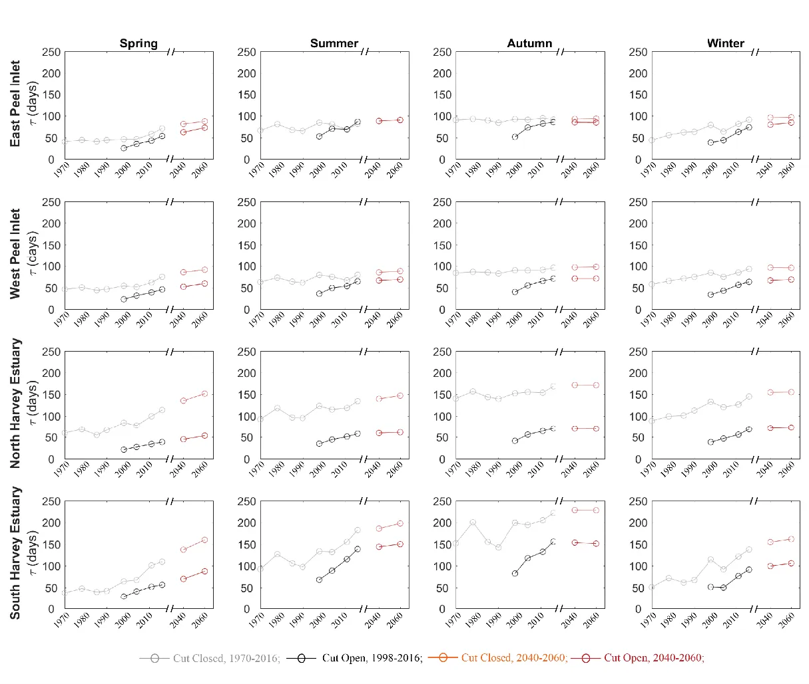
```
:::

### Increasing salinity and changing patterns of stratification

::: {.body-text width="100%"}
Similar to $\tau$, the evolution of salinity in response to the drying climate showed large variability in space and time, yet the impact of the Cut-opening on salinity was more complex (Fig. \@ref(fig:model-hydrology-pic9)). In the “no-Cut” scenarios, the mean salinity during the wet season increased from <20 psu in 1970 to over 30 psu in 2016. In the dry season, the changes in salinity were relatively smaller over time. The Cut-opening could increase or decrease the salinity in the estuary, depending on the salinity within the estuary at the time, compared to the ocean salinity of ~ 36 psu. If the estuary salinity was lower than the ocean salinity, the Cut-opening enhanced the salinity level, and vice versa. For example, the salinity in the north Harvey Estuary increased from 17.5 psu to 28.3 psu in the spring of 1998 by the Cut-opening, yet reduced from 51.8 to 39.8 psu by the opening of the Cut in the autumn. The Cut opening has relatively smaller influence on the salinity of Peel Inlet where has connection with ocean via not only the Cut but also the Mandurah Channel. The projected climate is expected to slightly increase the salinity in the Peel Inlet and Harvey Estuary, mostly in winters and springs.

Hypersalinity was often observed in summer and autumn in the Peel Inlet from both the ‘Cut-open’ and ‘no-Cut’ scenarios. The Harvey Estuary shows an increasing salinity with the drying climate in summer and becomes hypersaline after 2011. High salinity with values over 50 PSU were observed in autumn in South Harvey Estuary in the ‘no-Cut’ scenarios, whilst the Cut-opening reduced the hypersalinity likelihood in autumn in the Harvey Estuary. The relationship between the hypersalinity and the catchment inflows are further investigated with monitoring data at six regular monitoring sites (Fig. \@ref(fig:model-hydrology-pic10)), which shows the maximum salinity recorded in autumn increased with reduced inflows, especially in the period before the Cut-opening. Opening of the Cut reduced the maximum salinity at the sites near the Cut (site PH2 and PH58), under an annual flow threshold of about 1000 GL/year. The hypersalinity risk is shown to increase with distance to the channels, especially in site PH31 in the south Harvey Estuary where salinity >45 psu was often observed after Cut-opening. The maximum salinity can also be affected by other factors, such as accidental rainfall events in summers. However, it can be concluded that the risk of hypersalinity increased due to the drying climate, and the Cut-opening reduced the sensitivity of maximum salinity to the changes in inflow rates.

The magnitude of salinity stratification (salinity difference between the bottom and surface water) in winter and spring has shown a declining trend with the drying climate, while the variations are small in summer and autumn (Fig. \@ref(fig:model-hydrology-pic11)). The opening of the Cut introduces more ocean water intrusion, which creates a stronger salt-stratification in the wet seasons when it interacts with the freshwater inflows. The salt-stratification in the Peel Inlet was enhanced by the Cut opening in the wet seasons but that has gradually diminished with the reduction if the inflows, and there is increasing stratification in wet season within the Murray River (Fig. \@ref(fig:model-hydrology-pic12)). The maximum mean salinity difference in spring time was over 10 psu in 1970, which then decreased to about 3 psu in 1998 and was mostly <1 psu in the 2060 projection scenario, indicating weaker stratification due to the reduced inflow. The Cut enhanced the stratification in the Harvey Estuary, especially the northern part, and it also has shown a declining trend with the reduction in inflows.

```{r model-hydrology-pic9, echo = FALSE, out.width='100%', class = "text-image", fig.cap = "Same as Fig. 7, except for mean salinity evolution."}
knitr::include_graphics("images/model_hydrology/picture9.webp")
```

```{r model-hydrology-pic10, echo = FALSE, out.width='100%', class = "text-image", fig.cap = "Maximum salinity recorded in March/April and the annual inflow in the hydrologic year (March to March) at 6 monitoring sites (see the site locations in Fig. 1)."}
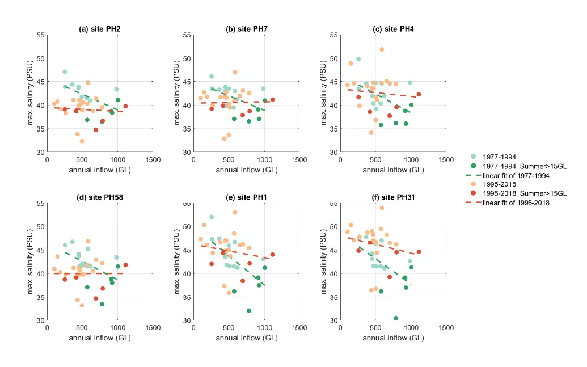
```

```{r model-hydrology-pic11, echo = FALSE, out.width='100%', class = "text-image", fig.cap = "Same as Fig. 7, except for mean salinity-stratification."}
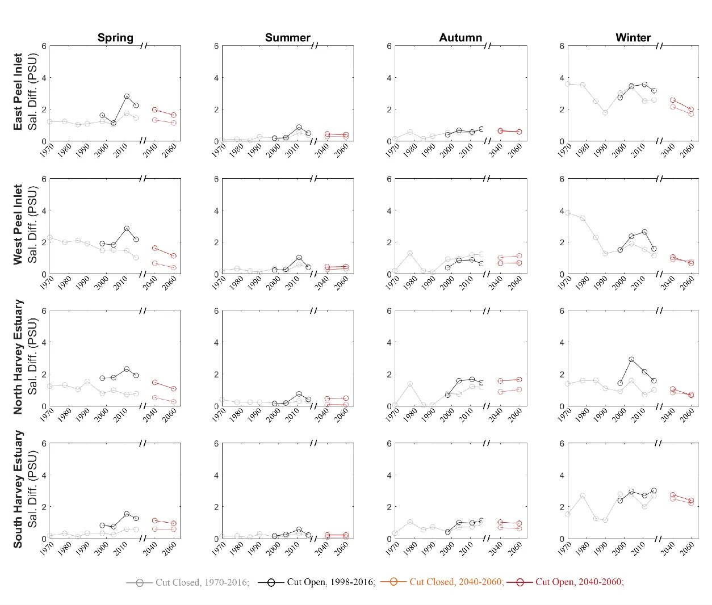
```

```{r model-hydrology-pic12, echo = FALSE, out.width='100%', class = "text-image", fig.cap = "Stratification intensity model outputs, comparing pre (1978 and 1990, top panel) and post (1998 and 2016, bottom panel) Cut conditions."}
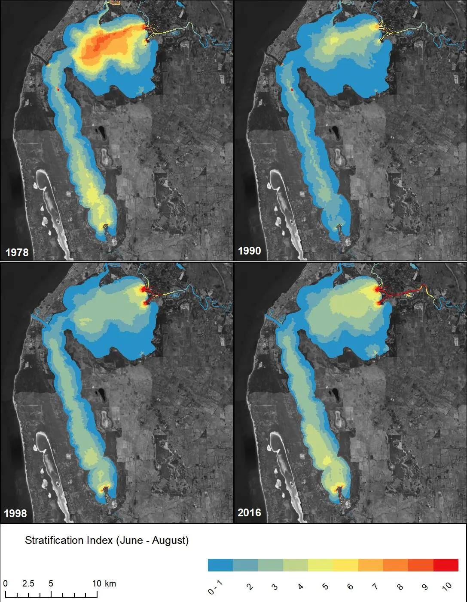
```
:::

### Implications for estuary management

::: {.body-text width="100%"}
The Cut had an obvious and dramatic effect on increasing the export of nutrients that would have otherwise been retained (Fig. \@ref(fig:model-hydrology-pic13)). Since the Cut opening in 1994 the main monitoring stations have shown TN as being stable around 0.5mg/L and TP has declined from 0.05 to 0.02 mg/L over time. Importantly, the increasing rate of exchange has made the estuary concentration of nutrients less sensitive to the inflow load (as demonstrated by the reduction in slope of 11c and d). The results have, however, revealed an increase in τ associated with the drying climate that has eroded some of the benefits associated with increased flushing following the construction of the Cut, and further reductions in flows will cause less flushing and will likely lead to a tendency for increasing nutrient accumulation over time. Importantly, this is also now manifesting in reduced flushing and higher concentrations in the riverine portions of the domain that are not clearly depicted in the long-term data shown in Fig. 11. This is explored by looking at the nutrient loading and export rates in more detail in other components of this ARC Linkage Project (see Hipsey et al., 2019a; b).

```{r model-hydrology-pic13, echo = FALSE, out.width='100%', class = "text-image", fig.cap = "Changes in the mean nutrient concentration of (a) TN and (b) TP in the Peel-Harvey Estuary (based on the average of the 6 main monitoring stations), and their relationship with the total annual nutrient loading (c and d)."}
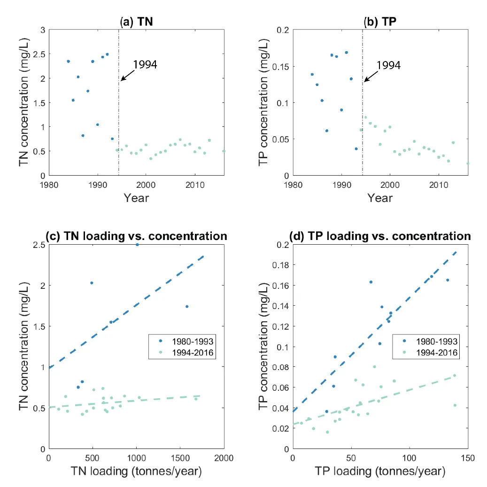
```

The hydrologic changes led to not only changes in the nutrient levels but also the mean salinity, with potential ramifications for the ecological community. In particular, the phytoplankton biomass dropped dramatically since the Cut opening (Fig. \@ref(fig:model-hydrology-pic3)) due to the improvement of ocean connectivity and flushing, but also due to a less desirable salinity regime for the toxic cyanobacteria *Nodularia spumigena* that plagued the Harvey Estuary before the Cut opening. The biomass of macroalgae has also decreased in the Peel Inlet, while it has increased in the Harvey Estuary since the Cut opening, which potentially reflecting the reduced nutrient concentrations, increased salinities and/or greater light availability (Pedretti et al., 2011). The biomass of some benthic macroinvertebrates, such as the blue swimmer crabs (*Portunus armatus*) and the Western king prawn (*Penaeus latisulcatus*) also showed an increase with the Cut opening and the reduced flow in recent years (Johnston et al., 2014). These trends seem to continue as our models predict a constant low flushing and high saline future in this estuary.

Aside from changes in flushing and the mean salinity fields, the annual variability of salinity along the rivers has indicated there is an increasing risk of hypersalinity in the Serpentine River and an upward moving of the salt-wedge in the Murray River (Fig. \@ref(fig:model-hydrology-pic14)). For example, the mean salinity at the Serpentine River mouth is about 20 psu in 1970, then increased to 24 psu in 1998 and projected to increase to over 30 psu in 2060. In the upstream areas of the Serpentine River, the mean salinity increased faster from about 15 psu in 1970 to near 35 psu. While there is no hypersalinity risk in the Murray River due to stronger freshwater flushing, the trend of increasing salinity along the river drives stratification which is a known driver of hypoxia and fish-kill events. The differences between the Cut-closed and Cut-open scenarios in year 1998 are much smaller than that caused by the drying climate, which concludes the drying climate is the major cause of the salinity changes in the rivers.

```{r model-hydrology-pic14, echo = FALSE, out.width='100%', class = "text-image", fig.cap = "Longitudinal gradient in annual salinity variability in four selected scenarios (1970, 1998 without the Cut opening, 1998 with the Cut opening, and a future scenario 2060 with assumptions of reduced flow and sea level rise) moving upstream along the (a) Serpentine River and (b) Murray River. "}
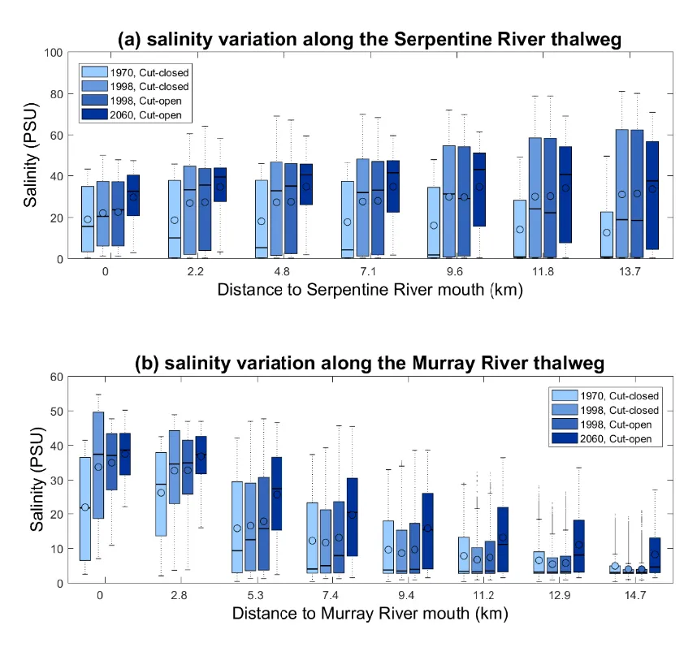
```
:::

## Conclusions

::: {.body-text width="100%"}
This chapter has sought to disentangle the effect of the recent climate change trend on the hydrologic evolution in the Peel-Harvey Estuary, relative to the changes brought about by construction of the Dawesville Cut. The Cut was effective in significantly reducing the water retention time, especially in areas on the Western side, while the drying climate trend has acted to increase the water retention time. The artificial channel enhanced the ocean intrusion, which has a mutual effect with the drying climate to increase the estuary salinity during the wet season, but it had opposite effect of reducing the hypersalinity in the dry season. The drying climate reduced the salinity stratification in the main body of the estuary, while the artificial channel increased the seawater fluxes and the salinity stratification, mostly in the Harvey Estuary. The changes are increasing the stresses on the riverine portion of the study domain. The changes in the water retention time and salinity have led to fundamental changes in nutrient levels and habitat of pelagic and benthic communities. Future consideration of the projected drying trend and effects of sea level rise is essential in designing management plans associated with planning for environmental water provision and setting water quality loading targets.
:::

## Acknowledgements

::: {.body-text width="100%"}
We thank Dr. Jatin Kala and Dr. Julia Andrys for providing meteorological data from their Weather Research and Forecasting (WRF) model.
:::