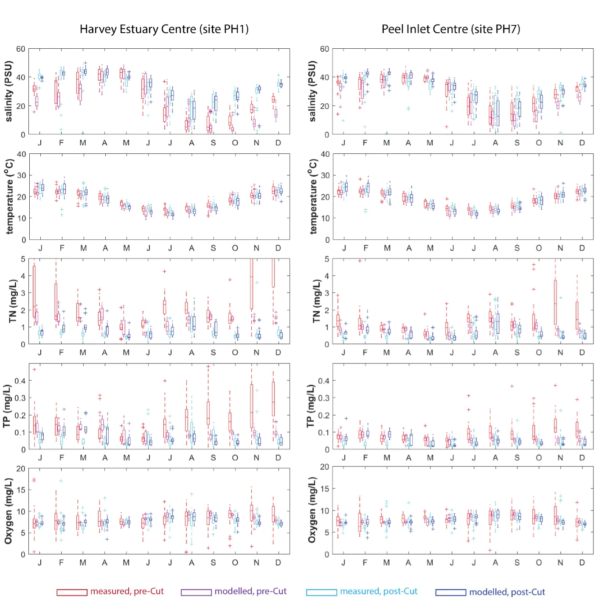

# Integrated Modelling Assessment of Nutrient Cycling and Water Quality in the Peel-Harvey Estuary {#model-water-quality}

::: {.chapter-authors width="100%"}
**Matthew R. Hipsey^1,2^, Peisheng Huang^1,2^, Brendan Busch^1^, Karl Hennig^3^**
:::

::: {.author-info width="100%"}
^1^ Aquatic Ecodynamics, UWA School of Agriculture and Environment, The University of Western Australia, Crawley WA 6009, Australia. <br> ^2^ UWA Oceans Institute, The University of Western Australia, Crawley WA 6009, Australia. <br> ^3^ Department of Water and Environmental Regulation, Perth WA 6842, Australia.
:::

```{r model-water-quality-pic1, echo = FALSE, out.width='100%', class = "title-image"}

knitr::include_graphics("images/model_water_quality/picture1.webp")

```


## Executive Summary

::: {.body-text width="100%"}
Long-term monitoring data (from 1970 to 2018) and 3D modelling investigations (of selected years from 1979 to 2018) were integrated to study changes in the water quality and nutrient budgets within the Peel-Harvey Estuary (PHE) in response to varied environmental stressors, including catchment loading, a drying climate trend, and the Dawesville Cut construction. The results showed that (1) there was a declining trend of nutrient inputs from the catchment into the PHE, driven by a reduction in flows and nutrient management measures in the catchment; (2) the role of the PHE system in filtering catchment nutrient inputs has changed due to the opening of the Dawesville Cut (e.g., addition of the Cut on average improved the TN export from 50% to 71%, and TP export from 31% to 49% of annual catchment loading, and the nutrient export via the Cut is about 2–3 times of that through the Mandurah Channel); (3) the PHE system has a significant spatial heterogeneity in water quality in response to catchment loading; (4) the estuary response model well reproduced the nutrient pools and water quality evolution in PHE especially in the post-Cut period, suggesting in its current form it is suitable for assessing management scenarios associated with nutrient load management or climate change; and (5) estuary response functions were developed to simplify models and showed locations near the channels are less sensitive to the catchment inputs, as well as that the Harvey Estuary displays a stronger salinity and phytoplankton biomass response to the catchment inputs compared to the Peel Inlet.

**Key findings:**
:::

-   A reconstruction of nutrient loads over time, including relative nutrient species partitioning, has shown the long-term reduction in load, but relative stability in flow-weighted inflow concentrations.
-   Continual changes in water quality have occurred in the estuary over time, including following the Cut and as well as a long-term response following the reduced flows.
-   The high-resolution Peel-Harvey Estuary Response Model has been able to capture water quality variability across regions from rivers to lagoons and channels.
-   The model has allowed the reconstruction of spatiotemporal variability in key water quality attributes and processes impacting the nutrient load partitioning within the estuary.
-   Zonal budgets were undertaken to identify local controls on carbon and nutrient metabolism, and to determine how these respond to changes in flow and catchment loading.
-   The pattern of retention and export has changed over time, following the Cut in particular, but recent changes also due to the reduced inflows.
-   The amount of retention is dependent on annual flow, and therefore maybe sensitive to forecast projections due to drying climate.

## Background

::: {.body-text width="100%"}
The Peel-Harvey Estuary (PHE) system, located within the south-west Australian region, is surrounded by a large catchment of ~11,940 km2 (Kelsey et al., 2011), including the coastal city of Mandurah which is one of the fastest growing cities in the state. Like many other urban estuaries and coastal embayments around the world ( Eyre, 2000; Howarth and Marino, 2006; Howarth et al., 2011; Greening et al., 2014; Cloern et al., 2017;), the PHE received excessive anthropogenic nutrient loading from the catchment and has exhibited signs of environmental stress due to eutrophication, such as fish kills, cyanobacteria and other algal blooms (Potter et al., 2016; Valesini et al., 2019). The severity of eutrophication in PHE led to the construction of an artificial channel, termed the “Dawesville Cut” (hereafter referred as “the Cut”), in 1994, with the purpose of enhancing ocean flushing therefore reducing nutrient levels within the estuary. Monitoring data has shown that the Cut was effective in reducing the water nutrient and phytoplankton concentrations (Brearley, 2005), however, the PHE system is still under stress of catchment development and climate change. The population in Mandurah had increased more than double from 2006 to 2016 (Australian Bureau of Statistics, 2018). At the same time, the Peel region experienced a drying climate followed by a rapid decline in runoff to the estuary (Silberstein et al., 2012; Valesini et al., 2019). While the changing status of the PHE ecosystem has been reported through analysis of water quality monitoring and ecological survey data (e.g. Brearley, 2005; Pedretti et al., 2011; Johnston et al., 2014; Valesini et al., 2019)Hallett et al., 2012; , there remains uncertainty as to how the water quality changes have occurred in response to the varied environmental stresses the system has experienced. The changing hydrological patterns experienced by the system (Huang et al., 2019a) has implications for the rates of nutrient retention and cycling, and manifestation of poor water quality (e.g. hypoxia, algal blooms).

The need to effectively balance the water quality status with development opportunities to support economic and societal growth in the PHE region confronts managers as a ‘wicked problem’, and requires knowledge of the past and present state of the estuarine condition and an understanding of how it will responds to environmental stresses (Patterson et al., 2013; Barnard and Elliott, 2015). Water quality response models, integrated with the long term monitoring data, are particularly useful in this regard by linking hydrologic changes (e.g. changing water retention and flushing) with nutrient loading and in-estuary biogeochemical transformations, thereby allowing nutrient budgeting and regional water quality risk assessment (Huang et al., 2019b). The development of response models are also essential tools to support long-term and complex land-use planning decisions, climate change scenarios, and restoration measures (Hipsey et al., 2015; Janssen et al., 2015; Honti et al., 2017). To date, there has been no estuarine response model for the PHE, and therefore uncertainty as to how the system is responding to large scale changes in hydrology and catchment management.
:::

## Objectives

::: {.body-text width="100%"}
This report seeks improved understanding of water quality responses to the environmental perturbations in the PHE, considering nutrient retention and cycling, through integration of the historical monitoring data and development of a new estuary response model. The main objectives are as follows:
:::

1)    Identify the seasonal and inter-annual characteristics of water quality changes in pre- and post-Cut periods;
2)    Develop the Peel-Harvey Estuary Response Model (PHERM) and evaluate the performance in reconstructing the long-term changes in water quality;
3)    Provide a synoptic view of changes to the nutrient budget of the PHE system, including the catchment loading, the estuary retention/assimilation capability, and rates of export to the ocean;
4)    Build estuary response functions (ERF) to identify the impacts of drying climate and Dawesville Cut on the changes of key water quality parameters (DO, TCHLA, clarity, nutrient retention).

## Approach

### Data review and compliation

::: {.body-text width="100%"}
A comprehensive data review and compilation process was undertaken to provide the necessary data for model setup, validation and assessment. Available monitoring data was sourced from: Marine and Freshwater Research Laboratory (MAFRL, 1977-2001), Department of Water and Environmental Regulation (DWER) Water Information Reporting (WIR, 2001-2018), Murdoch University biogeochemical field surveys (MU, 2016-2018), and Southern Cross University nutrient and isotope surveys (SCU, 2017). The data from these sources are summarized in Table 1 and sampling locations are shown in Fig. \@ref(fig:model-water-quality-pic2), and was standardised to facilitate comparison.

```{r model-water-quality-pic2, echo = FALSE, out.width='100%', class = "text-image", fig.cap = "Data sources and their sampling locations superimposed on the PHERM simulation domain."}
knitr::include_graphics("images/model_water_quality/picture2.webp")
```
:::

### The Peel Harvey Estuary Response Model (PHERM)

::: {.body-text width="100%"}
An estuary water quality response model was developed to gain insights into the nutrient budgeting and regional water quality response to changing environmental inputs. The water quality response model consists of a 3D hydrodynamic model TUFLOW-FV (as described in Huang et al., 2019a), which is dynamically coupled with the AED2 water quality model to simulate the nutrient cycling and key biogeochemical processes (Hipsey et al., 2019). The AED2 water quality modules were configured to simulate the C, N, P, and DO budgets, including resolving the inorganic nutrients and organic matter fractions, and primary production (Table 1; Fig. \@ref(fig:model-water-quality-pic2)). Spatial variation and sediment quality and benthic properties (including biomass of seagrass, macroalgae and bivalves) was also included.

Key modelled chemical and biological processes include:
:::

-   Water column kinetic (time-varying) chemical / biological transformations (e.g., denitrification or algal growth)
-   Water column equilibrium (instantaneous) chemical transformations (e.g., PO4 adsorption)
-   Vertical sedimentation or migration
-   Biogeochemical transformations in the sediment or biological changes in the benthos
-   Fluxes across the air-water interface
-   Fluxes across the sediment-water interface
-   Feedback of chemical or biological attributes to physical properties of water (light extinction, drag, density)

::: {.body-text width="100%"}
For more details of the AED model and its numerical methods the readers are referred to the [AED website](http://aquatic.science.uwa.edu.au/research/models/AED/).

The model domain, mesh, and hydrodynamic settings (weather forcing, tide and inflows) in PHERM were updated from that presented in Huang et al. (2019a) to have improved resolution in selected areas of interest after consulting stakeholders. The sediment was separated into 24 zones based on their properties (sand/silt composition and N/P contents) based on the survey data presented in Hallett et al. (2019). Water quality in the inflow waters were set based on the raw or daily infilled data from WIR, or from the catchment model (Hennig et al 2019) where no gauged data was available.

The final version, PHERM v11, was run for 16 selected years from 1979 to 2017, including 6 years in the pre-Cut period and 10 years in the post-Cut period, spanning a range of hydrologic conditions for each. Model parameters were set initially in accordance with settings used in similar systems (Bruce et al., 2014; Huang et al., 2019b), but were then adjusted based on detailed comparisons with field data through a process or error assessment. All available data was compiled into 24 Estuary Response Zones (ERZs) and used to identify calibration issues specific to different regions (e.g. rivers vs lagoons). Generally, the model parameter-set was common across all simulations.

The models output all variables across the domain at 2-hourly internals for each of the 16 annual simulations, and these were also used for nutrient budgeting at the estuary scale, and also in each ERZ. The resultant predictions were also used to develop simpler Estuary Response Functions (ERFs) to illustrate typical patterns of water quality response to flow and nutrient input in different areas of the system.

```{r model-water-quality-pic3, echo = FALSE, out.width='100%', class = "text-image", fig.cap = "AED water quality model diagram summarising interactions captured with the PHERM."}

```
:::

## Main Findings

### Synoptic view of long-term water quality changes

::: {.body-text width="100%"}
The monitored key water quality variables show strong seasonal signals, and the obvious response to the increased flushing brought about by the opening of the Cut (Fig. \@ref(fig:model-water-quality-pic4)). In general, the salinity decreases, and TN/TP concentrations increased during the wet season following catchment loading (see also Fig. \@ref(fig:model-water-quality-pic8)). The opening of the Cut enhanced the ocean water intrusion, therefore lifting salinity and reducing the mean concentrations of TN, TP and TCHLA since 1994. The annual-averaged TN concentration decreased from over 2.0 mg/L in the pre-Cut period to about 0.5 mg/L after the Cut opening, while the annual-averaged TP decreased from over 0.1 mg/L to about 0.03 mg/L. Variability in oxygen, and seasonal low oxygen in the lagoons, has also reduced since 1994.

```{r model-water-quality-pic4, echo = FALSE, out.width='100%', class = "text-image", fig.cap = "Synoptic view of the water quality evolution in the Peel Inlet (left panels) and Harvey Estuary (right panels) from 1979 to 2017. The symbol shapes indicate the data sources; blue indicates data measured within the surface waters and orange indicates data measured at the bottom. The brown arrows indicate the time when the Dawesville Cut was constructed."}
knitr::include_graphics("images/model_water_quality/picture4.webp")
```
:::

### Reduction in catchment nutrient loading

::: {.body-text width="100%"}
The catchment nutrient loading data were created from a synthesis of catchment river monitoring data, catchment model outputs and statistical modelling to allow the long-term comparison of loads and nutrient partitioning. The data shows a significant reduction in the annual TN and TP loading into the PHE system, following the reduction of annual inflows (Fig. \@ref(fig:model-water-quality-pic5)). The flow-normalised annual mean nitrogen concentrations remained relatively stable from 1970 to 2016, while there was significant declining trend in the TP concentration. The linear regression shows the total annual inflow dropped by 268.9 GL (39.8%) from 1970 to 2017, while the total annual TN loading dropped by 501.6 tonnes (44.6%) and the total annual TP loading dropped by 69.6 tonnes (50.9%), indicating not only the reduction of nutrient loading due to the inflow decline, but also the efforts of catchment nutrient control, especially on phosphorus.

```{r model-water-quality-pic5, echo = FALSE, out.width='100%', class = "text-image", fig.cap = "Annual-mean of (a) TN and (b) TP concentrations in all inflows entering the PHE estuary (8 gauged plus 16 ungauged), and the annual loading of (c) flow, (d) TN, and (e) TP."}
knitr::include_graphics("images/model_water_quality/picture5.webp")
```
:::

### PHERM performance in reconstructing the water quality changes

::: {.body-text width="100%"}
The performance of PHE water quality response model in reproducing the estuary states was extensively assessed against data from the regular monitoring sites and also event-based monitoring data, for all simulated water quality attributes (water temperature, salinity, oxygen (DO), total chlorophyll-a (TCHLA), TN, TP, turbidity, ammonium, nitrate, phosphate), and where possible surface and bottom values were individually assessed. The model validation were categorized into ‘site validation’ where the model results were validated against site measurement, and ‘estuary response validation’ where higher level trends in ecosystem response between the model and monitoring data were compared. Validation summaries at site are presented below relevant to nutrients, DO, and TCHLA. Full validation results are archived and can be viewed online through the [project data-report database](https://github.com/AquaticEcoDynamics/Peel_ARC/tree/master/Data).

Site validation examples are shown in Figs. \@ref(fig:model-water-quality-pic6) and \@ref(fig:model-water-quality-pic7) for PH1 (center of Harvey Estuary) and site PH7 (center of Peel Inlet), respectively. The model was able to accurately reproduce salinity and temperature in the estuary, and captured well the variations in dissolved oxygen and variation the nutrient pools such as TN and TP, though some over-prediction was occurring in the nutrient pools in the latter years. The model performance is further illustrated in Fig. \@ref(fig:model-water-quality-pic8) where monthly changes in water quality are aggregated to pre- and post-Cut periods and compared to monitoring data. The model well re-produced the seasonal variations in salinity, temperature, and nutrient levels, especially in the post-Cut period. In the pre-Cut period, the model under-predicted the salinity and nutrient concentrations, possibly due to the poor boundary condition setting in these periods when the quantity and quality of weather and catchment forcing were poor and were subject to numerous in-filling assumptions. However, the monthly-mean and deviation in the post-Cut period from the model output well matched the monitoring data. More importantly, the model response of key water attributes to the environmental inputs are close to the observational data (Fig. \@ref(fig:model-water-quality-pic9)), suggesting that in its present form, the model is suitable for assessing management scenarios associated with nutrient load management or climate change.

```{r model-water-quality-pic6, echo = FALSE, out.width='100%', class = "text-image", fig.cap = "Time history plot of key water quality variables from model output (dark line, monthly moving-average) and monitoring data (golden open circles, weekly/fortnightly interval) at site PH1 (center of Harvey Estuary). The model performance was evaluated with regression coefficient (r), mean absolute error (mae) and root-mean square error (rms) shown in the right panels. More detailed validation analyses of all measured variables for all years and regions are available online."}

```

```{r model-water-quality-pic7, echo = FALSE, out.width='100%', class = "text-image", fig.cap = "Same as Fig. 5, except for site PH7 (center of Peel Inlet)."}
knitr::include_graphics("images/model_water_quality/picture7.webp")
```

```{r model-water-quality-pic8, echo = FALSE, out.width='100%', class = "text-image", fig.cap = "Monthly water quality changes in the pre-Cut and post-Cut period from model output and monitoring data."}

```

```{r model-water-quality-pic9, echo = FALSE, out.width='100%', class = "text-image", fig.cap = "Response of S, TN, TP, and DO concentrations at site PH1to inflow comparing model outputs and observations, separated into pre- and post-Cut periods. "}

```
:::

### Nutrient retention and transportation

::: {.body-text width="100%"}
As the interface between the land and ocean, the PHE system can act to retain or export nutrients to ocean, depending on the balance of catchment loading and ocean flushing. This is depicted clearly from a comparison of model output across 4 pre- and 4 post-Cut years (Fig. \@ref(fig:model-water-quality-pic10)). Analysis of the model results shows that the PHE generally retains nutrients, with up to ~600 tons of TN and ~150 tons of TP retained per annum in the pre-Cut period, mostly in organic forms, due to restricted ocean flushing via the only Mandurah Channel (Fig. \@ref(fig:model-water-quality-pic11)). The Cut construction effectively improved the nutrient export efficiency. The mean nitrogen export ratio (ocean export per unit catchment loading) was estimated to be ~50% in the pre-Cut period, but increased to 71.3% in the post-Cut period, while the mean phosphorus export ratio increased from 30.6% in pre-Cut period to 49.4% in post-Cut period.

The PHE nutrient retention capability (defined as the difference between the catchment loading and ocean export) showed a negative relationship to the catchment loading in the post-Cut period, and the PHE showed net export under the annual-inflow loading threshold of ~350 GL/year when the export exceeded the catchment loading.

```{r model-water-quality-pic10, echo = FALSE, out.width='100%', class = "text-image", fig.cap = "Spring average (a) water age and (b) TN across 8 simulated years, demonstrating the large change in potential for nutrient flushing and retention."}

```

```{r model-water-quality-pic11, echo = FALSE, out.width='100%', class = "text-image", fig.cap = "Annual nutrient budget for (a) nitrogen and (b) phosphorus showing the balance between the catchment input and estuary export; and (c) estuary retention capability vs. annual inflow rate, showing the tendency to switch to net nutrient export below a critical catchment inflow volume."}
knitr::include_graphics("images/model_water_quality/picture11.webp")
```

The effect of the Cut construction on the water transportation is further illustrated in Fig. \@ref(fig:model-water-quality-pic12), which shows the TN/TP fluxes transported through interior transects within the PHE. In a selected pre-Cut hydrologic year, about 40% of TN and 27% of TP was exported to ocean. Much of the nutrients entering from the Harvey River were retained in the Harvey Estuary, due to the poor flushing in this region at this time. In a post-Cut year (2016) however, over 70% of nutrients from the Harvey River were exported out of the Harvey Estuary region. This result matches the analysis of the water retention in the hydrology analysis by Huang et al. (2019) that the Cut-opening effectively improved the flushing effect, especially in the Harvey Estuary, therefore notably reducing the nutrient levels.

```{r model-water-quality-pic12, echo = FALSE, out.width='100%', class = "text-image", fig.cap = "Whole estuary view of annual TN/TP fluxes transported by currents through the system comparing 1979 (left) and 2016 (right). The size of the arrow indicates the flux rates relative to the inputs. Note the large Murray River in put in the 2016 hydrologic year is attributable to the Feb 2017 summer flood event."}

```

The stocks and internal fluxes of the carbon, nitrogen and phosphorus in the PHE were also computed and display the overlapping seasonal cycles of catchment loading and estuary metabolism (production and respiration) (Fig. \@ref(fig:model-water-quality-pic13)). The nutrient stocks in particle and dissolved forms changed following the catchment inputs. They increased in the wet season (July and August) and, in the selected year of 2017, also increased in February due to the summer storm event that occurred whereby catchment loading exceeded the export. Organic matter is the major form of the various nutrient stocks. The primary production and respiration intensity also varies seasonally within a notable increase in summer relative to winter, despite the majority of the nutrient inputs entering in the winter. Nitrification and denitrification also played fundamental roles in the nitrogen cycle, contributing up to 2 tonnes/day in the estuary, whilst particle organic matter sedimentation was a major sink of water column nitrogen and phosphorus.

```{r model-water-quality-pic13, echo = FALSE, out.width='100%', class = "text-image", fig.cap = "Daily changes in the carbon, nitrogen, and phosphorus stocks and their internal fluxes within the PHE (budgeted area including the Peel Inlet and Harvey Estuary regions)."}

```
:::

### Regional water quality response to catchment inputs

::: {.body-text width="100%"}
PHE presents high heterogeneity in the distributions of both hydrology such as salinity and water retention time (see the Huang et al., 2019 hydrology analysis), and for water quality attributes making it difficult to make broad statements about water quality response to changing conditions. It is therefore warranted to undertake a “regional” analysis of local water quality changes to catchment inputs, in addition to the whole estuary nutrient budgeting and water quality analysis described above. This approach breaks the system into Estuary Response Zones and seeks to identify how water quality in (selected) zones is impacted by changing environmental drivers.
:::

#### Salinity response

::: {.body-text width="100%"}
The local salinity is sensitive to the catchment inflows (Fig. \@ref(fig:model-water-quality-pic14)). In the pre-Cut years, the salinity showed a faster decrease with the inflows, especially in the Harvey Estuary where the salinity dropped quickly to below 10 PSU when inflow rates > ~50 GL/week. The Cut-opening increase the salinity but a general decrease of salinity in response to inflow can still be observed. The salinity at the locations near the channels (site PH2 and PH58) are less ‘sensitive’ to the inflows due to the mixing with ocean water, compared to other sites further to the channels.

```{r model-water-quality-pic14, echo = FALSE, out.width='100%', class = "text-image", fig.cap = "Monitored salinity at 6 routine monitoring sites in PHE vs. weekly catchment inflow."}
knitr::include_graphics("images/model_water_quality/picture14.webp")
```
:::

#### Salinity stratification response

::: {.body-text width="100%"}
The stratification degrees (defined as the salinity difference between the surface and bottom water) showed a general increase with the catchment inflows (Fig. \@ref(fig:model-water-quality-pic15)), although there are large deviations in the response due to the fact that other factors such as wind mixing and current movements can also affect the salinity stratification. The response of stratification is stronger in the post-Cut period, especially in the Harvey Estuary, maybe because the Cut-opening enhanced ocean water intrusion that subsequently led to higher salinity in the bottom water.

```{r model-water-quality-pic15, echo = FALSE, out.width='100%', class = "text-image", fig.cap = "Monitored salinity stratification at 6 routine monitoring sites in PHE vs. weekly catchment inflow."}

```
:::

#### TN and TP response

::: {.body-text width="100%"}
The regional TN concentration shows a positive relationship with the catchment TN input in both the pre- and post-Cut periods, although the concentration in the post-Cut periods are lower (Fig. \@ref(fig:model-water-quality-pic16)). The TN at the sites close to the channels (site PH2 and PH58) show slighter ‘sensitivity’ to the catchment, compared to other sites further to the channels.

The regional TP concentration response is similar to TN, showing a positive relationship to the catchment input and slighter ‘sensitivity’ at the sites close to the channels (site PH2 and PH58) compared to other sites further to the channels (Fig. \@ref(fig:model-water-quality-pic17)).

```{r model-water-quality-pic16, echo = FALSE, out.width='100%', class = "text-image", fig.cap = "Monitored TN concentration at 6 routine monitoring sites in PHE vs. weekly catchment TN loading."}
knitr::include_graphics("images/model_water_quality/picture16.webp")
```

```{r model-water-quality-pic17, echo = FALSE, out.width='100%', class = "text-image", fig.cap = "Monitored TP concentration at 6 routine monitoring sites in PHE vs. weekly catchment TP loading."}

```
:::

#### Oxygen response

::: {.body-text width="100%"}
The oxygen concentration at the bottom water shows large deviation to the catchment flows (Fig. \@ref(fig:model-water-quality-pic18)), due to the facts that the oxygen was also impacted by many other factors such as wind speeds and primary production/respiration. The post-Cut period shows a general decrease of bottom oxygen concentration in response to the inflows, maybe due to the enhancement of salinity stratification (Fig. \@ref(fig:model-water-quality-pic15)) that inhibits the oxygen exchange from the surface water.

```{r model-water-quality-pic18, echo = FALSE, out.width='100%', class = "text-image", fig.cap = "Monitored bottom oxygen concentration at 6 routine monitoring sites in PHE vs. weekly catchment inflow."}
knitr::include_graphics("images/model_water_quality/picture18.webp")
```
:::

#### Maximum phytoplankton biomass response

::: {.body-text width="100%"}
The maximum phytoplankton biomass recorded in the summertime in response to the catchment inflows demonstrates different behaviors in the Peel Inlet and Harvey Estuary (Fig. \@ref(fig:model-water-quality-pic19)). The Harvey Estuary shows a general increase of the maximum phytoplankton biomass to the catchment inputs in both the pre- and post-Cut periods, although the biomass in the post-Cut period was significantly reduced, especially at site PH58 which is close to the Cut. In comparison, the response in the Peel Inlet is less significant, although the decrease of phytoplankton biomass with Cut-opening can still be observed, except for site PH4 which is shallow and adjacent to the mouth of Murray River.

```{r model-water-quality-pic19, echo = FALSE, out.width='100%', class = "text-image", fig.cap = "Maximum annual phytoplankton biomass vs. annual inflow in hydrologic year for 6 routine monitoring sites in PHE."}

```
:::

## Conclusions

::: {.body-text width="100%"}
The changes in the key water quality attributes and nutrient budgets of Peel-Harvey Estuary were analysed through integration of long-term monitoring data and a high-resolution water quality response model. The analysis validated in detail the model performance against the available data from 1979–2018 and the estuary response to climate change, catchment loading, and Dawesville Cut construction was assessed. The water quality presents present clear seasonal and interannual shifts following the Mediterranean climate and a drying trend. The reconstruction of nutrient load and its relative nutrient species partitioning over time shows reduction in load due to decreasing inflows and slight decreases in the flow-weighted nutrient concentrations. The high-resolution water quality response model, termed PHERM) is shown to capture variability across regions from rivers to lagoons and channels, and reproduce the spatiotemporal variability in key water quality attributes and processes. Nutrient budgeting analysis within the estuary was resolved with the water response model, which shows pattern of retention and export has changed over time, following cut in particular, and also the drying climate. The opening of the Dawesville Cut effectively improved the ocean flushing and, on average, improved the TN and TP export efficiency, with the nutrient export via the Cut now about 2–3 times of that via the Mandurah Channel. The results have shown that the amount of nutrient retention is dependent on the annual flow volume the estuary receives, and therefore maybe sensitive to forecast projections due to drying climate. Zonal response models were used to identify local controls on metabolism, which showed locations near the channels were less sensitive to the catchment inputs, whilst the Harvey Estuary response displayed a stronger salinity and phytoplankton biomass response to the catchment inputs compared to Peel Inlet.
:::

## Acknowledgements

::: {.body-text width="100%"}
The authors acknowledge the Casper Boon from UWA and the NCRIS Nectar cloud computing infrastructure for supporting the model computational requirements. We are also thankful to Fiona Valesini, Naomi Wells, Kieryn Kilminster and Chris Hallett for supporting the mode data requirements, model conceptualisation and parameterisation.
:::