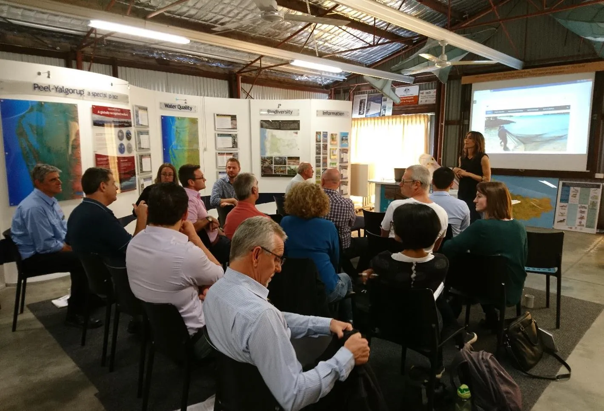
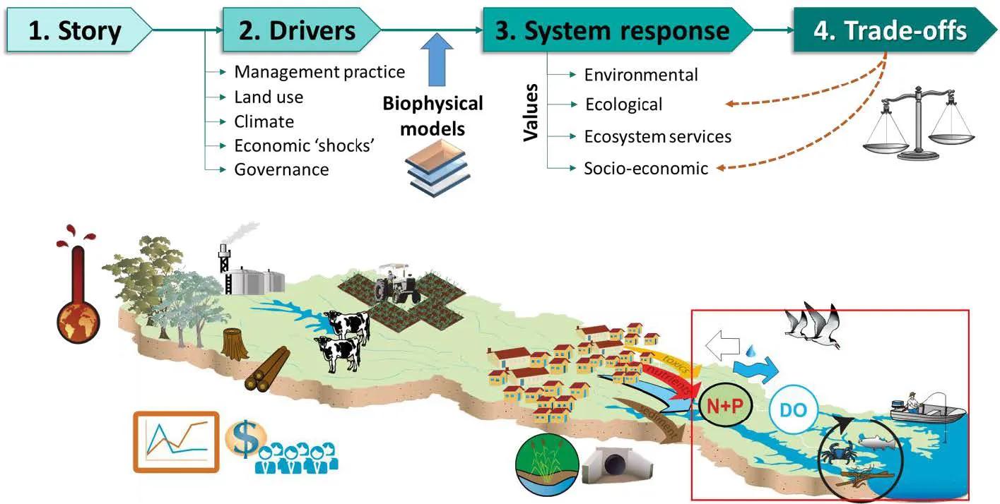
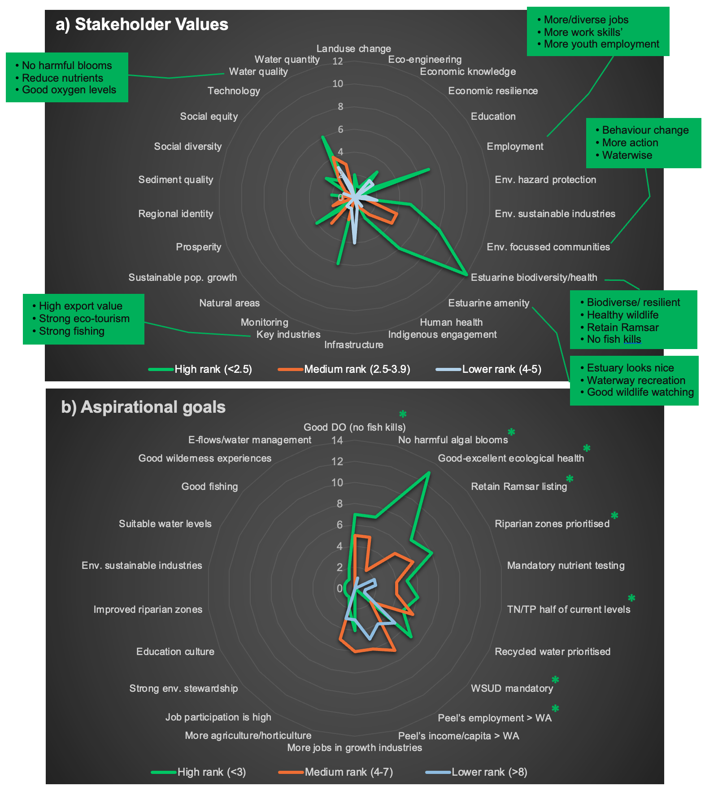

# (PART)  Decision Suppport System & Scenarios {-} 

# Estuarine and societal health trade-offs for the Peel-Harvey under 2050 scenarios {#healthscenarios}

<!-- ::: {.title_matter width="100%"} -->
<!-- [***Balancing estuarine and societal health in a changing environment***]{style="color:#5f543f"} -->
<!-- ::: -->

<br>

::: {.chapter-authors width="100%"}
**Matthew R. Hipsey^1^, Karl Hennig^2^, Fiona Valesini^3^, Kieryn Kilminster^2^, Peisheng Huang^1^, Brendan Busch^1^, Paul Plummer^4^, Michael Elliot^5^**
:::

::: {.author-info width="100%"}
^1^ Centre for Water and Spatial Science, UWA School of Agriculture and Environment, The University of Western Australia, Perth, Australia <br>
^2^ Department of Water and Environmental Regulation, Government of Western Australia, Perth, Australia <br>
^3^ Centre for Sustainable Aquatic Ecosystems, Murdoch University, Perth, Australia <br>
^4^ Centre for Regional Development, School of Social Science, The University of Western Australia, Perth, Australia <br>
^5^ Institute of Estuarine and Coastal Studies, University of Hull, Hull, United Kingdom
:::

```{r scenarios-pic1, echo = FALSE, out.width='100%', class = "title-image"}

```

<br>

## Abstract

::: {.body-text width="100%"}
The aim of this research was to develop a decision-support framework able to assist in understanding trade-offs between regional catchment development drivers (economic resilience) and the health of receiving estuarine waterways (environmental and ecological resilience). The framework reported is used to assess a series of scenarios that were designed after a stakeholder consultation process. These scenarios represented alternate future (2050) “*storylines*” that depicted different estuary health states, catchment development and management approaches and climate conditions for the Peel-Harvey system. These diverse views were synthesised into three main narratives (referred to as ‘environmentally optimistic’, ‘business as usual’ and ‘environmentally pessimistic’) and translated into coupled catchment-estuary model simulations. A range of novel environmental and economic indicators were then employed to assess the scenarios relative to a ‘base case’ (current conditions). 

From an environmental point of view, the scenarios tested show the overwhelming influence of a future dry climate on the flow of water to the estuary. While flows and nutrient loads are reduced, the flow-weighted nutrient concentrations remained fairly constant between matched land use scenarios that were subject to the two different climatic conditions. Catchment management actions were able to reduce the nutrients entering the estuary, with the most “environmentally optimistic” scenario able to reduce flow-weighted nitrogen by 24% and flow-weighted phosphorus by 69% compared to current conditions.  

The effect of climate change and land-use change for each scenario were compared by assessing the resulting differences in a range of water quality and ecosystem health indices. These indices also highlighted the relatively large change brought about by climate change (including sea level rise and catchment drying) into the future, which has the potential to significantly alter aspects of estuary condition, particularly on the eastern side of the basins and into the riverine reaches. Whilst some indices reported future benefits in some regions, overall the predictions indicated a more stressed system into the future and particularly exacerbated problems with hypoxia and harmful algal blooms in the rivers. The environmentally optimistic scenario did highlight, however, the potential benefit of sound catchment management on reducing negative impacts on the estuary and can help the adaptation process towards a drier future. The detailed model outputs are extensive and can be used to assist understanding of local changes and prioritise monitoring and management strategies. 

The scenarios were also assessed in terms of economic health. The framework for assessing economic health indicators is based on outputs from an econometrics model used to assess the historical and current regional job growth data. As such, the economic assessment did not seek to model long-term economic activity of individual sectors, but rather to provide a “systems view” of whether proposed stressors or actions would enhance economic specialisation, industry-linkages and job growth. Core indicators assessed for each scenario were therefore related to the comparative and competitive advantage of the regional economy, and a qualitative assessment of each indicator was made. 

To provide a holistic view of the relative environmental and economic status of each scenario, a further framework for supporting high-level decision-making was developed, able to link the varied drivers, pressures, actions, impacts and responses with locally relevant environmental quality and economic resilience indicators. The framework was applied to the three main stakeholder-led scenarios to demonstrate the trade-offs of decisions in a logical and transparent way. The assessment of the chosen scenarios highlights that actions to manage the health of the estuary can support long-term economic resilience by increasing export orientation and diversification. The newly developed framework shows potential for more widespread adoption for harmonising adaptation strategies between organisations by providing a common assessment approach for managing future risks. Further effort is required to operationalise the system in consultation with stakeholders. 
:::

## Introduction

::: {.body-text width="100%"}


People and estuaries are inextricably linked. These productive, safe and striking environments have long been attractive places to settle or visit due to the vast societal benefits they provide, such as food, protection, environmental buffering, lifestyles, livelihoods and connection to place. However, exploitation of their resources and the downstream impacts of over-development in their catchments has led to estuaries becoming among the most degraded of all aquatic ecosystems, which in turn threatens societal health. This close, reciprocal connection necessitates a socio-ecological view of these complex ecosystems, with the central question being *how do we best maintain the benefits provided by healthy estuaries, while also meeting the needs of our growing populations and supporting economic opportunities?* 

Successfully striking a balance or acceptable tradeoffs for the above question is a global issue, yet the pathways to achieving it are often poorly understood, rarely defined and seldom quantified. In part, this reflects the complexities of both estuaries and societies across multiple scales. It also reflects the fact that management of socio-ecological systems requires long-term thinking, yet the future is uncertain and our ability to learn from hindsight is often hampered by patchy long-term observations (Polasky et al., 2011; Carpenter et al., 2015). One way of dealing with these challenges, and offering informed insights into the socio-ecological tradeoffs we will have to navigate in the foreseeable future, is the process of ‘scenario development’. Scenarios are plausible stories about how the future may unfold based on known patterns, anticipated drivers, or alternative societal choices. Scenarios aren’t predictions, but instead are alternative futures that explore particular trajectories of change and possibilities for adaptation (Raskin 2005; Mahmoud et al., 2009). Scenario analysis connects storylines about the socio-ecological futures of most interest to stakeholders, with key drivers that ideally can be quantified (e.g. land-use mosaics, climate) and used as inputs for predictive models that capture the complexity of the human-natural system. This enables simulations about how the system is likely to respond from multiple perspectives and in turn assessments of the trade-offs between them, allowing decision-making to be tailored towards desired outcomes. This general process of scenario analysis has been used to guide strategic planning at the catchment scale in various cases around the world, albeit with differing objectives, supporting drivers, assessment methods and assumptions (e.g. Mahmoud et al., 2009; Bryan et al., 2011; Carpenter et al., 2015, Booth et al., 2016). 

The Peel-Harvey Estuary and its surrounding community provides a rich opportunity to explore forward-looking scenarios about the sustainability of this complex system, and guide smarter management choices that support this fast-growing region yet minimise impacts on its largest natural asset. The catchment-estuary system has rich environmental and ecological historical data sets (in some cases dating back to the 1970s or earlier) that have been brought together with extensive field sampling under the current ARC Linkage Project (e.g. Huang et al., 2019; Hallett et al., 2019; Valesini et al., 2019). Further work within the Linkage Project on local economic activity and the relative influence of external economic drivers supplements our socio-economic understanding of the Peel region (Plummer et al., 2019). Importantly, the coupled catchment-estuary model developed under other parts of the Linkage (Huang et al., 2019; Hipsey et al., 2019) provides the framework for synthesising the biophysical complexity of the system, and translating scenario storylines (via underpinning drivers) into expected estuary health responses. A further key part of the opportunity provided by the Peel-Harvey is the interest and investment by a diverse range of stakeholders in the future wellbeing of the region, both from ecological and socio-economic perspectives.

In line with timelines for regional land planning and development proposed by the State and Commonwealth governments to support the expected increase in Peel’s population (*Strategic Assessment of the Perth and Peel Regions* - ‘SAPPR’, released in 2015 as the *Draft Perth and Peel Green Growth Plan for 3.5 million* [Government of Western Australia, 2015] and currently under review), the future horizon we have selected for our socio-ecological scenarios is 2050. 
:::

### Objectives

With this in mind, the main objectives of this research study were to:

1) Identify which socio-ecological scenarios about the Peel-Harvey in 2050 are of most interest to Peel stakeholders to explore.
2) Translate each of the key scenario narratives into input data and parameters used by the coupled estuary-catchment model.
3) Forecast how key indices reflecting both estuary health and the broader societal health of the Peel region are likely to respond under each 2050 scenario, relative to the present (‘base case’).
4) Summarise the anticipated socio-ecological trade-offs under each 2050 scenario.

## Approach

### Identifying key stakeholder values and 2050 scenarios

#### Initial stakeholder workshop

::: {.body-text width="100%"}
A half-day workshop was held in June 2018 and attended by ~25 participants representing different management (State-local), community or scientific agencies with interests in the health of the Peel-Harvey Estuary and/or development of the Peel region. The main aims of the workshop were to understand, looking towards a future horizon of 2050, (1) which values were most important to maintain and (2) which plausible scenarios (or ‘stories’) were most important to explore. In providing their answers, stakeholders were asked to consider both the ecosystem health of the Peel-Harvey Estuary, and the socio-economic health of the broader Peel region.  

An introductory presentation was first provided to outline the scenario concept, beginning with a plausible ***story*** or narrative, then how this descriptive information could be translated into underpinning quantitative ***drivers***, which could be applied to the catchment-estuary model (Chapters 2-4) to predict ***response*** of the Peel-Harvey system from various perspectives (and particularly those reflecting stakeholder values). Comparison of system responses of interest would then enable ***trade-offs*** between them to be explored. A conceptual summary of this scenario approach is given in Fig. \@ref(fig:scenarios-pic2).
:::

::: {.body-text width="100%"}
```{r scenarios-pic2, echo = FALSE, out.width='100%', class = "text-image", fig.cap = "Summary of the main components underlying the scenarios concept that was adopted for exploring socio-ecological trade-offs in the Peel-Harvey system in 2050."}

```

Workshop participants were then asked to anonymously complete a survey (see Supplementary Material S11.1), considering what was important to them and their organisation more broadly, after guiding them through its main questions and their objectives. The four main questions in the survey were focused on the following: 
:::


<ol>
  <li>The most important  ***values *** to sustain in 2050, from an estuary health perspective and regional social and economic perspectives.
  </li>
  <li>The  ***2050 scenarios *** that were most important to explore for their possible impacts on estuarine and/or societal health. This question had two parts.
    <ol type="a">
      <li>Describing plausible ‘what-if’ stories of 2050 scenarios.</li>
      <li>Identifying specific combinations of catchment land-uses and/or management practices (and their implementation level) of most interest.</li>
    </ol>
  </li>
  <li>Ranking aspirational  ***goals*** for 2050.
  </li>
  <li>Specific  ***2050 estuary condition states*** (e.g. health status or environmental threshold) of most interest.
  </li>
</ol>


#### Distilling key values and 2050 scenarios  

::: {.body-text width="100%"}
*Values and Goals (Q1 and 3):* Written values, along with their ranks (1, most important, to 5, less important) were transcribed and assigned to broader categories that captured their main intent. The ranks made by each person in each category were averaged, then the number of averaged ranks falling into ‘high’ (ranks 1-2.5), ‘medium’ (ranks 2.6-3.9) and ‘lower’ (ranks 4-5) groups were counted. For the aspirational goals, ranks assigned to each of the 13+ goal statements were collated, then the number of ranks falling into ‘high’ (ranks 1-3), ‘medium’ (ranks 4-7) and ‘lower’ (rank >8) groups were counted. 

*2050 scenarios (Q2):* The 2050 stories (Q2a) described by each participant were interpreted by assigning statements within the narratives to broader categories, and counting the number of times each person mentioned each category type. These counts were then subjected to various statistical routines in the Primer v7 multivariate statistics software (Clarke and Gorley 2015) to cluster participants’ narratives into significantly different ‘story groups’, and determine which narrative descriptions best characterised each group.. For the 2050 land-use/management practice combinations (Q2b), scores representing the implementation levels (10, high implementation; 5, moderate implementation; 1, low implementation; 0 no implementation) for each land-use/management practice class (see section 11.4.2) were assigned to each person based on their narratives. Additional classes beyond those listed in Q2b were mentioned by some participants, which were also included in the collated data set and scored as above. These data, with a focus on the ‘high implementation’ level, were subjected to the same statistical routines as that for Q2a, resulting in significantly different clusters of catchment use and management, and an understanding of the land-uses and practices that best characterised each. 

*Estuary condition states (Q4):* Each narrative was interpreted as described for Q2a, and the counts in each broader category then summed and plotted. 
:::

#### Follow-up stakeholder workshop

::: {.body-text width="100%"}
A follow-up stakeholder workshop was held in June 2019 to present the key sets of values and scenarios distilled from the analyses undertaken in section 11.5.1, and outline the approach for interpreting those narratives as quantitative inputs for the coupled estuary-catchment model (section 11.5.2). Feedback from this workshop was used to refine the model drivers, which are outlined below.
:::

### Setting-up model drivers – defining future conditions

::: {.body-text width="100%"}
The coupled estuary-catchment model requires specific datasets (termed ‘drivers’) to undertake the 2050 scenario modelling. Three groups of drivers used by the catchment model were presented to the stakeholders to help guide scenario configuration.  
:::

<ol>
  <li>**Climate:** Current climate (derived from conditions observed from the 2006-2015 period) or a projected 2050 dry climate, which included anomalies for rainfall and potential evapotranspiration.
  </li>
  <li>**Land-use:** Land-use affects the amount of surface runoff and nutrients that are exported from the catchment to the estuary model. The following urban, agricultural and natural land-use classes were provided as options to workshop participants:
    <ul>
      <li>Urban</li>
      <li>Beef grazing</li>
      <li>Cropping</li>
      <li>Dairy</li>
      <li>Horses and lifestyle blocks</li>
      <li>Horticulture</li>
      <li>Industry, manufacturing and transport</li>
      <li>Intensive animal use</li>
      <li>Plantation</li>
      <li>Native vegetation</li>
    </ul>
  </li>
  <li>**Management practices:** Particular management actions applied to relevant land-uses can reduce nutrient export to the estuary model. The following 11 actions could be applied within the Peel-Harvey catchment, and were provided as options during the workshop:
    <ul>
      <li>Soil amendments</li>
      <li>Improved fertiliser management</li>
      <li>Improved fertiliser management and low water-soluble phosphorus fertiliser use</li>
      <li>Riparian zone rehabilitation</li>
      <li>Dairy effluent management</li>
      <li>Waste water treatment plant (WWTP) effluent management</li>
      <li>Point source management</li>
      <li>Water sensitive urban design (WSUD) in existing urban areas</li>
      <li>Septic tank removal</li>
      <li>Catchment revegetation</li>
      <li>Constructed wetlands</li>
    </ul>
  </li>
</ol>

::: {.body-text width="100%"}
In addition to the above drivers which were explored through the scenario selection, additional changes also need to be considered for the oceanic forcing of the system.  Sea level rise is estimated to continue towards the end of 21st century (IPCC, 2007; Kuhn et al., 2011), and by 2050 it is assumed 30 cm additional see level rise relative to the 2016 condition (see also Chapter \@ref(model-hydrology)). Alternate input files representing the 2050 sea level and temperature were therefore prepared accordingly. 
:::

### Assessing futute estuarine health under 2050 scenarios

::: {.body-text width="100%"}
The outcomes of the values assessment and scenario definition were used to generate plausible future inputs for climate, ocean and catchment conditions and management practices. These were used to run a coupled catchment-estuary water quality simulation for each scenario, spanning one hydrologic-year (April-April). 

Each scenario was assessed against a range of practical ecosystem service indicator metrics spanning water quality and ecosystem indicators (biogeochemical function and habitat condition). The ecosystem indicators were chosen to align with the values and attributes of the system highlighted through stakeholder consultation.  
:::

::: {.body-text width="100%"}
**Water Quality Indicators** - a range of metrics were considered, including: 
:::

- retention time, $\tau$
- salinity, $S$
- bottom oxygen, $DO_{bot}$
- total nitrogen, $TN$
- total phosphorous, $TP$, and
- chlorophyll-a, $TCHLA$

::: {.body-text width="100%"}
**Ecosystem Indicators** - a range of metrics were considered, including:
:::

- Net nutrient export/assimilation, $NEA$
- Composite index of water quality, $IWQ$
- Hypoxia likelihood, $HYP$
- Water clarity, $TUR$
- Harmful Algal Bloom index, $HAB$
- Crab Habitat Index, $CHI$
- Fish Community Index, $FCI$

<br>

::: {.body-text width="100%"}
For each of these variables we compared:
:::

- Changes in seasonal average conditions between scenarios, in order to explore spatial patterns in water quality attributes;
- Relative change (delta) for a given variable between two scenarios, presented as a map to highlight hotspot areas of change.
- Regional-scale or estuary-scale changes, in order to summarise and compare average conditions

::: {.body-text width="100%"}
For detail on the computational methodology for these attributes, refer to Supplementary Material S11.2.
:::

### Assessing future economic health under 2050 scenarios

::: {.body-text width="100%"}
The framework for assessing economic health indicators is based on the econometrics model used to analyse the historical regional job growth data (Chapter \@ref(econ)). The model has identified core attributes that can be used to determine the comparative and competitive advantage of the regional economy (Table \@ref(tab:econind)).  
:::

```{r econind, echo=FALSE, message=FALSE, warning=FALSE}
library(knitr)
library(kableExtra)
library(readxl)
  options(knitr.kable.NA = "")
Diff_tab <- read_xlsx('tables/peel_tables_scen.xlsx', sheet="econind")
  kable(Diff_tab[,1:3],"html", escape = F, align = "c"
        , caption = "<small>Summary of economic resilience indicators, and matching notation used in the regional econometrics model.</small>",bootstrap_options = "hover")%>%
   kable_styling(Diff_tab, bootstrap_options = "hover",
                full_width = T, position = "left",
                font_size = 11) %>% 
    
  row_spec(0, background = "#5f543f", bold = TRUE, color = "white") %>%
  column_spec(1, width_min = "10em" ,color="black",bold = F) %>%
  column_spec(2, width_min = "15em" ,color="black") %>%
  column_spec(3, width_min = "15em" ,color="black") %>%
  # row_spec(1:2, background = 'white')  %>%
 scroll_box(width = "40em",fixed_thead = FALSE)

  
```

::: {.body-text width="100%"}
The logic is that enhancing competitive and/or comparative advantage enhances economic performance (through job creation) and, hence, quality of life and standard of living. In turn, the overall competitive and comparative advantage of the Peel-Harvey depends on the pattern of industrial structure, which has been classified into key and strategic industries.  

For example, if the Peel-Harvey has a relative specialisation in fishing (which is part of the agriculture ANZIC industrial classification), and is assessed as being a rapidly growing industry, then it represents an important industry in terms of job creation and export growth and, hence, an important contributor to the quality of life.

In terms of economic “health”, we might think of this in terms of the impact on economic performance of changes in industrial structure, both in terms of the importance of each industry (number of jobs) and in terms of increasing/decreasing overall economic diversity.  The assumption is that more diverse economies are more resilient to future shocks and changes.

Scenarios are assessed from the point of view of how they are likely to impact each of these indicators in Table \@ref(tab:econind). 
:::

## Results & Findings

### Key stakeholder values and 2050 scenarios

> *Stakeholders most value an ecologically healthy estuary with good water quality, as well as 
environmentally-focused communities, high regional employment and strong growth industries* 

::: {.body-text width="100%"}
A synthesis of the main stakeholder values and aspirational goals, incorporating perspectives across both estuarine and socio-economic health, is shown in Fig. \@ref(fig:scenarios-pic3), along with a higher-level summary in Table \@ref(tab:shgoals). The most important value was clearly high estuarine biodiversity and accompanying health, which was also reinforced by the 2050 goals (Fig. 11.2a, b). Participants gave various responses that fell into this category, such as ‘good to excellent ecological health’; ‘biodiverse and/or resilient waterways’; ‘healthy wildlife’ (including fish, birds and/or dolphins); ‘healthy seagrass habitats’; ‘no/less major fish kills’ and ‘retaining Ramsar status’. Good water quality, underpinned by value and/or goal statements such as ‘no harmful algal blooms’, ‘TN/TP half of current levels’, ‘good dissolved oxygen levels’ ‘reduced contaminants’ was also ranked highly (Fig. 11.2a, b). :::

```{r scenarios-pic3, echo = FALSE, out.width='100%', class = "text-image", fig.cap = "Radar plots of the main categories of (a) stakeholder values and (b) goals, with their ranks assigned to high (most important), medium and lower groups. Values on concentric plot circles indicate the number of times a value/goal category was assigned to a rank group across all participants. ‘E/Env.’, environmental; ‘DO’, dissolved oxygen; ‘WSUD’, water sensitive urban design. Green text boxes provide example phrases of key values from participants, and asterisks denote key goals."}

```

::: {.body-text width="100%"}
Socially, a Peel community that was environmentally-focused (e.g. ‘behaviour change towards environmentally sustainable practices’; ‘better community engagement/education in improving estuarine health’; ‘waterwise community’) and had good amenity to the estuary (e.g. ‘the estuary looks nice’; ‘good waterway recreation’; ‘good wildlife watching’) was highly valued (Fig. 11.2a), with supporting highly-ranked goal statements (e.g. ‘mandatory water sensitive urban design’; ‘mandatory nutrient testing programs’; Fig. 11.2b). From an economic perspective, better employment opportunities (e.g. ‘higher and/or more diverse employment’; ‘increased work skills’; ‘increased youth employment’) and sustaining key industries (e.g. ‘high growth/export industries’; ‘strong fishing/eco-tourism industries’) were clearly important (Fig. 11.2a).

Table \@ref(tab:shgoals) further synthesises the key values and goals by combining several under umbrella statements that are likely to lead to a similar outcome. For example, if an ecologically-healthy estuary is attained (with accompanying ecological attributes like ‘high biodiversity’), it is envisaged that desired social outcomes such as ‘good wildlife watching’ will also be met, and probably that social actions such as ‘increased community engagement in estuarine health’ helped reach that status. Additionally, if estuarine water quality is good, social amenity (e.g. ‘estuary looks nice’, ‘good waterway recreation’) is probably also high. Key indices developed under the broader Linkage Project (see Supplementary Material 11.2), were also assigned as proxies for evaluating the extent to which the key values/goals are met, and are also included in Table \@ref(tab:shgoals). 
:::


```{r shgoals, echo=FALSE, message=FALSE, warning=FALSE}
library(knitr)
library(kableExtra)
library(readxl)
library(rmarkdown)
theSheet <- read_excel('tables/peel_tables_scen.xlsx', sheet="shgoals")
theSheetGroups <- unique(theSheet$Group)

kbl(theSheet[,2:NCOL(theSheet)], caption = "Summary of the most important stakeholder values and goals for the Peel in 2050, with their underlying key ecological and social attributes and proposed surrogate indices (Supplementary Material S11.2)", align = "c",) %>%
  pack_rows(theSheetGroups[1],
            min(which(theSheet$Group == theSheetGroups[1])),
            max(which(theSheet$Group == theSheetGroups[1])),
            background = '#ebebeb') %>%
  pack_rows(theSheetGroups[2],
            min(which(theSheet$Group == theSheetGroups[2])),
            max(which(theSheet$Group == theSheetGroups[2])),
            background = '#ebebeb') %>%
  pack_rows(theSheetGroups[3],
            min(which(theSheet$Group == theSheetGroups[3])),
            max(which(theSheet$Group == theSheetGroups[3])),
            background = '#ebebeb') %>%
  row_spec(0, background = "#14759e", bold = TRUE, color = "white") %>%
  kable_styling(full_width = F,font_size = 11) %>%
  column_spec(1, width_min = "19em") %>%
  column_spec(2, width_min = "19em") %>%
  scroll_box(width = "40em", fixed_thead = FALSE)
```


> Stakeholders most want to explore three 2050 scenarios, namely (i) good estuarine health, environmental stewardship and eco-tourism, (ii) a ‘business as usual’ approach and (iii) poor estuarine health outcomes, extensive urban development and amplified climate change 

::: {.body-text width="100%"}
Three main ***story groups*** were identified when participants’ narratives were statistically analysed to determine where the most natural yet significantly-different ‘breaks’ lay within the story compositions (CLUSTER and accompanying SIMPROF test, P <0.05). The ‘tree diagram’ in Fig. 11.3a presents these findings, illustrating how the various stories were split into successively smaller groups based on similarities in their compositions, with those splitting away at the top of the tree being the most different. Additionally, groups of stories marked by red lines indicate those containing no significant differences, meaning that finer splits into smaller groups at lower levels of the tree are essentially redundant. While five story groups were identified, two (‘a’ and ‘c’) contained only one story and were considered anomalies.

Further analyses to explore which particular combinations of narrative categories best characterised each story group are shown in Fig. 11.3b; simply, the darker the shading in this plot, the more frequently that narrative category was mentioned. There were clear differences in narrative among the three main groups. Story group ‘b’ obviously typified an ***environmentally-optimistic Peel in 2050***, underpinned by a strong focus by government, industry and community on improving estuarine health, leading to decreased nutrient flows to the estuary, ecologically-healthy and biodiverse waterways, high waterway amenity and a strong eco-tourism industry. Story group ‘d’, however, which was coined ‘***business as usual***’, mainly focused on understanding how the Peel socio-ecological system would look in 2050 under the level of population growth and catchment development footprint proposed in the Strategic Assessment of the Perth and Peel Regions (SAPPR). This State-Commonwealth initiative, which is currently under review, was released in 2015 as the Draft Perth and Peel Green Growth Plan for 3.5 million (Government of Western Australia, 2015) and aims to set the regional land planning and development directions to accommodate a projected 70% population increase by 2050. This story group also favoured no new implementation of management practices, and am ambivalent approach by government and industry towards estuarine health. The final story group (e) was mainly characterised by an ***environmentally-pessimistic outlook*** on the Peel in 2050, with common narratives around poor estuarine water quality, ecological health, fishing, waterway amenity and environmental stewardship across all sectors of society. Population growth and urban expansion was also higher than anticipated under the SAPPR, accompanied by an increase in agricultural development, and climate change effects were amplified. With regards to the two outlier stories ‘a’ and ‘c’, the first was characterised by a collapse of the beef and dairy industries, leading to a major population decline and ultimately a re-colonisation of agricultural land by natural vegetation, while the second was an extreme scenario of water scarcity across the region (Fig. 3b). 
:::

```{r scenarios-pic4, echo = FALSE, out.width='100%', class = "text-image", fig.cap = "(a) Cluster diagram illustrating how participant stories were grouped into significantly different ‘story groups’ (marked by red lines and coded with different symbols) based on similarities in their narratives. Groups ‘a’ and ‘c’ were considered to be outliers. (b) Shadeplots of each main story group, indicating their most characteristic narrative categories, i.e. those with darker shading on the grey scale, which have been further highlighted with the symbols for the story group they best typify."}
knitr::include_graphics("images/scenarios/picture4.png")
```

::: {.body-text width="100%"}
The specific catchment land-uses and/or management practices of most interest to the stakeholders (i.e. survey question 2b; Appendix 1) were also subjected to similar analyses to distil those ***catchment drivers*** that best underpinned the above story groups and could be readily parameterised in the catchment model. Four main groups were identified, along with three outliers represented by single responses that were not explored further (Fig. 4a). Of the four main groups, ‘a’ was focused on urban development (and specifically that proposed under the SAPPR development footprint) along with accompanying water sensitive urban design (WSUD), group ‘b’ focused on fertiliser and effluent (waste water, dairy management, irrigation and point source) management, group ‘c’ prioritised soil amendments and fertiliser management, and group ‘d’ centered on riparian zone rehabilitation (Fig. 4b).  

The outcomes of survey question 4, which was intended to uncover specific 2050 estuary condition states of most interest to the stakeholders, largely supported the findings from survey question 2. About 48% of the responses related to the ecological health of the estuary, with most concentrating on ‘good to excellent’ health and wanting to understand which catchment development and/or management practices would best support this (i.e. similar to the environmentally-optimistic story group above). A further 27% of responses related to estuarine water quality, with most wanting to explore estuary salinisation under anticipated or amplified climate change conditions, and the risk of harmful algal blooms (comparable to narratives within the environmentally-pessimistic story group). The remaining responses related to exploring the impacts on estuary condition of increasing riparian vegetation, maintaining a ‘business as usual’ approach to management, or increased bank erosion, most of which were covered under the story or catchment management groups identified in the analyses for survey question 2. 
:::

```{r scenarios-pic5, echo = FALSE, out.width='100%', class = "text-image", fig.cap = "(a) Cluster diagram illustrating how participant stories were grouped into significantly different land-use/management practice groups (those marked entirely by red lines and coded with different symbols) based on similarities in their narratives. Groups ‘a’-‘c’ were considered outliers. (b) Shadeplots of each main group, illustrating their most characteristic land-use/management practice categories, i.e. those with darker shading on the grey scale. The main categories typifying each group have been further summarised in the coloured text."}
knitr::include_graphics("images/scenarios/picture5.png")
```

::: {.body-text width="100%"}
Table 3 summarises the main 2050 scenarios distilled from the above consultation and data analysis process, capturing the three main story groups, their broad underpinning catchment and climate drivers, and the anticipated responses of the socio-ecological health indices chosen to reflect the key stakeholder values and goals (Table 2). 
:::

### Model drivers for each scenario

::: {.body-text width="100%"}
The calibrated catchment model was used to explore each of the above three scenarios under two different climate conditions. It was also used to characterise the current or ‘base case’ catchment land-use and management level to provide a benchmark for comparison. This resulted in eight separate scenarios, which are summarised in Table 3. 

<!-- BROKEN LINK -->

Full details regarding the base case model pararametisation (0a and 0b) are provided in Hennig et al. (in prep.). The base case took existing land-use (agriculture 5,140 ha, urban 240 ha, natural vegetation 4,000 ha), and applied two climate regimes – expected current climate (pre-2018) and forecast 2050 dry climate. 

**For the environmentally-optimistic scenario (1a and 1b)**, we assumed high phosphorus retentive fill would be used in all new urban developments. The urban footprint used was based on the planned urban development footprint (Fig. 5) provided in the [Draft Green Growth Plan](https://espatial.planning.wa.gov.au/mapviewer/Index.html?viewer=greengrowthplan). The ‘extensive catchment management’ applied in this scenario included: 
:::

-	**Soil amendments** – 100% of low phosphorus retentive index (PRI) soils.
-	**Riparian zone rehabilitation** - 337 km of fencing and revegetation (100% of riparian zones on the Swan Coastal Plain for maximum nitrogen removal).
-	**Fertiliser management with low water soluble phosphorus fertilisers** – 100% of beef and dairy farms.
-	**WWTP effluent management** – Waroona WWTP only.
-	**Point source management** – 100% of point sources (intensive agricultural land-uses).
-	**Dairy effluent management** - 25 farms (100%).
-	**WSUD in existing urban areas** – 100% of existing urban.

::: {.body-text width="100%"}
**For the business as usual scenario** (2a and 2b), planned urban development (as per the environmentally-optimistic scenario) in addition to the planned Peel Food Zone was included in the land-use change inputs of the model. The Peel Food Zone was included as 3,000 hectares of in-ground horticulture in the Nambeelup catchment, which resulted in a land-use change of beef farming to horticulture. No management actions were implemented in the model under this scenario. 

**For the environmentally-pessimistic scenario** (3a and 3b), planned urban development plus 5,625 hectares of additional urban development (Fig. 5) were modelled to represent urban growth in excess of that forecast in the Draft Green Growth Plan. We represented additional agricultural growth by doubling the area of annual horticulture (an additional 3,000 ha to the Peel Food Zone) which was placed in the north Dandalup catchment.
:::

```{r scenarios-pic6, echo = FALSE, out.width='100%', class = "text-image", fig.cap = "Planned urban expansion and assumed areas of additional urban growth in 2050 used for scenario modelling (see Table 11.4 for scenarios). NB: ‘Planning investigation’ areas (pink shading) refer to those regions where potential for urban development is being considered by the Department of Planning, Lands and Heritage under the Draft Green Growth Plan (Government of Western Australia, 2015)."}
knitr::include_graphics("images/scenarios/picture6.png")
```


### Catchment model scenario outputs

::: {.body-text width="100%"}
The average annual catchment discharge of flow and nutrients to the Peel-Harvey Estuary for each of the eight scenarios modelled are summarised in Table 11.5 and Fig. 11.6. The fate and impact of catchment runoff and nutrient loading is outlined in Chapter \@ref{model-water-quality} and discussed in section 11.5.4 below.

Comparison between the current and future climate scenarios showed that the 2050 dry climate reduced flow and nutrient loads to the estuary by approximately 50%. However, flow-weighted concentrations of nutrients (average annual nutrient load divided by average annual flow) were reduced by a much smaller amount, i.e. 7% for nitrogen and 9% for phosphorus. Flow-weighted nutrient concentrations are less sensitive to changes in hydrology and climate, and have been used to compare scenarios in this component of the study. In terms of these concentrations, there was little difference between the current and future climate for each of the scenarios, but differences were evident between scenarios. 

Urban development increased surface water runoff by approximately 5–10%, but had a negligible effect on nutrient runoff in all scenarios. Agricultural development resulted in an increase in nutrient runoff in scenarios 2 (business as usual) and 3 (environmentally-pessimistic) relative to the base-case. Flow-weighted nutrient concentrations were increased by approximately 13% (N) and 34% (P) in scenario 2, and were increased by 19% (N) and 43% (P) in scenario 3.

The environmentally-optimistic scenario resulted in a 24% reduction in flow-weighted nitrogen concentrations and a 69% reduction in flow-weighted phosphorus concentrations. Note that the management actions that were modelled in this scenario were targeted towards phosphorus. Approximately 58% of the phosphorus reduction was achieved from improved fertiliser management and soil amendments.  
:::
  
```{r scenarios-pic7, echo = FALSE, out.width='100%', class = "text-image", fig.cap = "Planned urban expansion and assumed areas of additional urban growth in 2050 used for scenario modelling (see Table 11.4 for scenarios). NB: ‘Planning investigation’ areas (pink shading) refer to those regions where potential for urban development is being considered by the Department of Planning, Lands and Heritage under the Draft Green Growth Plan (Government of Western Australia, 2015)."}
knitr::include_graphics("images/scenarios/picture7.png")
```


### Estuary health trajectories

::: {.body-text width="100%"}
The water and nutrient outputs from the catchment modelling created a characteristic set of estuary water quality and ecosystem indicators for each scenario. These are compared side-by-side in Figures 7-16 by looking at scenario predictions relative to the base-case (0a). The various indicators show a complex pattern of change due to: a) the changing climate (“a” vs “b”), and b) the changing land-use/land management scenarios (“0”, “1”, “2” and “3”).  

In general, the largest wholesale difference in water quality attributes and ecological indicators occurred between the “a” and “b” scenarios, highlighting the significance of sea-level rise and reduced catchment inflow volume on the overall pattern of water quality. The relatively low flow entering in the “1”, “2” and “3” scenario set meant that water quality was relatively insensitive to these at the estuary-scale. It must however be considered though that this is comparing a single flow regime and not fully assessing the range of future variability that could be expected. Further, the water quality response between the scenarios is evident in some regions more than others, particular in the rivers, as the increasing marinisation of the system is expected to take hold. 

For example, DO in shallow areas of the main lagoons is predicted to improve, whilst the rivers show a considerable decline, particularly the Murray River which is on average expected to be >2 mg/L lower than present. Nutrients were also varied across the domain, with slight reductions in some regions of the lagoons, but increases in the rivers that varied in accordance with the nutrient loading scenario (Figure 11). 
The variation of the key water quality attributes and ecological habitats in the scenarios are further summarized in Figure 17-20, in comparison with the outputs in the historical years, by reducing the indicators to a single annual value. The rivers (Figure 17-18) show higher salinity, water age and phytoplankton biomass, and lower DO in the “b” scenarios while the changes between the land management scenarios are relatively smaller. In comparison to the historical years, the “b” scenarios with dry climate is shown to have lower the IWQ, turbidity, and increased ecological habitat areas for crab and phytoplankton in the Serpentine River. Whilst in the “a” scenarios, these attributes are in comparable ranges with the historical years. The land management is shown to have a strong impact on the nutrient levels of the Serpentine River, where the mean TN and TP concentration are much higher in the “2” and “3” scenarios (with relatively higher concentration nutrient loading from catchment) than the “0” and “1” scenarios. The future scenarios favor the growth condition for cyanobacteria, and the “2” and “3” scenarios favor the growth condition for dinoflagellate.  Whilst in the Murray River, the “a” scenarios show more variation in the nutrient levels, although the nutrient concentrations in the “b” scenarios are relatively higher than the “a” scenarios. The habitat area stays stable for cyanobacteria, but improves for dinoflagellate. The habitat area for juvenile in the “b” scenarios are relatively lower to the “a” scenarios, but for adult crab are higher.  

The lagoons illustrate different behaviour to the rivers in the scenarios (Figure 19-20). Although the IWQ still decreases in the scenarios when compared to historical years, the habitat area for cyanobacteria has dropped to nearly zero, while the habitat area for dinoflagellate stays relatively stable. The dry climate in the “b” scenarios is shown to lower the juvenile and dinoflagellate habitat areas but increase the adult crab habitat area. The “b” scenario has more impacts on the Harvey Lagoon than the Peel Inlet in terms of crab and dinoflagellate habitat areas. Whilst in the Peel Inlet, the differences of the habitat areas between the “a” and “b” scenarios are relatively smaller, indicating the Peel Inlet is relatively insensitive to the climate change. The mean DO in the lagoons has improved although the nutrient levels are still high in the scenarios. 

The total amount of nutrient loading and export in the scenarios are relatively small compared to the historical years, yet the ratios of nutrient retention to the catchment loading show similar trends to the historical years in the post-Cut period (Figure 21-22). The “b” scenarios have less nutrient loading when compared to the “a” scenarios and the historical years due to the drier climate. The estuary is shown to net export the nutrients in these scenarios when the ocean flushing exceeds the catchment inputs. 
:::

### Economic resilience 

::: {.body-text width="100%"}
The dynamics and drivers of local competitiveness and comparative advantage shape a regional economy’s responsiveness to externalities (i.e. resilience), and can help explain the underlying forces leading to ‘catch-up’, ‘falling behind’ and ‘forging ahead’ trajectories (Plummer et al. 2019). The three main scenarios reported in the previous sections (1,2,3) have been considered through this lens, and according to the analysis framework previously reported.  

An example of the assessment of economic indicators for each scenario is described in Tables 5–7. 
:::

## Balancing Trade-offs Between Economic and Environmental Health

::: {.body-text width="100%"}
To ultimately facilitate decision-making a holistic view of scenarios is required that can link the environmental health and economic health indicators in a linear decision support logic (Figure 23). Rather than adopting detailed analysis of specific economic activities, profitability and ecosystem service monetization, we instead consider the system from a resilience point of view, and in our assessment seek to answer the following questions: 
:::

-	*Does the option promote job creation (e.g., by focusing export-oriented growth industries)?*
-	*Is the option diversifying the economy (e.g., promoting macro-economic resilience)?*
-	*Does the option lead to environmental decline, and is the decline likely to impact economic activity, or community sensitivity towards industry?*
-	*Is the option likely to induce negative feedbacks between economy and environment (e.g., strong coupling can accelerating links, likely leading to degradation)?*
-	*How sensitive is the option relative to exogenous drivers (climate change or external economic shocks)?*

::: {.body-text width="100%"}
For this purpose, we begin by adopting a modified Driver-Pressure-State-Impact-Response (DPSIR) coastal management framework as the basis for linking drivers, actions and responses to the state of system (Elliott et al. 2017). Specifically, the more comprehensive DAPSI(W)R(M) framework (hereafter DAPSIWRM) was employed and configured for the Peel-Harvey catchment-estuary system to structure the effects of changes to the natural system on the varied human uses and benefits of the marine system, and vice-versa. The utility of this approach is its ability to combine various exogenous (external) and endogenous (internal) drivers across multiple scales, in a way that clearly depicts the feedbacks and inter-relationships that develop in a what is a complex Socio-Ecological-System (SES), structured using an established logic. For the Peel-Harvey catchment-estuary system feedbacks and linkages occur between environmental quality and economy, though highlighting that not all economic growth in the region is directly connected to the environment directly (Figure 24). 

Whilst the SES feedback diagram depicted above is useful for contextualizing the varied pressures, actions, impacts and responses that are occurring in the coupled system, it remains difficult to develop a dynamic model connecting environment and economy in a way that is quantitative and can easily support decision making. In particular, large ambiguity in specifying response functions linking environmental and socio-economic system elements and inadequate socio-economic data to fully parameterise such a model would lead to predictions that are too uncertain for long-term prediction, which is a known challenge of dynamic socio-ecologic models (Elshaefi et al., 2015).  

Therefore, to operationalise the framework as a decision support tool we introduce a modified Bow-Tie method (Cormier et al., 2019). The core structure of the framework is presented generically below in Figure 25. Traditionally, the Bow-Tie method is used for risk analysis to understand how changes or actions that may create risk could be isolated, controlled and eliminated. This logic makes sense in the context of coastal management as we ultimately seek to eliminate risks to the environment (e.g. poor water quality) or risks to the community (e.g., industry decline and job loss). The approach presented in Cormier et al. (2019) is an interesting option as takes an ISO-compliant risk management framework to coastal ecosystem decline, and at its core is therefore designed from the point of view of supporting managers to make the right decision to reduce risk to an asset in the face of 

“escalating” factors – in our case the drivers changing the system. This method is however relatively new in this context and there are limited examples how this can integrate risks to the environment and economy in a tractable way. Further, it has been identified that rather than aiming for sustainable management to reduce risk, we could consider from the counter point of view, which is to maximise opportunity (e.g. for economic growth). In essence, at the core of our decision making to balance trade-offs, is a desire to a) reduce risk to vulnerable assets (e.g., the environment) and enhance opportunity to improve regional competitiveness (e.g., through job growth). Therefore, in our context, we have developed a revised Bow-Tie decision support framework that is able to highlight how escalating factors (drivers and actions) are either reducing our ability to realise an opportunity, or creating vulnerability in a valued asset, and therefore need to be managed. Management of the system (right-side of the Bow-Tie) is supported through undertaking adaptive measures and tracking progress against environmental and economic indicators that are known to adequately describe system function from the decision-makers point of view (Figure 25). 

The structure presented above is generic, but can be tailored to specific “assets” and/or specific escalating factors (e.g., how is climate change escalating risks associated with hypoxia?). This way a standard logic can be used to assess the varied stressors on the system. However, inherently the Peel-Harvey catchment-estuary system is inherently complex facing multiple stressors, all impacting on a wide array of system attributes of relevance to management. We therefore applied the general framework in Figure 25 to align it with the varied issues and indicators raised by the project team and stakeholders in Table 2 (Figure 26). The diagram exemplifies how the wide range of policies, plans and actions being undertaken by local agencies can be structured in a standard way.  This can ensure consistency between management plans identified at the project or organisation level, whilst encouraging a common approach to risk and opportunity identification, and how they are monitored, evaluated and reported. We also highlight that, whilst we have aimed to be as comprehensive in coverage of this framework as possible, the framework presented here may require further refinement and inclusion as it becomes operationalised. A process of auditing relevant LGA policies and management plans relevant to Peel-Harvey catchment-estuary system is therefore recommended to allow for continual revision of framework.  

As a demonstration of the decision-support framework for the specific scenarios identified during our stakeholder consultation process, and the subsequent analysis in Section 5.1, we visually depict the scenarios 1, 2 and 3 in Figures 27-29, by linking the identified drivers and management measures with the reported environmental and economic indicators. The results demonstrate that the environmentally-optimistic scenario can provide the best option for growth through encouraging diversification in export oriented industries and improving the specialisation of agriculture. 
:::

## Conclusions

::: {.body-text width="100%"}
The challenge for decision-making is understanding how drivers and pressures acting over diverse scales will impact on environmental and economic health. This chapter outlines a framework this assessment, specific for the Peel-Harvey catchment-estuary system. 

Based on a synthesis of stakeholder values, the catchment model was used to compare three catchment management scenarios (environmentally-optimistic, business as usual, and environmentally pessimistic/economically optimistic), under two climate regimes (current and 2050 dry).  Climate had an overwhelming influence on reducing flows to the estuary (approximately 50%) and this resulted in a similar reduction in the load of nitrogen and phosphorus in the future climate (2050 dry) compared to the current scenarios. Since nutrient loads and flow were reduced by the same proportions, this means that the average concentrations of nutrients in the water (i.e. flow weighted concentrations) were not affected by the influence of future climate projections. There were significant differences between the catchment management scenarios, with the environmentally-optimistic scenario demonstrating significant improvements with 24% reduction in flow-weighted nitrogen concentrations and a 69% reduction in flow-weighted phosphorus concentrations. 

Linking these results to the estuary response model was undertaken for each scenario. Comparing the scenarios allowed us to disentangle the future changes brought about by climate change (sea level rise, reduced flows) and catchment changes. The projected changes due to climate change were notable, and, due to the decreasing catchment loads, the relative difference between catchment management alternatives were not as striking as originally hypothesised when the scenarios were designed.  

To enable a holistic comparison, we then created a DSS by linking the DAPSIWRM system framework with environmental and economic indicators. For this purpose a ISO compliant risk analysis framework was adapted to help logically structure the various activities to enable a transparent process for assessing the trade-offs between scenarios.  

Assessment of the scenarios using this framework has clearly highlighted that the time for adaptation is now. Some environmental indicators show benefits, but generally the future poses risks that require adaptive management. Decline in catchment flows will manifestly change the nature of our rivers and concentrate poor water quality. Estuary water requirements need to be defined and employed as soon as possible to prevent further decline of the rivers in low flow years. Notably, catchment management will help adaptation to the drying trend. Changes in hydrology mean that traditional nutrient targets could be revised.  

Environmentally-sensitive land management and development priorities can encourage long-term economic resilience, but needs to be balanced with export-oriented activity to retain competitiveness such as technological innovation in agriculture, mining opportunities and tourism growth. Adaptive measures to enhance regional investment in growing and under-developed industries could be identified to encourage diversification. The drying climate may provide the Peel region a comparative advantage, encouraging tourism and attracting skilled labour, however, this opportunity is also a vulnerability. 
:::


## Data availability & supplementary materials

Data used for the model scenario simualtions and supporting the conclusions of this analysis are available in the Peel ARC Linkage Project Github repository (Busch et al., 2023). 

Supplementary materials for this chapter are available <here>.

## Acknowledgements 

::: {.body-text width="100%"}
We would to thank all of our research partners and wider Peel stakeholders who participated in our scenarios workshop, and shared their thoughts and visions for the Peel region in 2050. 
:::
