# Sediment condition in the Peel-Harvey Estuary

::: {.title_matter width="100%"}
[***Balancing estuarine and societal health in a changing environment***]{style="color:#5f543f"}
:::

::: {.chapter-authors width="100%"}
**Chris Hallett^1^, Fiona Valesini^1^, Sorcha Cronin O'Reilly^1^, Kieryn Kilminster^2^, Naomi Wells^3^, Brad Eyre^3^**
:::

::: {.author-info width="100%"}
^1^ Centre for Sustainable Aquatic Ecosystems, Murdoch University, Perth, WA <br> ^2^ Department of Water and Environmental Regulation, Perth, WA <br> ^3^ Centre for Coastal Biogeochemistry, Southern Cross University, Lismore, NSW
:::

```{r sediment-pic1, echo = FALSE, out.width='100%', class = "title-image"}

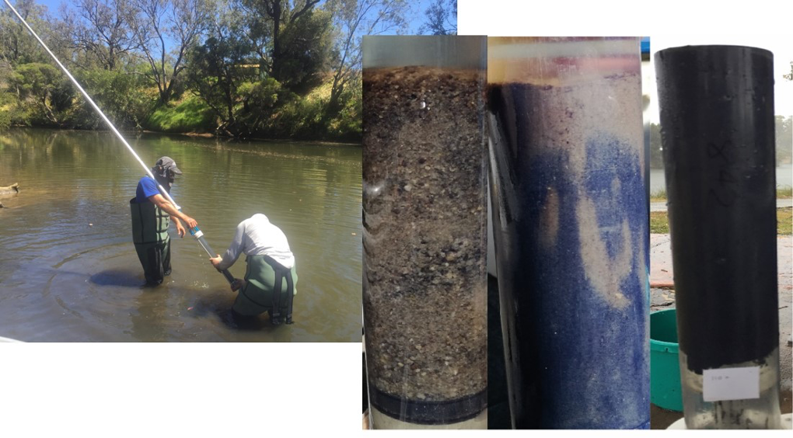

```

## Executive Summary

The enrichment of sediments with nutrients and organic matter is a key stressor of the health of the Peel-Harvey Estuary. Its rivers drain extensively cleared catchments and have long brought large quantities of organic matter, fine sediments (mud) and dissolved nutrients, including nitrogen and phosphorus, into the system. These inputs impact the condition or health of the estuarine sediments, including their particle size and porosity, oxygen content and nutrient processing abilities. In turn, these changes can degrade water quality, impact biota that live on or in the sediments, and subsequently, lead to a host of diminished societal benefits from the estuary.

The enrichment and resulting health of the sediments in the Peel-Harvey have long been of interest, with the first intensive surveys conducted in the 1970s and highlighting high levels of organic matter, nitrogen and phosphorus throughout large parts of the basins. More recently, concern has been growing over the extent and impacts of fine sulfidic sediments, or so-called monosulfidic black oozes. Despite these concerns, two decades have passed since the last broad-scale survey of sediments in the estuary, and the condition of sediments in the estuary's rivers, in particular, has been poorly documented.

This study aims to address these gaps in our current understanding of sediments throughout the estuary, and particularly to assess the impacts of enrichment on the health of its sediments. Specifically, we describe and test a novel approach (a 'Rapid Assessment Protocol' or RAP) for quickly and cost-effectively scoring sediment condition based on its colour, texture and odour, which could be used for future monitoring of sediment health in this system. The accuracy of the RAP was verified by comparing it to various detailed sediment enrichment attributes that we measured from samples collected across the estuary basins and rivers. This report provides a broad summary of our key findings, and is supplemented by a more detailed and technical account in @hallett2019rapid .

Our findings show that the RAP provides an excellent measure of sediment enrichment and its broader effects on sediment condition throughout the Peel-Harvey, with a particularly high success rate (\>88%) of identifying 'good' sites with low enrichment. Sediments throughout large parts of the system are moderately to highly enriched with carbon and nitrogen, particularly in the deeper, muddier waters of the Harvey Estuary, which negatively impacts their condition. Sites with low levels of enrichment were typically coarse-grained, well oxygenated sands with little to no odour of hydrogen sulfide, and were mainly found in the shallower, nearshore waters of the basins and the middle to lower reaches of the rivers. In contrast, highly enriched, poor condition sediments were typically oozy, grey/black muds with little to no oxygenated layer and a moderate to strong hydrogen sulfide odour. The unhealthiest sediments (monosulfidic black oozes) were found in the Yunderup Channel, the southeast corner of Peel Inlet and the upper estuarine reaches of the Serpentine and Murray rivers. More detailed investigations of the sediments in navigation channels and other depositional areas in the estuary, using the RAP described here, are recommended to better understand flow-on effects for broader estuary health.

To better assess the ongoing health of sediments throughout the estuary, and how activities such as dredging may impact sediment and broader estuarine health, we recommend that a consistent and regular sediment monitoring program is implemented alongside other environmental monitoring of the estuary. The RAP that we have developed, with its simple scoring system and predictive framework for classifying the sediment condition of any new site, provides a cost-effective tool for such monitoring.

## Background

The enrichment of sediments with nutrients and organic matter is a key stressor of the health of the Peel-Harvey Estuary, as is the case for many eutrophic estuaries throughout the world. This predominantly reflects the extensively cleared river catchments that drain into the estuary, bringing large inputs of organic matter, fine sediments (mud) and dissolved inorganic nutrients including nitrogen (N) and phosphorus (P) from surrounding agricultural and urban areas [@mccomb1992loss; @kelsey2011hydrological]. The resulting enrichment can impact the condition of sediments, their biogeochemistry and nutrient cycling processes [Fig. 1, @burdige20115], and thereby the ecology and ecosystem services they support [@hale2016eutrophication]. Organic matter is decomposed by microbes in the sediment, increasing sediment oxygen demand and creating hypoxic (low oxygen) or anoxic (no oxygen) conditions. Enriched, hypoxic sediments typically act as sources of inorganic nutrients such as phosphates and ammonium to the water column, potentially stimulating harmful algal blooms [@conley2007long]. They can also accumulate toxic hydrogen sulfide, leading to impoverished benthic faunal communities living in or on the sediment [@kanaya2016effects]. At the extreme end of the enrichment continuum are anoxic, organic-rich muds known as monosulfidic black oozes (MBO), which occur in parts of the Peel-Harvey Estuary [@kraal2013iron]. These sediments can be a significant source of methane, a potent greenhouse gas, and may have significant negative ecological impacts when disturbed [@sullivan2002acid].

A key challenge for estuary managers and scientists, which this study aimed to tackle, is how to quantify and monitor sediment condition throughout the Peel-Harvey in a timely and cost-effective manner. Intensive studies in the late 1970s to late 1980s revealed high concentrations of P, N and organic matter in surface sediments of the Peel-Harvey [@gabrielson1980sediment; @mccomb1998spatial]. Contrary to expectations, a subsequent study in 1998 following the opening of the Dawesville Cut found little change in sediment nutrient or organic matter concentrations from pre- to post-Cut periods. More recently, concern has also been growing over the extent and potential impacts of fine sulfidic sediments (MBOs) in the estuary, and particularly around the consequences of dredging these muds during maintenance operations [@valesini2019peel]. Despite these concerns, it has been almost two decades since the last broad-scale survey of sediment condition and biogeochemistry throughout the estuary. Most previous studies have also focused on the estuary's basins, with only limited surveys in the rivers. Our study sought to address these knowledge gaps by developing and validating a rapid and cost-effective approach for measuring sediment condition that could support a future monitoring plan.

We undertook a broad-scale survey of sediments at almost 100 sites throughout the estuary basins and rivers in November-December 2016. We collected (i) scored data on sediment colour, texture and odour; (ii) quantitative measurements of sediment enrichment (total carbon, TC; organic carbon, OC; total nitrogen, TN) and grain size, and (iii) C and N isotopes, to better understand how human activities may have impacted the estuary via chronic or acute enrichment. This sediment data also provided key 'base layers' for the estuary biogeochemical model developed in other parts of the Linkage Project [see @huang2019integrated]. The specific study objectives were as follows.

## Objectives

1)  Develop and apply a simple and rapid approach (a Rapid Assessment Protocol; RAP) for characterizing sediment condition, based on scores for sediment colour, odour and texture, throughout the Peel-Harvey Estuary.

2)  Evaluate whether the RAP condition scores reliably reflect the extent of sediment enrichment, as determined by complementary, detailed measurements of TC, OC and TN throughout the estuary.

3)  Quantify the influence of water depth, %mud and enrichment on sediment condition, and summarise these relationships via spatially interpolated maps.

4)  Use complementary sediment isotope data to identify zones of chronic vs. acute nutrient enrichment.

```{r sediment-pic2, echo = FALSE, out.width='40%', class = "text-image", fig.cap = "Core with oxygenated sediment (grey/ brown) and anoxic sediment (black) (Photo, C. Hallett)."}

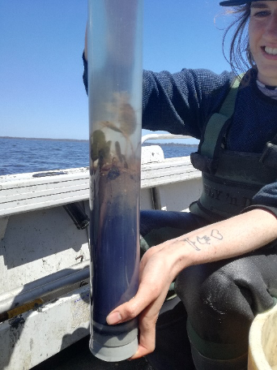

```

```{r sediment-pic3, echo = FALSE, out.width='100%', class = "text-image", fig.cap = "Conceptual model of the effects of progressive enrichment with organic matter (OM) and nutrients on sediment condition and biogeochemistry (from Hallett et al., 2019). Increasing enrichment leads to declining sediment condition, including a shift from (a) oxic to (c) anoxic conditions. This disrupts nutrient cycling between the sediment and overlying water and leads to the accumulation and potential release of inorganic nutrients (ammonium, phosphates) and toxic sulfides. (aRPD – apparent Redox Potential Discontinuity, which reflects depth of oxygen penetration into the sediment)."}

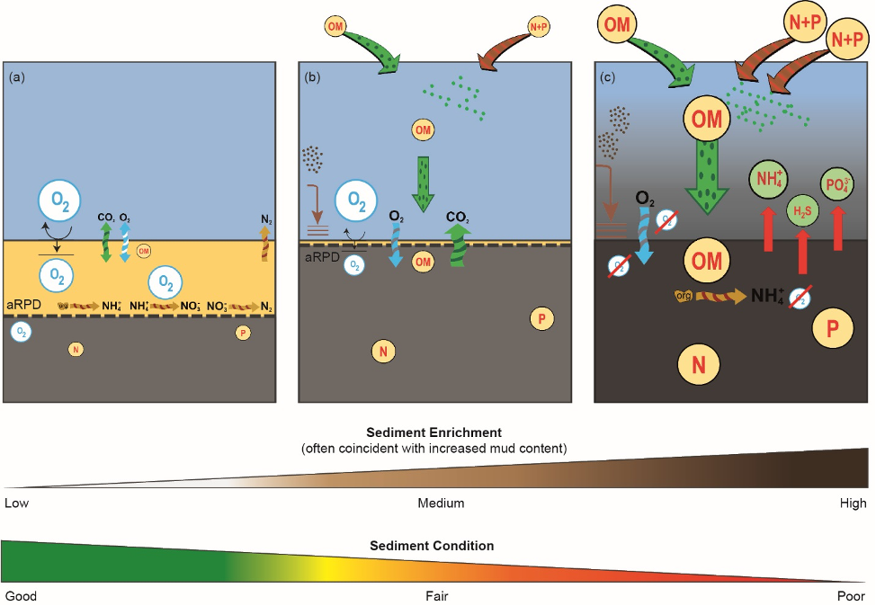

```

## Approach

## Rapid Assessment Protocol for evaluating sediment condition

#### Sample collection

A wide-scale sediment collection program was undertaken across 97 sites throughout the estuary during November-December 2016, comprising 62 sites in the basins (Peel Inlet and Harvey Estuary) and 35 sites across the estuarine reaches of the Serpentine and Murray rivers (Fig. 2).

At each site, two replicate, intact sediment cores were collected using a corer with a detachable, transparent PVC tube (600 mm long and 60 mm in diameter). The intact cores were then briefly stored in the dark until processed as described below. Water depth (m) was also recorded at each site.

#### Rapid assessment of sediment condition characteristics

A rapid, semi-quantitative assessment of sediment condition was undertaken on each replicate core, based on sediment colour, texture and odour. Each of these characteristics was scored from 0--5 (Table 1), reflecting poor to good sediment condition as outlined in Fig. 1. The scores for these three RAP variables were then summed to provide a total RAP score (0--15) for each core. Scores for replicate cores were then averaged to generate site-level RAP scores for data analysis. Further details on the RAP approach and all of the following analyses can be found in Hallett et al. (2019).

#### Quantitative assessment of sediment enrichment and other parameters

In the field, pooled subsamples of sediment were collected from each pair of replicate cores and stored at −18 °C prior to subsequent analysis. Sediments within 2 cm of the sediment surface were analysed for %TC, %OC, %TN and stable isotopes of nitrogen (δ^15^N) and carbon (δ^15^C) using an isotope ratio mass spectrometer, and those within 5 cm of the surface were analysed for particle size composition using a hydrometer. For particle size, the masses of each sample comprised of gravel (\>2 mm), sand (50 µm--2 mm), silt (2--50 µm) and clay (\<2 µm) were expressed as percentages, then the silt and clay fractions were combined to produce a measure of the fine sediments at each site (%mud). Full details of the laboratory analyses are provided in Hallett et al. (2019). For details on the isotope analyses see Smith et al. (2016).

```{r sediment-pic4, echo = FALSE, out.width='75%', class = "text-image", fig.cap = "Map of the sites at which sediments were sampled in the Peel-Harvey Estuary in 2016."}

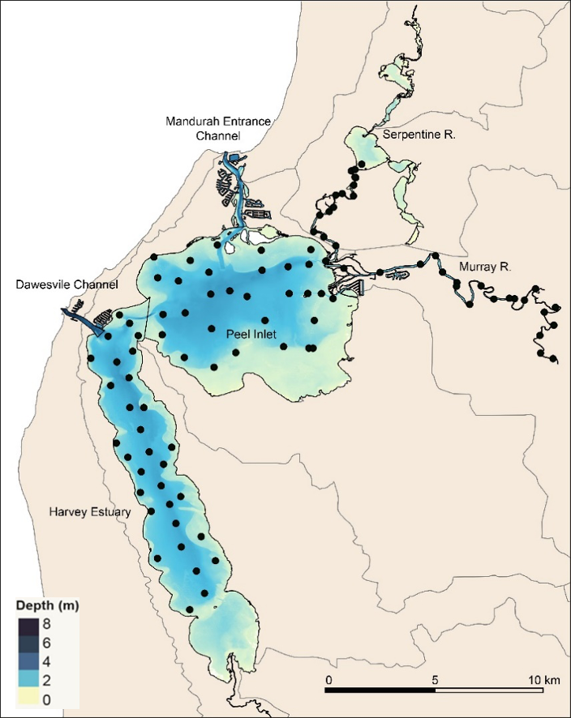

```

#### Data analyses

The following briefly summarises the intent of the main statistical analyses of the sediment data. @hallett2019rapid describes in detail all data pretreatments, statistical routines employed, test designs and routine settings. Most data analyses were undertaken in the Primer v7 multivariate software [@clarke2015getting] with the PERMANOVA+ add-on module [@gorley2008permanova]. Spatial mapping of sediment parameters and RAP results throughout the estuary were undertaken in QGIS 2.18. Guides for interpreting the main outcomes of these analyses are provided in the 'Main Findings' section.

All sites were firstly statistically ***classified into sediment enrichment classes*** (Low, Medium, High) based on their %TC, %OC and %TN measurements. The extent to which the RAP scores (collated from sediment colour, texture and odour) differentiated among sites assigned to the three enrichment classes was then tested. As these tests showed an excellent alignment between sediment enrichment and RAP condition, all sites were then ***classified into sediment condition classes*** (Good, Fair, Poor).

To broaden the usefulness of the RAP approach beyond the current study, easy-to-use 'decision trees' were developed for ***predicting the condition class*** of any new site in this system based solely on its RAP scores for colour, texture and/or odour. Separate analyses were undertaken for river and basin sites to account for natural regional variation in sediment colour, texture and odour.

Finally, the influences of water depth, %mud and enrichment on sediment condition were quantified, and ***summarised using spatially interpolated maps***.

## Main Findings

### Evaluating the Rapid Assessment Protocol for sediment condition

> ***The RAP is an accurate and cost-effective measure of sediment enrichment and its broader effects on sediment condition***

Sites throughout the estuary differed widely in their sediment enrichment (organic matter and nutrients) and mud contents. Sediment TC, most of which comprised OC (a proxy for organic matter), ranged from 0.07-7.85%, whilst TN ranged from 0.01-0.90%. The mud content of sediments ranged from 1-86%, with a mean of \~29%. Statistical clustering of these enrichment measurements at the 97 sites surveyed [see @hallett2019rapid] resulted in three, highly distinct groups of sites representing Low enrichment (59 sites), Medium enrichment (34 sites) and High enrichment (4 sites) classes. Sites in the High enrichment class had enrichment levels 10--15 times higher than those of the Low class (based on median values for TN, TC and OC; Fig. 3).

```{r sediment-pic5, echo = FALSE, out.width='75%', class = "text-image", fig.cap = ". Box and whisker plots of %TN, %TC and %OC values across all Low, Medium and High enrichment sites throughout the Peel-Harvey Estuary. Horizontal lines in each box represent median values, and whisker endpoints are high/low extreme values."}

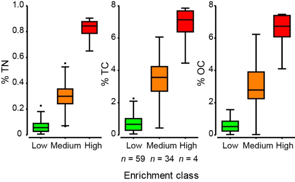

```

With respect to the sediment attributes that were scored using the RAP, very clear differences in colour, texture and odour were observed among sites (Fig. 4). Based on their scores across these three attributes, 35, 25 and two sites of the 62 surveyed across the basins were classed as in Good, Fair and Poor condition, respectively. Among riverine sites, 27 were in Good condition, six were Fair and two were Poor. The patterns in RAP scores among these condition classes differed slightly between basin and river sites. In the basins, colour and texture scores declined consistently from Good (median scores of 4) to Poor (median scores of 0), as did total RAP scores (Fig. 5a). In contrast, riverine sites in Fair and Poor condition showed similarly low colour and texture scores (median ≤1) and total RAP scores (Fig. 5b). Low odour scores were largely restricted to basin and river sites in Poor condition (medians of 1.5 and 1, respectively).

```{r sediment-pic6, echo = FALSE, out.width='50%', class = "text-image", fig.cap = "Cores of sediments classified as (a) Good, (b) Fair and (c) Poor condition based on their Rapid Assessment Protocol (RAP) scores for sediment colour, texture and odour."}

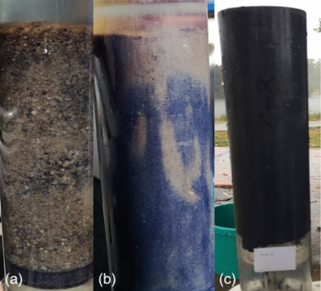

```

```{r sediment-pic7, echo = FALSE, out.width='100%', class = "text-image", fig.cap = "Box and whisker plots of sediment colour, texture, odour and total Rapid Assessment Protocol (RAP) scores among sites classified as being in Good, Fair and Poor sediment condition, across (a) basins and (b) rivers. Horizontal lines in each box represent median values, and whisker endpoints are high/low extreme values."}

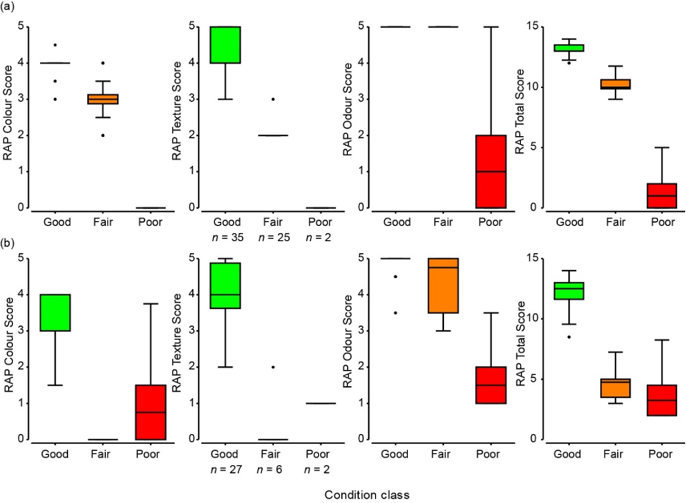

```

The RAP was shown to provide a highly useful proxy for assessing the degree of sediment enrichment and its broader effects on sediment condition throughout the estuary. A summary of the statistical method used to test this relationship is shown in Fig. 6, with the key outcomes of the test (known as 'Canonical Analysis of Principal Coordinates', or CAP) as follows. A guide for interpreting the CAP plot is given below, and further details are in @hallett2019rapid.

1.  There was a strong association between the RAP scores of sediment condition and the quantitative enrichment classes (low, medium and high), i.e. correlations of 0.62--0.78.

2.  Sites grading from low through to high enrichment were best explained by differences in sediment texture (grading from grainy sands to oozy muds) and colour (grading from yellow/brown to black), with high enrichment sites also being particularly linked with strong odours.

3.  RAP scores differed significantly among the enrichment classes, and correctly identified the right enrichment class for sites \~84% of the time. The RAP was particularly successful (\<12% misclassification rate) at identifying sites with low enrichment, demonstrating its promise as a first-pass survey approach for identifying 'least impacted' reference or control sites to support future impact assessments.

Broadly, to interpret the CAP plot in Fig. 6: (1) the points on the plot represent the survey sites, which are each colour-coded by their enrichment class (low, medium and high) and labelled with their condition class (black labels; good, fair and poor) -- simply, sites lying close together on the plot have more similar condition *and* enrichment characteristics than those further apart; (2) site differences in sediment condition and enrichment were well 'explained' by two main gradients -- the horizontal axis (CAP1) and vertical axis (CAP2). The blue lines (vectors) overlaid on the plot show the roles played by each of the RAP characteristics in helping to explain those site differences. Thus, sites grading from low to high enrichment (and good to poor condition) from left to right along CAP1 were associated strongly with decreasing RAP scores for sediment texture and colour (i.e. vector lines lying mainly parallel to CAP1) and to a lesser extent odour (vector line at a sharper angle to CAP1). Moving from the bottom to the top along CAP2, the greatest separation of sites was seen for those in the high enrichment class. The RAP vector most strongly linked with this separation was odour, reflecting stronger smelling sediments in the high enrichment class.

```{r sediment-pic8, echo = FALSE, out.width='75%', class = "text-image", fig.cap = "Canonical Analysis of Principal Coordinates (CAP) plot, with the 97 sites coded by symbols for their enrichment class and labelled with their Rapid Assessment Protocol (RAP) condition class (G–Good, F–Fair, P–Poor). Note that several sites overlap on the plot. Vector lines (in blue) overlaid on the plot indicate the strength and direction of the correlations between each RAP variable (colour, texture and odour) with the CAP axes."}

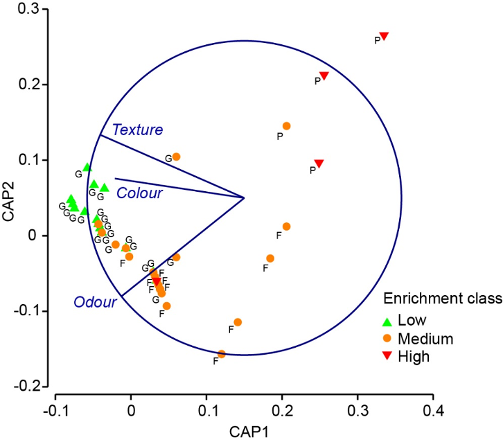

```

> ***The RAP can predict the sediment condition of any new site***

Given the above validation that the RAP accurately reflects sediment enrichment and broader sediment condition, easy-to-use decision trees were then generated to enable any investigator to reliably predict the sediment condition class of any further basin or river site in the Peel-Harvey based solely on its observed RAP scores. These decision trees [produced statistically by a regression tree approach, see @hallett2019rapid] are shown in Fig. 7 below. To use these trees, the RAP scores of any new sediment sample are simply compared to the thresholds at each branch of the tree, starting at the top, then taking a left path if the non-bracketed criteria are true, or a right path if the bracketed criteria are true. 

```{r sediment-pic9, echo = FALSE, out.width='100%', class = "text-image", fig.cap = "Decision trees for assigning new (a) basin and (b) river sites in the Peel-Harvey Estuary to their appropriate sediment condition class (bold text at terminal nodes) based on their Rapid Assessment Protocol (RAP) score thresholds. Unbracketed and bracketed thresholds at each branch indicate that a left and right path, respectively, should be followed through the tree. (Trees were constructed using LINKTREE and SIMPROF routines. B% reflects the extent of class differences)."}

knitr::include_graphics("images/sediment/picture9.png")

```

The decision tree for basin sites indicated that Poor sediment condition would be predicted for any future site with odour scores of ≤2 (i.e. moderate to strong smell of hydrogen sulphide, or 'rotten egg gas'; Table 1), or colour or texture scores of 0 (black oozy muds; Table 1, Fig. 7a). Separation of basin sites with Fair or Good sediment condition mainly depends on whether their texture score was ≤2 or ≥3, respectively (i.e. smooth to oozy muds *vs.* grainy sands). Among river sites, Good sediment condition would be predicted for those with texture scores of ≥2 and colour scores of ≥1.5, and Poor condition for sites with odour scores of ≤2 or texture scores of \<1 (Fig. 7b).

These decision rules were used to determine the condition of sediments at a further 120 sites throughout the Peel-Harvey in 2017--18, to help quantify the ecological responses of benthic macroinvertebrate communities to sediment stressors and subsequently establish a new biological index of estuarine condition [@oreilly2019assessing]. Given the speed and low resource costs of applying the RAP decision rules, they could clearly provide a robust, consistent and cost-effective approach for future monitoring of sediment condition throughout the Peel-Harvey (see section 6).

> ***Sediments in the deeper parts of the Harvey Estuary are generally muddier, more enriched and in poorer condition than those in the Peel Inlet***

In general, the least enriched sediments were located around the edges of the estuary basins, and particularly in the well-flushed western Peel Inlet and northern-most Harvey Estuary, whereas the more central parts of the basins tended to be more enriched (Fig. 8). Harvey Estuary sediments were notably more enriched than those in Peel Inlet, although the south-eastern corner of Peel Inlet was also a hotspot of enrichment. Much of the sediment in the rivers was moderately to highly enriched, with the highest levels typically seen among sites further upstream. These patterns in enrichment were generally mirrored by those in sediment condition, with more enriched sites often exhibiting poorer condition.

Spatial interpolations of water depth, sediment mud content and enrichment parameters help to illuminate the effects of both natural and human influences on patterns in sediment condition throughout the estuary. Deeper, central parts of the estuary basins generally exhibited Fair sediment condition, in contrast to the Good condition of many sites on the shallower margins (Fig. 9a). This generally reflected higher mud contents at the deeper basin sites, but particularly at those in the Harvey Estuary (\>60% mud; Fig. 9b), where levels of enrichment were notably higher (Fig. 9c, d). These patterns were confirmed by statistical tests (distance-based linear modelling), which revealed that enrichment alone explained the largest proportion of the variability in RAP scores (57% among basin sites and 52% among river sites; Appendix 1). Enrichment was significantly associated with poorer sediment condition among river and basin sites, irrespective of their mud content. Nonetheless, enriched sediments were particularly likely to exhibit poorer condition if they were also muddier, which in the case of basin sites was associated with greater water depths.

These relationships reflect the clear effects of enrichment, and associated muddying, on the physical and biogeochemical characteristics, and therefore condition, of sediments. Accumulation of OM and nutrients, often in conjunction with increased fine particles (mud), alters the physical and biogeochemical properties of sediments, including their porosity, oxygenation status and nutrient cycling processes [Fig. 1, @eyre2009denitrification; @valdemarsen2010sulfur]. These changes manifest as changes in sediment texture, colour and odour [@rosenberg2001response; @hargrave2008towards], which the RAP summarises via a semi-quantitative scoring system.

```{r sediment-pic10, echo = FALSE, out.width='75%', class = "text-image", fig.cap = "Map of overall sediment enrichment (TC, OC and TN) interpolated throughout the estuary. Circles denote sediment sampling sites, colour coded by their sediment condition class (green, Good; yellow, Fair; red, Poor). Insets provide higher resolution views of patterns in the rivers."}

knitr::include_graphics("images/sediment/picture10.png")

```

```{r sediment-pic11, echo = FALSE, out.width='75%', class = "text-image", fig.cap = "Maps of (a) water depth, (b) %mud, (c) %OC, (d) %TN interpolated throughout the estuary. Circles denote sediment sampling sites, colour coded by their sediment condition class (green, Good; yellow, Fair; red, Poor). Insets provide higher resolution views of patterns in the rivers."}

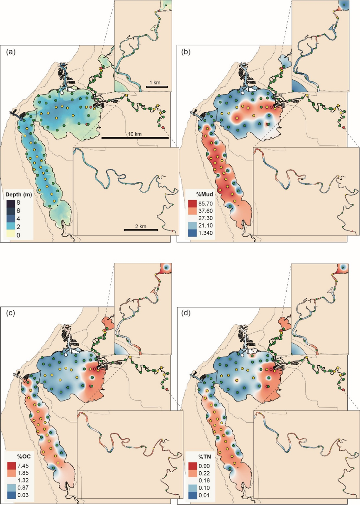

```

The proportion of mud, which varies naturally with water depth, influences sediment enrichment as nutrients and OM bind to fine sediment particles. Deeper waters tend to harbour muddier and therefore more enriched sediments, which impacts their sediment condition. This is particularly true in the Peel-Harvey, which experiences naturally low levels of tidal flushing due to the estuary's narrow connections to the microtidal marine environment, and also declining freshwater flows under a drying climate which are reducing the degree of riverine flushing and leading to increased stratification and retention [@hallett2018observed; @valesini2019peel]. The finding of muddier, enriched sediments in the deeper waters of the Harvey Estuary matches patterns observed during historical sediment surveys in 1978--89 [@mccomb1998spatial]. The intensively fertilized Harvey catchment, with its particularly high density of artificial drains and sandy sediments with low nutrient binding capacity, has delivered large quantities of inorganic nutrients to the estuary over many decades [@mccomb1992loss]. Also, significant freshwater flows from the upper Harvey River have been artificially diverted to the ocean since the 1930s, contributing to the Harvey Estuary experiencing far less flushing than the Peel Inlet, which receives flows from the Serpentine and much larger Murray rivers. As a result, fine sediments, nutrients and OM from the Harvey catchment have tended to accumulate in its basin to a greater degree, with evident impacts on sediment enrichment and condition. This outcome has potentially important implications for the future management of water resources and downstream impacts in the Harvey Estuary, particularly under a drying climate that will see further reductions in flushing river flows [@hallett2018observed].

> ***The poorest sediment condition was observed in navigation channels and other areas of high deposition, including upper parts of the Serpentine and Murray rivers***

The poorest sediment condition in the Peel-Harvey Estuary occurred at highly depositional sites characterised by both high enrichment and mud content. These included the upper Serpentine and Murray rivers, the southeast corner of the Peel Inlet and the artificially deepened Yunderup Channel (Figs 8, 9). Flushing is minimal in the latter locations and thick macroalgal mats are known to accumulate and rapidly become buried below layers of fine sediment [@morgan2012enrichment]. Previously, intensive studies of these channel sites have revealed strongly reducing (i.e. anoxic), monosulfidic sediments that can release ammonium and phosphates into the water column [@kraal2013decoupling]. These findings have significant implications given the forecast expansion of marina developments and boating channels within the Peel-Harvey in coming decades, and particularly the proposed dredging of a new, large channel to support a major marina development at Point Grey, opposite the Dawesville Channel.

The RAP could be employed for spatially extensive, yet rapid and cost-effective surveys of navigation channels and other highly depositional areas throughout the estuary, to quantify the extent of these highly degraded sediments and help better inform future dredging activities.

### Identifying zones of chronic *vs* acute nutrient enrichment via sediment isotopes

> ***Stable isotopes highlighted hotspots of nitrogen enrichment***

We measured the isotope composition of the organic matter in the sediments (δ^15^N and δ^13^C) to get a better understanding of the sources and processes driving the observed sediment quality patterns. Based on the knowledge that sediment δ^15^N values will increase (become more positive) when there are higher rates of biological nitrogen removal relative to production, we identified two distinct 'nitrogen removal zones' (Fig. 10a). These were near the Mandurah Channel and along the western shore of the Harvey Estuary, and correspond to zones of particularly low TN concentrations (Fig. 9). The sediment nitrogen data thus confirms that the most eutrophied sediment region, which also corresponds to a region of high macrophyte abundance [see @valesini2019seagrass], is still accumulating nitrogen. In contrast, the suspected excess nitrogen inputs from storm drains around Mandurah and septic leaks along the Harvey Estuary shore seem to be driving nitrogen *removal* from the sediments (hence low concentrations and high δ^15^N signatures in these locations). Sediment d13C data also brings a new dimension to the sediment quality distribution established above, by revealing that the high C content of the estuary sediments comes from decomposition of the abundant macrophyte beds [@valesini2019seagrass], rather than export and accumulation of terrestrial C (Fig. 10b). Together these findings add some nuance to the sediment quality index, by demonstrating that, 1) some 'healthy' sediment zones may still be affected by human pollutants, and, 2) internal organic matter production is driving the observed declining sediment quality.

```{r sediment-pic12, echo = FALSE, out.width='90%', class = "text-image", fig.cap = "(a) Map of sediment nitrogen stable isotope values (δ15N) and carbon (δ13C) interpolated throughout the estuary. These values were measured on the total nitrogen (TN) and organic carbon (OC) pools, as reported in Fig. 9. Circles denote sediment sampling sites."}

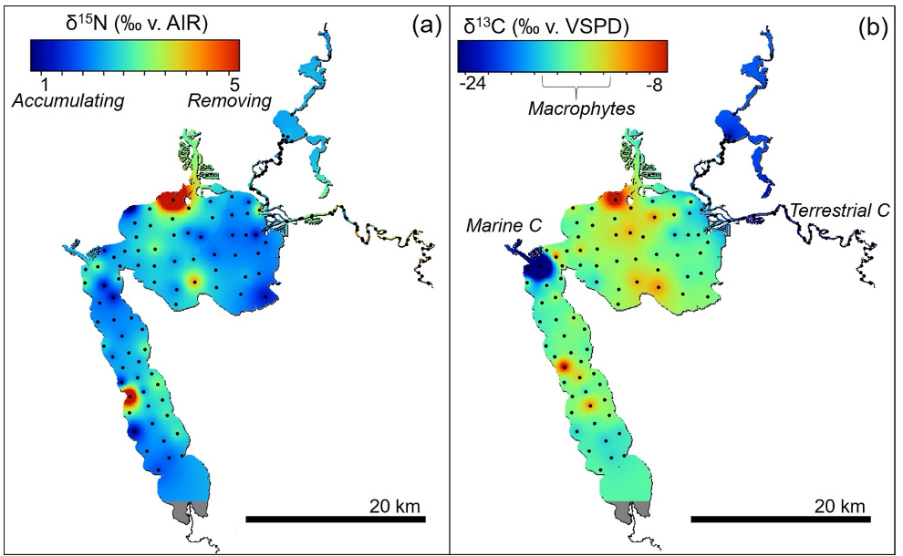

```

## Conclusions

> ***Sediments in the Peel-Harvey are enriched with nutrients and organic matter***

-   Despite the intended aim of the Dawesville Channel to reduce nutrients in the Peel-Harvey Estuary, sediments throughout large parts of the system remain enriched with carbon and nitrogen, particularly in the deeper, muddier waters of the Harvey Estuary.

-   Stable isotopes highlighted likely point sources of acute nitrogen pollution around the estuary, including along the western edge of Harvey Estuary and along the Murray River. Using this type of isotope approach to evaluate estuary sediment quality is relatively new (an adaption of soil quality assessment techniques). We plan further work to calibrate its sensitivity to human disturbances by measuring changes in sediment δ^15^N before, during and after dredging in the estuary.

-   Enrichment negatively impacts the condition of sediments in the Peel-Harvey. Degraded sediment condition is likely to impact on the organisms inhabiting the sediment, the water quality in the estuary, and key ecosystem services such as nutrient cycling.

-   Sediments in the poorest condition (monosulfidic black oozes) occur in areas of the estuary with high rates of deposition, including the Yunderup Channel and upper estuarine reaches of the Serpentine and Murray rivers. Further investigations of navigation channels and other depositional areas throughout the estuary, employing the RAP described here, are recommended to quantify the extent and consequences of these highly degraded sediments.

> ***The RAP provides a rapid and cost-effective tool for current and future monitoring of sediment condition***

-   The RAP is a robust measure of the degree of sediment enrichment and its broader effects on sediment condition. RAP scores correctly identified the enrichment class of 84% of survey sites.

-   The RAP is particularly good at identifying sites with low enrichment, highlighting its potential as a first-pass survey approach for identifying 'least impacted' reference sites to support future impact assessments in the Peel-Harvey Estuary.

-   The outputs from the RAP assessment and accompanying quantitative analyses are being used to quantify sediment stressors throughout the system, which in turn provides a framework to assess the ecological responses of benthic macroinvertebrate communities and subsequently establish a biotic index of estuarine condition [@oreilly2019assessing].

-   The RAP has broad applicability for supporting cost-effective monitoring of sediment condition, given its simple scoring system based on well-documented responses of sediment condition to enrichment, and accompanying 'decision tree' for classifying the condition of any new site.

-   In particular, we recommend the RAP be employed for spatially extensive surveys of navigation channels and other highly depositional areas throughout the estuary, to quantify the extent of these highly degraded sediments and better inform future dredging activities.

-   A broad program for future monitoring of sediment condition throughout the Peel-Harvey is proposed in Table 2 and Fig. 11. This program is purposely broad, the finer details for implementing the program needing to be determined depending on the level of interest in uptake and resourcing.

```{r sediment-pic13, echo = FALSE, out.width='75%', class = "text-image", fig.cap = "Map of suggested sites for future monitoring of sediment condition throughout the estuary, based on the outcomes of the current study. Colours indicate sediment condition class, as assessed in the 2016 survey (green, Good; yellow, Fair; red, Poor). Red ellipses denote ‘watch’ areas, i.e. those deemed at greatest risk of impacted sediment condition, and which are particularly likely to require ongoing monitoring and management. Note that the location of all sites is provisional, and should be tailored for purpose prior to finalising any monitoring regime."}

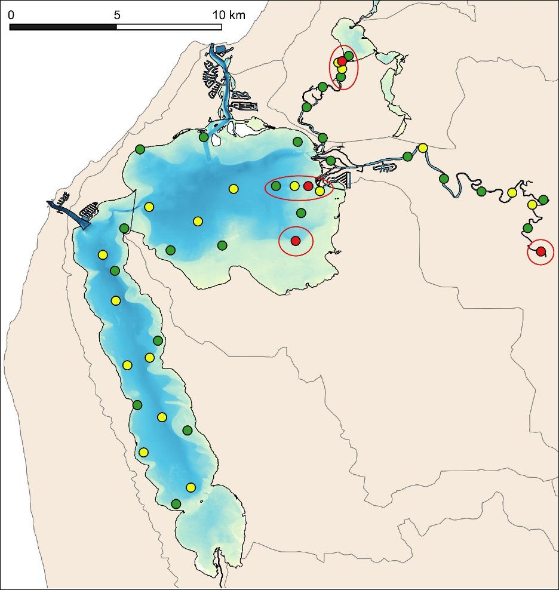

```

## Acknowledgements

We are very grateful to Marta Sánchez-Alarcón, Helen Nice, Frances D'Souza and particularly Alan Cottingham for assistance with fieldwork; Graham Lancaster, Iain Alexander, Natasha Carlson-Perret and colleagues at the Environmental Analysis Laboratory and the Centre for Coastal Biogeochemistry Research, Southern Cross University, for laboratory processing of sediment samples, and Malcolm Robb for helpful discussions and advice. We also greatly appreciate the funding and logistical support provided for this project by the Regional Estuaries Initiative, a Western Australian government program led by the Department of Water and Environmental Regulation.
