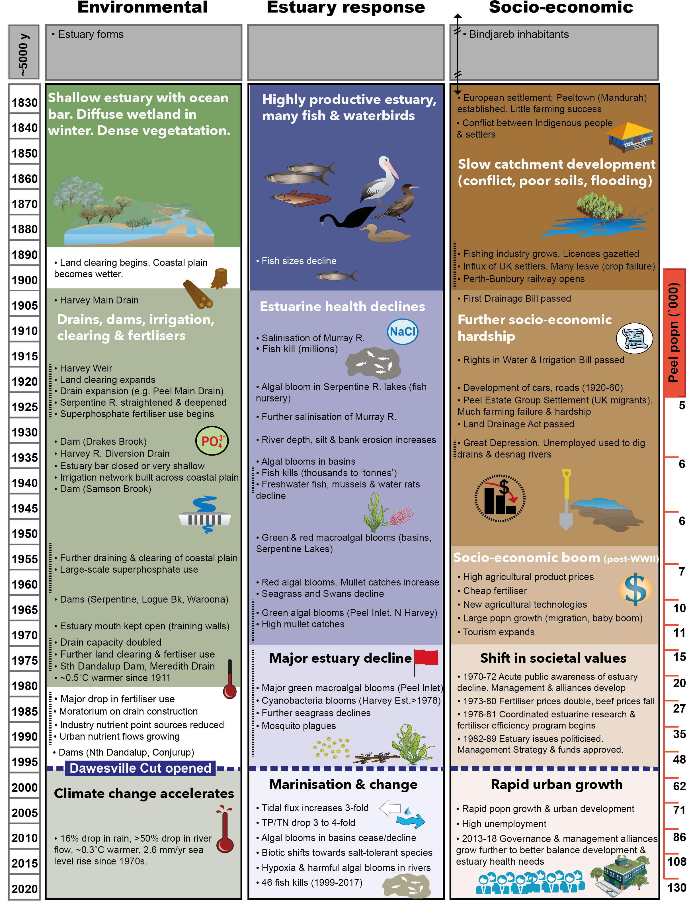
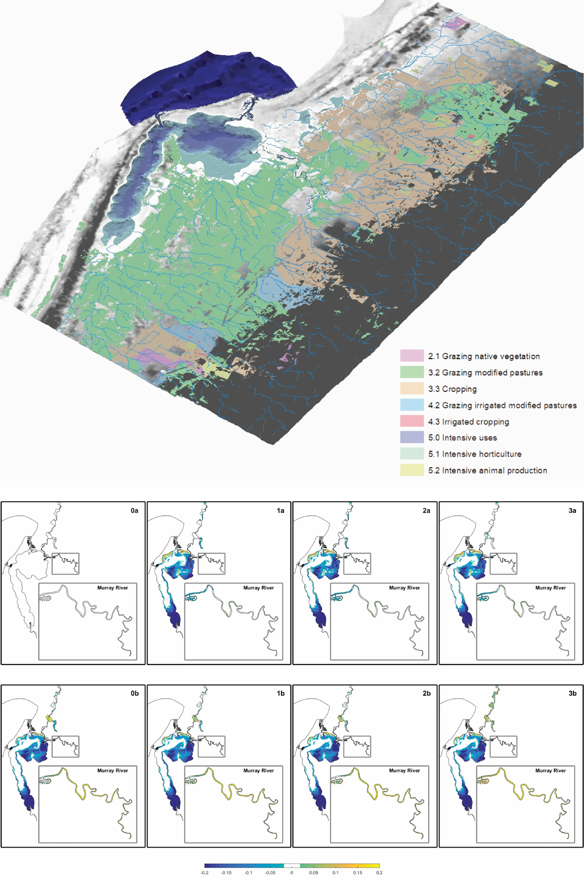

# Synthesis & Overview

<br>

::: {.chapter-authors width="100%"}
**Fiona Valesini^1^, Matthew R. Hipsey^2^, Brad Eyre^3^, Kieryn Kilminster^4^, Paul Plummer^5^, Mike Elliott^6^, Chris Hallett^1^, Peisheng Huang^2^, Brendan Busch^2^, Naomi Wells^3^, Karl Hennig^4^, Sorcha Cronin-O'Reilly^1^, Mustefa Reshid^3^, Oliver Krumholz^1^, Julia Horsley^5^, Jill Trinh^5^**
:::

::: {.author-info width="100%"}
^1^ Centre for Sustainable Aquatic Ecosystems, Murdoch University, Perth, Australia <br>
^2^ Centre for Water and Spatial Science, UWA School of Agriculture and Environment, The University of Western Australia, Perth, Australia <br>
^3^ Centre of Coastal Biogeochemistry, Southern Cross University, Lismore, Australia <br>
^4^ Department of Water and Environmental Regulation, Government of Western Australia, Perth, Australia <br>
^5^ Centre for Regional Development, School of Social Science, The University of Western Australia, Perth, Australia <br> 
^6^ Institute of Estuarine and Coastal Studies, University of Hull, Hull, United Kingdom
:::

```{r summary-pic1, echo = FALSE, out.width='100%', class = "title-image"}

knitr::include_graphics("images/synthesis/CH1 Channel.jpg")

```

<br>
<br>

::: {.body-text width="100%"}
Estuaries around the world are challenged by the pressures of coastal development, resource exploitation and climate change. At the same time they remain integral to community values, local identity, and regional economies. So how can we best strike the balance between development and protection? The research documented in this book aimed to explore this question and facilitate the sustainable development of a fast-growing coastal area in south-western Australia - the **Peel-Harvey** region.  By exploiting 40+ year inter-disciplinary data sets for this catchment-estuary system and integrating ecological, hydrological, biogeochemical, modelling and socio-economic expertise, the research presented in this book seeks to link primary catchment drivers to estuarine health response (up to higher fauna), quantify estuarine ecological health and ecosystem services under historical and future scenarios, and test resilience across the human–natural system. Key outcomes include evidence-based catchment planning solutions that optimise trade-offs between socio-economic development goals and minimal downstream impacts on estuarine health. Given the Peel-Harvey’s particularly iconic history of fundamental ecosystem shifts, through both chronic decline and an acute engineered ‘recovery’, combined with its current and forecast climate and development stressors, there is an urgent need for a holistic view of this important socio-ecological system that can be used to inform sustainable development.

Our overarching **objectives** were to:

1)  *Develop indices of estuarine and societal 'health'*
2)  *Establish historical trends and health status*
3)  *Establish current condition and health status*
4)	*Build a comprehensive theoretical and modelling framework to power a Decision Support System*
5)  *Explore current and future socio-ecological trade-offs through scenario assessment*
:::

::: {.body-text width="100%"}
The research project encompassed a suite of detailed underpinning studies, each of which are summarised in the following chapters of this book. In its entirety, this work has significantly advanced our understanding of how the Peel-Harvey Estuary works, and of its surrounding catchment, community and economy. It has also synthesised how it has changed over the last five decades, and is likely to change further by 2050 under proposed development and climate trajectories. In addition to extensive primary data collection on estuarine condition (hydrology, ecology and biogeochemistry), we also developed comprehensive environmental models for the catchment and estuary, an econometric model, and a conceptual management framework linking economic activity and estuarine environmental-ecological quality (Fig. \@ref(fig:summary-pic2)).

```{r summary-pic2, echo = FALSE, out.width='100%', class = "text-image", fig.cap = "A holistic assessment of the drivers threats, mitigating actions and responses, and their benefits as depicted in a 'bow-tie' diagram applied to the Peel-Harvey socio-ecological system."}

knitr::include_graphics("images/synthesis/picture2.webp")
```

Several key **take-home messages** were identified from this research. 

Regarding our learnings from the past and understanding of the present, they included:

  -   The engineered second entrance channel to the estuary built in the mid-1990s (the Dawesville Cut) and climate change since the 1970s have led to marked and constant changes in estuarine hydrology.

  -   The relative rate of nutrient retention in the estuary and balance of estuary ‘metabolism’ has been responding since the Cut to changes in nutrient inputs from the catchment.

  -   Ecologically, the estuary is showing multiple and converging signs of trouble, as reflected through its seagrass and macroalgal communities, bottom-dwelling invertebrate fauna and fish fauna.

  -   Several environmental and ecological ‘trouble hot-spots’ have emerged throughout the estuary, including the deeper waters of the Murray River, southern Harvey Estuary and shallows of south-eastern Peel Inlet.

  -   The Peel-Harvey community values healthy waterways, both socially and as an important contributor to economic growth in the region.

Regarding our assessment of the Peel-Harvey in 2050, they included the following:

  -   The projected future drying climate is expected to have an overwhelming influence on water flows to the estuary, concentrating poor water quality and ecological problems in the rivers.

  -   Implementing extensive catchment management actions can significantly reduce nutrient flows to the estuary and serve as a way to adapt to the drying trend.

  -   Continuing with a 'business as usual' approach to catchment management is expected to lead to further declines in estuarine heath.

Based on our analysis, four high-level **recommendations** were made:

1.	There is a need to substantially increase the scale and diversity of catchment and estuary management - the time for adaptation to growing stressors is now.
2.	Standardised and regular monitoring of estuarine ecology, water quality, sediment condition and human use is required to track and provide fuller insights into estuary health, and identify the most effective management interventions.
3.	Plan for development that can support economic growth, without increasing the overall water and nutrient footprint.
4.	Continued effort to develop and operationalise the DSS and manage new data streams is required to support ongoing scenario assessments and provide transparency in decision-making for sustainable development in the Peel-Harvey region.
:::

::: {.body-text width="100%"}
It has been the objective of this research program that the data, tools, knowledge and recommendations can all be directly applied to help support the ongoing management challenges facing the Peel-Harvey waterways and community. We also hope that it can serve to motivate new ideas for ways to preserve or restore the inherent socio-ecological values of this vast ecosystem to ensure it can remain healthy for generations to come.
:::

## Introduction

### Overview 

::: {.body-text width="100%"}
The overarching goal of this research project undertaken between 2016-2019 was to produce an integrated, Decision Support System (DSS) for better understanding trade-offs between regional catchment development drivers (economic resilience) and the health of the receiving estuarine waterways (environmental and ecological resilience). Understanding these trade-offs and exploring alternative futures around them is fundamental to sustainably developing our coastal regions. If a balance can be achieved, then broader societal resilience can be realised, reflecting the societal benefits that develop from both a healthy economy (e.g. more jobs, specialised industries) and healthy waterways (e.g. good fishing, wildlife watching, connection to place; Fig. \@ref(fig:summary-pic3)).

```{r summary-pic3, echo = FALSE, out.width='100%', class = "text-image", fig.cap = "Conceptual diagram of the balance between catchment development aspirations (economic resilience) and downstream estuarine health (ecological resilience) to achieve broader social resilience."}
knitr::include_graphics("images/synthesis/picture3.webp")
```

Yet, despite the increasing challenges brought about by accelerated population growth, much of which is occurring along our coasts and estuaries, the pathways to achieving this duality are either unclear or poorly considered. This partly reflects the local complexities of coastal waterways, especially estuaries, and the societies that depend on them. It also reflects the fact that good management of these socio-ecological systems requires long-term thinking and ongoing support, integration of diverse and high-resolution information streams, co-operation among disparate stakeholder groups, and the focusing of multidisciplinary skill sets on a common set of goals. Added to this complexity at local scales, are the shifting external baselines that influence our economies and environments at broader scales, such as global economic drivers and climate change.

This research sought to tackle the above challenge by producing a decision-support framework for identifying the most sustainable catchment development choices, both under current and projected future conditions, focusing on the Peel-Harvey estuary-catchment system in south-western Australia. As outlined below, the Peel-Harvey provides an ideal test case for deepening our understanding of the drivers of ‘health’ or resilience across complex socio-ecological systems, and how we can develop better futures by learning from the past and proactively adapting in the present. 
:::

### The Peel-Harvey Estuary 

::: {.body-text width="100%"}
The Peel-Harvey is the largest estuary in south-western Australia (130 km^2^) and part of the Ramsar-listed Peel-Yalgorup wetland system [@brearley2005ernest; @valesini2019peelharvey]. It’s large and shallow receiving basins (Peel Inlet and Harvey Estuary, mainly < 2 m deep) are fed by three rivers (the Murray, Serpentine and Harvey) and are connected to the sea by two permanently-open channels (the natural Mandurah Channel and artificial Dawesville Cut; Fig. \@ref(fig:summary-pic6)). The three main river subcatchments cover ~9,400 km^2^ across the coastal plain and adjoining Darling Scarp. Much of the sandy coastal plain has been developed for agriculture (dominated by beef cattle grazing), with some industrial activity (e.g. mines, refineries and intensive animal uses) and a fast-growing urban sector along the coastal fringe (Fig. \@ref(fig:summary-pic6)). Most of the catchment on the escarpment drains into the Murray River and is dominated by native vegetation and, further inland, extensive cropping areas with some forestry plantations [@kelsey2011hydrological]. 

```{r summary-pic6, echo = FALSE, out.width='100%', class = "text-image", fig.cap="(a) Peel-Harvey catchment and estuary, showing the three main river sub-catchments and broad land uses; (b) Peel-Harvey Estuary and detailed land uses on the coastal plain portion of the catchment."}
knitr::include_graphics("images/synthesis/picture6.webp")
```

The estuary is a major natural asset that is intrinsically tied to the cultural heritage of the Peel-Harvey region, as well as the modern lifestyles and livelihoods of the people it supports. It has a history of significant environmental decline linked to extreme nutrient enrichment and algal bloom issues (especially from the 1960s-1980s),which triggered a major remedial engineering intervention in the mid-1990s (the Dawesville Cut) to increase estuary flushing and help alleviate these problems  [@mccomb1992loss, @bradby1997peel]. Adding to this complex picture is the warming and drying climate across south-western Australia, especially since the 1970s [@silberstein2012], and the resulting impacts such as greatly reduced river flow, warmer temperatures and rising sea levels [@valesini2019peelharvey]. Fortunately, data sets spanning the 1970s to recent decades exist for various components of the estuarine ecosystem, including key meteorological and oceanographic drivers, river flow, water quality and various aspects of its ecology (e.g. seagrass, macroalgae and fish communities).

Alongside accelerating climate change pressures, the Peel-Harvey is one of the fastest growing regions in Western Australia, with the population (~137,000 in 2016) expected to more than triple to >440,000 people by 2050  [@dplh2018perth]. Various economic development and diversification strategies have also been actively pursued across the region, such as the [Transform Peel](http://www.peel.wa.gov.au/transformpeel/) program [@dplh2018perth].  

An illustrative summary of key environmental, ecological and societal shifts documented in the Peel-Harvey since the 1800s is provided in Fig. \@ref(fig:summary-pic4). Given its particular history of fundamental ecosystem changes through both chronic decline and an acute engineered ‘recovery’, as well as its current and forecast climate and development stressors, the Peel-Harvey represents an important opportunity to explore the resilience of estuarine systems and the societies they support. Our overarching study objectives are outlined below, with further detail on the objectives of each study component given in the following chapters. 

```{r summary-pic4, echo = FALSE, out.width='100%', class = "text-image",  fig.cap="Summaries of key environmental, estuary response and socio-economic changes in the Peel-Harvey system from the early 1800s to 2020. Note that these timelines are non-exhaustive. Information sources include Hodgkin  et al. (1981), Bradby  (1997), McComb  and Humphries (1992), Brearley  (2005), Cuthbert et al. (2007), Silberstein et al. (2012), Australian Bureau of Statistics, 2018 and DWER unpubl. data. Figure reproduced from Valesini et al. (2019) with permission from publisher."}

```
:::

## Project Objectives

::: {.body-text width="100%"}

1) **Develop indices of estuarine and societal health:** Produce quantitative measures to assess ecosystem health status against established benchmarks.

2) **Establish historical trends and health status:** Characterise the past (1970s to ~2010), including decadal periods before and after the opening of the Dawesville Cut (1994), to establish how key elements of the Peel-Harvey environment, ecology and economy have changed over time.

3) **Establish current trends and health status:** Characterise the current  Peel-Harvey socio-ecological system (~2016-2018) through the collation of existing data and collection of extensive new data.

4) **Build a comprehensive theoretical and modelling framework to power the Decision Support System:** Construct a coupled catchment-estuary modelling framework, integrating past and current data, to (i) capture the complexity of ecosystem structure, function and processes across the catchment-estuarine continuum, (ii) enable the prediction of estuarine health response under proposed future environmental or management conditions, and (iii) support a ‘systems view’ for integrating the effects of these futures on local economic health.

5) **Explore current and future socio-ecological trade-offs through scenario assessment:** Explore socio-ecological trade-offs across the Peel-Harvey system under current conditions, and compare them to those forecast under a set of future (2050) development, management and climate scenarios defined by Peel-Harvey stakeholders.

<br>

> ***This study is among the first in Australia to integrate all of the above components to support sustainable development and understanding of whole-of-system resilience across a catchment-estuarine continuum***

<br>
:::

## Approach

### Concepts and components underlying the Decision Support System 

::: {.body-text width="100%"}
A conceptual diagram of the main study components and linkages comprising the DSS for exploring trade-offs between estuarine and economic health is shown in Fig. \@ref(fig:summary-pic9). It is based loosely on the well-known ‘**DPSIR**’ model (*Drivers, Pressures, State, Impact and Response*), which provides a causal framework for describing the interactions between society and the environment [@atkins2011management]. The DPSIR model has been developed further over recent years and we built on the version by @elliott2017and which was termed **DAPSI**[**W**]**R**[**M**] (e.g., *Drivers*, *Activities*, *Pressures*, *State*, *Impacts* [on human *Welfare*], *Responses* [as *Measures*]). We have sought to integrate this approach with progress made from the development of a regional econometrics model of the Peel-Harvey system (Chapter \@ref(econ)) to develop an conceptual and theoretical framework suited to decision support and scenario assessment.    

```{r summary-pic9, echo = FALSE, out.width='100%', class = "text-image", fig.cap="Conceptual diagram of the main study components underpinning the DSS for balancing tradeoffs between estuarine and economic health in the Peel-Harvey. Past and present data inform the ability of the DSS to predict future tradeoffs under stakeholder-defined scenarios, and hence inform management response."}
knitr::include_graphics("images/synthesis/picture9.webp")
```

An overview of each main DSS component and its sub-components is detailed below and in summarised in Table \@ref(tab:synthesis), and developed further throughout the accompanying chapters. 
:::


```{r synthesis, echo=FALSE, message=FALSE, warning=FALSE}
library(knitr)
library(kableExtra)
library(readxl)
library(rmarkdown)
theSheet <- read_excel('tables/peel_tables.xlsx', sheet="synthesis")
theSheetGroups <- unique(theSheet$Group)

kbl(theSheet[,2:NCOL(theSheet)], caption = "Summary of the main components of the DSS (Fig. 1.5), their supporting sub-components and accompanying book chapters that characterise each in further detail.", align = "c",) %>%
  pack_rows(theSheetGroups[1],
            min(which(theSheet$Group == theSheetGroups[1])),
            max(which(theSheet$Group == theSheetGroups[1])),
            background = '#ebebeb') %>%
  pack_rows(theSheetGroups[2],
            min(which(theSheet$Group == theSheetGroups[2])),
            max(which(theSheet$Group == theSheetGroups[2])),
            background = '#ebebeb') %>%
  pack_rows(theSheetGroups[3],
            min(which(theSheet$Group == theSheetGroups[3])),
            max(which(theSheet$Group == theSheetGroups[3])),
            background = '#ebebeb') %>%
  kable_classic(full_width = T) %>%
  row_spec(0, background = "#5f543f", bold = TRUE, color = "white") %>%
  kable_styling(full_width = F,font_size = 11,bootstrap_options = c("hover", "condensed")) %>%
  column_spec(2, width_min = "7em") %>%
  column_spec(3, width_min = "12em") %>%
  scroll_box(width = "40em",
             fixed_thead = FALSE)
```


### Coupled catchment-estuary response model

::: {.body-text width="100%"}
At the core of the DSS, is the coupled catchment-estuary response model framework which characterises the combined structure and function of the catchment and estuary, including the influence of external drivers such as climate and oceanography. This framework captures parts of the ‘Drivers’ and ‘Pressures’ elements of the DPSIR model. It comprises the catchment model; detailed tracing of nutrient ‘source to fate pathways’ using isotopic signatures; models of the estuary hydrodynamics and biogeochemistry (**PHERM**; Peel-Harvey Estuary Response Model); and other important components of the estuarine environment (Table \@ref(tab:synthesis)). 
:::

### Estuarine ecosystem resilience indicators

::: {.body-text width="100%"}
 A comprehensive suite of estuarine ecosystem health indicators form the second main component of the DSS, providing quantitative measures that span the environmental, ecological and ecosystem services spectrum. These indices capture various facets of the ‘State’ element of the DPSIR model. They are linked either inherently or statistically to the estuary response model, enabling prediction of index response under proposed scenarios (Fig. \@ref(fig:summary-pic9)).  While the calculations underlying these indices are complex, most are reported simply on a ‘good-poor’ spectrum using either scales or ‘report card’ grades, so they can be easily interpreted by the wider community. The full suite of indicators is outlined in Table \@ref(tab:synthesis).
:::

### Regional economic resilience indicators

::: {.body-text width="100%"}
The last main component of the DSS is a set of indicators that reflect the local competitiveness of Peel-Harvey’s economy, and determine its resilience to external drivers (Table \@ref(tab:synthesis)). These indicators summarise key metrics of the local economy such as competitive and comparative advantage, and more specific measures of industry specialisation and diversity, export potential, employment and rate of growth. These indices also capture various facets of the ‘State’ element of the DPSIR model. 
:::

### Socio-ecological scenarios and trade-offs

::: {.body-text width="100%"}
Trade-offs between the estuarine and economic resilience indices, or indeed those between different subsets of estuarine health indices, are then able to be assessed. Depending on the availability of different data sets (see Supplementary Materials S1.1), these trade-offs could be assessed under past conditions, current conditions, or proposed future conditions through scenario development (Fig. \@ref(fig:summary-pic9)). These trade-offs capture the ‘Impacts’ element of the DPSIR model.
:::

### Evidence-based decision-making framework

::: {.body-text width="100%"}
The final element of the DPSIR model is the ‘Response’. This refers to the actions that managers and decision-makers across the Peel-Harvey region may choose to take, given the information that is now available to them. Here we deliver a framework that enables a transparent, risk-management approach to support evidence-based and adaptive decision making. In this way, decisions related to either environmental management or catchment development share a common logic founded in resilience thinking principles, allowing managers to adopt a common road-map for assessing proposed projects, practices or policies.
:::

### Data collation, collection and repository

::: {.body-text width="100%"}
Extensive historical data sets were collated to support development of the model and decision-support framework and individual components of the project, which are broadly summarised in Supplementary Material S1.1. Additionally, extensive new field data were collected during this study to comprehensively summarise the current condition of the Peel-Harvey system. Broad categories of these new data sets are summarised in Figs \@ref(fig:summary-pic10) and \@ref(fig:summary-pic11) for the estuary and catchment, respectively. An online repository of these data sets can be found at an [online data repository]( https://github.com/AquaticEcoDynamics/Peel_ARC/).

```{r summary-pic10, echo = FALSE, out.width='90%', class = "text-image", fig.cap="Summary of the sampling or monitoring sites in the Peel-Harvey Estuary at which environmental or biotic data were collected in 2016-2018 to support development of the DSS. Further detail on each of the field sampling regimes can be found in the respective chapters (Table 1.1)."}
knitr::include_graphics("images/synthesis/picture10.webp")
```

```{r summary-pic11, echo = FALSE, out.width='90%', class = "text-image", fig.cap="Summary of the sampling or monitoring sites in the Peel-Harvey catchment at which environmental data were collected in 2016-2018 to support development of the DSS. Further detail on each of the field sampling regimes can be found in the respective chapters (Table 1.1)."}
knitr::include_graphics("images/synthesis/picture11.webp")
```
:::

## Results & Findings

### Learning from the past and understanding the present {-}

> *The Cut and climate change have led to constant change in estuarine hydrology*

::: {.body-text width="100%"}
When the Cut was created in the mid-1990s it would have been difficult to anticipate the likely future trends in river flow. The results of our data compilation and hydrodynamic modelling showed us that the drying climate has fundamentally changed the estuary’s hydrology by a comparable magnitude to that of the opening of the Cut, and also highlighted the complexity of their interacting effects. Firstly, the artificial channel successfully improved the estuary flushing by reducing average water ages by 20-110 days. In contrast, the reduced precipitation and catchment inflow has had a gradual opposite effect on the water ages, and during the wet season this has almost counteracted the reduction brought about by the channel. Secondly, the drying climate has caused an increase in the salinity of the estuary lagoons by 10-30 psu. However, while the artificial channel increased the salinity during the wet season, it has reduced the likelihood of hypersalinity (>40 psu) during the dry season in some areas. These hydrological impacts also varied spatially, with the southern estuary, which has the least connection with ocean through either channel, being identified as the most sensitive to both climate change and the opening of the Cut.  
:::

> *The relative rate of nutrient retention and balance of estuary metabolism has been responding since the Cut to changes in catchment inputs*

::: {.body-text width="100%"}
A reconstruction of nutrient loads over time, including the relative partitioning of the constituent nutrient species, has shown that there has been a long-term reduction in load, but relative stability in flow-weighted inflow concentrations. This suggests nutrient management has maintained nutrient levels at a constant level, and the overall load reduction is mostly a result of the drying trend reducing the nutrient-rich catchment flows. Within the estuary itself, continual changes in water quality have been occurring over time, not just following the Cut, but also a longer-term response following the recent period of reduced flows. The high-resolution Peel-Harvey Estuary Response Model (PHERM) has been able to capture variability across regions from rivers to lagoons and channels in water quality variability. The model has allowed the reconstruction of spatiotemporal variability in key water quality attributes and processes impacting the nutrient load partitioning within the estuary.

Zonal budgets have identified local controls on carbon and nutrient metabolism, and were used to determine how estuary biogeochemical function responds to changes in flow and catchment loading. The pattern of nutrient retention and export has changed considerably over time, following the Cut in particular, but recent changes are also due to the reduced inflows. Model simulations suggest the estuary has gradually shifted from being a net accumulator of nutrients to a net exporter. This is because the decrease in inflows means that internal loading can now exceed external inputs during low-flow years. Therefore, the amount of retention is dependent on annual flow, and will be sensitive to forecast projections of a drying climate
. 
:::

> *Ecologically, the estuary is showing signs of trouble*

::: {.body-text width="100%"}
Despite the notable reduction of nutrients in the main basins since the Cut, several lines of evidence from the faunal communities (bottom-dwelling invertebrates and fish) show that the current ecological health of the Peel-Harvey Estuary is often poor relative to established benchmark conditions (Chapters \@ref(bmi) & \@ref(fish)). The benchmarks for the fish fauna were established from a long-term historical data record (1978+), indicating that ecological health has generally declined over time. While the fish communities have become more marine, as expected following the opening of the Cut and the reduction in river flows, they are also often more sporadic in composition, less abundant, less speciose, and/or have fewer specialised feeding or habitat traits. Areas of the estuary with persistently poor fish faunal health were mainly linked with low dissolved oxygen conditions and bottom waters that had been retained in the estuary for long periods. The benthic invertebrates, whose benchmark conditions were established by sampling these fauna at a large number of sites in 2016-18 (i.e. given the limited historical data across the full estuary), generally reflected a stressed community dominated by tolerant taxa. These invertebrate fauna were often in poor health, especially in summer, which was linked with high levels of organic matter and sulfidic muds, with low levels of oxygen in the sediment. 

One component of the estuarine ecology that has improved and is now often in good health compared to historical (1978+) conditions, is the submerged macrophyte (seagrass and macroalgae) community. These health changes mainly reflect the large reductions in green macroalgae and increases in seagrass since the opening of the Cut (Chapter \@ref(macrophytes)). However, there are also some parts of the estuary where these plant communities are in poor health, and are now in worse condition than at any time over the historical sampling record (see below). 
:::

> *The deeper Murray River, southern Harvey Estuary and shallows of south-eastern Peel Inlet have emerged as 
‘trouble hot-spots’, both environmentally and ecologically*

::: {.body-text width="100%"}
The above areas of the estuary are currently displaying consistent and/or increasing signs of stress based on their water quality, sediment quality and ecology.  

The Murray River was shown by the estuary response model to be experiencing more persistent salinity stratification, hypoxia and nutrient retention compared to historical periods (Chapter \@ref(model-water-quality)), and the nutrient isotope/tracer data also highlighted that it receives relatively high groundwater inputs that contain very high nitrogen concentrations (Chapter \@ref(iso)). The sediments in the Murray are also highly enriched with nutrients and organic matter (Chapter \@ref(sediment)), and the invertebrate and fish faunas in the deeper waters are in chronically-poor health (Chapters \@ref(bmi) & \@ref(fish)). Similarly, the southern Harvey Estuary, which is poorly flushed by either tidal or riverine waters and so has long periods of water retention (~100-150 days in summer and autumn), also has highly enriched sediments and its deeper-water fish and invertebrate communities are in poor health. Furthermore, unlike most of the other basin regions where macrophyte health has improved over time, nuisance green macroalgae has been increasing in the southern Harvey Estuary in recent years, and is now the most abundant it has been over the 40 year sampling record. High nutrient enrichment, abundant green algal accumulations and poor benthic invertebrate health also characterised the shallow south-eastern Peel region. 
:::

> *The community values healthy waterways as an important contributor to economic growth in the region*

::: {.body-text width="100%"}
The Peel-Harvey region experienced an overall increase in employment between 2006 and 2016 with an increasing workforce. The most significant period was between 2006 and 2011 with the region’s employment growth rate reaching 28.7%, followed by a period from 2011-2016 which grew at 18.8%. Based on analysis of economic data, the Peel-Harvey’s economy remained specialised in manufacturing, construction, agriculture and retail trade over this period. By 2016, mining surpassed agriculture in the degree of specialisation for the region. The majority of all other industries in Peel- Harvey also grew in size between 2006 and 2016.

Links between economic growth and resilience, and the condition of the estuary system, were conceptualised through a Socio-Ecological System (SES) systems model. This was used as a conceptual framework to highlight the link between essential ecosystem services and local attractiveness and competitiveness. The strong performance of construction and retail services reflects the drivers of urban expansion as residents seek the lifestyle benefits of the region.

To reinforce the links between different sectors and estuary health, the stakeholder values and aspirational goals for the region were sought through a structured solicitation process, incorporating perspectives ranging from a conservation focus to regional economic development. A synthesis of these views identified the most important value was high estuarine biodiversity and accompanying health, highlighting the estuary as an icon for residents, land-holders and businesses alike. Participants gave various responses that fell into this category, such as ‘good to excellent ecological health’; ‘biodiverse and/or resilient waterways’; ‘healthy wildlife’ (including fish, birds and/or dolphins); ‘healthy seagrass habitats’; ‘no/less major fish kills’ and ‘retaining Ramsar status.’ Good water quality, underpinned by value and/or goal statements such as ‘no harmful algal blooms,’ ‘TN/TP half of current levels,’ ‘good dissolved oxygen levels’ and ‘reduced contaminants’, was also ranked highly.

Socially, a Peel community that was environmentally-focused (e.g. ‘behaviour change towards environmentally sustainable practices’; ‘better community engagement/education in improving estuarine health’; ‘waterwise community’) and had good amenity to the estuary (e.g. ‘the estuary looks nice’; ‘good waterway recreation’; ‘good wildlife watching’) was highly valued, with supporting highly-ranked goal statements (e.g. ‘mandatory water sensitive urban design’; ‘mandatory nutrient testing programs’). From an economic perspective, better employment opportunities (e.g. ‘higher and/or more diverse employment’; ‘increased work skills’; ‘increased youth employment’) and sustaining key industries (e.g. ‘high growth/export industries’; ‘strong fishing/eco-tourism industries’) were also identified as being important to stakeholders. These results clearly highlight a community that supports sustainable development rather than “development at all costs”.
:::

### Preparing for a future Peel-Harvey {-}

> *The projected future drying climate is expected to have an overwhelming influence on water flows to the estuary, concentrating poor water quality and ecological problems in the rivers*

::: {.body-text width="100%"}
The drying climate projected for 2050 is forecast to continue to reduce water flows to the estuary (by ~50% compared to current conditions). Whilst this does have the benefit of reducing the overall nutrient load, it is likely to reduce flushing of nutrients in the sediment and allow incoming nutrients to persist in the riverine reaches for longer.  As these areas are likely to experience stronger and more persistent stratification, this trend is predicted to further exacerbate problems with hypoxia and harmful algal blooms in the rivers, and the associated frequency and extent of fish-kills.  
:::

> *Implementing extensive catchment management actions can significantly reduce nutrient flows to the estuary.*

::: {.body-text width="100%"}
Large-scale implementation of catchment management actions (e.g., improving fertiliser management, applying soil amendments, riparian zone rehabilitation etc) under environmentally-sensitive development of the catchment was explored within the modelled scenarios, and is expected to significantly reduce nitrogen and especially phosphorous flows to the estuary compared to current conditions. As the joint pressures of climate change and nutrient increases are detrimental to estuary condition, continued efforts towards nutrient reduction are also a potential strategy to help adapt to the drying climate. A portfolio of options to meet nutrient reduction targets has been identified, focused on on-farm and within-drain measures.
:::

> *Continuing with a ‘business as usual’ approach to catchment management will lead to further declines in estuarine heath.*

::: {.body-text width="100%"}
Comparison of scenarios with different levels of catchment management intervention (e.g., Fig \@ref(fig:summary-pic12)) highlighted that "doing nothing" in the face of climate change, urban expansion and agricultural intensification will lead to further declines in water quality in the estuary. Continuing with the current rate of implementation of catchment management approaches, as well as enabling agricultural and urban development as proposed in the *Strategic Assessment of the Perth and Peel Regions*, is forecast to intensify problems with hypoxia in the rivers and increase nutrient flows to the rivers and parts of the basins. On the other hand, alternate “green-growth” development strategies were shown to be able to make a positive impact on maintaining and potentially improving estuarine water quality. Additionally, through our links with the econometrics modelling, it was identified how investment in agricultural technology to improve production whilst reducing nutrient leaching could drive local competitiveness and promote longer-term economic growth.  

```{r summary-pic12, echo = FALSE, out.width='100%', class = "text-image", fig.cap="Catchment land-use and drainage entering into the Peel-Harvey estuary model (PHERM; top) and example outputs of the model scenario comparison for a chosen estuary health indicator. See Chapter 11 for details."}

```
:::

## Recommendations for policy-makers

> *Increase the scale and diversity of catchment and estuary management - the time for adaptation to growing stressors is now*


- In general, future climate and development projections pose additional risks to estuary health that require substantial adaptive management in the present term. "Doing nothing", or continuing with "business-as-usual", will lead to continued decline of the rivers and basins.
- No single solution or approach is possible and a multi-pronged adaptation strategy should be developed.
- Environmental water flows to maintain estuary health need to be considered and assessed as an option to help achieve the scale of ecosystem remediation required to adapt to expected future climate scenarios.
- Major reductions in nutrient delivery to the estuary can be achieved with concerted catchment management efforts (mainly improved fertiliser management, soil amendments, drain water management, revegetation and use of nutrient-stripping technology) and environmentally-sensitive development (i.e. through managing the extent and type of agricultural expansion).
- Such investment can produce positive estuarine health outcomes whilst improving the ‘clean-green’ brand of WA agriculture. We also identified this approach as strengthening the competitive advantage of the local economy, and suggest further business cases should be developed to identify strategies such as nutrient offsets to encourage implementation and innovation.
- Large-scale nature-based restoration efforts within the estuary that can help support local fishery and ecotourism opportunities also need to be explored.


> *Monitor estuarine ecology and sediment to provide fuller insights into estuary health and identify the most effective management interventions*

- Currently, there are no monitoring programs in the estuary for key aspects of its ecology (e.g. seagrass, fish) and/or supporting environmental elements except for water quality.
- Given the current state and trajectories of estuarine ecological health, and the value placed on it by the Peel community, it is crucial that these key ecosystem components are monitored consistently and regularly into the future.
- Monitoring regimes for the sediment, macrophytes, benthic invertebrates and fish have been proposed (see following chapters), building on the extensive field work and validation undertaken in this Linkage Project. These regimes can be tailored to suit objectives and budget and, if adopted in the near future, can value-add to the current data sets.
- Consistent ecological data streams and calculation of accompanying health indices will also allow the real ecosystem impacts of any new management interventions to be understood, and support the ongoing refinement of the DSS framework.

> *Plan for development that can support economic growth, without increasing their water and nutrient footprint*

- Continued efforts are required to curate and further develop the economic data for the region to allow for more rigorous assessment of how the region is adapting to social and environmental change.
- Whilst environmentally-sensitive land management and development priorities can come at a cost, our econometric analysis of the regional data suggests they can also encourage long-term economic resilience, as long as strategies are balanced to ensure export-oriented activities retain their competitiveness. For example, measures to foster technological innovation in agriculture and mining and tourism growth will serve to create new investment and export opportunities. Adaptive measures and policies to enhance regional investment in growing and under-developed industries associated with land management and ‘green-farming’ could also be identified to encourage employment diversification within the region. 

> *Continue to develop the DSS to house and operationalise new data streams, and provide transparency in decision-making for sustainably developing the Peel-Harvey region*

- Fragmentation of decision-making across jurisdictions and geographic areas risks the estuary suffering “death by a thousand cuts”. An overarching body able to undertake a holistic assessment and build consensus on adaptation measures is needed to help drive restoration.
- The DSS produced by this project integrates many disparate historical data sets, newly collected data and extensive modelling capacity into a single framework to enable risk-based assessment of developments proposed in the Peel-Harvey region.
- It is a highly capable ‘toolbox’ which is able to be adapted to ask site-specific or regional question. It could be broadened to accommodate new components or data streams, or even tailored to specific detailed tasks.
- The DSS is among the first of its kind in Australia, and so has chartered considerable new territory. As such, there are various aspects of the current framework that would benefit from further development and continued investment and improvement. This can be achieved through establishing ongoing partnerships with end-users to support the housing, servicing and interrogation of the DSS, as well as the regular integration of new environmental, ecological and economic data streams.


## Supplementary materials

::: {.body-text width="100%"}
The following supplementary materials are also available in the [Supplementary Material][Supplementary Materials] chapter:

 -	S1.1. Summary of the historical data sets collated to support development of the DSS.
:::
<br>
<br>
<br>

::: {.author-info width="100%"}
Cover image: Natural entrance channel of the Peel Harvey Estuary. Photo credit *Peel-Harvey Catchment Council*.
:::

